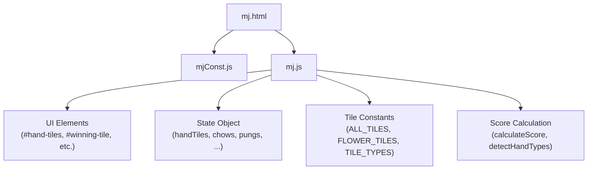
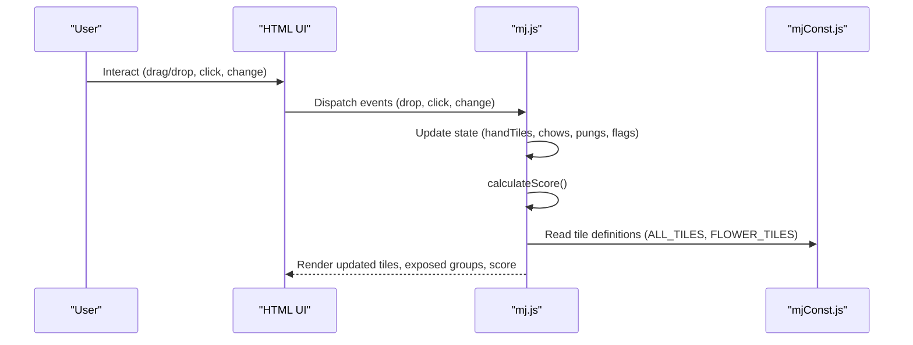
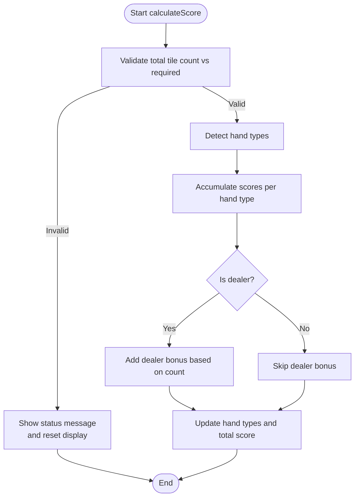
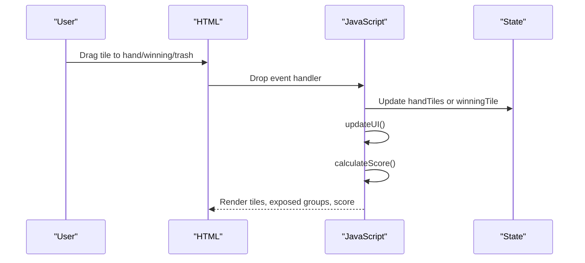
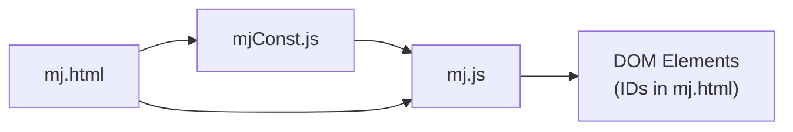

# API Reference

<cite>
**Referenced Files in This Document**
- [mj.js](file://mj.js)
- [mjConst.js](file://mjConst.js)
- [mj.html](file://mj.html)
</cite>

## Table of Contents
1. [Introduction](#introduction)
2. [Project Structure](#project-structure)
3. [Core Components](#core-components)
4. [Architecture Overview](#architecture-overview)
5. [Detailed Component Analysis](#detailed-component-analysis)
6. [Dependency Analysis](#dependency-analysis)
7. [Performance Considerations](#performance-considerations)
8. [Troubleshooting Guide](#troubleshooting-guide)
9. [Conclusion](#conclusion)
10. [Appendices](#appendices)

## Introduction
This document provides an API reference for the OV MJ Calculator’s internal interfaces and data structures. It focuses on:
- The main application state object used to represent a Mahjong hand and game context
- Tile data structures and constants
- Functions and methods exposed by the calculator for programmatic access to scoring, tile management, and game state manipulation
- Integration examples showing how external scripts can interact with the core functionality

The calculator is implemented as a browser-based tool that manages user interactions via drag-and-drop and form controls, computes hand types and scores, and updates the UI accordingly.

## Project Structure
The project consists of three primary files:
- mjConst.js: Defines tile categories and tile definitions (including flowers)
- mj.js: Implements application state, UI logic, event handling, and score calculation
- mj.html: Provides the DOM structure and binds UI elements to the JavaScript logic

**Diagram sources**
- [mj.html:13-247](file://mj.html#L13-L247)
- [mj.js:1-42](file://mj.js#L1-L42)
- [mjConst.js:1-65](file://mjConst.js#L1-L65)

**Section sources**
- [mj.html:13-247](file://mj.html#L13-L247)
- [mj.js:1-42](file://mj.js#L1-L42)
- [mjConst.js:1-65](file://mjConst.js#L1-L65)

## Core Components
This section documents the main state object and its properties, along with their purposes.

### Main State Object
The central state object holds all information required to represent a Mahjong hand and scoring context.

- handTiles: Array of tile objects representing the current hand
- flowers: Array of flower tile objects added by the user
- chows: Array of sequence groups (e.g., 1-2-3 of same suit)
- pungs: Array of triplet groups (three identical tiles)
- openKongs: Array of exposed kong groups (four identical tiles declared openly)
- concealedKongs: Array of hidden kong groups (four identical tiles kept private)
- winningTile: Single tile object representing the winning tile
- seatWind: String indicating the player’s seat wind
- roundWind: String indicating the current round wind
- isDealer: Boolean indicating if the player is the dealer
- dealerCount: Number indicating consecutive dealer rounds
- isSelfDraw: Boolean indicating self-drawn win
- isDeclaredReady: Boolean indicating declared ready (riichi-like condition)
- isIppatsu: Boolean indicating one-shot win after declaring ready
- isLastTileDraw: Boolean indicating last tile drawn from the wall
- isLastDiscard: Boolean indicating last discard in the round
- isFlowerDraw: Boolean indicating win by drawing a flower tile
- isKongDraw: Boolean indicating win by drawing after a kong
- isRobbingKong: Boolean indicating win by robbing a kong
- isDoubleKongDraw: Boolean indicating win by drawing after a double kong
- isRobbingDoubleKong: Boolean indicating win by robbing a double kong
- isTenhou: Boolean indicating tenhou (heavenly hand)
- isChihou: Boolean indicating chihou (earthly hand)
- isTenReady: Boolean indicating ten-ready (heavenly riichi)
- isChiReady: Boolean indicating chi-ready (earthly riichi)
- isFaceDown: Boolean indicating face-down hand condition
- isMultiWin: Integer indicating multiple winning tiles (0=none, 2=double, 3=triple)
- isMultiWinSelfDraw: Boolean indicating multi-win with self-draw bonus
- visibleWinTileCount: Integer indicating number of visible winning tiles on the table (for “明絕” conditions)
- history: Array of previous states for undo functionality

These fields are updated through UI interactions and are consumed by the scoring engine to compute total points and display results.

**Section sources**
- [mj.js:1-33](file://mj.js#L1-L33)

## Architecture Overview
The application follows a simple MVC-like pattern:
- Model: The state object and tile constants
- View: HTML elements rendering tiles, exposed groups, and settings
- Controller: Event handlers and functions that update state and trigger recalculations

**Diagram sources**
- [mj.html:13-247](file://mj.html#L13-L247)
- [mj.js:36-42](file://mj.js#L36-L42)
- [mj.js:580-703](file://mj.js#L580-L703)
- [mj.js:1082-1129](file://mj.js#L1082-L1129)
- [mjConst.js:1-65](file://mjConst.js#L1-L65)

## Detailed Component Analysis

### Tile Data Structures (mjConst.js)
The tile system defines categories and concrete tile entries.

- TILE_TYPES: Enum-like object defining categories
  - CHARACTERS: Characters (萬子)
  - BAMBOOS: Bamboos (索子)
  - DOTS: Dots (筒子)
  - HONORS: Honors (字牌)
  - FLOWERS: Flowers (花牌)

- ALL_TILES: Array of standard tiles
  - Each entry has:
    - type: One of TILE_TYPES
    - value: Numeric identifier within the category
    - display: Human-readable label
    - cssClass: CSS class for styling

- FLOWER_TILES: Array of flower tiles
  - Each entry has:
    - type: TILE_TYPES.FLOWERS
    - value: Numeric identifier
    - display: Flower name
    - cssClass: 'flower'
    - seatWind: Associated seat wind for scoring contexts

Usage notes:
- Tiles are rendered into containers based on type
- Drag-and-drop uses dataset attributes (type, value, source) to identify tiles
- Scoring and validation rely on consistent type/value pairs

**Section sources**
- [mjConst.js:1-65](file://mjConst.js#L1-L65)

### Application State Management (mj.js)
Key responsibilities:
- Initialize and render tiles and flowers
- Handle drag-and-drop and touch interactions
- Manage selection and movement of tiles between hand, exposed groups, and winning tile
- Maintain undo history
- Compute and display scores

Important functions and methods:
- initApp(): Initializes UI, event listeners, and renders initial state
- setupDragAndDrop(): Configures drag-and-drop zones and events
- handleTileClick(): Adds tiles to hand or flowers based on source
- handleHandTilesDrop(), handleWinningTileDrop(), handleTrashDrop(): Move tiles between areas
- addChow(), addPung(), addOpenKong(), addConcealedKong(): Create exposed groups from selected tiles
- getSelectedTiles(), getSelectedTilesForChow(): Helper functions to select tiles for operations
- saveStateToHistory(), undoLastAction(), clearSelection(): Undo and reset functionality
- updateUI(): Orchestrates UI updates and triggers score calculation
- calculateScore(): Validates tile counts, detects hand types, accumulates scores, and updates displays
- getAllTiles(): Aggregates all tiles across hand and exposed groups plus winning tile
- initializeTiles(), selectTile(): Utility functions for tile initialization and selection

Integration points:
- UI bindings in setupEventListeners() connect HTML inputs to state changes and recalculation
- Status messages inform users about validation errors and progress

**Section sources**
- [mj.js:36-42](file://mj.js#L36-L42)
- [mj.js:44-148](file://mj.js#L44-L148)
- [mj.js:150-177](file://mj.js#L150-L177)
- [mj.js:449-522](file://mj.js#L449-L522)
- [mj.js:535-578](file://mj.js#L535-L578)
- [mj.js:580-703](file://mj.js#L580-L703)
- [mj.js:713-829](file://mj.js#L713-L829)
- [mj.js:831-907](file://mj.js#L831-L907)
- [mj.js:909-1080](file://mj.js#L909-L1080)
- [mj.js:1082-1129](file://mj.js#L1082-L1129)
- [mj.js:1131-1170](file://mj.js#L1131-L1170)
- [mj.js:1172-1211](file://mj.js#L1172-L1211)

### Score Calculation Flow
The scoring process validates the hand composition and computes points based on detected hand types and special conditions.

**Diagram sources**
- [mj.js:1082-1129](file://mj.js#L1082-L1129)

**Section sources**
- [mj.js:1082-1129](file://mj.js#L1082-L1129)

### UI Interaction Flow
User actions drive state updates and recalculations.

**Diagram sources**
- [mj.html:13-52](file://mj.html#L13-L52)
- [mj.js:449-522](file://mj.js#L449-L522)
- [mj.js:909-1080](file://mj.js#L909-L1080)
- [mj.js:1082-1129](file://mj.js#L1082-L1129)

**Section sources**
- [mj.html:13-52](file://mj.html#L13-L52)
- [mj.js:449-522](file://mj.js#L449-L522)
- [mj.js:909-1080](file://mj.js#L909-L1080)
- [mj.js:1082-1129](file://mj.js#L1082-L1129)

## Dependency Analysis
- mj.js depends on mjConst.js for tile definitions
- mj.html loads mjConst.js before mj.js to ensure constants are available
- mj.js manipulates DOM elements identified by IDs defined in mj.html

**Diagram sources**
- [mj.html:244-247](file://mj.html#L244-L247)
- [mj.js:1-42](file://mj.js#L1-L42)
- [mjConst.js:1-65](file://mjConst.js#L1-L65)

**Section sources**
- [mj.html:244-247](file://mj.html#L244-L247)
- [mj.js:1-42](file://mj.js#L1-L42)
- [mjConst.js:1-65](file://mjConst.js#L1-L65)

## Performance Considerations
- Tile rendering and drag-and-drop event binding occur during initialization; avoid re-binding unnecessarily
- History stack is capped at 50 entries to prevent unbounded memory growth
- Score calculation runs on every UI update; consider batching updates if integrating heavy custom logic
- Use getAllTiles() judiciously; it aggregates arrays and may be called frequently during updates

[No sources needed since this section provides general guidance]

## Troubleshooting Guide
Common issues and resolutions:
- Missing DOM elements: Ensure IDs referenced in setupEventListeners and drop zone setup exist in mj.html
- Invalid tile selections: Validation checks enforce valid combinations for chows, pungs, and kongs; error messages guide corrections
- Undo not working: Verify history contains saved states; clearSelection resets state and history appropriately
- Score not updating: Confirm calculateScore is invoked after state changes; check tile count validation

**Section sources**
- [mj.js:580-703](file://mj.js#L580-L703)
- [mj.js:713-829](file://mj.js#L713-L829)
- [mj.js:864-907](file://mj.js#L864-L907)
- [mj.js:1082-1129](file://mj.js#L1082-L1129)

## Conclusion
The OV MJ Calculator exposes a well-defined state model and a set of functions for managing tiles, exposed groups, and scoring. External scripts can integrate by:
- Reading and modifying the state object directly
- Invoking public functions to perform operations like adding groups or calculating scores
- Binding to UI events to synchronize state and display

This API enables flexible integration while maintaining consistency with the built-in UI behavior.

[No sources needed since this section summarizes without analyzing specific files]

## Appendices

### Integration Examples
Below are conceptual examples demonstrating how external scripts can interact with the calculator’s core functionality. Replace placeholder values with actual tile objects from ALL_TILES or FLOWER_TILES.

- Example: Programmatically add a tile to the hand
  - Access state.handTiles and push a tile object
  - Call updateUI() to refresh the interface and recalculate score
  - Path references: [mj.js:1172-1211](file://mj.js#L1172-L1211), [mj.js:909-917](file://mj.js#L909-L917)

- Example: Create a pung group from selected tiles
  - Ensure there are at least three identical tiles in handTiles
  - Invoke addPung() which validates and updates state.pungs and removes tiles from handTiles
  - Path references: [mj.js:750-775](file://mj.js#L750-L775), [mj.js:831-858](file://mj.js#L831-L858)

- Example: Set a winning tile and trigger scoring
  - Assign a tile object to state.winningTile
  - Call updateUI() to render and calculate score
  - Path references: [mj.js:476-504](file://mj.js#L476-L504), [mj.js:909-917](file://mj.js#L909-L917)

- Example: Toggle special conditions and recalculate
  - Modify boolean or numeric state fields (e.g., isSelfDraw, isIppatsu, dealerCount)
  - Call updateUI() to reflect changes and compute new score
  - Path references: [mj.js:580-703](file://mj.js#L580-L703), [mj.js:1082-1129](file://mj.js#L1082-L1129)

- Example: Aggregate all tiles for inspection
  - Use getAllTiles() to obtain a complete list including hand, exposed groups, and winning tile
  - Path references: [mj.js:1131-1155](file://mj.js#L1131-L1155)

Note: These examples describe usage patterns and point to relevant implementation sections. Do not copy code directly; instead, follow the referenced paths to understand the expected data shapes and function behaviors.

**Section sources**
- [mj.js:476-504](file://mj.js#L476-L504)
- [mj.js:750-775](file://mj.js#L750-L775)
- [mj.js:831-858](file://mj.js#L831-L858)
- [mj.js:909-917](file://mj.js#L909-L917)
- [mj.js:1082-1129](file://mj.js#L1082-L1129)
- [mj.js:1131-1155](file://mj.js#L1131-L1155)
- [mj.js:1172-1211](file://mj.js#L1172-L1211)