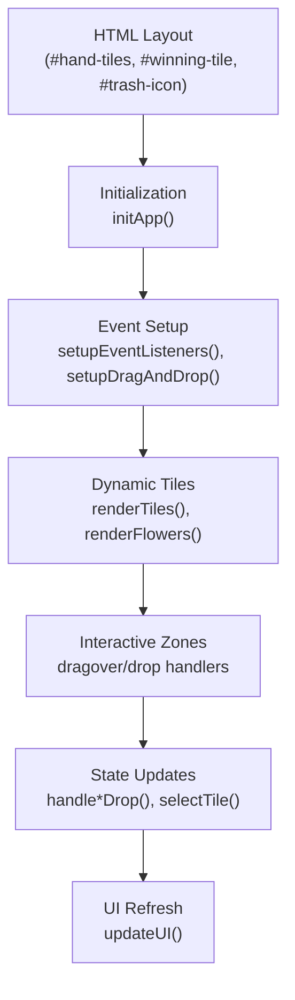
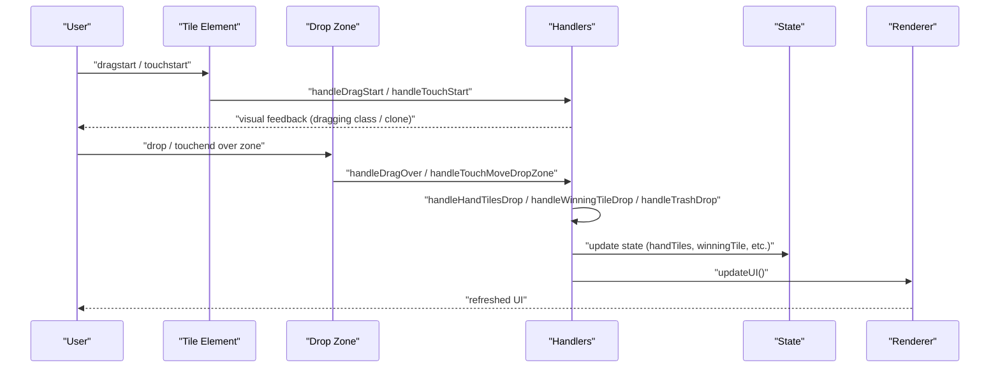
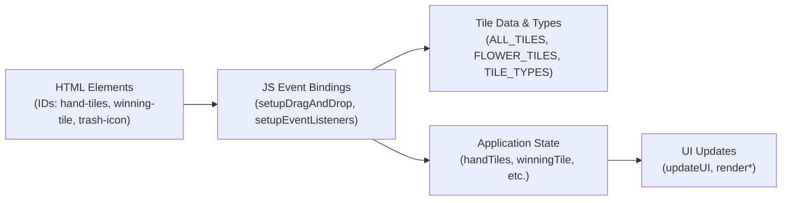

# Event Handling API

<cite>
**Referenced Files in This Document**
- [mj.js](file://mj.js)
- [mj.html](file://mj.html)
- [mjConst.js](file://mjConst.js)
</cite>

## Table of Contents
1. [Introduction](#introduction)
2. [Project Structure](#project-structure)
3. [Core Components](#core-components)
4. [Architecture Overview](#architecture-overview)
5. [Detailed Component Analysis](#detailed-component-analysis)
6. [Dependency Analysis](#dependency-analysis)
7. [Performance Considerations](#performance-considerations)
8. [Troubleshooting Guide](#troubleshooting-guide)
9. [Conclusion](#conclusion)

## Introduction
This document explains the event handling system of the OV MJ Calculator, focusing on drag-and-drop and touch interactions for selecting and moving tiles between areas such as hand tiles, winning tile, and trash. It covers how interactive elements are initialized, how custom events bridge mouse and touch flows, and how to integrate external listeners or programmatically trigger interactions.

## Project Structure
The application is a single-page interface with:
- HTML layout defining containers for selectable tiles, hand tiles, exposed groups, winning tile area, and trash icon.
- JavaScript that initializes UI, sets up event listeners, manages state, and renders dynamic tile elements.
- Constants defining tile types and tile data used by rendering and selection logic.

**Diagram sources**
- [mj.js:36-42](file://mj.js#L36-L42)
- [mj.js:45-65](file://mj.js#L45-L65)
- [mj.js:535-578](file://mj.js#L535-L578)
- [mj.js:909-917](file://mj.js#L909-L917)
- [mj.html:13-58](file://mj.html#L13-L58)

**Section sources**
- [mj.html:13-58](file://mj.html#L13-L58)
- [mj.js:36-42](file://mj.js#L36-L42)
- [mj.js:535-578](file://mj.js#L535-L578)
- [mj.js:909-917](file://mj.js#L909-L917)
- [mjConst.js:1-65](file://mjConst.js#L1-L65)

## Core Components
- Drag-and-drop initialization: setupDragAndDrop configures draggable attributes and binds drag events to all tile elements; it also registers drop zones for hand tiles, winning tile, and trash.
- Mouse drag handlers: handleDragStart, handleDragEnd, handleDragOver, handleDragEnter, handleDragLeave manage native drag behavior and visual feedback.
- Touch handlers: handleTouchStart, handleTouchMove, handleTouchEnd implement long-press or short-tap detection and simulate dragging via a floating clone element.
- Drop handlers: handleHandTilesDrop, handleWinningTileDrop, handleTrashDrop update application state based on where a tile was dropped.
- Click-to-select: handleTileClick adds tiles from source containers into the hand or flowers area.
- Dynamic tile lifecycle: renderTiles/renderFlowers create DOM nodes and attach event listeners via setupDragEvents; updateDraggableTiles re-applies listeners to dynamically added selected tiles.

**Section sources**
- [mj.js:45-65](file://mj.js#L45-L65)
- [mj.js:67-91](file://mj.js#L67-L91)
- [mj.js:93-116](file://mj.js#L93-L116)
- [mj.js:151-177](file://mj.js#L151-L177)
- [mj.js:180-308](file://mj.js#L180-L308)
- [mj.js:386-442](file://mj.js#L386-L442)
- [mj.js:449-522](file://mj.js#L449-L522)
- [mj.js:535-578](file://mj.js#L535-L578)
- [mj.js:705-711](file://mj.js#L705-L711)

## Architecture Overview
The event system uses a combination of native drag-and-drop APIs and custom touch simulation. The flow ensures consistent behavior across devices and supports dynamic tile creation.

**Diagram sources**
- [mj.js:67-91](file://mj.js#L67-L91)
- [mj.js:93-116](file://mj.js#L93-L116)
- [mj.js:180-308](file://mj.js#L180-L308)
- [mj.js:386-442](file://mj.js#L386-L442)
- [mj.js:449-522](file://mj.js#L449-L522)
- [mj.js:909-917](file://mj.js#L909-L917)

## Detailed Component Analysis

### Drag-and-Drop Initialization: setupDragAndDrop
- Scans all existing .tile elements and marks them draggable, then attaches unified drag/touch/click listeners via setupDragEvents.
- Registers three drop zones: hand-tiles, winning-tile, and trash-icon.
- Ensures newly created tiles remain interactive through updateDraggableTiles when selected tiles are rendered.

Key responsibilities:
- Centralized listener attachment to avoid duplicates.
- Consistent configuration of drop zones with both mouse and touch support.
- Guarding against missing DOM elements during initialization.

**Section sources**
- [mj.js:45-65](file://mj.js#L45-L65)
- [mj.js:118-148](file://mj.js#L118-L148)
- [mj.js:705-711](file://mj.js#L705-L711)

### Mouse Drag Handlers
- handleDragStart: stores tile metadata in dataTransfer and starts visual dragging state.
- handleDragEnd: clears dragging classes globally.
- Global dragend cleanup: ensures any lingering dragging classes are removed.
- Zone hover effects: handleDragEnter/handleDragLeave add/remove drag-over styling.
- handleDragOver: enables drop by setting dropEffect.

These handlers ensure smooth drag UX and consistent state transitions.

**Section sources**
- [mj.js:386-419](file://mj.js#L386-L419)
- [mj.js:421-442](file://mj.js#L421-L442)

### Touch Event Handlers (Mobile Support)
- handleTouchStart: prevents default scrolling, captures initial coordinates, prepares drag data, and sets a long-press timeout to start dragging after a threshold.
- handleTouchMove: detects movement beyond a small threshold to initiate dragging; creates a floating clone positioned under the finger; prevents scroll while dragging.
- handleTouchEnd: resolves drop target using elementFromPoint; if no valid zone, falls back to simulating a click for quick taps; cleans up temporary drag image and state.
- Zone-specific touch helpers: handleTouchMoveDropZone and handleTouchEndDropZone coordinate drop execution for touch flows.

Behavior highlights:
- Long press vs. tap distinction improves usability on mobile.
- Custom drag image mimics native drag behavior.
- Robust fallbacks and warnings help diagnose issues.

**Section sources**
- [mj.js:180-308](file://mj.js#L180-L308)
- [mj.js:310-377](file://mj.js#L310-L377)

### Drop Handlers and State Updates
- handleHandTilesDrop: moves tiles into hand or restores from winning tile; selects tiles from source containers.
- handleWinningTileDrop: sets or clears the winning tile; moves tiles between hand and winning tile.
- handleTrashDrop: removes tiles from hand or clears winning tile.

All handlers parse dataTransfer JSON payloads and call updateUI to reflect changes.

**Section sources**
- [mj.js:449-522](file://mj.js#L449-L522)

### Click-to-Select Flow
- handleTileClick: adds tiles from source containers into hand or flowers; shows status messages; updates UI.
- Works alongside drag-and-drop to provide alternative interaction paths.

**Section sources**
- [mj.js:151-177](file://mj.js#L151-L177)

### Dynamic Tile Lifecycle and Event Delegation Pattern
- Rendering functions (renderTiles, renderFlowers) create DOM nodes and immediately attach listeners via setupDragEvents.
- When tiles are moved into the hand or winning tile areas, updateHandTilesDisplay/updateWinningTileDisplay recreate nodes and reattach listeners.
- updateDraggableTiles ensures any dynamically added selected tiles become interactive.

While not using a single delegated listener on a parent container, the code consistently rebinds listeners to each new node, ensuring correctness for dynamically created elements.

**Section sources**
- [mj.js:535-578](file://mj.js#L535-L578)
- [mj.js:926-942](file://mj.js#L926-L942)
- [mj.js:1037-1052](file://mj.js#L1037-L1052)
- [mj.js:705-711](file://mj.js#L705-L711)

### Custom Events Fired by the Application
- During touch-based drops, a CustomEvent named "drop" is created and dispatched on the target zone. Its payload includes a dataTransfer-like object with getData returning the serialized drag data. This allows external listeners to observe drop actions triggered by touch flows.

Note: No other custom events are explicitly fired elsewhere in the analyzed code.

**Section sources**
- [mj.js:358-369](file://mj.js#L358-L369)

### Integration Examples

#### External Listeners for Drop Zones
You can listen to the custom "drop" event on any drop zone to react to user interactions:

- Add a listener to a drop zone (e.g., #hand-tiles) to capture drop events.
- Read the payload via e.dataTransfer.getData('application/json') to get tile metadata.
- Perform side effects like logging, analytics, or additional validation.

Example pattern:
- Attach an event listener to the zone.
- On 'drop', parse the payload and act accordingly.

[No sources needed since this section provides integration guidance without analyzing specific files]

#### Programmatic Interaction
To programmatically move a tile:
- Update state directly (e.g., push to state.handTiles or set state.winningTile).
- Call updateUI to refresh the interface.
- Optionally dispatch a synthetic "drop" event if you need downstream consumers to react.

[No sources needed since this section provides integration guidance without analyzing specific files]

## Dependency Analysis
- HTML defines the interactive regions and controls referenced by IDs.
- JavaScript initializes and binds listeners to these regions.
- Constants define tile types and datasets used during rendering and selection.

**Diagram sources**
- [mj.html:13-58](file://mj.html#L13-L58)
- [mj.js:36-42](file://mj.js#L36-L42)
- [mj.js:535-578](file://mj.js#L535-L578)
- [mj.js:909-917](file://mj.js#L909-L917)
- [mjConst.js:1-65](file://mjConst.js#L1-L65)

**Section sources**
- [mj.html:13-58](file://mj.html#L13-L58)
- [mj.js:36-42](file://mj.js#L36-L42)
- [mj.js:535-578](file://mj.js#L535-L578)
- [mj.js:909-917](file://mj.js#L909-L917)
- [mjConst.js:1-65](file://mjConst.js#L1-L65)

## Performance Considerations
- Avoid redundant bindings: setupDragEvents removes previous listeners before adding new ones to prevent memory leaks and duplicate triggers.
- Batch UI updates: updateUI consolidates multiple UI refreshes into one pass.
- Minimize DOM churn: dynamic rendering recreates only necessary elements and reuses constants for tile definitions.
- Touch performance: passive:false is used intentionally to preventDefault during drag operations; keep this minimal scope to avoid blocking scrolling outside drag contexts.
- Cleanup: global dragend handler and per-element cleanup in touch end ensure no stale references or floating clones remain.

[No sources needed since this section provides general guidance]

## Troubleshooting Guide
Common issues and their locations:
- Missing elements: console errors indicate when expected drop zones are not found during initialization.
- No drag data: warnings appear if touch move occurs without drag data or if no dragging element exists at drop time.
- Invalid drop targets: warnings log when no valid drop zone is detected at touch end coordinates.
- Scroll interference: warnings note when touchend cannot be canceled due to scrolling conflicts.

Mitigations:
- Ensure DOM elements exist before initialization.
- Verify that tiles have required dataset attributes (type, value, source).
- Check that touch coordinates resolve to valid zones using elementFromPoint.

**Section sources**
- [mj.js:118-148](file://mj.js#L118-L148)
- [mj.js:243-246](file://mj.js#L243-L246)
- [mj.js:324-370](file://mj.js#L324-L370)

## Conclusion
The OV MJ Calculator’s event handling system combines native drag-and-drop with a robust touch implementation to support seamless tile interactions across devices. It centralizes initialization, maintains clean state updates, and exposes a custom "drop" event for extensibility. By following the patterns described here, developers can integrate external listeners, automate interactions, and extend the calculator’s capabilities while preserving performance and reliability.