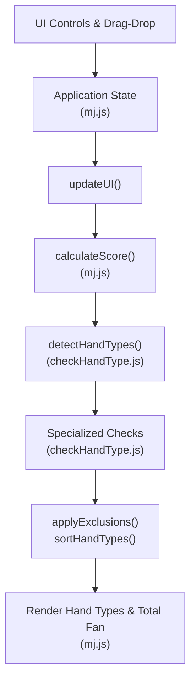
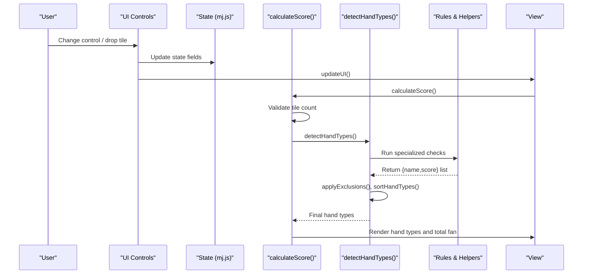
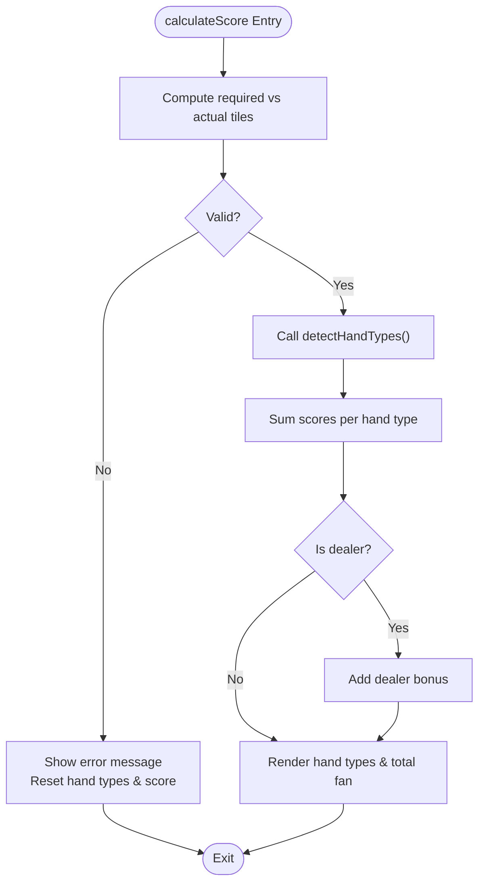
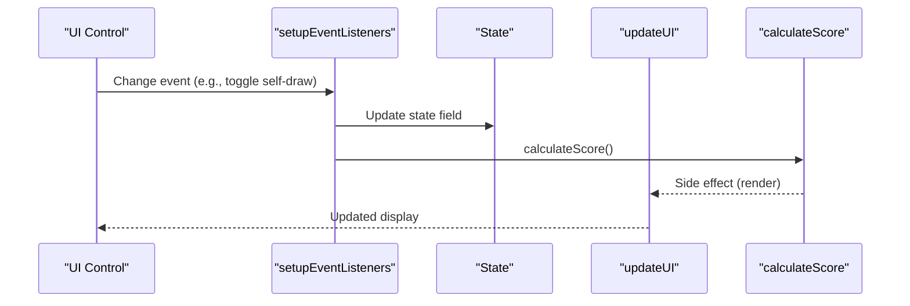
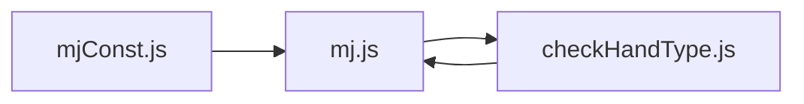

# Scoring Calculation Functions

<cite>
**Referenced Files in This Document**
- [mj.js](file://mj.js)
- [checkHandType.js](file://checkHandType.js)
- [mjConst.js](file://mjConst.js)
</cite>

## Table of Contents
1. [Introduction](#introduction)
2. [Project Structure](#project-structure)
3. [Core Components](#core-components)
4. [Architecture Overview](#architecture-overview)
5. [Detailed Component Analysis](#detailed-component-analysis)
6. [Dependency Analysis](#dependency-analysis)
7. [Performance Considerations](#performance-considerations)
8. [Troubleshooting Guide](#troubleshooting-guide)
9. [Conclusion](#conclusion)

## Introduction
This document explains the scoring calculation system of the OV MJ Calculator, focusing on:
- The main calculateScore function and its execution flow
- Hand type detection algorithms and scoring rules
- Specialized scoring functions (signatures, inputs, outputs, usage)
- How winning conditions (self-draw, robbing kong, etc.) affect scores
- Integration between UI state changes and scoring recalculation triggers

The implementation is split across:
- UI state management and event wiring in mj.js
- Comprehensive hand pattern detection and scoring in checkHandType.js
- Tile definitions and constants in mjConst.js

## Project Structure
At a high level:
- mj.js manages application state, UI interactions, and calls calculateScore whenever relevant state changes.
- checkHandType.js implements detectHandTypes and many specialized checks that produce named hand types with associated fan (score) values.
- mjConst.js defines tile types and tile sets used by both files.



**Diagram sources**
- [mj.js:580-703](file://mj.js#L580-L703)
- [mj.js:909-917](file://mj.js#L909-L917)
- [mj.js:1082-1129](file://mj.js#L1082-L1129)
- [checkHandType.js:104-587](file://checkHandType.js#L104-L587)

**Section sources**
- [mj.js:1-42](file://mj.js#L1-L42)
- [mj.js:580-703](file://mj.js#L580-L703)
- [mj.js:909-917](file://mj.js#L909-L917)
- [mj.js:1082-1129](file://mj.js#L1082-L1129)
- [checkHandType.js:104-587](file://checkHandType.js#L104-L587)
- [mjConst.js:1-65](file://mjConst.js#L1-L65)

## Core Components
- Application state object holds tiles, open melds, winning tile, seat/round winds, dealer info, and flags for special conditions (self-draw, last tile draw, robbing kong, multi-win, etc.).
- Event listeners wire UI controls to update state and trigger calculateScore.
- calculateScore validates tile counts, invokes detectHandTypes, aggregates scores, and renders results.
- detectHandTypes runs a comprehensive set of checks to identify valid hand patterns and assigns fan values per rule set.

Key responsibilities:
- mj.js: state updates, UI rendering, score aggregation and display
- checkHandType.js: pattern detection, exclusion rules, sorting, and detailed scoring logic
- mjConst.js: tile type constants and tile lists

**Section sources**
- [mj.js:1-33](file://mj.js#L1-L33)
- [mj.js:580-703](file://mj.js#L580-L703)
- [mj.js:909-917](file://mj.js#L909-L917)
- [mj.js:1082-1129](file://mj.js#L1082-L1129)
- [checkHandType.js:104-587](file://checkHandType.js#L104-L587)
- [mjConst.js:1-65](file://mjConst.js#L1-L65)

## Architecture Overview
The scoring pipeline is event-driven:
- User actions (drag-drop, toggles) modify state
- updateUI refreshes visuals and calls calculateScore
- calculateScore validates total tile count and delegates to detectHandTypes
- detectHandTypes returns an array of {name, score} objects
- applyExclusions removes conflicting patterns; sortHandTypes orders them
- mj.js sums scores and displays each detected hand type plus total fan



**Diagram sources**
- [mj.js:580-703](file://mj.js#L580-L703)
- [mj.js:909-917](file://mj.js#L909-L917)
- [mj.js:1082-1129](file://mj.js#L1082-L1129)
- [checkHandType.js:104-587](file://checkHandType.js#L104-L587)

## Detailed Component Analysis

### Main Scoring Function: calculateScore
- Purpose: Validate hand composition, compute detected hand types, aggregate scores, and render results.
- Inputs: Reads from global state (tiles, open melds, winning tile, seat/round wind, dealer flags, special condition flags).
- Execution flow:
  - Clears previous status messages
  - Computes required tile count based on exposed groups and kongs
  - Validates total tile count; if invalid, shows message and resets display
  - Calls detectHandTypes to get all applicable hand types
  - Aggregates scores and appends dealer bonus when applicable
  - Updates DOM with individual hand types and total fan count
- Outputs: Updates UI elements (#hand-types, #score-display); no return value used by caller beyond side effects.



**Diagram sources**
- [mj.js:1082-1129](file://mj.js#L1082-L1129)

**Section sources**
- [mj.js:1082-1129](file://mj.js#L1082-L1129)

### Hand Type Detection: detectHandTypes
- Purpose: Identify all applicable hand patterns and assign fan values according to rules.
- Inputs: Global state (hand tiles, flowers, chows, pungs, open/concealed kongs, winning tile, seat/round wind, dealer flags, special condition flags).
- Execution highlights:
  - High-priority hands first (e.g., Shi San Yao, Shi Liu Bu Da variants)
  - Suite-based patterns (pure/mixed one suit, dragons, winds)
  - Sister/hand sequences (gaoxiang, xiangfeng, bubugao)
  - State-based bonuses (self-draw, declared ready, ippatsu, last tile draw/discard, flower/kong draws, robbing kong, double kong draw, face-down, multi-win, tenhou/chihou, tenready/chiready)
  - Flower scoring and special win conditions (flower two platforms)
  - Exclusion rules applied to avoid overlapping or conflicting patterns
  - Special “Da Ji Hu” transformation when non-reward fan ≤ 1
  - Sorting by score then name
- Outputs: Array of {name, score} objects representing detected hand types.

```mermaid
classDiagram
class Detector {
+detectHandTypes() {name,score}[]
+applyExclusions(handTypes) {name,score}[]
+checkDaJiHu(handTypes, isSelfDraw) {name,score}[]
+sortHandTypes(handTypes) {name,score}[]
}
class Helpers {
+isShiSanYao(allTiles) bool
+isShiLiuBuDa(allTiles) result
+isPingHu(allTiles) bool
+isDuiDuiHu(allTiles) bool
+isPureOneSuit(allTiles) bool
+isMixedOneSuit(allTiles) bool
+getWindPungs() string[]
+getDragonPungs() string[]
+calculateFlowerScore() object
+...many more specialized checks...
}
Detector --> Helpers : "uses"
```

**Diagram sources**
- [checkHandType.js:104-587](file://checkHandType.js#L104-L587)
- [checkHandType.js:2034-2055](file://checkHandType.js#L2034-L2055)
- [checkHandType.js:2057-2124](file://checkHandType.js#L2057-L2124)
- [checkHandType.js:2126-2198](file://checkHandType.js#L2126-L2198)
- [checkHandType.js:2200-2251](file://checkHandType.js#L2200-L2251)
- [checkHandType.js:2744-2845](file://checkHandType.js#L2744-L2845)

**Section sources**
- [checkHandType.js:104-587](file://checkHandType.js#L104-L587)

### Specialized Scoring Functions and Rules
Below are key specialized functions with their roles, inputs, outputs, and usage context.

- applyExclusions(handTypes): Removes conflicting hand types based on predefined exclusion rules.
  - Input: Array of {name, score}
  - Output: Filtered array of {name, score}
  - Usage: Called after collecting all candidate hand types to ensure consistent scoring.

- checkDaJiHu(handTypes, isSelfDraw): Transforms low-scoring hands into “Da Ji Hu” or “Ya Hu” depending on self-draw, keeping only reward-type bonuses.
  - Inputs: handTypes array, boolean isSelfDraw
  - Output: Modified handTypes array
  - Usage: Applied after exclusions to handle special low-fan wins.

- detectHandTypes(): Orchestrates all checks and returns final sorted hand types.
  - Inputs: Global state
  - Output: Sorted array of {name, score}
  - Usage: Central entry point for scoring.

- isShiSanYao(allTiles), analyzeWaitsBeforeWinForShiSanYao(handTiles): Detects 13-orphan-like patterns and analyzes pre-win waits for scoring variants.
  - Inputs: allTiles or handTiles
  - Output: Boolean or wait list
  - Usage: Determines base score and potential multi-wait variants.

- isShiLiuBuDa(allTiles), isShiLiuBuDaDuDu(allTiles), isShiLiuBuDaSanXiangFeng(allTiles), isShiLiuBuDaZhaLong(allTiles): Detect 16-tile non-chow patterns and related sub-patterns.
  - Inputs: allTiles
  - Output: Result object or boolean
  - Usage: Assigns base and variant scores.

- isGreaterThanFive(allTiles), isLessThanFive(allTiles), isMissingFive(allTiles): Detect number-range constraints across all combinations.
  - Inputs: allTiles
  - Output: Boolean
  - Usage: Adds specific fan values when satisfied.

- isBigSevenDoors(allTiles), isSmallSevenDoors(allTiles), isBigFiveDoors(allTiles), isSmallFiveDoors(allTiles): Detect door coverage patterns including honors and flowers.
  - Inputs: allTiles
  - Output: Boolean
  - Usage: Adds door-related fan values.

- isAllHonors(allTiles), isBigFourWinds(allTiles), isSmallFourWinds(allTiles), isBigThreeWinds(allTiles), isSmallThreeWinds(allTiles), isBigThreeDragons(allTiles), isSmallThreeDragons(allTiles): Honor-based patterns.
  - Inputs: allTiles
  - Output: Boolean
  - Usage: Assigns honor-based fan values.

- detectGaoxiangHandTypes(allTiles), detectXiangfeng(allChows), detectBubugao(allChows), detectSisterHandTypes(allTiles): Sequence and sister patterns.
  - Inputs: allTiles or allChows
  - Output: Array of {name, score}
  - Usage: Adds sequence-based fan values.

- detectYaojiuHandTypes(allTiles): Patterns involving 1/9 tiles (ladder, old-young, broken-yao, pure/hybrid yao peng, full-carry yao jiu).
  - Inputs: allTiles
  - Output: Array of {name, score}
  - Usage: Adds yao-jiu related fan values.

- detectSiguiHandTypes(allTiles): Four-of-a-kind placement patterns (in chow, as eye, or general).
  - Inputs: allTiles
  - Output: Array of {name, score}
  - Usage: Adds sigui-related fan values.

- detectQuanDaiXHandTypes(allTiles): Full-carry patterns (pure/hybrid carry X).
  - Inputs: allTiles
  - Output: Array of {name, score}
  - Usage: Adds quan-dai-x fan values.

- calculateFlowerScore(): Computes flower points based on seat wind matching.
  - Inputs: Global state (flowers, seatWind)
  - Output: {positiveFlowers, otherFlowers, totalScore}
  - Usage: Adds flower fan values.

- isPingHu(allTiles), isDuiDuiHu(allTiles), isMixedOneSuit(allTiles), isPureOneSuit(allTiles): Basic structural patterns.
  - Inputs: allTiles
  - Output: Boolean
  - Usage: Adds base pattern fan values.

- getConcealedPungCount(), getBrotherPungs(), isThreeBrothers(allTiles), isSmallThreeBrothers(allTiles), isBigMixedBrothers(allTiles): Brother and pung patterns.
  - Inputs: allTiles
  - Output: Count or Boolean
  - Usage: Adds brother/pung-related fan values.

- isSingleWait(allTiles), isFakeSingleWait(allTiles), isPairWait(allTiles), is258Eye(allTiles): Wait and eye patterns.
  - Inputs: allTiles
  - Output: Boolean
  - Usage: Adds single-wait/fake-single-wait/pair/eye fan values.

- getWindPungs(), getRoundWindPungs(), getSeatWindPungs(), getDragonPungs(): Honor presence checks.
  - Inputs: allTiles or state
  - Output: Array of strings
  - Usage: Adds honor-based fan values.

- sortHandTypes(handTypes): Sorts by score descending, then name ascending.
  - Inputs: Array of {name, score}
  - Output: Sorted array
  - Usage: Ensures deterministic display order.

Usage examples (conceptual):
- Self-draw: When state.isSelfDraw is true, detectHandTypes adds “自摸” and possibly “門清自摸” depending on other conditions; calculateScore includes these in total.
- Robbing kong: When state.isRobbingKong is true, detectHandTypes adds “搶槓食糊”; similarly for double kong and robbing double kong.
- Multi-win: When state.isMultiWin is 2 or 3, “雪上霜(雙響)” or “雪上冰(三響)” are added; if state.isMultiWinSelfDraw is true, “錦上添花” variants are added.
- Last tile draw/discard: When state.isLastTileDraw or state.isLastDiscard is true, respective fans are added.
- Tenhou/Chihou/Tenready/Chiready: When corresponding flags are set, respective fans are added.

**Section sources**
- [checkHandType.js:1-70](file://checkHandType.js#L1-L70)
- [checkHandType.js:72-102](file://checkHandType.js#L72-L102)
- [checkHandType.js:104-587](file://checkHandType.js#L104-L587)
- [checkHandType.js:589-764](file://checkHandType.js#L589-L764)
- [checkHandType.js:765-1005](file://checkHandType.js#L765-L1005)
- [checkHandType.js:1027-1117](file://checkHandType.js#L1027-L1117)
- [checkHandType.js:1119-1255](file://checkHandType.js#L1119-L1255)
- [checkHandType.js:1257-1500](file://checkHandType.js#L1257-L1500)
- [checkHandType.js:1590-1877](file://checkHandType.js#L1590-L1877)
- [checkHandType.js:1879-2032](file://checkHandType.js#L1879-L2032)
- [checkHandType.js:2034-2055](file://checkHandType.js#L2034-L2055)
- [checkHandType.js:2057-2198](file://checkHandType.js#L2057-L2198)
- [checkHandType.js:2200-2251](file://checkHandType.js#L2200-L2251)
- [checkHandType.js:2253-2411](file://checkHandType.js#L2253-L2411)
- [checkHandType.js:2413-2587](file://checkHandType.js#L2413-L2587)
- [checkHandType.js:2589-2742](file://checkHandType.js#L2589-L2742)
- [checkHandType.js:2744-2845](file://checkHandType.js#L2744-L2845)
- [checkHandType.js:2847-2958](file://checkHandType.js#L2847-L2958)
- [checkHandType.js:2959-3017](file://checkHandType.js#L2959-L3017)
- [checkHandType.js:3019-3129](file://checkHandType.js#L3019-L3129)
- [checkHandType.js:3131-3257](file://checkHandType.js#L3131-L3257)
- [checkHandType.js:3259-3376](file://checkHandType.js#L3259-L3376)
- [checkHandType.js:3424-3786](file://checkHandType.js#L3424-L3786)
- [checkHandType.js:3788-3847](file://checkHandType.js#L3788-L3847)
- [checkHandType.js:3849-3991](file://checkHandType.js#L3849-L3991)
- [checkHandType.js:3993-4036](file://checkHandType.js#L3993-L4036)
- [checkHandType.js:4038-4188](file://checkHandType.js#L4038-L4188)
- [checkHandType.js:4190-4286](file://checkHandType.js#L4190-L4286)

### Winning Conditions Impact on Scores
- Self-draw: Adds “自摸” and potentially “門清自摸” when also menzen; influences “Da Ji Hu” path via checkDaJiHu.
- Roobing kong: Adds “搶槓食糊”; double kong draw adds “槓上槓食糊”; robbing double kong adds “搶槓上槓糊”.
- Last tile draw/discard: Adds “海底撈月” or “河底撈魚”.
- Flower draw/kong draw: Adds “花上自摸” or “槓上自摸”.
- Face-down: Adds “蓋牌”.
- Multi-win: Adds “雪上霜(雙響)” or “雪上冰(三響)”; with self-draw flag, adds “錦上添花” variants.
- Tenhou/Chihou/Tenready/Chiready: Adds respective high-value fans when flags are set.
- Visible win tile count: If 3 visible winning tiles, adds “明絕” or “絕絕” depending on wait shape.

These conditions are read directly from state and evaluated within detectHandTypes.

**Section sources**
- [checkHandType.js:263-328](file://checkHandType.js#L263-L328)
- [checkHandType.js:332-374](file://checkHandType.js#L332-L374)
- [checkHandType.js:545-582](file://checkHandType.js#L545-L582)
- [checkHandType.js:558-561](file://checkHandType.js#L558-L561)

### UI Integration and Recalculation Triggers
- Event listeners in setupEventListeners bind UI controls to state updates and call calculateScore immediately upon change.
- updateUI orchestrates visual updates and ensures calculateScore runs after any state mutation.
- Drag-and-drop handlers update state and call updateUI, which triggers recalculations.



**Diagram sources**
- [mj.js:580-703](file://mj.js#L580-L703)
- [mj.js:909-917](file://mj.js#L909-L917)
- [mj.js:1082-1129](file://mj.js#L1082-L1129)

**Section sources**
- [mj.js:580-703](file://mj.js#L580-L703)
- [mj.js:909-917](file://mj.js#L909-L917)
- [mj.js:1082-1129](file://mj.js#L1082-L1129)

## Dependency Analysis
- mj.js depends on mjConst.js for tile definitions and CSS classes.
- mj.js calls detectHandTypes in checkHandType.js, which reads global state and uses helper functions defined in the same file.
- Exclusion rules and sorting are internal to checkHandType.js and influence final output consumed by mj.js.



**Diagram sources**
- [mjConst.js:1-65](file://mjConst.js#L1-L65)
- [mj.js:524-533](file://mj.js#L524-L533)
- [mj.js:1082-1129](file://mj.js#L1082-L1129)
- [checkHandType.js:104-587](file://checkHandType.js#L104-L587)

**Section sources**
- [mjConst.js:1-65](file://mjConst.js#L1-L65)
- [mj.js:524-533](file://mj.js#L524-L533)
- [mj.js:1082-1129](file://mj.js#L1082-L1129)
- [checkHandType.js:104-587](file://checkHandType.js#L104-L587)

## Performance Considerations
- detectHandTypes performs multiple passes over all tiles and melds; complexity grows with number of suits and melds but remains manageable for typical Mahjong hand sizes.
- Exclusion rules reduce redundant scoring paths early, improving clarity and performance.
- Repeated computations (e.g., getAllMelds, getAllChows, getAllPungs) can be optimized by caching results within a single detectHandTypes call if needed.
- UI-triggered recalculations occur frequently; consider debouncing heavy operations if additional features increase computation cost.

[No sources needed since this section provides general guidance]

## Troubleshooting Guide
Common issues and where to inspect:
- Invalid tile count: calculateScore shows an error and resets display; verify hand tiles, open melds, and winning tile totals match expected requirements.
- Missing or extra tiles: Ensure exposed groups (chows, pungs, kongs) and hand tiles sum correctly; see validation logic in calculateScore.
- Unexpected exclusions: Review EXCLUSION_RULES and applyExclusions to understand why certain patterns were removed.
- Incorrect winning condition flags: Confirm UI toggles reflect game state (self-draw, last tile draw/discard, robbing kong, multi-win, etc.), as they directly influence detectHandTypes outcomes.

**Section sources**
- [mj.js:1082-1101](file://mj.js#L1082-L1101)
- [checkHandType.js:1-70](file://checkHandType.js#L1-L70)

## Conclusion
The OV MJ Calculator’s scoring system centers on a robust detectHandTypes engine that identifies numerous traditional Mahjong patterns and applies exclusion rules to produce a coherent set of scored hand types. The main calculateScore function orchestrates validation, detection, and presentation, while UI events continuously drive recalculation. Specialized functions encapsulate complex pattern checks, making the system extensible and maintainable. Understanding the integration points and rule interactions enables accurate debugging and future enhancements.

[No sources needed since this section summarizes without analyzing specific files]