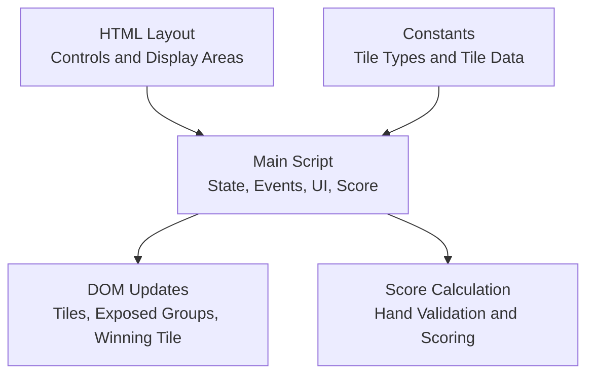
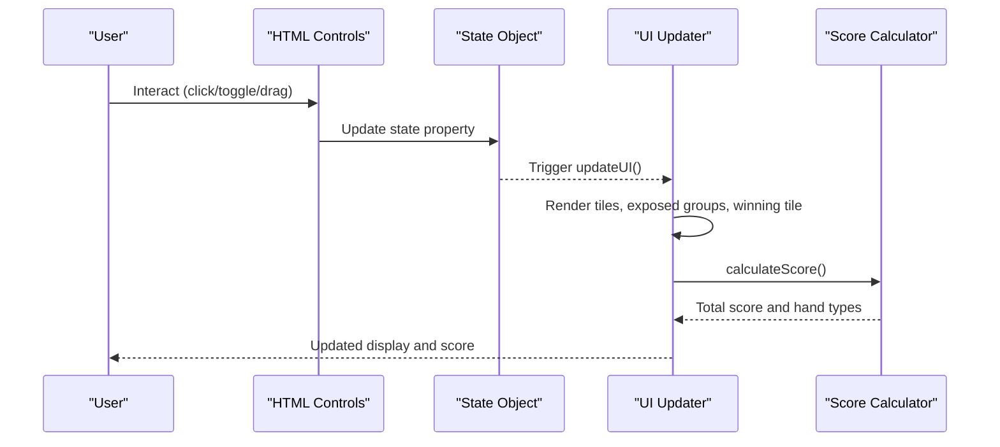
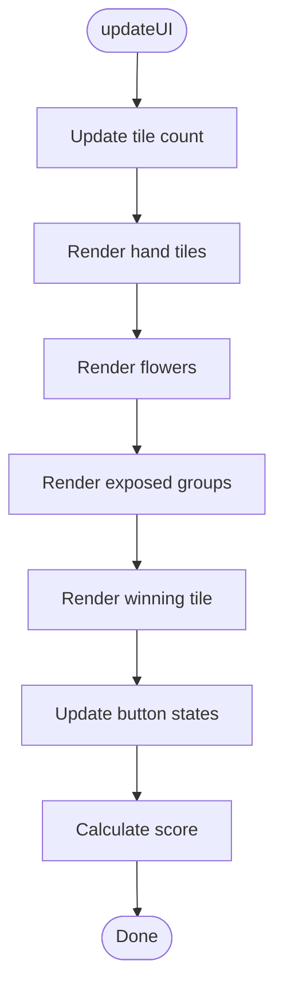
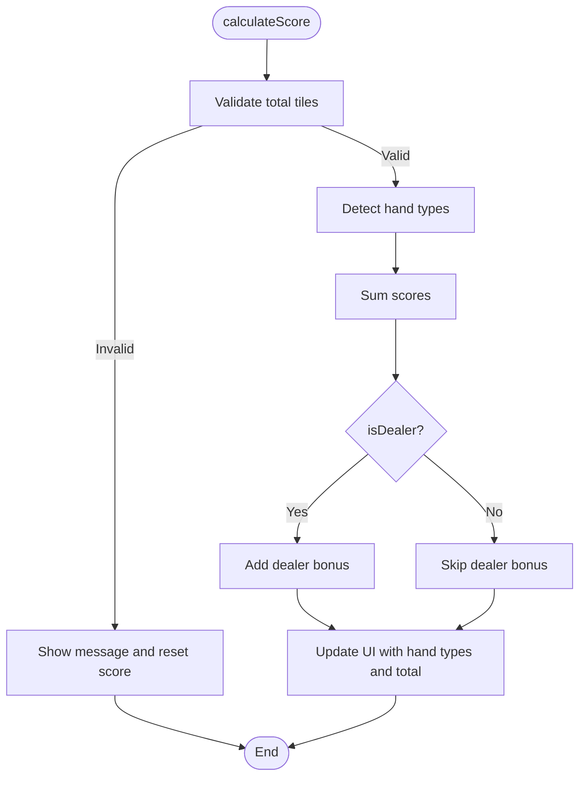
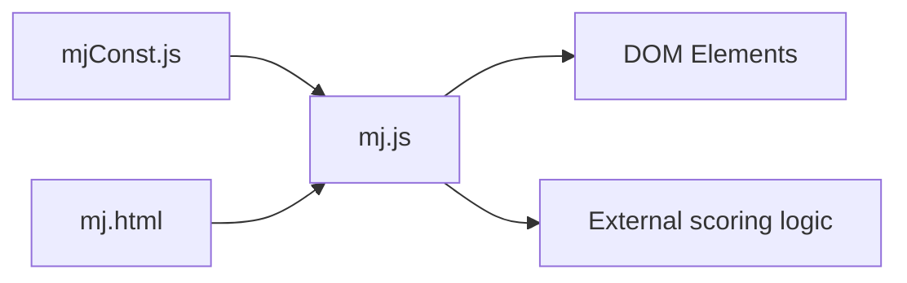

# State Management API

<cite>
**Referenced Files in This Document**
- [mj.js](file://mj.js)
- [mjConst.js](file://mjConst.js)
- [mj.html](file://mj.html)
</cite>

## Table of Contents
1. [Introduction](#introduction)
2. [Project Structure](#project-structure)
3. [Core Components](#core-components)
4. [Architecture Overview](#architecture-overview)
5. [Detailed Component Analysis](#detailed-component-analysis)
6. [Dependency Analysis](#dependency-analysis)
7. [Performance Considerations](#performance-considerations)
8. [Troubleshooting Guide](#troubleshooting-guide)
9. [Conclusion](#conclusion)

## Introduction
This document explains the state management system of the OV MJ Calculator, focusing on the central application state, how it is updated by user interactions, and how those updates drive UI rendering and score recalculation. It also covers programmatic state manipulation patterns, event-driven updates, the history mechanism for undo, and notes on persistence.

## Project Structure
The calculator is a single-page web app with:
- A static HTML layout defining input controls and display areas
- A constants module defining tile types and available tiles
- A main script that defines the global state, handles events, updates the UI, and calculates scores

**Diagram sources**
- [mj.html:1-248](file://mj.html#L1-L248)
- [mj.js:1-1211](file://mj.js#L1-L1211)
- [mjConst.js:1-65](file://mjConst.js#L1-L65)

**Section sources**
- [mj.html:1-248](file://mj.html#L1-L248)
- [mj.js:1-1211](file://mj.js#L1-L1211)
- [mjConst.js:1-65](file://mjConst.js#L1-L65)

## Core Components
At the heart of the application is a single global state object that captures the current hand, exposed groups, winning tile, seat/round winds, dealer information, and many special condition flags. All UI components and scoring logic read from this state.

Key responsibilities:
- Maintain a canonical snapshot of the game state
- Provide mutation functions that update state and persist history
- Trigger UI updates and score recalculations after any change

State properties overview:
- Hand and exposed groups:
  - handTiles: array of tile objects representing the player's concealed hand
  - flowers: array of flower tile objects
  - chows: array of sequential triplets (e.g., 1-2-3 of same suit)
  - pungs: array of triplets of identical tiles
  - openKongs: array of four-of-a-kind sets declared openly
  - concealedKongs: array of four-of-a-kind sets kept hidden
- Winning tile:
  - winningTile: a single tile object or null
- Seat and round context:
  - seatWind: string indicating the player's seat wind
  - roundWind: string indicating the current round wind
  - isDealer: boolean indicating if the player is the dealer
  - dealerCount: integer number of consecutive dealer rounds
- Special condition flags:
  - isSelfDraw: boolean
  - isDeclaredReady: boolean
  - isIppatsu: boolean
  - isLastTileDraw: boolean
  - isLastDiscard: boolean
  - isFlowerDraw: boolean
  - isKongDraw: boolean
  - isRobbingKong: boolean
  - isDoubleKongDraw: boolean
  - isRobbingDoubleKong: boolean
  - isTenhou: boolean
  - isChihou: boolean
  - isTenReady: boolean
  - isChiReady: boolean
  - isFaceDown: boolean
  - isMultiWin: integer (0 none, 2 double, 3 triple)
  - isMultiWinSelfDraw: boolean
  - visibleWinTileCount: integer (0–3)
- History:
  - history: array of previous snapshots used for undo

Data types summary:
- Arrays: handTiles, flowers, chows, pungs, openKongs, concealedKongs, history
- Objects: winningTile (single tile), each element in arrays is a tile or group object
- Booleans: all is* flags
- Strings: seatWind, roundWind
- Integers: dealerCount, isMultiWin, visibleWinTileCount

**Section sources**
- [mj.js:1-33](file://mj.js#L1-L33)

## Architecture Overview
The application follows an event-driven architecture:
- User interactions (drag-and-drop, clicks, toggles) update the state
- After state changes, the UI is re-rendered and scores are recalculated
- Undo operations restore prior states from a history stack

**Diagram sources**
- [mj.js:580-703](file://mj.js#L580-L703)
- [mj.js:909-917](file://mj.js#L909-L917)
- [mj.js:1082-1129](file://mj.js#L1082-L1129)

## Detailed Component Analysis

### State Object and Properties
The state object centralizes all mutable data. Each property has a clear purpose:
- handTiles: current concealed hand tiles; supports drag-and-drop and selection
- flowers: selected flower tiles; contributes to scoring via rules
- chows/pungs/openKongs/concealedKongs: exposed groups; affect maximum hand size and scoring
- winningTile: the tile completing the hand; required for valid hands
- seatWind/roundWind: contextual winds affecting scoring
- isDealer/dealerCount: dealer status and streak multiplier
- is* flags: encode special conditions that influence scoring
- visibleWinTileCount/isMultiWin: multi-win and visibility modifiers
- history: snapshot stack enabling undo

Complexity considerations:
- Array mutations (push/splice) are O(n) where n is the number of tiles/groups
- Frequent re-renders occur after each mutation; keep arrays small for performance

**Section sources**
- [mj.js:1-33](file://mj.js#L1-L33)

### Event-Driven State Updates
All settings inputs bind directly to state properties and immediately trigger score recalculation:
- Seat wind, round wind, dealer checkbox, dealer count
- Self-draw and all special condition checkboxes/selects
These handlers update the corresponding state fields and call calculateScore().

Example flow:
- User toggles “是否自摸” -> state.isSelfDraw updated -> calculateScore() called -> UI refreshed

**Section sources**
- [mj.js:580-703](file://mj.js#L580-L703)

### Drag-and-Drop and Tile Selection
Drag-and-drop enables adding tiles to:
- Hand area: selectTile() adds to handTiles with validation
- Winning tile area: handleWinningTileDrop() sets winningTile and moves tiles between hand and winning slot
- Trash area: removes tiles from hand or clears winning tile

Validation includes:
- Maximum per-tile count (up to 4)
- Maximum hand size based on exposed groups
- Automatic winning tile assignment when hand reaches capacity

**Section sources**
- [mj.js:150-177](file://mj.js#L150-L177)
- [mj.js:449-522](file://mj.js#L449-L522)
- [mj.js:1172-1209](file://mj.js#L1172-L1209)

### Creating Exposed Groups (Chow, Pung, Kong)
- addChow(): validates three sequential tiles of the same suit; saves history; pushes to chows; removes from hand
- addPung(): validates at least three identical tiles; saves history; pushes to pungs; removes from hand
- addOpenKong()/addConcealedKong(): validates four identical tiles; saves history; pushes to respective kong arrays; removes from hand

Each operation persists a snapshot before mutation and triggers UI updates.

**Section sources**
- [mj.js:713-829](file://mj.js#L713-L829)

### UI Rendering Pipeline
updateUI() orchestrates:
- updateTileCount(): computes max hand size based on exposed groups
- updateHandTilesDisplay(): renders hand tiles with drag support
- updateFlowersDisplay(): renders selected flowers
- updateExposedTilesDisplay(): renders chows, pungs, open kongs, concealed kongs
- updateWinningTileDisplay(): renders the winning tile
- updateButtonStates(): enables/disables action buttons based on selection
- calculateScore(): validates total tile count and computes score

**Diagram sources**
- [mj.js:909-917](file://mj.js#L909-L917)
- [mj.js:919-1080](file://mj.js#L919-L1080)

**Section sources**
- [mj.js:909-1080](file://mj.js#L909-L1080)

### Score Calculation and Validation
calculateScore() performs:
- Validates total tile count against required count (including exposed groups and winning tile)
- Detects hand types via external logic and aggregates scores
- Adds dealer-related bonus based on isDealer and dealerCount
- Displays detected hand types and total score

**Diagram sources**
- [mj.js:1082-1129](file://mj.js#L1082-L1129)

**Section sources**
- [mj.js:1082-1129](file://mj.js#L1082-L1129)

### History Mechanism and Undo
History provides undo functionality:
- saveStateToHistory(): serializes key parts of the state into a snapshot and pushes onto history; caps history length to prevent unbounded growth
- undoLastAction(): pops the last snapshot and restores state fields; then updates UI
- clearSelection(): clears all selections and exposes a new history entry for undo

Persistence note:
- The current implementation does not persist history across page reloads; it exists only in memory during the session.

**Section sources**
- [mj.js:864-894](file://mj.js#L864-L894)
- [mj.js:896-907](file://mj.js#L896-L907)

### Programmatic State Manipulation Examples
While the app primarily uses event handlers, you can programmatically manipulate state by calling the relevant functions:
- Add a tile to hand: selectTile(tileObject)
- Create a Chow: addChow()
- Create a Pung: addPung()
- Create Open/Concealed Kong: addOpenKong(), addConcealedKong()
- Set winning tile: handleWinningTileDrop(event) or set state.winningTile directly
- Toggle flags: update state.* properties bound to UI elements
- Undo: undoLastAction()
- Clear: clearSelection()

After any direct state mutation, call updateUI() to reflect changes in the UI and recalculate scores.

**Section sources**
- [mj.js:1172-1209](file://mj.js#L1172-L1209)
- [mj.js:713-829](file://mj.js#L713-L829)
- [mj.js:909-917](file://mj.js#L909-L917)

## Dependency Analysis
The main script depends on:
- Constants for tile definitions and types
- HTML elements for binding events and rendering
- External scoring logic referenced in the HTML (not included here)

**Diagram sources**
- [mj.html:244-247](file://mj.html#L244-L247)
- [mjConst.js:1-65](file://mjConst.js#L1-L65)
- [mj.js:1-1211](file://mj.js#L1-L1211)

**Section sources**
- [mj.html:244-247](file://mj.html#L244-L247)
- [mjConst.js:1-65](file://mjConst.js#L1-L65)
- [mj.js:1-1211](file://mj.js#L1-L1211)

## Performance Considerations
- Keep arrays small: frequent push/splice operations scale with array length
- Batch updates: avoid multiple rapid mutations without intermediate UI updates
- Debounce heavy calculations: consider throttling repeated score recalculations if needed
- Limit history size: already capped to prevent memory growth

[No sources needed since this section provides general guidance]

## Troubleshooting Guide
Common issues and resolutions:
- Invalid hand size: ensure total tiles match required count including exposed groups and winning tile
- Button disabled: verify selection meets requirements (sequential for Chow, identical for Pung/Kong)
- Undo not working: confirm history entries exist before attempting undo
- Unexpected UI state: call updateUI() after programmatic state changes

**Section sources**
- [mj.js:1082-1129](file://mj.js#L1082-L1129)
- [mj.js:1054-1080](file://mj.js#L1054-L1080)
- [mj.js:880-894](file://mj.js#L880-L894)

## Conclusion
The OV MJ Calculator’s state management centers on a single state object updated through event handlers and explicit functions. Changes propagate to the UI and scoring engine consistently via a centralized update pipeline. The history mechanism supports undo, while persistence remains session-scoped. By following the documented patterns for state mutation and UI updates, developers can extend or integrate additional features reliably.