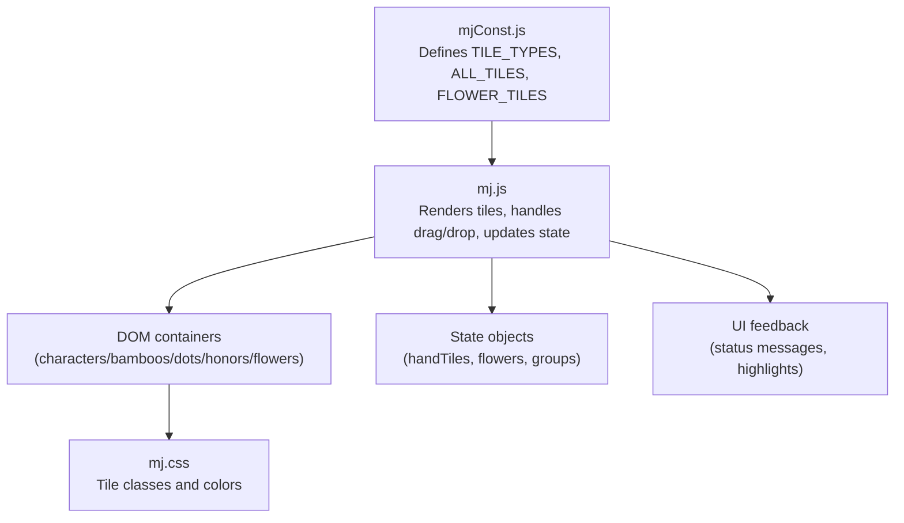
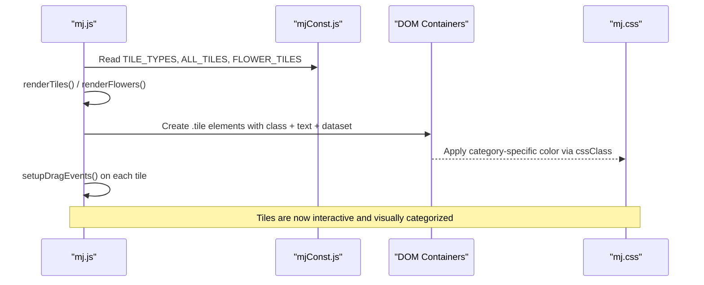
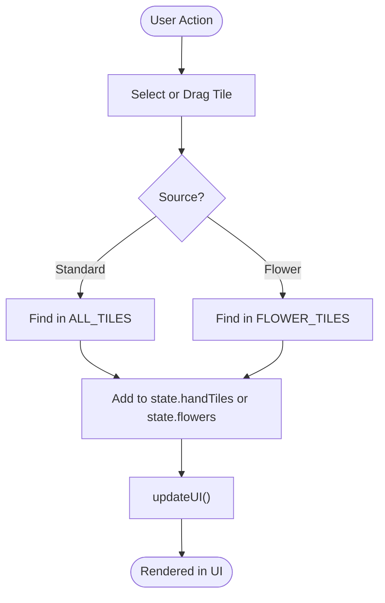
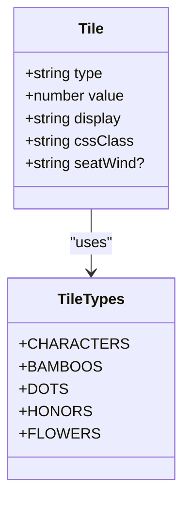
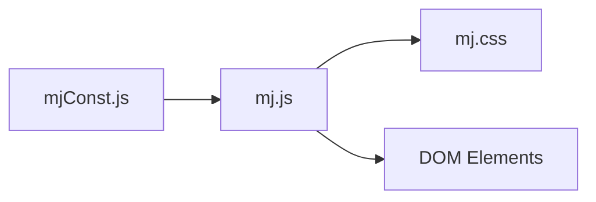

# Tile Data Structure

<cite>
**Referenced Files in This Document**
- [mjConst.js](file://mjConst.js)
- [mj.js](file://mj.js)
- [mj.css](file://mj.css)
</cite>

## Table of Contents
1. [Introduction](#introduction)
2. [Project Structure](#project-structure)
3. [Core Components](#core-components)
4. [Architecture Overview](#architecture-overview)
5. [Detailed Component Analysis](#detailed-component-analysis)
6. [Dependency Analysis](#dependency-analysis)
7. [Performance Considerations](#performance-considerations)
8. [Troubleshooting Guide](#troubleshooting-guide)
9. [Conclusion](#conclusion)

## Introduction
This document explains the tile data structures used by the application, focusing on the definitions and usage of ALL_TILES, FLOWER_TILES, and TILE_TYPES from mjConst.js. It details how tiles are structured (type, value, display, cssClass), how they are rendered to the UI, and how they are manipulated through user interactions such as selection, dragging, and grouping operations.

## Project Structure
The tile system is defined in a dedicated constants file and consumed by the main application logic for rendering and interaction:
- Constants and tile datasets: mjConst.js
- Application state, rendering, and interaction handlers: mj.js
- Visual styling for tiles and categories: mj.css

**Diagram sources**
- [mjConst.js:1-65](file://mjConst.js#L1-L65)
- [mj.js:535-578](file://mj.js#L535-L578)
- [mj.css:85-124](file://mj.css#L85-L124)

**Section sources**
- [mjConst.js:1-65](file://mjConst.js#L1-L65)
- [mj.js:535-578](file://mj.js#L535-L578)
- [mj.css:85-124](file://mj.css#L85-L124)

## Core Components
- TILE_TYPES: Enumerates tile categories used throughout the app.
- ALL_TILES: Complete set of standard tiles across characters, bamboos, dots, and honors.
- FLOWER_TILES: Special flower tiles with additional seatWind metadata.
- Tile object shape: type, value, display, cssClass (and seatWind for flowers).

Key responsibilities:
- Provide a single source of truth for tile definitions.
- Support filtering by category for rendering into specific containers.
- Enable consistent CSS class mapping for visual categorization.

**Section sources**
- [mjConst.js:1-65](file://mjConst.js#L1-L65)

## Architecture Overview
The flow from data to UI:
- Initialization renders tile sets into categorized DOM containers using filter operations on ALL_TILES and FLOWER_TILES.
- Each tile element carries dataset attributes (type, value, source) that allow event handlers to identify and manipulate the underlying tile.
- User actions update application state (handTiles, flowers, exposed groups) and trigger re-rendering or UI updates.

**Diagram sources**
- [mjConst.js:1-65](file://mjConst.js#L1-L65)
- [mj.js:535-578](file://mj.js#L535-L578)
- [mj.css:85-124](file://mj.css#L85-L124)

## Detailed Component Analysis

### Tile Types and Categories
- TILE_TYPES defines five categories: CHARACTERS, BAMBOOS, DOTS, HONORS, FLOWERS.
- These values are used to:
  - Filter ALL_TILES into per-category containers during rendering.
  - Map to CSS classes for consistent coloring.
  - Identify tile origin in drag-and-drop and selection flows.

Usage examples in code:
- Filtering for rendering:
  - Characters, Bamboos, Dots, Honors are filtered from ALL_TILES and appended to their respective containers.
- CSS class mapping:
  - getTileCssClass maps each TILE_TYPES value to a corresponding CSS class name.

**Section sources**
- [mjConst.js:1-8](file://mjConst.js#L1-L8)
- [mj.js:535-541](file://mj.js#L535-L541)
- [mj.js:524-533](file://mj.js#L524-L533)

### ALL_TILES Structure
- Contains all standard tiles grouped by category.
- Each tile object includes:
  - type: One of TILE_TYPES.CHARACTERS, BAMBOOS, DOTS, HONORS.
  - value: Numeric identifier within the category (e.g., 1–9 for suits; 1–7 for honors).
  - display: Human-readable label shown on the tile face.
  - cssClass: Category-based CSS class for styling.

Rendering behavior:
- For each category, ALL_TILES is filtered and mapped to DOM nodes with matching cssClass and dataset attributes.

**Section sources**
- [mjConst.js:10-53](file://mjConst.js#L10-L53)
- [mj.js:535-560](file://mj.js#L535-L560)

### FLOWER_TILES Structure
- Defines special flower tiles with an extra property:
  - seatWind: Associates a flower with a seat wind direction (used elsewhere in scoring/context).
- Each tile object includes:
  - type: TILE_TYPES.FLOWERS.
  - value: Unique numeric identifier among flowers.
  - display: Flower name label.
  - cssClass: 'flower' for styling.

Rendering behavior:
- Rendered into a dedicated container and made draggable/selectable like other tiles.

**Section sources**
- [mjConst.js:55-65](file://mjConst.js#L55-L65)
- [mj.js:562-578](file://mj.js#L562-L578)

### Tile Object Shape and Lifecycle
- Creation:
  - Tiles originate from ALL_TILES or FLOWER_TILES.
  - When added to hand or winning tile area, the app may clone or reference these objects and ensure cssClass is present.
- Manipulation:
  - Selection adds tiles to state.handTiles or state.flowers.
  - Drag-and-drop moves tiles between areas (hand, winning tile, trash).
  - Grouping operations (chow/pung/kong) validate and consume selected tiles, then remove them from handTiles.
- Destruction:
  - Tiles can be removed from handTiles when moved to exposed groups or discarded via trash.

**Diagram sources**
- [mj.js:150-177](file://mj.js#L150-L177)
- [mj.js:449-474](file://mj.js#L449-L474)
- [mj.js:562-578](file://mj.js#L562-L578)

**Section sources**
- [mj.js:150-177](file://mj.js#L150-L177)
- [mj.js:449-522](file://mj.js#L449-L522)
- [mj.js:562-578](file://mj.js#L562-L578)

### UI Rendering and Categorization
- Rendering functions:
  - renderTiles filters ALL_TILES by TILE_TYPES and creates DOM nodes with appropriate cssClass and dataset attributes.
  - renderFlowers renders FLOWER_TILES into a dedicated container.
- Styling:
  - Category-specific CSS classes map to distinct colors for quick visual identification.

**Diagram sources**
- [mjConst.js:1-65](file://mjConst.js#L1-L65)
- [mj.js:535-578](file://mj.js#L535-L578)
- [mj.css:120-124](file://mj.css#L120-L124)

**Section sources**
- [mj.js:535-578](file://mj.js#L535-L578)
- [mj.css:85-124](file://mj.css#L85-L124)

### Examples of Tile Operations

- Creating a tile instance for the UI:
  - Use entries from ALL_TILES or FLOWER_TILES; ensure cssClass is applied via getTileCssClass when constructing new instances for state.

- Filtering tiles by category:
  - Filter ALL_TILES by TILE_TYPES.* to populate category-specific containers.

- Adding tiles to hand or flowers:
  - On click or drop, find the matching tile in ALL_TILES or FLOWER_TILES and push into state.handTiles or state.flowers.

- Removing tiles:
  - On discard or move to exposed groups, locate and splice the tile from state.handTiles.

- Validating groups:
  - Chow: Ensure three sequential tiles of the same suit.
  - Pung/Kong: Ensure multiple identical tiles of the same type/value.

These patterns are implemented in the following sections of mj.js:
- Click handling and adding to state: [mj.js:150-177](file://mj.js#L150-L177)
- Drag-and-drop to hand/winning/trash: [mj.js:449-522](file://mj.js#L449-L522)
- Group creation and validation: [mj.js:713-800](file://mj.js#L713-L800)

**Section sources**
- [mj.js:150-177](file://mj.js#L150-L177)
- [mj.js:449-522](file://mj.js#L449-L522)
- [mj.js:713-800](file://mj.js#L713-L800)

## Dependency Analysis
- mjConst.js provides immutable definitions consumed by mj.js.
- mj.js depends on:
  - TILE_TYPES for categorization and CSS mapping.
  - ALL_TILES and FLOWER_TILES for rendering and user interactions.
- mj.css styles tiles based on cssClass values derived from TILE_TYPES.

**Diagram sources**
- [mjConst.js:1-65](file://mjConst.js#L1-L65)
- [mj.js:524-578](file://mj.js#L524-L578)
- [mj.css:120-124](file://mj.css#L120-L124)

**Section sources**
- [mjConst.js:1-65](file://mjConst.js#L1-L65)
- [mj.js:524-578](file://mj.js#L524-L578)
- [mj.css:120-124](file://mj.css#L120-L124)

## Performance Considerations
- Filtering ALL_TILES per category on each render is O(n) per category; acceptable given small dataset size.
- Reusing dataset attributes (type, value) avoids repeated lookups and enables efficient manipulation.
- Avoid unnecessary re-renders by batching state updates before calling updateUI.

[No sources needed since this section provides general guidance]

## Troubleshooting Guide
Common issues and where to inspect:
- Tiles not appearing in correct category:
  - Verify TILE_TYPES values match those used in ALL_TILES and that renderTiles filters correctly.
- Wrong CSS color applied:
  - Confirm getTileCssClass returns expected class for the tile’s type.
- Drag-and-drop not working:
  - Check that dataset attributes (type, value, source) are set on tile elements and that setupDragEvents is called after creation.
- State inconsistencies after drag/drop:
  - Inspect handleHandTilesDrop, handleWinningTileDrop, and handleTrashDrop to ensure proper splicing and nulling of winningTile.

Relevant code locations:
- Rendering and filtering: [mj.js:535-578](file://mj.js#L535-L578)
- CSS class mapping: [mj.js:524-533](file://mj.js#L524-L533)
- Drag-and-drop handlers: [mj.js:449-522](file://mj.js#L449-L522)

**Section sources**
- [mj.js:524-578](file://mj.js#L524-L578)
- [mj.js:449-522](file://mj.js#L449-L522)

## Conclusion
The tile system centers on a clear, typed data model defined in mjConst.js. ALL_TILES and FLOWER_TILES provide comprehensive tile definitions with consistent properties (type, value, display, cssClass), while TILE_TYPES standardizes categorization across rendering and interaction logic. The application uses these definitions to render categorized tiles, support drag-and-drop, manage state, and apply consistent styling. Following the documented patterns ensures reliable tile creation, manipulation, and UI integration.