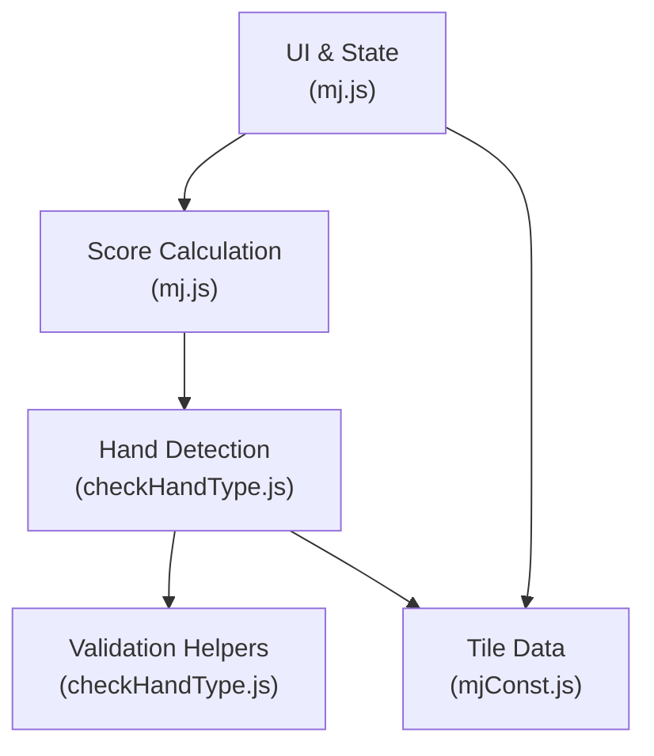
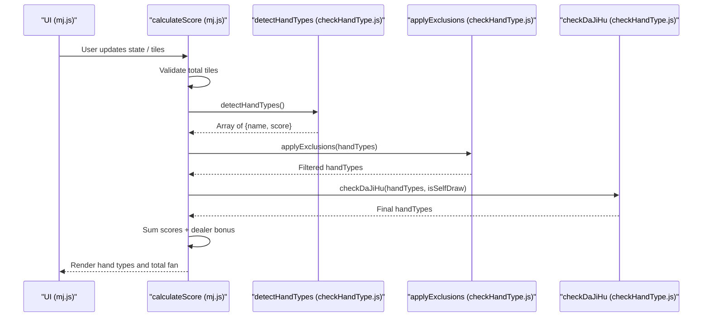
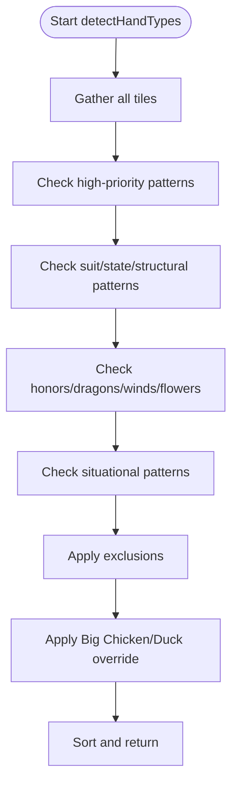
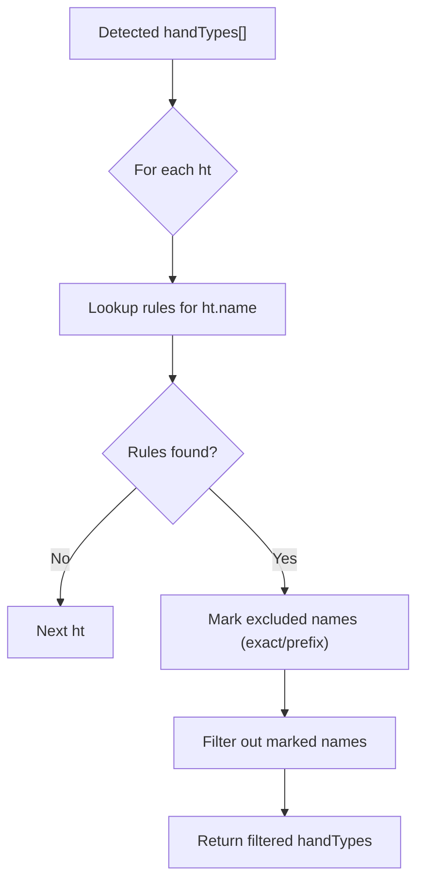
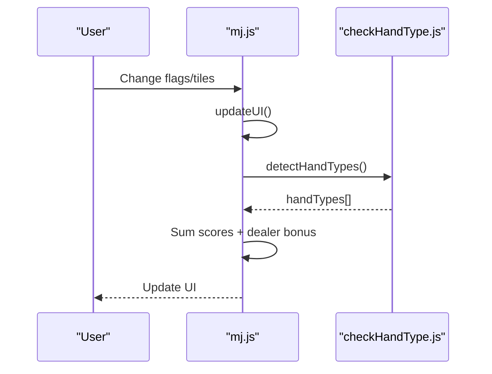
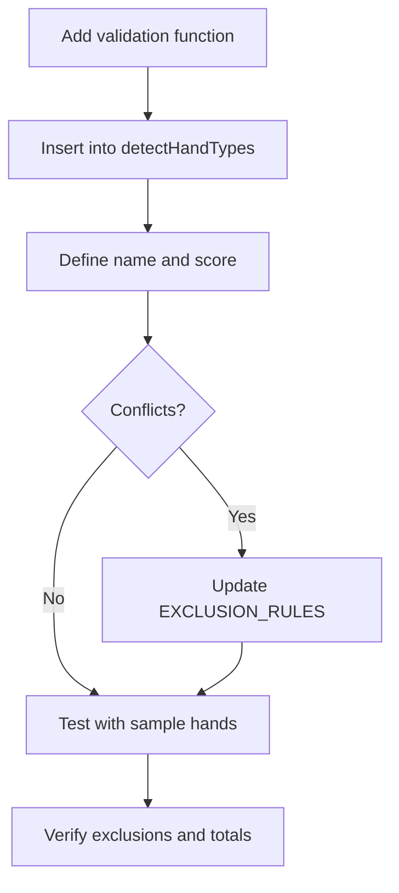
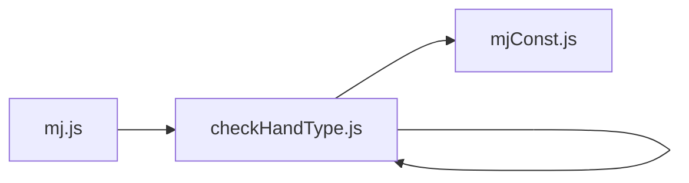

# Adding New Scoring Rules

<cite>
**Referenced Files in This Document**
- [mj.js](file://mj.js)
- [checkHandType.js](file://checkHandType.js)
- [mjConst.js](file://mjConst.js)
</cite>

## Table of Contents
1. [Introduction](#introduction)
2. [Project Structure](#project-structure)
3. [Core Components](#core-components)
4. [Architecture Overview](#architecture-overview)
5. [Detailed Component Analysis](#detailed-component-analysis)
6. [Dependency Analysis](#dependency-analysis)
7. [Performance Considerations](#performance-considerations)
8. [Troubleshooting Guide](#troubleshooting-guide)
9. [Conclusion](#conclusion)
10. [Appendices](#appendices)

## Introduction
This document explains how to extend the scoring system by adding new hand types and scoring rules to checkHandType.js. It covers the hand detection algorithm structure, exclusion rule implementation, point calculation methods, integration with main state management, and testing strategies for verifying new rules against existing hands. The goal is to enable safe, maintainable additions of common Taiwanese Mahjong hand types (e.g., Chi Pei, Long Fu, or custom regional variations).

## Project Structure
The application consists of:
- mj.js: UI state management, event handling, and orchestration of score calculation.
- checkHandType.js: Core scoring engine that detects hand types, applies exclusions, and computes scores.
- mjConst.js: Tile definitions and constants used across the app.

**Diagram sources**
- [mj.js:1082-1129](file://mj.js#L1082-L1129)
- [checkHandType.js:105-587](file://checkHandType.js#L105-L587)
- [mjConst.js:1-65](file://mjConst.js#L1-L65)

**Section sources**
- [mj.js:1-1211](file://mj.js#L1-L1211)
- [checkHandType.js:1-4286](file://checkHandType.js#L1-L4286)
- [mjConst.js:1-65](file://mjConst.js#L1-L65)

## Core Components
- State and UI orchestration: mj.js maintains game state (hand tiles, exposed groups, winning tile, flags like self-draw, kong draws, etc.) and triggers calculateScore on changes.
- Scoring engine: checkHandType.js implements detectHandTypes which aggregates multiple validators and returns a list of detected hand types with scores.
- Constants: mjConst.js defines tile types and tile sets used throughout.

Key responsibilities:
- mj.js:
  - Maintains state and updates UI.
  - Validates total tile count and calls detectHandTypes.
  - Aggregates dealer bonus and displays results.
- checkHandType.js:
  - Orchestrates detection order and priority.
  - Applies exclusion rules to avoid double-counting.
  - Implements many specialized validators (e.g., pure/mixed suits, dragon/wind patterns, special patterns like Greater/Less than Five, missing Five, etc.).
- mjConst.js:
  - Provides TILE_TYPES and tile arrays.

**Section sources**
- [mj.js:1082-1129](file://mj.js#L1082-L1129)
- [checkHandType.js:105-587](file://checkHandType.js#L105-L587)
- [mjConst.js:1-65](file://mjConst.js#L1-L65)

## Architecture Overview
The scoring flow integrates UI state with detection logic:

**Diagram sources**
- [mj.js:1082-1129](file://mj.js#L1082-L1129)
- [checkHandType.js:105-587](file://checkHandType.js#L105-L587)

## Detailed Component Analysis

### Hand Detection Algorithm Structure
- Entry point: detectHandTypes collects all tiles via getAllTiles and runs a prioritized sequence of checks:
  - High-value or rare patterns first (e.g., Shi San Yao, Shi Liu Bu Da variants, Greater/Less/Missing Five, Seven/Five Doors).
  - Suit-based patterns (Pure/Mixed One Suit).
  - State-based bonuses (self-draw, declared ready, kong draws, etc.).
  - Structural patterns (Ping Hu, Dui Dui Hu, various combinations).
  - Honor/dragon/wind patterns and flower scoring.
  - Special situational patterns (single wait forms, multi-win, etc.).
- After detection, applyExclusions removes lower-priority or conflicting patterns based on EXCLUSION_RULES.
- Finally, checkDaJiHu may replace low-scoring reward-only hands with higher-value “Big Chicken” or “Duck” patterns depending on non-reward fan count and self-draw status.

**Diagram sources**
- [checkHandType.js:105-587](file://checkHandType.js#L105-L587)

**Section sources**
- [checkHandType.js:105-587](file://checkHandType.js#L105-L587)

### Exclusion Rule Implementation
- EXCLUSION_RULES maps a detected hand type name to an array of names it excludes. Matching supports exact matches and prefix matching to handle parameterized names (e.g., “純全帶X(5)” matches base key “純全帶X”).
- applyExclusions iterates detected hand types, builds a removal set from rules, and filters out excluded entries.

**Diagram sources**
- [checkHandType.js:1-70](file://checkHandType.js#L1-L70)

**Section sources**
- [checkHandType.js:1-70](file://checkHandType.js#L1-L70)

### Point Calculation Methods
- Each validator returns an object with name and score. Scores are summed after exclusions and optional overrides.
- Some patterns compute dynamic scores based on counts (e.g., number of concealed kongs, specific combinations).
- Dealer bonus adds additional points when applicable.

Integration points:
- mj.js calculates total score by summing returned scores and adding dealer-related points.
- checkHandType.js centralizes pattern-specific scoring logic.

**Section sources**
- [mj.js:1082-1129](file://mj.js#L1082-L1129)
- [checkHandType.js:105-587](file://checkHandType.js#L105-L587)

### Integration with Main State Management
- mj.js exposes state fields for flags (self-draw, kong draw, declared ready, etc.) and passes them into detection via global access within checkHandType.js.
- When any relevant state changes, mj.js recalculates score through updateUI -> calculateScore -> detectHandTypes.

**Diagram sources**
- [mj.js:580-703](file://mj.js#L580-L703)
- [mj.js:1082-1129](file://mj.js#L1082-L1129)
- [checkHandType.js:105-587](file://checkHandType.js#L105-L587)

**Section sources**
- [mj.js:580-703](file://mj.js#L580-L703)
- [mj.js:1082-1129](file://mj.js#L1082-L1129)
- [checkHandType.js:105-587](file://checkHandType.js#L105-L587)

### Step-by-Step: Adding a New Hand Type (Example: Chi Pei)
Assume “Chi Pei” is a new regional variation requiring specific structural conditions. Follow these steps:

1. Define validation function
   - Create a function that inspects allTiles and state to determine if the hand qualifies.
   - Use helper utilities already present (e.g., getAllChows, getAllPungs, findEye, isAllCombinationsContainNumber) where applicable.
   - Return true/false or structured data if needed.

2. Add detection call
   - In detectHandTypes, insert your new check at an appropriate priority position relative to other patterns.
   - If the new hand conflicts with existing ones, add exclusion entries in EXCLUSION_RULES.

3. Assign score
   - Push a result object with name and score into handTypes.
   - Ensure naming aligns with exclusion prefix rules if necessary.

4. Test integration
   - Verify that mj.js correctly calls detectHandTypes and sums scores.
   - Confirm exclusions remove conflicting patterns as intended.

5. Validate edge cases
   - Check interactions with state flags (self-draw, kong draws, declared ready).
   - Ensure compatibility with high-priority patterns (e.g., Pure One Suit, Dragon/Wind patterns).

[No sources needed since this diagram shows conceptual workflow, not actual code structure]

### Step-by-Step: Adding a New Hand Type (Example: Long Fu)
Repeat the same process as above, but tailor the validation to Long Fu’s specific requirements (e.g., presence of certain sequences or honor structures). Pay attention to:
- Whether it should be mutually exclusive with similar long-hand patterns.
- Whether it interacts with “Greater/Less/Missing Five” or “Seven/Five Doors”.
- How exposure (chows/pungs/kongs) affects eligibility.

[No sources needed since this section doesn't analyze specific files]

### Validation Functions and Utilities
Common helpers used across validations include:
- getAllTiles, getAllChows, getAllPungs: aggregate tiles and melds.
- findEye: locate the pair (eye).
- Pattern-specific checks: e.g., isPureOneSuit, isMixedOneSuit, isShiSanYao, isShiLiuBuDa, isGreaterThanFive, isLessThanFive, isMissingFive.
- Combination checks: isAllCombinationsContainNumber, isAllCombinationsContainNumbersOrHonors.

These functions reduce duplication and ensure consistent logic across different hand detections.

**Section sources**
- [checkHandType.js:1590-1673](file://checkHandType.js#L1590-L1673)
- [checkHandType.js:2057-2124](file://checkHandType.js#L2057-L2124)
- [checkHandType.js:2847-2947](file://checkHandType.js#L2847-L2947)
- [checkHandType.js:3259-3376](file://checkHandType.js#L3259-L3376)
- [checkHandType.js:3424-3485](file://checkHandType.js#L3424-L3485)
- [checkHandType.js:3849-3991](file://checkHandType.js#L3849-L3991)

## Dependency Analysis
- mj.js depends on checkHandType.js for scoring and on mjConst.js for tile definitions.
- checkHandType.js depends on mjConst.js for TILE_TYPES and uses internal helpers extensively.
- Exclusion rules create soft dependencies between hand types; adding a new type may require updating EXCLUSION_RULES to prevent incorrect overlaps.

**Diagram sources**
- [mj.js:1082-1129](file://mj.js#L1082-L1129)
- [checkHandType.js:105-587](file://checkHandType.js#L105-L587)
- [mjConst.js:1-65](file://mjConst.js#L1-L65)

**Section sources**
- [mj.js:1082-1129](file://mj.js#L1082-L1129)
- [checkHandType.js:105-587](file://checkHandType.js#L105-L587)
- [mjConst.js:1-65](file://mjConst.js#L1-L65)

## Performance Considerations
- detectHandTypes performs multiple scans over allTiles; keep new validators efficient and reuse helpers.
- Avoid redundant computations by caching intermediate results when possible (e.g., precompute tile counts).
- Be mindful of nested loops in complex detectors (e.g., permutations for Zha Long); limit scope and early-exit on invalid conditions.
- Exclusion filtering is linear in the number of detected types; keep the list manageable.

[No sources needed since this section provides general guidance]

## Troubleshooting Guide
Common issues and resolutions:
- Incorrect overlap or double-counting:
  - Review EXCLUSION_RULES to ensure new hand types exclude conflicting ones appropriately.
  - Use prefix matching carefully; verify names match expected keys.
- Unexpected score drops:
  - Check checkDaJiHu override behavior; low non-reward fan counts can replace reward-only patterns with higher-value ones.
- State flag interactions:
  - Ensure new validators respect state flags (self-draw, kong draws, declared ready) as required by the hand’s rules.
- UI not updating:
  - Confirm mj.js updateUI triggers calculateScore and that state changes are properly reflected before calling detectHandTypes.

**Section sources**
- [checkHandType.js:1-70](file://checkHandType.js#L1-L70)
- [checkHandType.js:72-102](file://checkHandType.js#L72-L102)
- [mj.js:1082-1129](file://mj.js#L1082-L1129)

## Conclusion
Extending the scoring system involves:
- Implementing robust validation functions for new hand types.
- Integrating them into detectHandTypes with correct priority.
- Managing conflicts via EXCLUSION_RULES.
- Ensuring seamless integration with mj.js state and UI updates.
Following the step-by-step approach and using existing helpers will help you add new rules safely and maintainably.

[No sources needed since this section summarizes without analyzing specific files]

## Appendices

### Testing Strategies for New Scoring Rules
- Unit-style tests for validators:
  - Construct allTiles arrays representing known valid/invalid hands.
  - Assert boolean outcomes for new validators.
- Integration tests:
  - Simulate full hands in mj.js state and verify detectHandTypes returns expected names and scores.
  - Validate exclusion behavior by ensuring conflicting patterns are removed.
- Edge case coverage:
  - Self-draw vs discard win scenarios.
  - Exposure effects (chows/pungs/kongs) on eligibility.
  - Interaction with high-priority patterns (e.g., Pure One Suit, Dragon/Wind patterns).
- Regression tests:
  - Re-run existing hand examples to ensure no unintended side effects.

[No sources needed since this section provides general guidance]