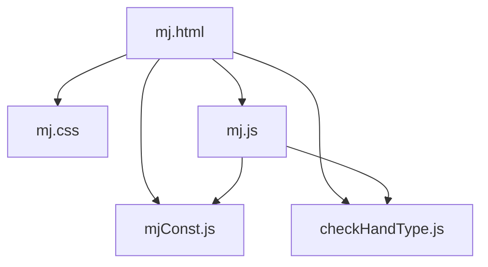
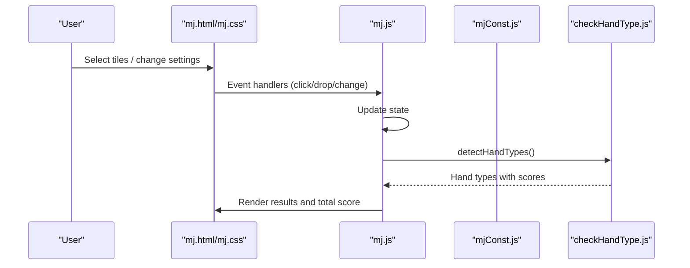
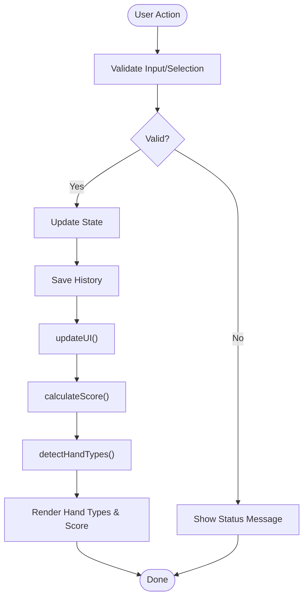
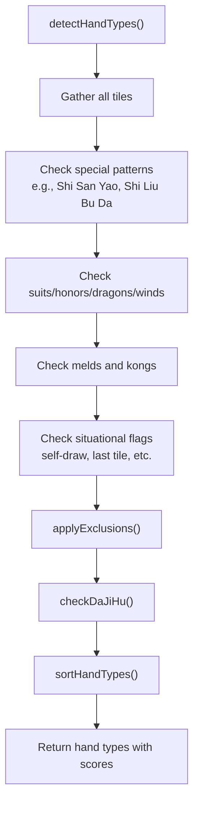
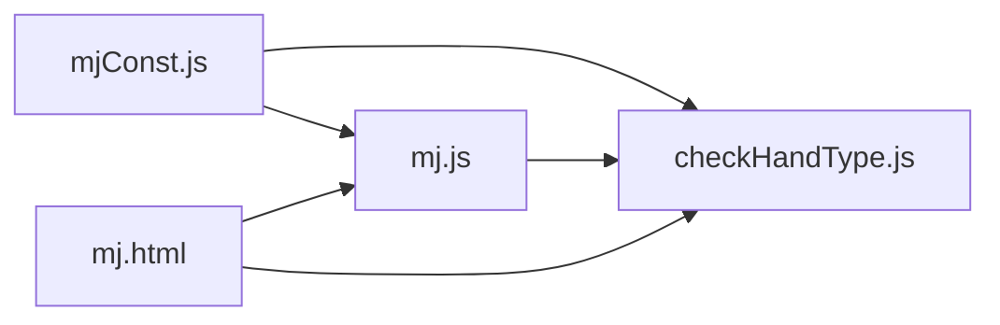

# Code Organization and Structure

<cite>
**Referenced Files in This Document**
- [mj.html](file://mj.html)
- [mj.css](file://mj.css)
- [mj.js](file://mj.js)
- [mjConst.js](file://mjConst.js)
- [checkHandType.js](file://checkHandType.js)
</cite>

## Table of Contents
1. [Introduction](#introduction)
2. [Project Structure](#project-structure)
3. [Core Components](#core-components)
4. [Architecture Overview](#architecture-overview)
5. [Detailed Component Analysis](#detailed-component-analysis)
6. [Dependency Analysis](#dependency-analysis)
7. [Performance Considerations](#performance-considerations)
8. [Troubleshooting Guide](#troubleshooting-guide)
9. [Conclusion](#conclusion)
10. [Appendices](#appendices)

## Introduction
This document explains the code organization and modular architecture of the OV MJ Calculator. It focuses on clear separation of concerns between:
- UI presentation (HTML/CSS)
- Application logic and state management (JavaScript)
- Scoring engine (hand detection and scoring)
- Data definitions (tile types and tile sets)

The goal is to help you understand how components interact, maintain clean code when adding new features, and visualize data flow and dependencies across modules.

## Project Structure
The project is a small, client-side web application with four primary files:
- mj.html: The user interface structure and script loading order
- mj.css: Styling for tiles, sections, controls, and responsive layout
- mj.js: Application state, UI interactions, drag-and-drop, and orchestration
- mjConst.js: Tile type constants and tile datasets
- checkHandType.js: Scoring engine that detects hand patterns and computes scores

**Diagram sources**
- [mj.html:244-246](file://mj.html#L244-L246)

**Section sources**
- [mj.html:1-248](file://mj.html#L1-L248)
- [mj.css:1-493](file://mj.css#L1-L493)
- [mj.js:1-1211](file://mj.js#L1-L1211)
- [mjConst.js:1-65](file://mjConst.js#L1-L65)
- [checkHandType.js:1-800](file://checkHandType.js#L1-L800)

## Core Components
- UI layer (mj.html + mj.css): Defines sections for selecting tiles, exposed melds, winning tile, settings, special conditions, and results display. Provides interactive elements like buttons, selects, checkboxes, and drop zones.
- Application logic (mj.js): Manages application state, event listeners, drag-and-drop behavior, tile selection, exposed meld creation (chow/pung/kong), undo/clear, and orchestrates score calculation and UI updates.
- Scoring engine (checkHandType.js): Detects hand patterns, applies exclusion rules, calculates fan counts, and returns sorted hand types with scores.
- Data definitions (mjConst.js): Centralizes tile type constants and tile arrays for numbers and flowers.

Key responsibilities and naming conventions:
- State object in mj.js groups all game-related fields with descriptive names (e.g., seatWind, roundWind, isSelfDraw).
- Functions are named verb-first or action-oriented (e.g., addChow, addPung, updateUI, calculateScore).
- Constants are grouped under TILE_TYPES and arrays ALL_TILES, FLOWER_TILES for clarity.
- Scoring functions use descriptive names (e.g., detectHandTypes, applyExclusions, isValidShiSanYao).

**Section sources**
- [mj.js:1-33](file://mj.js#L1-L33)
- [mjConst.js:1-65](file://mjConst.js#L1-L65)
- [checkHandType.js:1-800](file://checkHandType.js#L1-L800)

## Architecture Overview
The application follows a unidirectional data flow:
- User interacts with UI (click/drag/drop/settings changes)
- mj.js updates state and triggers UI refresh
- mj.js calls checkHandType.js to compute hand types and scores
- Results are rendered back into the UI

**Diagram sources**
- [mj.html:244-246](file://mj.html#L244-L246)
- [mj.js:580-703](file://mj.js#L580-L703)
- [mj.js:1082-1129](file://mj.js#L1082-L1129)
- [checkHandType.js:105-587](file://checkHandType.js#L105-L587)

## Detailed Component Analysis

### UI Layer (mj.html + mj.css)
- Structure: Sections for tile selection, selected tiles area, exposed melds, winning tile, flowers, settings, special conditions, and results.
- Controls: Buttons for chow/pung/open-kong/concealed-kong/undo/clear; selects for seat/round wind, dealer count; checkboxes for self-draw and special conditions.
- Styling: Consistent tile visuals, responsive grid layouts, drag-and-drop visual feedback, and status messages.

Responsibilities:
- Provide semantic markup for accessibility and clarity
- Define containers for dynamic content (hand-tiles, winning-tile, exposed-tiles)
- Load scripts in correct order to ensure dependencies are available

Interaction points:
- Event bindings are set up by mj.js during initialization
- Styles adapt to mobile screens and provide visual cues for drag-and-drop states

**Section sources**
- [mj.html:13-241](file://mj.html#L13-L241)
- [mj.css:68-124](file://mj.css#L68-L124)
- [mj.css:126-186](file://mj.css#L126-L186)
- [mj.css:200-242](file://mj.css#L200-L242)
- [mj.css:406-493](file://mj.css#L406-L493)

### Application Logic (mj.js)
State management:
- Centralized state object holds hand tiles, flowers, exposed melds, winning tile, and all setting flags.
- History stack supports undo operations.

Event handling:
- Drag-and-drop setup for both mouse and touch devices
- Drop zones for hand tiles, winning tile, and trash icon
- Click handlers for tile selection and flower addition
- Change handlers for all settings that trigger recalculation

Meld creation:
- addChow validates three sequential same-suit tiles
- addPung validates at least three identical tiles
- addOpenKong/addConcealedKong validate four identical tiles
- Each operation saves history, updates state, and refreshes UI

Scoring orchestration:
- updateUI calls calculateScore which validates tile counts and invokes detectHandTypes
- Results are rendered and total score updated

Error handling:
- Status messages inform users about invalid selections or insufficient tiles
- Validation prevents illegal states (e.g., exceeding max tiles per type or total)

**Diagram sources**
- [mj.js:150-177](file://mj.js#L150-L177)
- [mj.js:713-829](file://mj.js#L713-L829)
- [mj.js:864-907](file://mj.js#L864-L907)
- [mj.js:909-1129](file://mj.js#L909-L1129)

**Section sources**
- [mj.js:1-33](file://mj.js#L1-L33)
- [mj.js:44-148](file://mj.js#L44-L148)
- [mj.js:150-177](file://mj.js#L150-L177)
- [mj.js:179-370](file://mj.js#L179-L370)
- [mj.js:386-447](file://mj.js#L386-L447)
- [mj.js:449-522](file://mj.js#L449-L522)
- [mj.js:535-578](file://mj.js#L535-L578)
- [mj.js:580-703](file://mj.js#L580-L703)
- [mj.js:713-829](file://mj.js#L713-L829)
- [mj.js:831-907](file://mj.js#L831-L907)
- [mj.js:909-1129](file://mj.js#L909-L1129)

### Scoring Engine (checkHandType.js)
Responsibilities:
- Detect hand patterns using comprehensive checks (e.g., shi san yao, shi liu bu da, suits, honors, dragons, winds, sequences, kongs)
- Apply exclusion rules to avoid double-counting overlapping hand types
- Handle special win conditions (tenhou/chihou, multi-win, last-tile draws)
- Return sorted list of hand types with scores

Key functions:
- detectHandTypes: Orchestrates detection across multiple categories and applies exclusions
- applyExclusions: Removes conflicting hand types based on defined rules
- checkDaJiHu: Adjusts scoring for high-value reward-based hands
- Various pattern detectors (e.g., isPingHu, isDuiDuiHu, isPureOneSuit)

Data usage:
- Reads from global state (hand tiles, exposed melds, settings) via getAllTiles and state flags
- Uses TILE_TYPES from mjConst.js for consistent tile classification

**Diagram sources**
- [checkHandType.js:105-587](file://checkHandType.js#L105-L587)
- [checkHandType.js:1-70](file://checkHandType.js#L1-L70)

**Section sources**
- [checkHandType.js:1-800](file://checkHandType.js#L1-L800)

### Data Definitions (mjConst.js)
Responsibilities:
- Define tile type constants (characters, bamboos, dots, honors, flowers)
- Provide complete tile arrays for numbers and flowers used throughout the app

Naming conventions:
- TILE_TYPES enum-like object for consistent categorization
- ALL_TILES array for number tiles with type/value/display/cssClass
- FLOWER_TILES array for flower tiles including seat wind associations

Usage:
- mj.js references TILE_TYPES to map CSS classes and filter tiles
- checkHandType.js uses TILE_TYPES to classify tiles during pattern detection

**Section sources**
- [mjConst.js:1-65](file://mjConst.js#L1-L65)

## Dependency Analysis
Module relationships:
- mj.html loads mjConst.js first, then mj.js, then checkHandType.js to ensure constants and utilities are available before execution.
- mj.js depends on mjConst.js for tile data and on checkHandType.js for scoring.
- checkHandType.js depends on mjConst.js for tile type constants and reads global state from mj.js.

**Diagram sources**
- [mj.html:244-246](file://mj.html#L244-L246)
- [mj.js:1082-1129](file://mj.js#L1082-L1129)
- [checkHandType.js:105-587](file://checkHandType.js#L105-L587)

**Section sources**
- [mj.html:244-246](file://mj.html#L244-L246)
- [mj.js:1082-1129](file://mj.js#L1082-L1129)
- [checkHandType.js:105-587](file://checkHandType.js#L105-L587)

## Performance Considerations
- Avoid excessive DOM manipulation: batch updates within updateUI to minimize reflows.
- Debounce frequent input changes if needed (e.g., rapid setting toggles).
- Keep detectHandType efficient by short-circuiting checks where possible and avoiding redundant computations.
- Limit history size to prevent memory growth (already capped at 50 entries).
- Use efficient filtering and counting strategies for large tile sets.

[No sources needed since this section provides general guidance]

## Troubleshooting Guide
Common issues and resolutions:
- Invalid tile count: Ensure total tiles match required count (including kongs); status message indicates current vs required.
- Invalid meld selection: Chow requires three sequential same-suit tiles; Pung/Kong require identical tiles.
- Drag-and-drop not working: Verify drop zones are initialized and event listeners are attached; check console for missing elements.
- Undo not restoring state: Confirm history is saved before mutations; verify history length and pop behavior.
- Scoring inconsistencies: Review exclusion rules and special condition flags; ensure state flags reflect actual game context.

**Section sources**
- [mj.js:1082-1129](file://mj.js#L1082-L1129)
- [mj.js:713-829](file://mj.js#L713-L829)
- [mj.js:864-907](file://mj.js#L864-L907)

## Conclusion
The OV MJ Calculator employs a clean, modular architecture with clear separation of concerns:
- UI (HTML/CSS) handles presentation and interaction
- Application logic (JS) manages state and orchestrates flows
- Scoring engine (checkHandType.js) encapsulates complex hand detection and scoring
- Data definitions (mjConst.js) centralize tile data and types

This structure supports maintainability and extensibility. When adding new features, follow established naming conventions, keep responsibilities isolated, and update dependencies carefully to preserve the unidirectional data flow.

[No sources needed since this section summarizes without analyzing specific files]

## Appendices

### Guidelines for Adding New Features
- UI additions:
  - Add markup in mj.html under appropriate sections
  - Style with existing classes or create new ones in mj.css following naming conventions
  - Wire events in mj.js setupEventListeners and handle updates in updateUI
- New scoring patterns:
  - Implement detection functions in checkHandType.js
  - Add exclusion rules in EXCLUSION_RULES if necessary
  - Integrate into detectHandTypes with proper ordering and validation
- New data:
  - Extend mjConst.js with new tile types or sets
  - Ensure mj.js and checkHandType.js reference new constants consistently
- Testing:
  - Validate tile counts and meld rules
  - Verify exclusion rules prevent double-counting
  - Check UI responsiveness and drag-and-drop behavior

[No sources needed since this section provides general guidance]