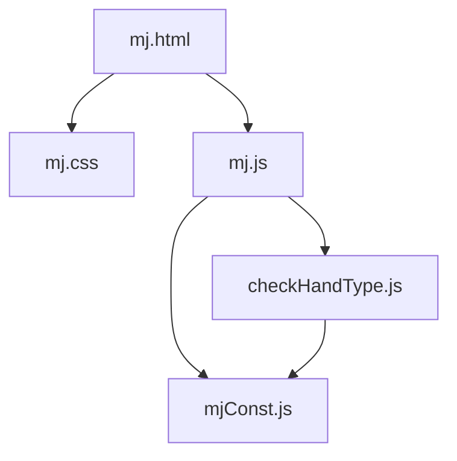
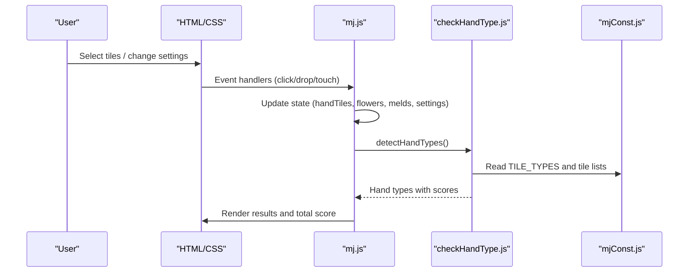
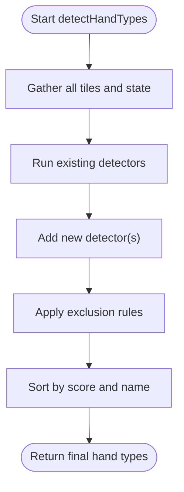
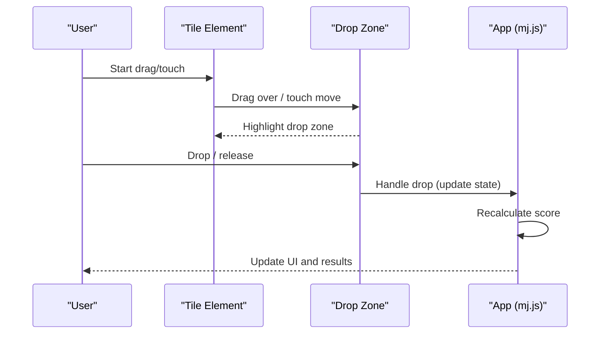
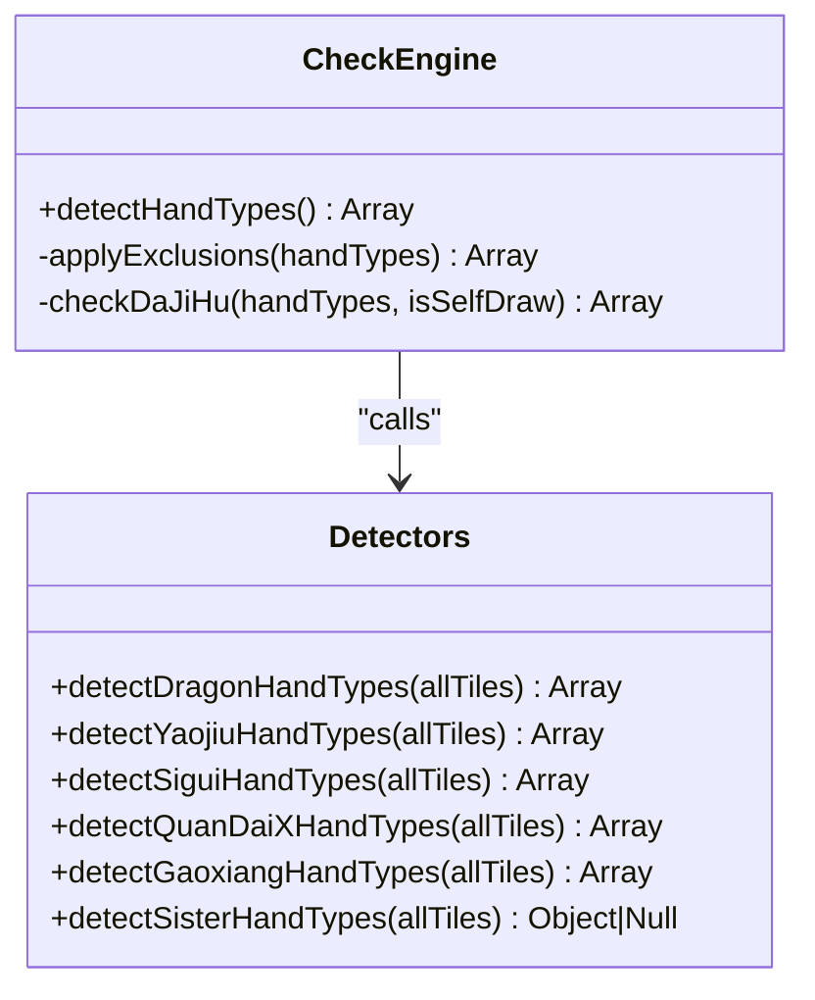
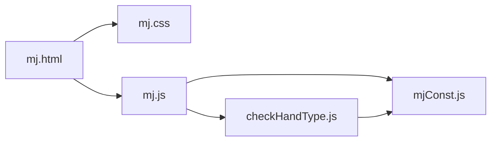

# Development Guide

<cite>
**Referenced Files in This Document**
- [mj.html](file://mj.html)
- [mj.css](file://mj.css)
- [mj.js](file://mj.js)
- [mjConst.js](file://mjConst.js)
- [checkHandType.js](file://checkHandType.js)
</cite>

## Table of Contents
1. [Introduction](#introduction)
2. [Project Structure](#project-structure)
3. [Core Components](#core-components)
4. [Architecture Overview](#architecture-overview)
5. [Detailed Component Analysis](#detailed-component-analysis)
6. [Dependency Analysis](#dependency-analysis)
7. [Performance Considerations](#performance-considerations)
8. [Troubleshooting Guide](#troubleshooting-guide)
9. [Conclusion](#conclusion)
10. [Appendices](#appendices)

## Introduction
This guide explains how to extend and maintain the OV MJ Calculator, a browser-based Mahjong hand scoring assistant. It covers code organization, coding conventions, and the development workflow for adding new scoring rules, extending tile types, and customizing the user interface. It also includes testing guidance, debugging tips, performance optimization techniques, and browser compatibility considerations.

## Project Structure
The project is a small client-side application composed of:
- mj.html: The UI layout and DOM structure
- mj.css: Styling and responsive behavior
- mj.js: Application state, event handling, drag-and-drop, and UI updates
- mjConst.js: Tile definitions (types, values, display names, CSS classes)
- checkHandType.js: Scoring engine that detects hand patterns and computes fan points

**Diagram sources**
- [mj.html:1-248](file://mj.html#L1-L248)
- [mj.css:1-493](file://mj.css#L1-L493)
- [mj.js:1-800](file://mj.js#L1-L800)
- [mjConst.js:1-65](file://mjConst.js#L1-L65)
- [checkHandType.js:1-800](file://checkHandType.js#L1-L800)

**Section sources**
- [mj.html:1-248](file://mj.html#L1-L248)
- [mj.css:1-493](file://mj.css#L1-L493)
- [mj.js:1-800](file://mj.js#L1-L800)
- [mjConst.js:1-65](file://mjConst.js#L1-L65)
- [checkHandType.js:1-800](file://checkHandType.js#L1-L800)

## Core Components
- UI layer (mj.html + mj.css): Defines sections for selecting tiles, exposed melds, winning tile, settings, special conditions, and results. Provides responsive design and touch-friendly interactions.
- State and interaction (mj.js): Manages application state (hand tiles, flowers, melds, winning tile, settings), handles click/drag-and-drop/touch events, renders tiles, and triggers score recalculation on changes.
- Data model (mjConst.js): Centralizes tile type constants and tile lists for number suits and honors, plus flower tiles with seat wind associations.
- Scoring engine (checkHandType.js): Detects hand patterns, applies exclusion rules, calculates fan points, and returns sorted hand types.

Key responsibilities:
- mj.js orchestrates user input and updates the UI; it calls the scoring engine when state changes.
- checkHandType.js reads global state and produces a list of detected hand types with scores.
- mjConst.js provides the canonical tile definitions used by rendering and scoring.

**Section sources**
- [mj.js:1-800](file://mj.js#L1-L800)
- [checkHandType.js:1-800](file://checkHandType.js#L1-L800)
- [mjConst.js:1-65](file://mjConst.js#L1-L65)
- [mj.html:1-248](file://mj.html#L1-L248)
- [mj.css:1-493](file://mj.css#L1-L493)

## Architecture Overview
The application follows a simple client-side architecture:
- HTML defines the interactive surface and containers for dynamic content.
- CSS styles the interface and ensures mobile responsiveness.
- JavaScript initializes the app, binds events, manages state, and renders UI.
- The scoring module evaluates the current state and returns ranked hand types.

**Diagram sources**
- [mj.html:1-248](file://mj.html#L1-L248)
- [mj.js:1-800](file://mj.js#L1-L800)
- [checkHandType.js:1-800](file://checkHandType.js#L1-L800)
- [mjConst.js:1-65](file://mjConst.js#L1-L65)

## Detailed Component Analysis

### Adding New Scoring Rules (checkHandType.js)
To add or modify scoring rules:
- Extend detection functions and integrate them into the main detection flow.
- Use the exclusion system to avoid overlapping or conflicting hand types.
- Ensure each rule returns an object with name and score, then let sorting handle ordering.

Recommended steps:
1. Implement a dedicated detection function (e.g., detectXHandTypes).
2. Call it from the main detection entry point and push results into the handTypes array.
3. If necessary, add exclusion entries so higher-priority rules suppress lower ones.
4. Validate via UI: select tiles/settings that should trigger your rule and confirm output.

Important concepts:
- Exclusion rules prevent double-counting and ensure consistent scoring.
- Some rules are mutually exclusive (e.g., pure vs mixed variants).
- Sorting is applied at the end to present highest-scoring hands first.

**Diagram sources**
- [checkHandType.js:105-587](file://checkHandType.js#L105-L587)

**Section sources**
- [checkHandType.js:1-800](file://checkHandType.js#L1-L800)

### Extending Tile Types (mjConst.js)
Tile types and tile lists drive both rendering and scoring:
- TILE_TYPES enumerates categories (number suits, honors, flowers).
- ALL_TILES defines all playable tiles with type, value, display text, and CSS class.
- FLOWER_TILES defines flower tiles with seat wind mapping for scoring.

How to extend:
- Add new tile entries to ALL_TILES or FLOWER_TILES with consistent fields.
- If introducing a new suit/category, update TILE_TYPES and any rendering logic that depends on it.
- Ensure CSS classes exist for visual distinction.

Considerations:
- Keep display strings localized if needed.
- Maintain stable value ranges per type to avoid breaking scoring logic.

**Section sources**
- [mjConst.js:1-65](file://mjConst.js#L1-L65)

### Customizing the User Interface (mj.html and mj.css)
UI customization involves:
- Modifying mj.html to add/remove sections, controls, or result displays.
- Updating mj.css to style new elements and improve responsiveness.

Guidelines:
- Use semantic section containers and IDs referenced by mj.js for predictable behavior.
- Follow existing naming conventions for classes (e.g., tiles-container, selected-tile).
- For mobile-first improvements, leverage media queries and touch-friendly styles already present.

Common tasks:
- Add a new setting group: insert a div with a label and control in mj.html; bind an event listener in mj.js to update state and recalculate score.
- Enhance mobile responsiveness: adjust tile sizes, spacing, and drop zones using existing responsive patterns.

**Section sources**
- [mj.html:1-248](file://mj.html#L1-L248)
- [mj.css:1-493](file://mj.css#L1-L493)
- [mj.js:580-703](file://mj.js#L580-L703)

### Interaction Flow and Drag-and-Drop
The app supports mouse drag-and-drop and touch interactions:
- Tiles can be dragged into hand, exposed melds, winning tile, or trash areas.
- Touch interactions emulate drag-and-drop with long-press thresholds and visual feedback.
- Drop zones highlight on hover/active states for clarity.

**Diagram sources**
- [mj.js:44-148](file://mj.js#L44-L148)
- [mj.js:179-370](file://mj.js#L179-L370)
- [mj.js:386-522](file://mj.js#L386-L522)

**Section sources**
- [mj.js:44-148](file://mj.js#L44-L148)
- [mj.js:179-370](file://mj.js#L179-L370)
- [mj.js:386-522](file://mj.js#L386-L522)

### Scoring Engine Patterns
The scoring engine uses modular detectors and a central pipeline:
- Grouped checks: state-based, tile-counting, situational, and pattern-based.
- Exclusion rules resolve conflicts between overlapping hand types.
- Special cases like Da Ji Hu transform the final set based on low non-reward fan totals.

**Diagram sources**
- [checkHandType.js:105-587](file://checkHandType.js#L105-L587)
- [checkHandType.js:766-1005](file://checkHandType.js#L766-L1005)
- [checkHandType.js:1028-1144](file://checkHandType.js#L1028-L1144)
- [checkHandType.js:1258-1295](file://checkHandType.js#L1258-L1295)
- [checkHandType.js:1591-1610](file://checkHandType.js#L1591-L1610)
- [checkHandType.js:1880-1935](file://checkHandType.js#L1880-L1935)

**Section sources**
- [checkHandType.js:105-587](file://checkHandType.js#L105-L587)
- [checkHandType.js:766-1005](file://checkHandType.js#L766-L1005)
- [checkHandType.js:1028-1144](file://checkHandType.js#L1028-L1144)
- [checkHandType.js:1258-1295](file://checkHandType.js#L1258-L1295)
- [checkHandType.js:1591-1610](file://checkHandType.js#L1591-L1610)
- [checkHandType.js:1880-1935](file://checkHandType.js#L1880-L1935)

## Dependency Analysis
High-level dependencies:
- mj.html loads mj.css, mjConst.js, mj.js, and checkHandType.js in order.
- mj.js depends on mjConst.js for tile data and calls checkHandType.js for scoring.
- checkHandType.js depends on mjConst.js for tile types and reads global state from mj.js.

**Diagram sources**
- [mj.html:244-247](file://mj.html#L244-L247)
- [mj.js:1-800](file://mj.js#L1-L800)
- [checkHandType.js:1-800](file://checkHandType.js#L1-L800)
- [mjConst.js:1-65](file://mjConst.js#L1-L65)

**Section sources**
- [mj.html:244-247](file://mj.html#L244-L247)
- [mj.js:1-800](file://mj.js#L1-L800)
- [checkHandType.js:1-800](file://checkHandType.js#L1-L800)
- [mjConst.js:1-65](file://mjConst.js#L1-L65)

## Performance Considerations
- Avoid unnecessary reflows: batch DOM updates after state changes.
- Debounce frequent recalculations if you add heavy UI interactions.
- Prefer efficient selectors and minimize repeated queries in hot paths.
- Keep tile lists and detection functions optimized; avoid deep recursion where possible.
- Use CSS transitions sparingly on large tile sets to reduce repaint costs.

[No sources needed since this section provides general guidance]

## Troubleshooting Guide
Common issues and fixes:
- Tiles not appearing: verify mjConst.js tile arrays and CSS classes; ensure containers exist in mj.html.
- Drag-and-drop not working: check event listeners setup and drop zone initialization; inspect console for errors during touch/mouse events.
- Incorrect scoring: review exclusion rules and detection order; validate state inputs (melds, winning tile, settings).
- Mobile UX problems: test touch interactions; ensure drop zones respond to touchmove/touchend; verify responsive styles.

Debugging tips:
- Use browser DevTools to inspect state variables and event flows.
- Temporarily log intermediate results in the scoring pipeline to trace detection outcomes.
- Isolate changes by toggling settings and observing minimal reproducible scenarios.

**Section sources**
- [mj.js:118-148](file://mj.js#L118-L148)
- [mj.js:179-370](file://mj.js#L179-L370)
- [checkHandType.js:105-587](file://checkHandType.js#L105-L587)

## Conclusion
The OV MJ Calculator is a modular, extensible client-side application. To maintain and enhance it:
- Add scoring rules in checkHandType.js following the established detection and exclusion patterns.
- Extend tile types in mjConst.js with consistent data structures.
- Customize the UI via mj.html and mj.css while preserving IDs/classes referenced by mj.js.
- Test thoroughly across devices and browsers, focusing on touch interactions and responsive layouts.

[No sources needed since this section summarizes without analyzing specific files]

## Appendices

### How to Add a New Hand Type (Step-by-Step)
1. Implement a detection function in checkHandType.js that inspects allTiles and state.
2. Return an array of hand type objects with name and score.
3. Integrate the function into the main detection flow and push results.
4. Add exclusion rules if necessary to prevent overlap with higher-priority types.
5. Validate via UI by constructing example hands and confirming outputs.

**Section sources**
- [checkHandType.js:105-587](file://checkHandType.js#L105-L587)

### How to Extend Tile Types
1. Add entries to ALL_TILES or FLOWER_TILES in mjConst.js with type, value, display, cssClass.
2. If introducing a new category, update TILE_TYPES and any dependent logic.
3. Ensure CSS classes exist for styling and visibility.
4. Test rendering and scoring impacts.

**Section sources**
- [mjConst.js:1-65](file://mjConst.js#L1-L65)

### How to Customize the UI
1. Modify mj.html to add or adjust sections and controls.
2. Style new elements in mj.css; follow existing class naming and responsive patterns.
3. Bind events in mj.js to update state and trigger recalculation.
4. Test on desktop and mobile devices for usability and accessibility.

**Section sources**
- [mj.html:1-248](file://mj.html#L1-L248)
- [mj.css:1-493](file://mj.css#L1-L493)
- [mj.js:580-703](file://mj.js#L580-L703)

### Testing and Debugging Checklist
- Verify tile selection and drag-and-drop work on mouse and touch.
- Confirm settings changes update state and recalculate scores.
- Validate exclusion rules do not suppress intended hand types.
- Check responsive behavior across screen sizes.
- Inspect console for errors and warnings during interactions.

**Section sources**
- [mj.js:118-148](file://mj.js#L118-L148)
- [mj.js:179-370](file://mj.js#L179-L370)
- [checkHandType.js:105-587](file://checkHandType.js#L105-L587)

### Browser Compatibility Notes
- Uses standard HTML5 drag-and-drop and touch events; fallbacks implemented for mobile.
- Responsive design relies on modern CSS features; test on target browsers.
- Avoid vendor-specific hacks unless necessary; prefer standardized properties.

[No sources needed since this section provides general guidance]