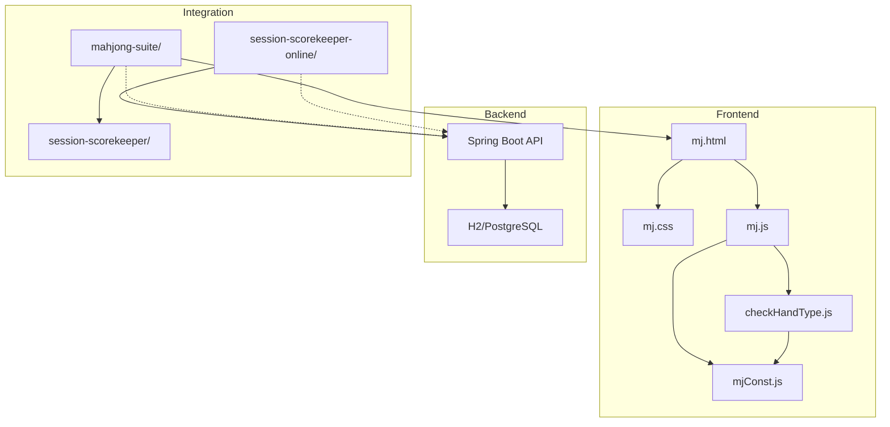
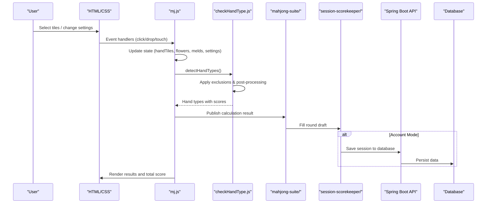
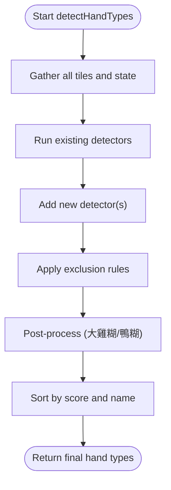
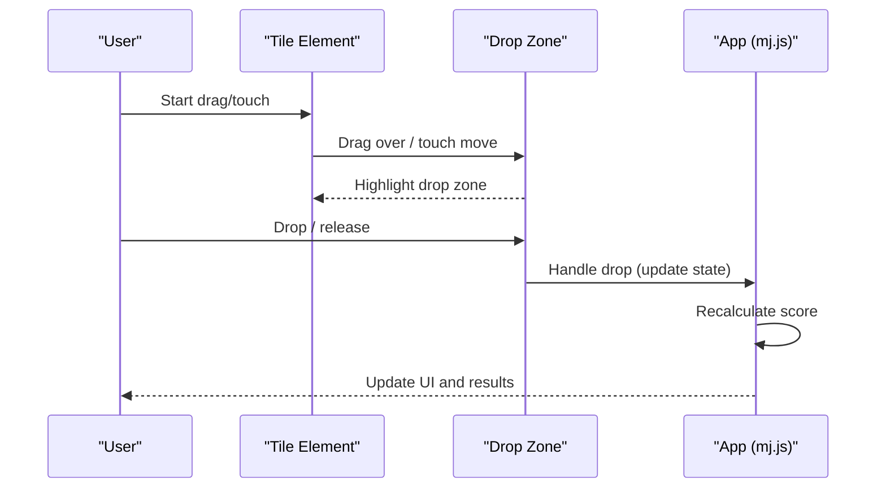
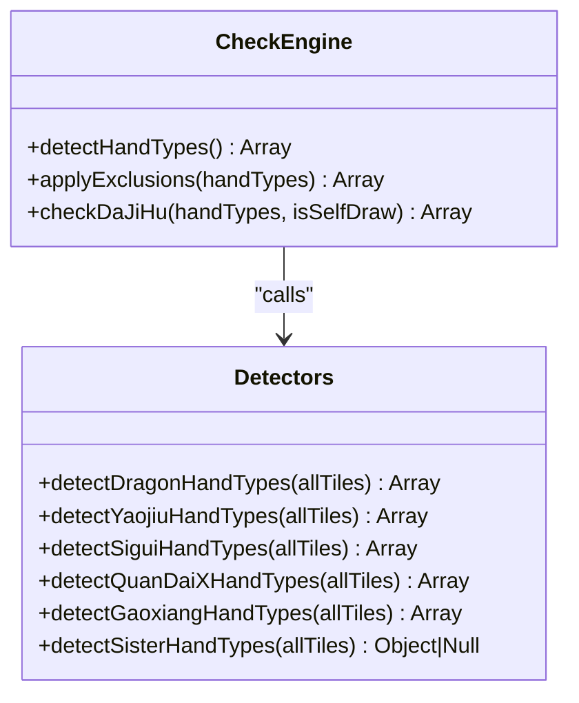

# Development Guide

<cite>
**Referenced Files in This Document**
- [mj.html](file://mj.html)
- [mj.css](file://mj.css)
- [mj.js](file://mj.js)
- [mjConst.js](file://mjConst.js)
- [checkHandType.js](file://checkHandType.js)
- [app-config.js](file://app-config.js)
- [README.md](file://README.md)
- [docs/RULES.md](file://docs/RULES.md)
- [docs/ARCHITECTURE.md](file://docs/ARCHITECTURE.md)
- [docs/DEPLOYMENT.md](file://docs/DEPLOYMENT.md)
- [.gitignore](file://.gitignore)
</cite>

## Update Summary
**Changes Made**
- Added comprehensive scoring rules documentation from docs/RULES.md
- Integrated full system architecture details from docs/ARCHITECTURE.md  
- Added deployment procedures from docs/DEPLOYMENT.md
- Updated project structure to reflect full-stack application
- Enhanced troubleshooting guide with backend considerations
- Added testing procedures for both frontend and backend components

## Table of Contents
1. [Introduction](#introduction)
2. [Project Structure](#project-structure)
3. [Core Components](#core-components)
4. [Architecture Overview](#architecture-overview)
5. [Detailed Component Analysis](#detailed-component-analysis)
6. [Scoring Rules and Behavior](#scoring-rules-and-behavior)
7. [Deployment Procedures](#deployment-procedures)
8. [Testing and Quality Assurance](#testing-and-quality-assurance)
9. [Performance Considerations](#performance-considerations)
10. [Troubleshooting Guide](#troubleshooting-guide)
11. [Conclusion](#conclusion)
12. [Appendices](#appendices)

## Introduction
This guide explains how to extend and maintain the OV MJ Calculator, a comprehensive browser-based Mahjong hand scoring assistant with full-stack capabilities. The application supports both guest mode (client-side only) and account mode (with Java backend and database persistence). It covers code organization, coding conventions, development workflow for adding new scoring rules, extending tile types, customizing the user interface, and deploying to production environments.

The project implements Taiwan Mahjong v2.7 rules with comprehensive test coverage across Chrome and Edge browsers, ensuring consistent scoring behavior and reliable performance.

## Project Structure
The project is a full-stack application composed of:

### Frontend Components
- **mj.html**: The UI layout and DOM structure for the scoring calculator
- **mj.css**: Styling and responsive behavior for mobile-first design
- **mj.js**: Application state management, event handling, drag-and-drop functionality, and UI updates
- **mjConst.js**: Tile definitions including types, values, display names, and CSS classes
- **checkHandType.js**: Scoring engine that detects hand patterns and computes fan points
- **app-config.js**: Centralized browser configuration for API endpoints and timeouts

### Backend Components
- **backend/**: Spring Boot Java application providing REST API services
- **session-scorekeeper/**: In-memory session scorekeeping for guest mode
- **session-scorekeeper-online/**: Online version with database persistence
- **mahjong-suite/**: Integration shell combining calculator and scorekeeper



**Diagram sources**
- [mj.html:244-247](file://mj.html#L244-L247)
- [docs/ARCHITECTURE.md:84-103](file://docs/ARCHITECTURE.md#L84-L103)
- [docs/ARCHITECTURE.md:221-234](file://docs/ARCHITECTURE.md#L221-L234)

**Section sources**
- [mj.html:1-248](file://mj.html#L1-L248)
- [mj.css:1-493](file://mj.css#L1-L493)
- [mj.js:1-800](file://mj.js#L1-L800)
- [mjConst.js:1-65](file://mjConst.js#L1-L65)
- [checkHandType.js:1-800](file://checkHandType.js#L1-L800)
- [app-config.js:1-17](file://app-config.js#L1-L17)
- [README.md:236-253](file://README.md#L236-L253)

## Core Components
The application consists of several key components with distinct responsibilities:

### UI Layer (mj.html + mj.css)
Defines sections for selecting tiles, exposed melds, winning tile, settings, special conditions, and results. Provides responsive design and touch-friendly interactions optimized for mobile devices.

### State and Interaction (mj.js)
Manages application state including hand tiles, flowers, melds, winning tile, and settings. Handles click/drag-and-drop/touch events, renders tiles, and triggers score recalculation on changes.

### Data Model (mjConst.js)
Centralizes tile type constants and tile lists for number suits and honors, plus flower tiles with seat wind associations.

### Scoring Engine (checkHandType.js)
Detects hand patterns, applies exclusion rules, calculates fan points, and returns sorted hand types based on Taiwan Mahjong v2.7 rules.

### Configuration (app-config.js)
Provides centralized browser configuration for API endpoints, entry URLs, and request timeouts.

Key responsibilities:
- **mj.js** orchestrates user input and updates the UI; it calls the scoring engine when state changes.
- **checkHandType.js** reads global state and produces a list of detected hand types with scores.
- **mjConst.js** provides the canonical tile definitions used by rendering and scoring.
- **app-config.js** manages runtime configuration without exposing sensitive data.

**Section sources**
- [mj.js:1-800](file://mj.js#L1-L800)
- [checkHandType.js:1-800](file://checkHandType.js#L1-L800)
- [mjConst.js:1-65](file://mjConst.js#L1-L65)
- [mj.html:1-248](file://mj.html#L1-L248)
- [mj.css:1-493](file://mj.css#L1-L493)
- [app-config.js:1-17](file://app-config.js#L1-L17)

## Architecture Overview
The application follows a modular client-server architecture with clear separation of concerns:

### Guest Mode Architecture
- Pure static hosting with no backend requirements
- All data exists only in current page memory
- No localStorage read/write or persistent storage
- Ideal for quick scoring sessions and temporary records

### Account Mode Architecture  
- Full-stack application with Spring Boot backend
- Database persistence using H2 or PostgreSQL
- User authentication and session management
- Multi-game support with independent game sessions



**Diagram sources**
- [docs/ARCHITECTURE.md:13-38](file://docs/ARCHITECTURE.md#L13-L38)
- [docs/ARCHITECTURE.md:39-83](file://docs/ARCHITECTURE.md#L39-L83)
- [docs/ARCHITECTURE.md:84-103](file://docs/ARCHITECTURE.md#L84-L103)

## Detailed Component Analysis

### Adding New Scoring Rules (checkHandType.js)
To add or modify scoring rules following the established v2.7 rule framework:

1. **Implement detection functions** in checkHandType.js that inspect allTiles and state
2. **Return arrays of hand type objects** with name and score properties
3. **Integrate into main detection flow** and push results to handTypes array
4. **Add exclusion rules** if necessary to prevent overlap with higher-priority types
5. **Validate via UI** by constructing example hands and confirming outputs

Important concepts:
- **Exclusion rules** prevent double-counting and ensure consistent scoring
- Some rules are mutually exclusive (e.g., pure vs mixed variants)
- Sorting is applied at the end to present highest-scoring hands first
- Parameterized results use exact-or-family matching for exclusions



**Diagram sources**
- [checkHandType.js:154-658](file://checkHandType.js#L154-L658)
- [checkHandType.js:121-151](file://checkHandType.js#L121-L151)

**Section sources**
- [checkHandType.js:1-800](file://checkHandType.js#L1-L800)
- [docs/RULES.md:157-169](file://docs/RULES.md#L157-L169)

### Extending Tile Types (mjConst.js)
Tile types and tile lists drive both rendering and scoring:

- **TILE_TYPES** enumerates categories (number suits, honors, flowers)
- **ALL_TILES** defines all playable tiles with type, value, display text, and CSS class
- **FLOWER_TILES** defines flower tiles with seat wind mapping for scoring

How to extend:
- Add new tile entries to ALL_TILES or FLOWER_TILES with consistent fields
- If introducing a new suit/category, update TILE_TYPES and any rendering logic
- Ensure CSS classes exist for visual distinction
- Maintain stable value ranges per type to avoid breaking scoring logic

Considerations:
- Keep display strings localized if needed
- Follow existing naming conventions for consistency
- Test rendering and scoring impacts thoroughly

**Section sources**
- [mjConst.js:1-65](file://mjConst.js#L1-L65)

### Customizing the User Interface (mj.html and mj.css)
UI customization involves modifying both structure and styling:

- **Modifying mj.html** to add/remove sections, controls, or result displays
- **Updating mj.css** to style new elements and improve responsiveness

Guidelines:
- Use semantic section containers and IDs referenced by mj.js for predictable behavior
- Follow existing naming conventions for classes (e.g., tiles-container, selected-tile)
- For mobile-first improvements, leverage media queries and touch-friendly styles
- Maintain accessibility standards and keyboard navigation support

Common tasks:
- Add a new setting group: insert a div with label and control in mj.html; bind event listener in mj.js
- Enhance mobile responsiveness: adjust tile sizes, spacing, and drop zones using existing responsive patterns
- Improve error handling: add status messages and validation feedback

**Section sources**
- [mj.html:1-248](file://mj.html#L1-L248)
- [mj.css:1-493](file://mj.css#L1-L493)
- [mj.js:580-703](file://mj.js#L580-L703)

### Interaction Flow and Drag-and-Drop
The app supports comprehensive input methods:

- **Mouse drag-and-drop** for desktop users
- **Touch interactions** with long-press thresholds and visual feedback for mobile
- **Click-to-select** as an alternative interaction method
- **Drop zones** highlight on hover/active states for clarity



**Diagram sources**
- [mj.js:44-148](file://mj.js#L44-L148)
- [mj.js:179-370](file://mj.js#L179-L370)
- [mj.js:386-522](file://mj.js#L386-L522)

**Section sources**
- [mj.js:44-148](file://mj.js#L44-L148)
- [mj.js:179-370](file://mj.js#L179-L370)
- [mj.js:386-522](file://mj.js#L386-L522)

### Scoring Engine Patterns
The scoring engine uses modular detectors and a central pipeline:

- **Grouped checks**: state-based, tile-counting, situational, and pattern-based
- **Exclusion rules** resolve conflicts between overlapping hand types
- **Special cases** like Da Ji Hu transform the final set based on low non-reward fan totals
- **Parameterized results** handle dynamic scoring scenarios



**Diagram sources**
- [checkHandType.js:154-658](file://checkHandType.js#L154-L658)
- [checkHandType.js:763-800](file://checkHandType.js#L763-L800)

**Section sources**
- [checkHandType.js:154-658](file://checkHandType.js#L154-L658)
- [checkHandType.js:763-800](file://checkHandType.js#L763-L800)

## Scoring Rules and Behavior
The scoring system implements Taiwan Mahjong v2.7 rules with comprehensive test coverage:

### Rule Authority and Sources
The implementation follows a strict hierarchy of authority:
1. **v2.7 rule reference** for rule intent
2. **Canonical test.html** for executable expected results
3. **checkHandType.js** for current scoring implementation
4. **This documentation** for maintained explanation

### Hand Model
The calculator models a Taiwan Mahjong winning hand using:
- Concealed hand tiles
- One winning tile
- Exposed chows and pungs
- Open and concealed kongs
- Flowers
- Seat and round winds
- Dealer and repeat-dealer state
- Situational flags such as self-draw, ready declarations, kong wins, and last-tile wins

### Scoring Pipeline
The scoring engine follows four stages:
1. **Collect input**: mj.js combines concealed tiles, melds, kongs, and the winning tile
2. **Detect candidates**: detectHandTypes() evaluates special hands, composition rules, sets, waits, honors, flowers, and situational conditions
3. **Apply exclusions**: applyExclusions() removes results that cannot stack with a stronger or combined result
4. **Post-process**: low-value 大雞糊/鴨糊 handling is applied where required, final results are ordered, and the UI adds dealer-related fan

### Special Rule Amendments
The v2.7 rules include specific amendments:
- **No-honor non-stacking amendment**: Certain patterns prohibit 無字 or 無字花 bonuses
- **嚦咕嚦咕 honor-pair amendment**: Special scoring for qualifying pair-composition hands
- **Ordinary honor-pattern preservation**: Non-嚦咕 hands retain ordinary values

**Section sources**
- [docs/RULES.md:1-169](file://docs/RULES.md#L1-L169)

## Deployment Procedures
The application supports multiple deployment modes:

### Guest Mode Deployment
Pure static hosting requiring no backend dependencies:
- Serve static files via any web server
- No database, API, or authentication required
- All data exists only in current page memory
- Ideal for GitHub Pages or simple hosting providers

### Account Mode Deployment
Full-stack deployment requiring additional components:
- **Frontend**: Static files served via web server
- **Backend**: Spring Boot executable JAR
- **Database**: H2 file-based or PostgreSQL
- **Security**: HTTPS, reverse proxy, CORS configuration

### Environment Configuration
Configure `app-config.js` for your environment:
- **Local API**: `apiBaseUrl: 'http://127.0.0.1:8080/api'`
- **Same-origin proxy**: `apiBaseUrl: '/api'`
- **Remote HTTPS API**: `apiBaseUrl: 'https://api.example.com/api'`

### Production Security Considerations
- Use HTTPS for all deployments
- Configure proper security headers (CSP, X-Content-Type-Options, etc.)
- Set up proper CORS policies for cross-origin API access
- Implement backup and disaster recovery procedures
- Monitor application health and performance metrics

**Section sources**
- [docs/DEPLOYMENT.md:1-353](file://docs/DEPLOYMENT.md#L1-L353)
- [app-config.js:1-17](file://app-config.js#L1-L17)

## Testing and Quality Assurance
Comprehensive testing ensures reliability across platforms:

### Browser Testing
- **Scoring tests**: 137 test cases per browser (Chrome/Edge)
- **Session keeper tests**: 47 test cases covering integration contracts
- **Automated execution**: Python scripts run tests in headless browsers
- **Evidence collection**: Results saved to `test-results/*.json`

### Backend Testing
- **Java unit tests**: MockMvc with in-memory H2 database
- **Integration tests**: Full API lifecycle testing
- **Database schema validation**: Ensures proper table creation and constraints

### Pre-deployment Validation
Run complete test suite before deployment:
```bash
python -u run_tests.py --browser all --timeout 120
python -u run_scorekeeper_tests.py --browser all --timeout 120
mvn -f "backend/pom.xml" test
mvn -f "backend/pom.xml" package
```

### Quality Gates
- **Browser compatibility**: Chrome and Edge must pass all tests
- **Code coverage**: Comprehensive test coverage for critical paths
- **Performance**: Responsive UI under various load conditions
- **Security**: No sensitive data exposure in frontend configuration

**Section sources**
- [docs/ARCHITECTURE.md:235-270](file://docs/ARCHITECTURE.md#L235-L270)
- [README.md:191-217](file://README.md#L191-L217)

## Performance Considerations
Optimize application performance through these techniques:

### Frontend Optimization
- **Avoid unnecessary reflows**: Batch DOM updates after state changes
- **Debounced recalculations**: Prevent excessive scoring computations during rapid input
- **Efficient selectors**: Minimize repeated DOM queries in hot paths
- **CSS transitions**: Use sparingly on large tile sets to reduce repaint costs

### Backend Optimization
- **Database indexing**: Proper indexes for frequently queried columns
- **Connection pooling**: Efficient database connection management
- **Request caching**: Cache static assets and frequently accessed data
- **Memory management**: Monitor and optimize memory usage for large datasets

### Mobile Performance
- **Touch optimization**: Smooth drag-and-drop with appropriate thresholds
- **Responsive design**: Optimize layouts for various screen sizes
- **Network efficiency**: Minimize API calls and payload sizes
- **Battery optimization**: Reduce CPU-intensive operations when possible

## Troubleshooting Guide
Common issues and their solutions:

### Frontend Issues
- **Tiles not appearing**: Verify mjConst.js tile arrays and CSS classes; ensure containers exist in mj.html
- **Drag-and-drop not working**: Check event listeners setup and drop zone initialization; inspect console for errors during touch/mouse events
- **Incorrect scoring**: Review exclusion rules and detection order; validate state inputs (melds, winning tile, settings)
- **Mobile UX problems**: Test touch interactions; ensure drop zones respond to touchmove/touchend; verify responsive styles

### Backend Issues
- **API connectivity**: Verify CORS configuration and API endpoint accessibility
- **Database connections**: Check connection strings and credentials
- **Authentication failures**: Validate token generation and expiration handling
- **Performance bottlenecks**: Monitor query performance and optimize slow endpoints

### Debugging Techniques
- **Browser DevTools**: Inspect state variables and event flows
- **Console logging**: Temporarily log intermediate results in scoring pipeline
- **Network monitoring**: Track API requests and responses
- **Database queries**: Analyze slow queries and optimize as needed

**Section sources**
- [mj.js:118-148](file://mj.js#L118-L148)
- [mj.js:179-370](file://mj.js#L179-L370)
- [checkHandType.js:154-658](file://checkHandType.js#L154-L658)

## Conclusion
The OV MJ Calculator is a comprehensive, extensible full-stack application that successfully combines traditional Mahjong scoring with modern web technologies. To maintain and enhance it effectively:

### Development Best Practices
- **Add scoring rules** in checkHandType.js following established detection and exclusion patterns
- **Extend tile types** in mjConst.js with consistent data structures
- **Customize UI** via mj.html and mj.css while preserving IDs/classes referenced by mj.js
- **Test thoroughly** across devices and browsers, focusing on touch interactions and responsive layouts

### Architecture Principles
- **Separation of concerns**: Clear boundaries between frontend, backend, and business logic
- **Configuration management**: Centralized configuration without exposing sensitive data
- **Extensibility**: Modular design allowing easy addition of new features
- **Reliability**: Comprehensive testing and validation ensuring consistent behavior

### Future Enhancement Opportunities
- **Additional rule sets**: Support for different Mahjong variants
- **Advanced analytics**: Statistical analysis and trend reporting
- **Multi-language support**: Internationalization for broader accessibility
- **Cloud deployment**: Containerized deployment options for scalability

## Appendices

### How to Add a New Hand Type (Step-by-Step)
1. **Implement detection function** in checkHandType.js that inspects allTiles and state
2. **Return array of hand type objects** with name and score properties
3. **Integrate into main detection flow** and push results to handTypes array
4. **Add exclusion rules** if necessary to prevent overlap with higher-priority types
5. **Validate via UI** by constructing example hands and confirming outputs
6. **Add test cases** to ensure consistent behavior across browsers

**Section sources**
- [checkHandType.js:154-658](file://checkHandType.js#L154-L658)
- [docs/RULES.md:157-169](file://docs/RULES.md#L157-L169)

### How to Extend Tile Types
1. **Add entries** to ALL_TILES or FLOWER_TILES in mjConst.js with type, value, display, cssClass
2. **Update TILE_TYPES** if introducing a new category
3. **Ensure CSS classes** exist for styling and visibility
4. **Test rendering and scoring impacts** thoroughly
5. **Verify mobile compatibility** across different screen sizes

**Section sources**
- [mjConst.js:1-65](file://mjConst.js#L1-L65)

### How to Customize the UI
1. **Modify mj.html** to add or adjust sections and controls
2. **Style new elements** in mj.css; follow existing class naming and responsive patterns
3. **Bind events** in mj.js to update state and trigger recalculation
4. **Test on desktop and mobile** devices for usability and accessibility
5. **Validate cross-browser compatibility**

**Section sources**
- [mj.html:1-248](file://mj.html#L1-L248)
- [mj.css:1-493](file://mj.css#L1-L493)
- [mj.js:580-703](file://mj.js#L580-L703)

### Testing and Debugging Checklist
- **Verify tile selection and drag-and-drop** work on mouse and touch
- **Confirm settings changes** update state and recalculate scores
- **Validate exclusion rules** do not suppress intended hand types
- **Check responsive behavior** across screen sizes
- **Inspect console** for errors and warnings during interactions
- **Run automated test suites** before deployment
- **Test backend APIs** with various input scenarios

**Section sources**
- [mj.js:118-148](file://mj.js#L118-L148)
- [mj.js:179-370](file://mj.js#L179-L370)
- [checkHandType.js:154-658](file://checkHandType.js#L154-L658)

### Browser Compatibility Notes
- **Standard HTML5 drag-and-drop** and touch events with fallbacks for mobile
- **Responsive design** relies on modern CSS features; test on target browsers
- **Avoid vendor-specific hacks** unless necessary; prefer standardized properties
- **Performance optimization** varies across browsers; monitor and adjust as needed

### Git Ignore Patterns
Modern `.gitignore` patterns exclude:
- **Compiled artifacts**: *.pyc, __pycache__, dist/, build/
- **Dependencies**: .venv/, venv/, node_modules/
- **Logs and temp files**: *.log, *.tmp, *.swp
- **Environment files**: .env, .env.local, .env.*
- **Editor files**: .vscode/, .idea/

**Section sources**
- [.gitignore:1-31](file://.gitignore#L1-L31)

### Environment Setup
Required tools and versions:
- **Node.js**: For development tooling
- **Python 3.x**: For test runners and utilities
- **Java 17**: For backend compilation and testing
- **Maven**: For Java dependency management
- **Chrome/Edge**: For browser testing automation

### Development Workflow
1. **Clone repository** and install dependencies
2. **Set up local environment** with app-config.js
3. **Run frontend** using Python HTTP server
4. **Run backend** using Maven and Java
5. **Execute test suites** to verify functionality
6. **Make changes** and run targeted tests
7. **Deploy** following documented procedures