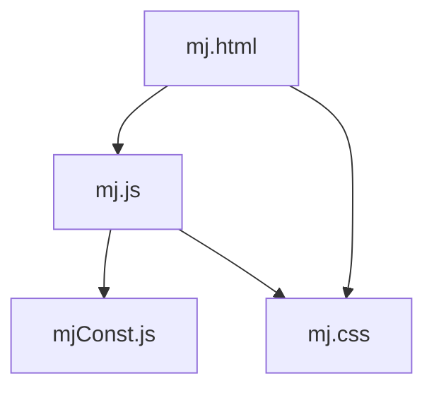
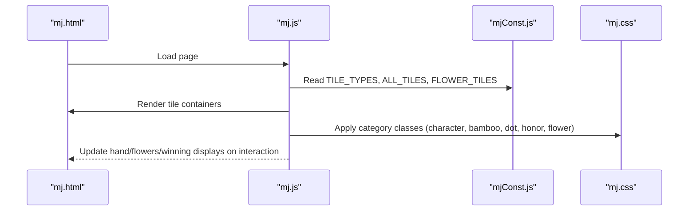
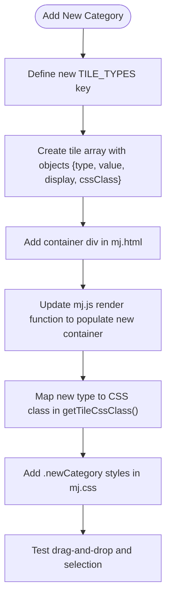
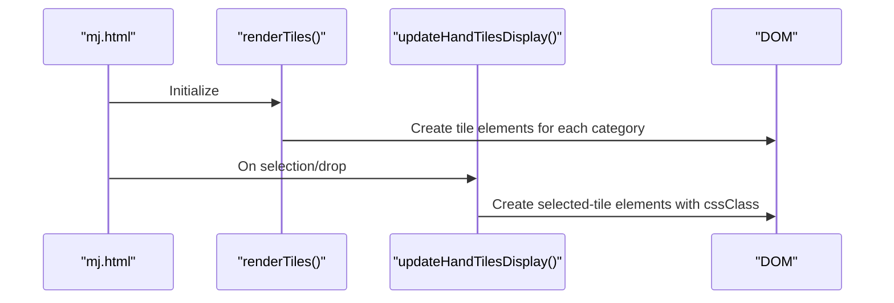
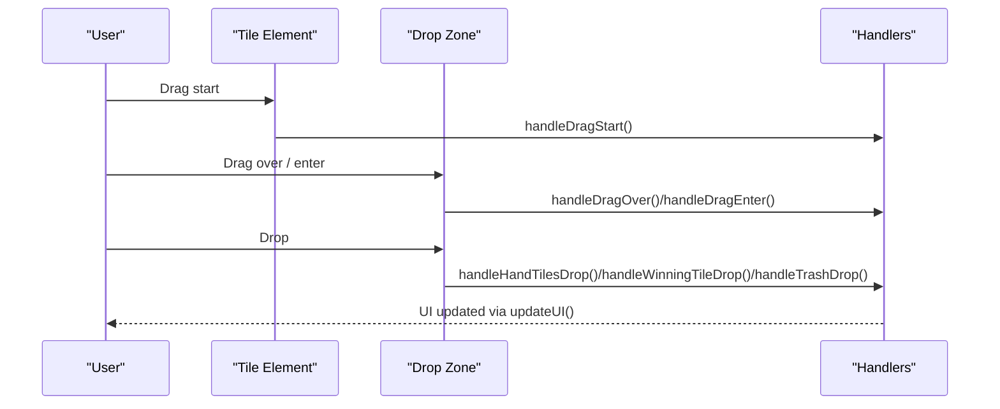
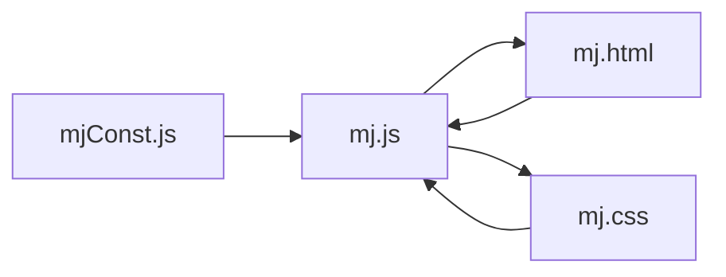

# Extending Tile Types

<cite>
**Referenced Files in This Document**
- [mjConst.js](file://mjConst.js)
- [mj.html](file://mj.html)
- [mj.css](file://mj.css)
- [mj.js](file://mj.js)
</cite>

## Table of Contents
1. [Introduction](#introduction)
2. [Project Structure](#project-structure)
3. [Core Components](#core-components)
4. [Architecture Overview](#architecture-overview)
5. [Detailed Component Analysis](#detailed-component-analysis)
6. [Dependency Analysis](#dependency-analysis)
7. [Performance Considerations](#performance-considerations)
8. [Troubleshooting Guide](#troubleshooting-guide)
9. [Conclusion](#conclusion)
10. [Appendices](#appendices)

## Introduction
This document explains how to extend the Mahjong calculator beyond standard Taiwanese tiles by adding new tile categories, modifying tile properties, and updating display rendering. It covers the tile object structure, CSS class assignments, integration with the drag-and-drop system, and UI updates required in mj.html and mj.css. You will also find examples for special tiles such as wild cards, bonus tiles, and regional variants.

## Project Structure
The application is a small client-side app composed of four primary files:
- Data definitions for tile types and tile lists live in mjConst.js.
- The user interface markup is in mj.html.
- Styling rules are in mj.css.
- Application logic, including rendering, drag-and-drop, selection, and scoring, is in mj.js.

**Diagram sources**
- [mj.html:1-248](file://mj.html#L1-L248)
- [mj.js:1-1211](file://mj.js#L1-L1211)
- [mjConst.js:1-65](file://mjConst.js#L1-L65)
- [mj.css:1-493](file://mj.css#L1-L493)

**Section sources**
- [mj.html:1-248](file://mj.html#L1-L248)
- [mj.js:1-1211](file://mj.js#L1-L1211)
- [mjConst.js:1-65](file://mjConst.js#L1-L65)
- [mj.css:1-493](file://mj.css#L1-L493)

## Core Components
- Tile type constants and tile arrays define what tiles exist and how they render.
- Rendering functions build DOM elements from these definitions and attach drag-and-drop behavior.
- Drag-and-drop handlers move tiles between selection areas (hand, winning tile, trash).
- CSS classes provide visual differentiation per tile category.

Key responsibilities:
- mjConst.js: Declares TILE_TYPES and defines ALL_TILES and FLOWER_TILES.
- mj.js: Renders tiles, handles interactions, manages state, and integrates drag-and-drop.
- mj.html: Provides containers for each tile category and sections for selected tiles and flowers.
- mj.css: Styles tiles and drop zones; includes color classes for categories.

**Section sources**
- [mjConst.js:1-65](file://mjConst.js#L1-L65)
- [mj.js:36-42](file://mj.js#L36-L42)
- [mj.js:535-578](file://mj.js#L535-L578)
- [mj.js:449-522](file://mj.js#L449-L522)
- [mj.html:13-58](file://mj.html#L13-L58)
- [mj.css:68-124](file://mj.css#L68-L124)

## Architecture Overview
The data-to-UI flow is straightforward:
- Constants and tile arrays in mjConst.js are consumed by mj.js during initialization.
- mj.js renders selectable tiles into containers defined in mj.html.
- User interactions update state and re-render affected areas.
- CSS classes applied to tile elements control appearance.

**Diagram sources**
- [mj.js:36-42](file://mj.js#L36-L42)
- [mj.js:535-578](file://mj.js#L535-L578)
- [mjConst.js:1-65](file://mjConst.js#L1-L65)
- [mj.css:120-124](file://mj.css#L120-L124)

## Detailed Component Analysis

### Tile Object Structure
Each tile is an object with consistent fields used across rendering and interaction:
- type: Category identifier matching one of the TILE_TYPES values.
- value: Numeric or semantic value within the category.
- display: Human-readable label shown on the tile.
- cssClass: CSS class that determines color and style.

Flower tiles may include additional metadata like seatWind for scoring contexts.

Examples of where this structure is used:
- Defining tiles in mjConst.js.
- Selecting and storing tiles in state in mj.js.
- Rendering tiles into the DOM in mj.js.

**Section sources**
- [mjConst.js:11-65](file://mjConst.js#L11-L65)
- [mj.js:151-177](file://mj.js#L151-L177)
- [mj.js:926-942](file://mj.js#L926-L942)
- [mj.js:1037-1052](file://mj.js#L1037-L1052)

### Adding a New Tile Category
To add a new category (for example, “Wild” or “Bonus”):
1. Define a new constant key in TILE_TYPES in mjConst.js.
2. Add entries to a new array (e.g., WILD_TILES or BONUS_TILES) using the same object shape as existing tiles.
3. Create a new container element in mj.html for the category.
4. Extend mj.js to:
   - Render the new category’s tiles into the new container.
   - Include the new category in drag-and-drop handling if needed.
   - Map the new category to a CSS class via getTileCssClass.
5. Add a corresponding CSS class in mj.css for color and styling.

**Diagram sources**
- [mjConst.js:1-8](file://mjConst.js#L1-L8)
- [mj.js:524-533](file://mj.js#L524-L533)
- [mj.html:13-19](file://mj.html#L13-L19)
- [mj.css:120-124](file://mj.css#L120-L124)

**Section sources**
- [mjConst.js:1-8](file://mjConst.js#L1-L8)
- [mj.js:524-533](file://mj.js#L524-L533)
- [mj.html:13-19](file://mj.html#L13-L19)
- [mj.css:120-124](file://mj.css#L120-L124)

### Modifying Tile Properties
You can modify any property of a tile object:
- Change display text to localize or rename tiles.
- Adjust value semantics for scoring or grouping logic.
- Assign a different cssClass to change appearance.

Where properties are read and used:
- Display text is rendered into DOM nodes.
- Type and value are used to identify tiles when selecting or moving them.
- cssClass determines which CSS rule applies.

**Section sources**
- [mjConst.js:11-65](file://mjConst.js#L11-L65)
- [mj.js:547-557](file://mj.js#L547-L557)
- [mj.js:926-942](file://mj.js#L926-L942)

### Updating Display Rendering
Rendering occurs in two places:
- Initial tile selection area rendering populates containers based on TILE_TYPES.
- Selected tiles rendering creates draggable elements in hand, exposed groups, and winning tile areas.

When adding a new category:
- Ensure the new container exists in mj.html.
- Extend the mapping in the render function to include the new category.
- Ensure getTileCssClass returns the correct class for the new type.

**Diagram sources**
- [mj.js:535-578](file://mj.js#L535-L578)
- [mj.js:926-942](file://mj.js#L926-L942)

**Section sources**
- [mj.js:535-578](file://mj.js#L535-L578)
- [mj.js:926-942](file://mj.js#L926-L942)

### Integration With Drag-and-Drop System
Drag-and-drop is implemented for both mouse and touch:
- Tiles are marked draggable and bound with event listeners.
- Drop zones include hand-tiles, winning-tile, and trash-icon.
- Touch interactions simulate dragging via long press and movement thresholds.

When extending tile types:
- Newly rendered tiles automatically inherit drag behavior because setupDragEvents is called on creation.
- If you add custom behaviors (e.g., restricted drop zones), adjust the relevant handlers.

**Diagram sources**
- [mj.js:45-65](file://mj.js#L45-L65)
- [mj.js:67-91](file://mj.js#L67-L91)
- [mj.js:93-116](file://mj.js#L93-L116)
- [mj.js:386-442](file://mj.js#L386-L442)
- [mj.js:449-522](file://mj.js#L449-L522)

**Section sources**
- [mj.js:45-65](file://mj.js#L45-L65)
- [mj.js:67-91](file://mj.js#L67-L91)
- [mj.js:93-116](file://mj.js#L93-L116)
- [mj.js:386-442](file://mj.js#L386-L442)
- [mj.js:449-522](file://mj.js#L449-L522)

### Examples: Special Tiles

#### Wild Cards
- Add a new category key in TILE_TYPES.
- Create WILD_TILES array with objects using the new type and a unique cssClass.
- Add a container in mj.html for wild cards.
- In mj.js, render wild tiles into the new container and map the type to the cssClass in getTileCssClass.
- Add .wild styles in mj.css.

Considerations:
- Decide whether wilds can be part of chows/pungs/kongs or only as jokers.
- If wilds have special scoring rules, integrate those in scoring logic outside this scope.

**Section sources**
- [mjConst.js:1-8](file://mjConst.js#L1-L8)
- [mj.js:524-533](file://mj.js#L524-L533)
- [mj.html:13-19](file://mj.html#L13-L19)
- [mj.css:120-124](file://mj.css#L120-L124)

#### Bonus Tiles
- Similar to wild cards, but bonus tiles might carry extra metadata (e.g., points or multipliers).
- Store metadata in the tile object and use it in scoring or UI hints.
- Optionally create a separate container and handler if bonus tiles behave differently.

**Section sources**
- [mjConst.js:55-65](file://mjConst.js#L55-L65)
- [mj.js:151-177](file://mj.js#L151-L177)

#### Regional Variants
- For region-specific suits or honors, add a new category and tile set.
- Provide localized display strings and distinct cssClass for visual clarity.
- Ensure drag-and-drop works out-of-the-box since rendering binds events dynamically.

**Section sources**
- [mjConst.js:11-53](file://mjConst.js#L11-L53)
- [mj.js:535-578](file://mj.js#L535-L578)

## Dependency Analysis
High-level dependencies:
- mj.js depends on mjConst.js for tile definitions.
- mj.js reads and writes DOM elements defined in mj.html.
- mj.js applies CSS classes that are styled in mj.css.

Potential coupling points:
- getTileCssClass must cover all tile types to ensure proper styling.
- renderTiles maps specific container IDs to tile categories; changes require matching HTML structure.
- Drag-and-drop relies on dataset attributes (type, value, source) present on tile elements.

**Diagram sources**
- [mj.js:535-578](file://mj.js#L535-L578)
- [mj.js:524-533](file://mj.js#L524-L533)
- [mj.html:13-58](file://mj.html#L13-L58)
- [mj.css:120-124](file://mj.css#L120-L124)

**Section sources**
- [mj.js:524-533](file://mj.js#L524-L533)
- [mj.js:535-578](file://mj.js#L535-L578)
- [mj.html:13-58](file://mj.html#L13-L58)
- [mj.css:120-124](file://mj.css#L120-L124)

## Performance Considerations
- Rendering is lightweight; however, avoid excessive DOM churn by batching updates where possible.
- Drag-and-drop event binding is attached per tile; dynamic creation ensures consistency without manual re-binding.
- Keep tile arrays small and well-structured to minimize lookup costs during selection and rendering.

[No sources needed since this section provides general guidance]

## Troubleshooting Guide
Common issues and resolutions:
- New tiles not appearing:
  - Verify the new container exists in mj.html.
  - Confirm the render function includes the new category mapping.
  - Check that getTileCssClass returns a valid class for the new type.
- Tiles not draggable:
  - Ensure setupDragEvents is called after creating tile elements.
  - Verify dataset attributes (type, value, source) are set correctly.
- Wrong styling:
  - Ensure a CSS class exists in mj.css for the new type.
  - Confirm the class name matches what getTileCssClass returns.
- Drop zone not responding:
  - Confirm drop zones exist in mj.html and IDs match handlers.
  - Check that dragover/drop listeners are attached.

**Section sources**
- [mj.js:535-578](file://mj.js#L535-L578)
- [mj.js:67-91](file://mj.js#L67-L91)
- [mj.js:93-116](file://mj.js#L93-L116)
- [mj.js:449-522](file://mj.js#L449-L522)
- [mj.css:120-124](file://mj.css#L120-L124)

## Conclusion
Extending tile types involves three coordinated steps:
- Define new tile categories and tile objects in mjConst.js.
- Add UI containers and rendering logic in mj.html and mj.js.
- Apply styles in mj.css and ensure drag-and-drop remains functional.

By following the patterns established for existing categories (characters, bamboos, dots, honors, flowers), you can reliably introduce wild cards, bonus tiles, and regional variants while maintaining a consistent user experience.

[No sources needed since this section summarizes without analyzing specific files]

## Appendices

### Quick Checklist for Adding a New Tile Category
- Add a new key to TILE_TYPES in mjConst.js.
- Create a new tile array with objects containing type, value, display, and cssClass.
- Add a container div in mj.html for the new category.
- Update mj.js:
  - Render the new category into its container.
  - Map the new type to a CSS class in getTileCssClass.
  - Ensure drag-and-drop events are bound for new tiles.
- Add CSS rules in mj.css for the new category’s color and style.

**Section sources**
- [mjConst.js:1-8](file://mjConst.js#L1-L8)
- [mj.js:524-533](file://mj.js#L524-L533)
- [mj.js:535-578](file://mj.js#L535-L578)
- [mj.html:13-19](file://mj.html#L13-L19)
- [mj.css:120-124](file://mj.css#L120-L124)