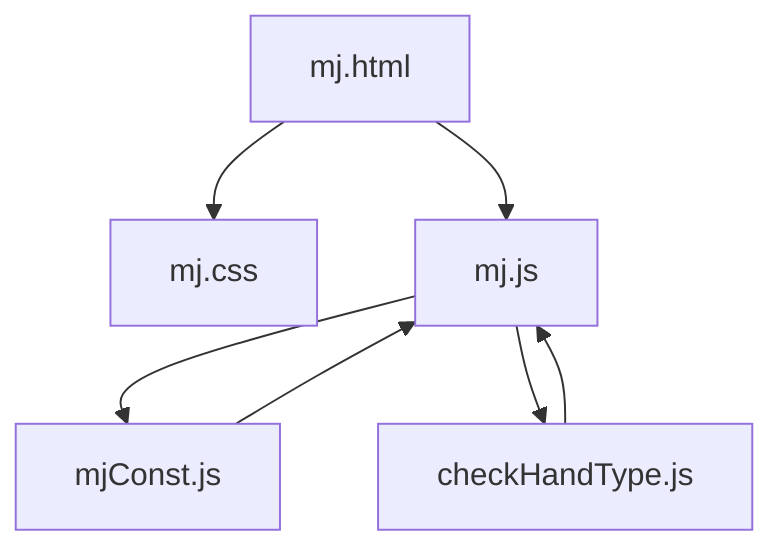
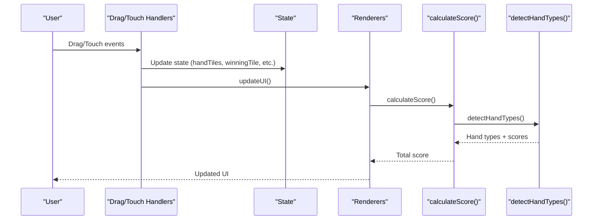
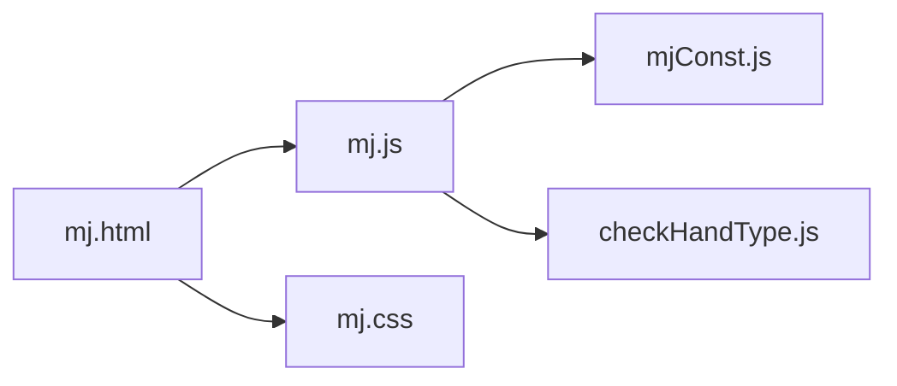

# Performance Optimization

<cite>
**Referenced Files in This Document**
- [mj.js](file://mj.js)
- [mjConst.js](file://mjConst.js)
- [mj.html](file://mj.html)
- [mj.css](file://mj.css)
- [checkHandType.js](file://checkHandType.js)
</cite>

## Table of Contents
1. [Introduction](#introduction)
2. [Project Structure](#project-structure)
3. [Core Components](#core-components)
4. [Architecture Overview](#architecture-overview)
5. [Detailed Component Analysis](#detailed-component-analysis)
6. [Dependency Analysis](#dependency-analysis)
7. [Performance Considerations](#performance-considerations)
8. [Troubleshooting Guide](#troubleshooting-guide)
9. [Conclusion](#conclusion)
10. [Appendices](#appendices)

## Introduction
This document provides a comprehensive performance optimization guide for the OV MJ Calculator. It focuses on memory management, efficient DOM manipulation strategies, and scoring algorithm optimizations. It also includes best practices for handling large tile sets, complex hand combinations, real-time calculations, profiling techniques using browser developer tools, identifying bottlenecks, implementing lazy loading for heavy computations, mobile device considerations, battery usage optimization, smooth scrolling during drag operations, and guidelines to maintain performance as the codebase grows.

## Project Structure
The application is a single-page Mahjong score calculator with:
- UI markup and layout (HTML)
- Styling and responsive design (CSS)
- Application state, event handling, drag-and-drop, and rendering logic (JS)
- Tile definitions and constants (JS)
- Scoring algorithm and hand detection (JS)

**Diagram sources**
- [mj.html:1-248](file://mj.html#L1-L248)
- [mj.css:1-493](file://mj.css#L1-L493)
- [mj.js:1-1211](file://mj.js#L1-L1211)
- [mjConst.js:1-65](file://mjConst.js#L1-L65)
- [checkHandType.js:1-800](file://checkHandType.js#L1-L800)

**Section sources**
- [mj.html:1-248](file://mj.html#L1-L248)
- [mj.css:1-493](file://mj.css#L1-L493)
- [mj.js:1-1211](file://mj.js#L1-L1211)
- [mjConst.js:1-65](file://mjConst.js#L1-L65)
- [checkHandType.js:1-800](file://checkHandType.js#L1-L800)

## Core Components
- State and initialization: Centralized state object tracks tiles, open melds, winning tile, and flags; initialization renders tiles, flowers, sets up events and drag-and-drop, then updates UI.
- Drag-and-drop and touch interactions: Robust handlers for mouse and touch, including long-press activation, drag image creation, drop zone setup, and cleanup.
- Rendering pipeline: Functions update hand tiles, exposed groups, winning tile display, button states, and trigger scoring.
- Scoring engine: A comprehensive hand detection system that evaluates many patterns and applies exclusion rules before returning final hand types and scores.

Key responsibilities and hot paths:
- Event listeners trigger frequent recalculations via updateUI -> calculateScore -> detectHandTypes.
- Drag-and-drop creates temporary DOM nodes and manipulates styles frequently during interaction.
- Rendering rebuilds lists by clearing innerHTML and appending elements repeatedly.

**Section sources**
- [mj.js:1-1211](file://mj.js#L1-L1211)
- [checkHandType.js:1-800](file://checkHandType.js#L1-L800)

## Architecture Overview
The runtime flow connects user interactions to state changes and UI updates, followed by scoring computation.

**Diagram sources**
- [mj.js:44-116](file://mj.js#L44-L116)
- [mj.js:449-522](file://mj.js#L449-L522)
- [mj.js:909-917](file://mj.js#L909-L917)
- [mj.js:1082-1129](file://mj.js#L1082-L1129)
- [checkHandType.js:104-587](file://checkHandType.js#L104-L587)

## Detailed Component Analysis

### Memory Management Techniques
- Avoid repeated allocations in tight loops:
  - In render functions, avoid creating new objects per tile when not needed; reuse data references from constants where possible.
  - Prefer batched DOM updates: build a DocumentFragment or use innerHTML once per container instead of multiple appends.
- History buffer:
  - The undo history stores deep copies of state; cap size to prevent unbounded growth.
- Temporary objects:
  - Minimize allocations inside drag move handlers; reuse variables and clear references after use.

Optimization opportunities:
- Replace repeated JSON.parse/stringify in drag data with structured cloning or typed payloads.
- Use WeakMap for per-element metadata to reduce memory pressure on tile nodes.
- Debounce rapid state changes (e.g., frequent settings toggles) to reduce redundant scoring runs.

**Section sources**
- [mj.js:864-878](file://mj.js#L864-L878)
- [mj.js:386-424](file://mj.js#L386-L424)
- [mj.js:179-308](file://mj.js#L179-L308)

### Efficient DOM Manipulation Strategies
- Batch updates:
  - Clear and rebuild containers in one pass; avoid interleaving reads and writes.
- Reuse event listeners:
  - Ensure setupDragEvents removes old listeners before adding new ones to prevent duplicates.
- Minimize reflows:
  - Apply classes for visual feedback rather than inline style changes during drag.
- Virtualization for large lists:
  - For very large tile sets, consider virtualizing visible tiles to reduce DOM nodes.

Current implementation notes:
- Drag-and-drop uses cloneNode for drag images; ensure removal on end to avoid leaks.
- Touch handlers set passive:false for scroll prevention; be mindful of performance cost.

**Section sources**
- [mj.js:67-91](file://mj.js#L67-L91)
- [mj.js:535-578](file://mj.js#L535-L578)
- [mj.js:926-942](file://mj.js#L926-L942)
- [mj.js:1037-1052](file://mj.js#L1037-L1052)
- [mj.js:1157-1170](file://mj.js#L1157-L1170)

### Scoring Algorithm Optimizations
- Early exits and short-circuiting:
  - Many checks depend on state flags; evaluate cheap conditions first to skip expensive pattern detection.
- Memoization:
  - Cache results of pure functions like getAllTiles and suit/honor counts across calls within an update cycle.
- Reduce redundant scans:
  - Build a single frequency map of all tiles once per calculation and reuse it across detectors.
- Exclusion rules:
  - Apply exclusions efficiently using prefix matching and early filtering to minimize post-processing.

Recommended improvements:
- Introduce a context object passed through detectors to share computed stats (counts, suits, honors).
- Defer non-critical detections until necessary (e.g., only compute rare patterns if base conditions match).
- Parallelize independent checks using Web Workers for heavy pattern detection if needed.

**Section sources**
- [checkHandType.js:1-800](file://checkHandType.js#L1-L800)
- [mj.js:1131-1155](file://mj.js#L1131-L1155)

### Handling Large Tile Sets and Complex Combinations
- Lazy rendering:
  - Render only visible tiles initially; add more on scroll or demand.
- Efficient selection:
  - Use indexed structures (maps keyed by type-value) for O(1) lookups when validating selections.
- Grouped operations:
  - When adding chows/pungs/kongs, batch removals from handTiles to minimize array mutations.

**Section sources**
- [mj.js:713-829](file://mj.js#L713-L829)
- [mj.js:831-862](file://mj.js#L831-L862)

### Real-Time Calculations and Throttling
- Debounce/throttle:
  - For frequent input changes (e.g., dealer count), debounce to limit calculateScore calls.
- Incremental updates:
  - Only recalculate affected parts of the UI when possible.

**Section sources**
- [mj.js:580-703](file://mj.js#L580-L703)

### Mobile Device Performance and Battery Optimization
- Passive listeners:
  - Use passive:true where appropriate to improve scroll performance; currently some handlers use passive:false to prevent default behavior—ensure this is necessary.
- Minimize layout thrashing:
  - Batch DOM reads/writes; avoid forced reflows in touchmove.
- Reduce CPU usage:
  - Limit work in touchmove; defer heavy tasks to requestIdleCallback or after interaction ends.

**Section sources**
- [mj.js:179-308](file://mj.js#L179-L308)
- [mj.css:401-404](file://mj.css#L401-L404)

### Smooth Scrolling During Drag Operations
- Prevent unwanted scrolling:
  - Use overscroll-behavior and touch-action to control scroll behavior during drags.
- Visual feedback without layout:
  - Use transforms for drag image positioning to avoid reflow.

**Section sources**
- [mj.js:372-384](file://mj.js#L372-L384)
- [mj.css:329-335](file://mj.css#L329-L335)
- [mj.css:401-404](file://mj.css#L401-L404)

## Dependency Analysis
High-level dependencies between modules:
- mj.html loads mjConst.js, mj.js, and checkHandType.js.
- mj.js depends on mjConst.js for tile definitions and invokes checkHandType.js for scoring.
- mj.css styles all interactive elements and ensures responsive behavior.

**Diagram sources**
- [mj.html:244-247](file://mj.html#L244-L247)
- [mj.js:1-42](file://mj.js#L1-L42)
- [mjConst.js:1-65](file://mjConst.js#L1-L65)
- [checkHandType.js:1-800](file://checkHandType.js#L1-L800)
- [mj.css:1-493](file://mj.css#L1-L493)

**Section sources**
- [mj.html:244-247](file://mj.html#L244-L247)
- [mj.js:1-42](file://mj.js#L1-L42)
- [mjConst.js:1-65](file://mjConst.js#L1-L65)
- [checkHandType.js:1-800](file://checkHandType.js#L1-L800)
- [mj.css:1-493](file://mj.css#L1-L493)

## Performance Considerations
- Profiling techniques:
  - Use Performance tab to capture timelines during drag-and-drop and scoring; identify long tasks and frequent recalculations.
  - Use Memory tab to track heap snapshots; look for retained nodes from drag images or event listeners.
  - Use Lighthouse for mobile performance insights and battery impact indicators.
- Identifying bottlenecks:
  - Frequent innerHTML replacements in render functions can cause layout thrashing; prefer fragment-based updates.
  - Heavy scoring runs on every change; introduce throttling or incremental updates.
- Lazy loading:
  - Defer non-critical hand detections until user pauses input; use requestIdleCallback to schedule background analysis.
  - Load additional scoring modules on demand if feature expansion increases complexity.
- Mobile considerations:
  - Reduce work in touchmove; use transform-based animations to keep main thread free.
  - Avoid excessive DOM queries; cache selectors where safe.
- Best practices for growth:
  - Modularize scoring into separate modules with clear interfaces; test each detector independently.
  - Introduce metrics and logging to track calculation time and memory usage over time.

[No sources needed since this section provides general guidance]

## Troubleshooting Guide
Common issues and resolutions:
- Duplicate event listeners:
  - Ensure setupDragEvents removes previous listeners before attaching new ones to prevent memory leaks and unexpected behavior.
- Drag image not removed:
  - Verify cleanup in touchend/dragend to remove temporary nodes and reset classes.
- Scoring not updating:
  - Confirm updateUI triggers calculateScore and that required tile counts are valid before running detectors.
- Scroll interference on mobile:
  - Check passive flag usage and overscroll-behavior; ensure drag prevents default only when necessary.

**Section sources**
- [mj.js:67-91](file://mj.js#L67-L91)
- [mj.js:270-308](file://mj.js#L270-L308)
- [mj.js:407-419](file://mj.js#L407-L419)
- [mj.js:1082-1129](file://mj.js#L1082-L1129)

## Conclusion
By applying targeted memory management, optimizing DOM updates, streamlining the scoring algorithm, and adopting mobile-friendly interaction patterns, the OV MJ Calculator can deliver smooth, responsive performance even under heavy usage. Implementing profiling, lazy loading, and modular architecture will help maintain performance as features grow.

[No sources needed since this section summarizes without analyzing specific files]

## Appendices

### Key Code Paths for Performance Audits
- Initialization and setup: [mj.js:35-42](file://mj.js#L35-L42)
- Drag-and-drop lifecycle: [mj.js:67-116](file://mj.js#L67-L116), [mj.js:179-308](file://mj.js#L179-L308), [mj.js:386-424](file://mj.js#L386-L424)
- Rendering pipelines: [mj.js:535-578](file://mj.js#L535-L578), [mj.js:926-1052](file://mj.js#L926-L1052)
- Scoring entry point: [mj.js:1082-1129](file://mj.js#L1082-L1129)
- Hand detection core: [checkHandType.js:104-587](file://checkHandType.js#L104-L587)

**Section sources**
- [mj.js:35-42](file://mj.js#L35-L42)
- [mj.js:67-116](file://mj.js#L67-L116)
- [mj.js:179-308](file://mj.js#L179-L308)
- [mj.js:386-424](file://mj.js#L386-L424)
- [mj.js:535-578](file://mj.js#L535-L578)
- [mj.js:926-1052](file://mj.js#L926-L1052)
- [mj.js:1082-1129](file://mj.js#L1082-L1129)
- [checkHandType.js:104-587](file://checkHandType.js#L104-L587)