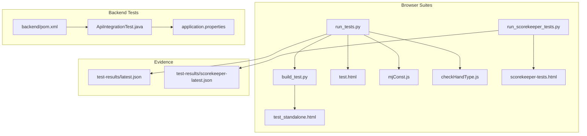
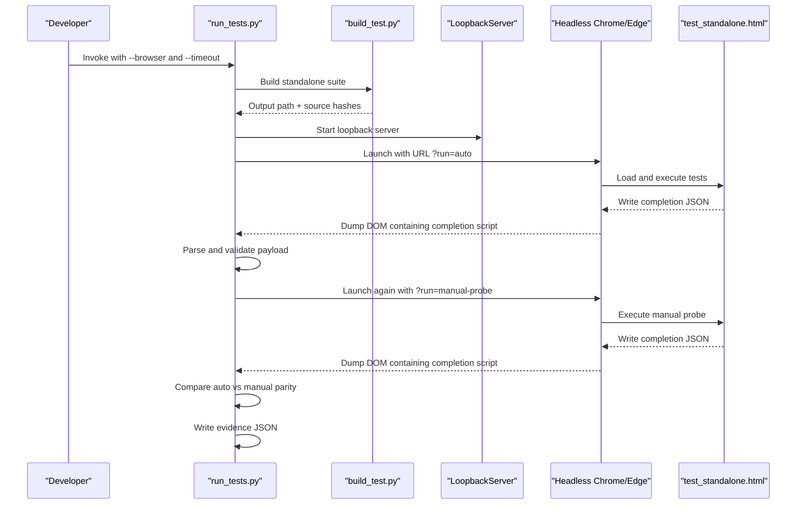
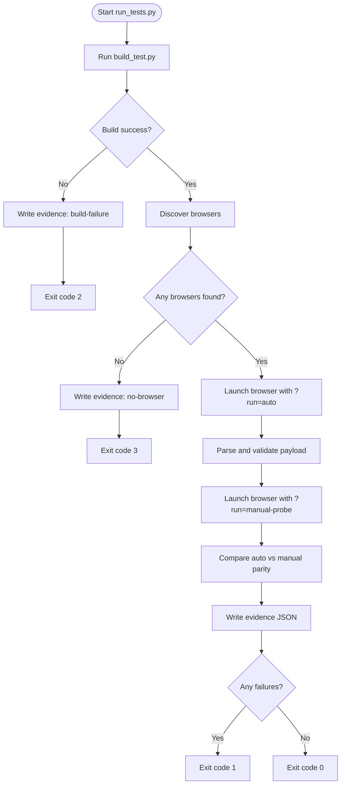
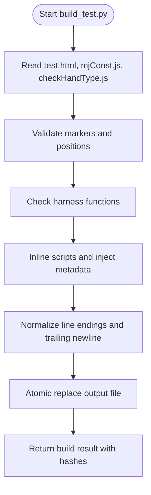
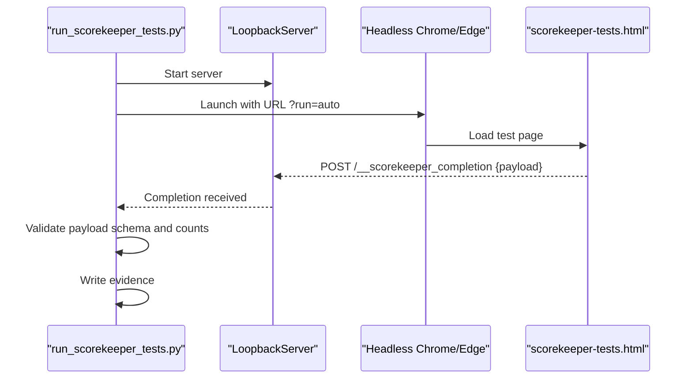
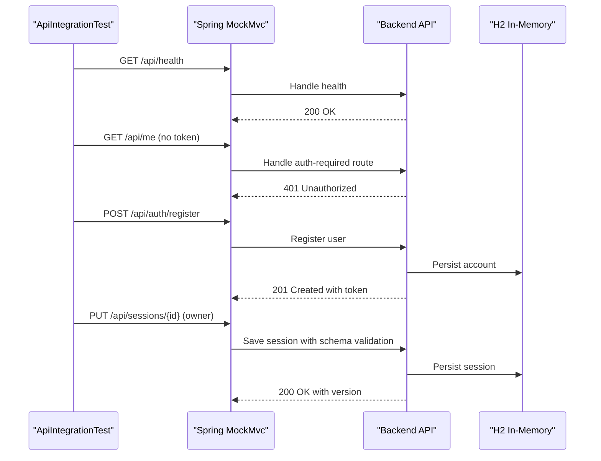
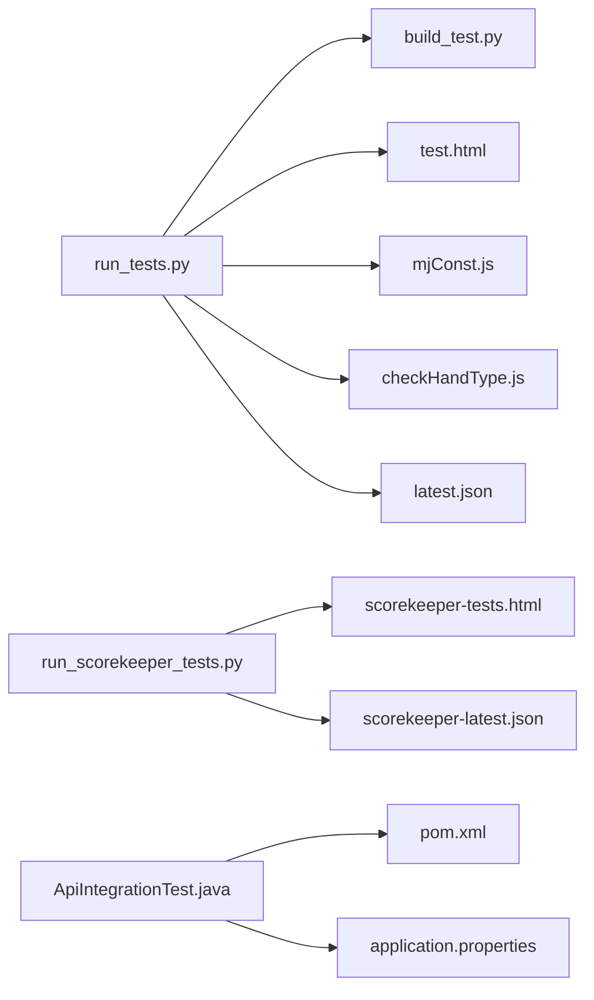

# Testing Infrastructure

<cite>
**Referenced Files in This Document**
- [docs/TESTING.md](file://docs/TESTING.md)
- [run_tests.py](file://run_tests.py)
- [build_test.py](file://build_test.py)
- [test.html](file://test.html)
- [mjConst.js](file://mjConst.js)
- [checkHandType.js](file://checkHandType.js)
- [run_scorekeeper_tests.py](file://run_scorekeeper_tests.py)
- [scorekeeper-tests.html](file://scorekeeper-tests.html)
- [backend/pom.xml](file://backend/pom.xml)
- [backend/src/test/java/com/onevictoria/mahjong/ApiIntegrationTest.java](file://backend/src/test/java/com/onevictoria/mahjong/ApiIntegrationTest.java)
- [backend/src/test/resources/application.properties](file://backend/src/test/resources/application.properties)
- [test-results/latest.json](file://test-results/latest.json)
- [test-results/scorekeeper-latest.json](file://test-results/scorekeeper-latest.json)
</cite>

## Table of Contents
1. [Introduction](#introduction)
2. [Project Structure](#project-structure)
3. [Core Components](#core-components)
4. [Architecture Overview](#architecture-overview)
5. [Detailed Component Analysis](#detailed-component-analysis)
6. [Dependency Analysis](#dependency-analysis)
7. [Performance Considerations](#performance-considerations)
8. [Troubleshooting Guide](#troubleshooting-guide)
9. [Conclusion](#conclusion)

## Introduction
This document explains the testing infrastructure for the project. The suite is intentionally split into three independent verification layers:

- Browser-based scorekeeper and lifecycle tests (47 cases, run on Chrome and Edge).
- Canonical scoring rule tests (137+ cases, run on Chrome and Edge with strict parity checks).
- Java API and JPA integration tests (MockMvc against an in-memory H2 database).

The design emphasizes deterministic builds, protected source integrity, structured evidence artifacts, and reproducible execution across browsers without requiring Node.js for the browser suites.

**Section sources**
- [docs/TESTING.md:1-12](file://docs/TESTING.md#L1-L12)

## Project Structure
At a high level, the testing surface spans:

- Python runners that orchestrate headless browsers and validate structured completion payloads.
- A build step that produces a self-contained HTML test page by inlining canonical sources and injecting build metadata.
- Browser test pages that execute assertions and report results back to the runner via a loopback HTTP callback or DOM dump.
- A Spring Boot backend test suite using MockMvc and H2.
- Evidence JSON files capturing timestamps, invocation details, browser versions, source hashes, and per-case outcomes.

**Diagram sources**
- [run_tests.py:1-661](file://run_tests.py#L1-L661)
- [build_test.py:1-134](file://build_test.py#L1-L134)
- [test.html:1-200](file://test.html#L1-L200)
- [run_scorekeeper_tests.py:1-323](file://run_scorekeeper_tests.py#L1-L323)
- [scorekeeper-tests.html:1-200](file://scorekeeper-tests.html#L1-L200)
- [backend/pom.xml:1-21](file://backend/pom.xml#L1-L21)
- [backend/src/test/java/com/onevictoria/mahjong/ApiIntegrationTest.java:1-111](file://backend/src/test/java/com/onevictoria/mahjong/ApiIntegrationTest.java#L1-L111)
- [backend/src/test/resources/application.properties](file://backend/src/test/resources/application.properties)

**Section sources**
- [docs/TESTING.md:13-48](file://docs/TESTING.md#L13-L48)

## Core Components
- Canonical browser suite runner: discovers browsers, builds a standalone test page, runs headless Chrome/Edge, validates completion payloads, and writes evidence.
- Canonical builder: extracts markers from canonical sources, inlines dependencies, injects build metadata, and atomically writes output.
- Scorekeeper suite runner: starts a local server, launches browsers, waits for same-origin callbacks, validates schema and counts, and writes evidence.
- Backend integration tests: register users, authenticate, create sessions, enforce ownership and optimistic concurrency, validate schemas, and export data.

Key responsibilities and guarantees:
- Deterministic outputs and source hashing to prevent stale evidence.
- Strict payload validation including count consistency, invariant flags, oracle probes, and preservation baselines.
- Protected material checks ensuring required repository assets exist.
- Exit codes that clearly distinguish test failures, build failures, timeouts, and infrastructure issues.

**Section sources**
- [run_tests.py:21-46](file://run_tests.py#L21-L46)
- [run_tests.py:169-226](file://run_tests.py#L169-L226)
- [run_tests.py:461-471](file://run_tests.py#L461-L471)
- [build_test.py:57-119](file://build_test.py#L57-L119)
- [run_scorekeeper_tests.py:142-157](file://run_scorekeeper_tests.py#L142-L157)
- [backend/src/test/java/com/onevictoria/mahjong/ApiIntegrationTest.java:31-109](file://backend/src/test/java/com/onevictoria/mahjong/ApiIntegrationTest.java#L31-L109)

## Architecture Overview
The canonical suite follows a strict pipeline:

1. Build phase: inline canonical sources and inject build metadata into a standalone HTML file.
2. Discovery phase: locate Chrome and/or Edge executables from PATH and standard locations.
3. Execution phase: start a loopback HTTP server, launch headless browsers with isolated profiles, and request auto/manual modes.
4. Validation phase: parse DOM dumps, extract JSON completion payloads, validate schemas and invariants, and compare manual vs auto parity.
5. Evidence phase: write structured JSON artifacts with timestamps, hashes, and per-run diagnostics.

**Diagram sources**
- [run_tests.py:461-471](file://run_tests.py#L461-L471)
- [run_tests.py:510-529](file://run_tests.py#L510-L529)
- [run_tests.py:338-410](file://run_tests.py#L338-L410)
- [build_test.py:57-119](file://build_test.py#L57-L119)

## Detailed Component Analysis

### Canonical Suite Runner
Responsibilities:
- Discover browsers via environment variables, PATH, and standard installation paths.
- Run each browser twice: once in automatic mode and once in manual probe mode to ensure parity.
- Validate completion payloads against a strict schema, including source hashes, counts, invariants, oracle probes, inventory, and preservation baselines.
- Produce exit codes that differentiate test failures, build failures, missing browsers, timeouts, and infrastructure errors.

Key implementation patterns:
- Loopback server serves only the generated standalone HTML; other requests return 404.
- Completion parsing uses an HTML parser to extract exactly one JSON payload from a dedicated script tag.
- Process trees are terminated reliably to avoid hanging browser processes.
- Evidence includes invocation details, browser availability, protected material status, source revision, and per-run commands and stderr tails.

**Diagram sources**
- [run_tests.py:600-656](file://run_tests.py#L600-L656)
- [run_tests.py:338-410](file://run_tests.py#L338-L410)
- [run_tests.py:461-471](file://run_tests.py#L461-L471)
- [run_tests.py:510-529](file://run_tests.py#L510-L529)

**Section sources**
- [run_tests.py:21-46](file://run_tests.py#L21-L46)
- [run_tests.py:169-226](file://run_tests.py#L169-L226)
- [run_tests.py:249-291](file://run_tests.py#L249-L291)
- [run_tests.py:338-410](file://run_tests.py#L338-L410)
- [run_tests.py:413-458](file://run_tests.py#L413-L458)
- [run_tests.py:600-656](file://run_tests.py#L600-L656)

### Canonical Builder
Responsibilities:
- Read canonical sources and enforce marker uniqueness and ordering.
- Inline external scripts and inject build metadata deterministically.
- Normalize line endings and atomically replace the output file.
- Return build metadata including byte size and source hashes.

Validation guarantees:
- Exactly one occurrence of each marker and completion element.
- Required harness functions must be present.
- No pre-existing generated metadata in canonical input.

**Diagram sources**
- [build_test.py:57-119](file://build_test.py#L57-L119)

**Section sources**
- [build_test.py:1-134](file://build_test.py#L1-L134)

### Scorekeeper Suite Runner
Responsibilities:
- Serve the scorekeeper test page from a loopback server.
- Launch Chrome and Edge headlessly with isolated profiles.
- Wait for a same-origin POST callback containing a versioned payload.
- Validate schema, counts, and invariants; record per-test results.
- Write evidence with invocation context and run diagnostics.

Execution flow:
- For each requested browser, start the server, prepare completion state, launch the browser, wait for completion within timeout, validate payload, and collect stderr tail.
- Aggregate runs and determine overall success based on all runs passing.

**Diagram sources**
- [run_scorekeeper_tests.py:49-114](file://run_scorekeeper_tests.py#L49-L114)
- [run_scorekeeper_tests.py:182-273](file://run_scorekeeper_tests.py#L182-L273)
- [run_scorekeeper_tests.py:276-287](file://run_scorekeeper_tests.py#L276-L287)

**Section sources**
- [run_scorekeeper_tests.py:1-323](file://run_scorekeeper_tests.py#L1-L323)

### Backend Integration Tests
Responsibilities:
- Verify public health endpoint and authentication requirements.
- Register users, login, retrieve profile, create/list players, logout, and confirm token revocation.
- Create/update/delete sessions with optimistic concurrency and cross-account isolation.
- Validate session schema and reject invalid bao entries.
- Export sessions as JSON and TXT.

Environment:
- Uses Spring Boot Test with MockMvc and an in-memory H2 database configured via test properties.

**Diagram sources**
- [backend/src/test/java/com/onevictoria/mahjong/ApiIntegrationTest.java:31-109](file://backend/src/test/java/com/onevictoria/mahjong/ApiIntegrationTest.java#L31-L109)
- [backend/pom.xml:10-18](file://backend/pom.xml#L10-L18)
- [backend/src/test/resources/application.properties](file://backend/src/test/resources/application.properties)

**Section sources**
- [backend/src/test/java/com/onevictoria/mahjong/ApiIntegrationTest.java:1-111](file://backend/src/test/java/com/onevictoria/mahjong/ApiIntegrationTest.java#L1-L111)
- [backend/pom.xml:1-21](file://backend/pom.xml#L1-L21)
- [docs/TESTING.md:239-278](file://docs/TESTING.md#L239-L278)

## Dependency Analysis
The testing system has clear boundaries and minimal coupling:

- The canonical runner depends on the builder and the canonical sources. It does not depend on Node.js.
- The scorekeeper runner depends on the scorekeeper test page and a loopback server.
- Backend tests depend on Spring Boot Test, MockMvc, and H2 configuration.
- Evidence files are outputs, not inputs, and serve as immutable records for release verification.

**Diagram sources**
- [run_tests.py:1-661](file://run_tests.py#L1-L661)
- [build_test.py:1-134](file://build_test.py#L1-L134)
- [run_scorekeeper_tests.py:1-323](file://run_scorekeeper_tests.py#L1-L323)
- [backend/src/test/java/com/onevictoria/mahjong/ApiIntegrationTest.java:1-111](file://backend/src/test/java/com/onevictoria/mahjong/ApiIntegrationTest.java#L1-L111)
- [backend/pom.xml:1-21](file://backend/pom.xml#L1-L21)
- [backend/src/test/resources/application.properties](file://backend/src/test/resources/application.properties)

**Section sources**
- [run_tests.py:21-46](file://run_tests.py#L21-L46)
- [run_tests.py:510-529](file://run_tests.py#L510-L529)
- [run_scorekeeper_tests.py:276-287](file://run_scorekeeper_tests.py#L276-L287)

## Performance Considerations
- Headless browsers run with isolated temporary profiles to avoid cross-session interference.
- Hard timeouts terminate process trees to prevent hangs from consuming resources.
- The loopback servers are lightweight and serve only necessary endpoints, reducing overhead.
- Evidence writing uses atomic replacement to avoid partial artifacts.
- Source hashing ensures that rebuilds and re-runs are deterministic and verifiable.

[No sources needed since this section provides general guidance]

## Troubleshooting Guide
Common issues and resolutions:

- Missing browsers: Install Chrome and Edge, add them to PATH, or pass an explicit executable path.
- Protected material failure: Ensure required repository assets exist, including the protected rule document at the expected location.
- Timeouts: End lingering browser processes, confirm headless startup works, and increase timeout if necessary; do not mask hangs with longer timeouts.
- Stale or malformed evidence: Re-run from canonical sources; do not edit JSON artifacts manually.
- Manual vs auto parity mismatch: Investigate differences between automatic execution and manual probe verdicts.
- Java test failures: Confirm Java 17 and Maven use the same JAVA_HOME; inspect Surefire stack traces.
- PostgreSQL startup failures: Verify profile, JDBC URL, credentials, network, schema permissions, and DDL auto settings.

Evidence inspection:
- For canonical tests, verify status, discovered/executed/passed counts, invariant flag, and source hashes.
- For scorekeeper tests, verify status, discovered/executed/passed counts, and browser app state.

**Section sources**
- [docs/TESTING.md:323-340](file://docs/TESTING.md#L323-L340)
- [docs/TESTING.md:280-304](file://docs/TESTING.md#L280-L304)
- [run_tests.py:532-597](file://run_tests.py#L532-L597)

## Conclusion
The testing infrastructure provides layered, deterministic, and auditable verification across browser UI behavior, canonical scoring rules, and backend APIs. By enforcing strict payload schemas, source hashing, parity checks, and protected material validation, it produces reliable evidence suitable for release qualification. The separation of concerns between builders, runners, test pages, and backend tests keeps the system maintainable and focused on reproducible outcomes.

[No sources needed since this section summarizes without analyzing specific files]