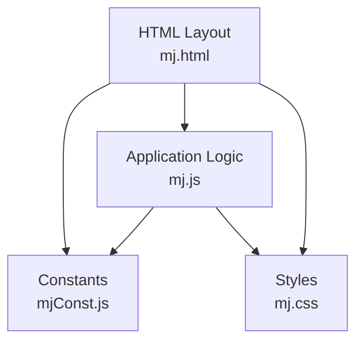
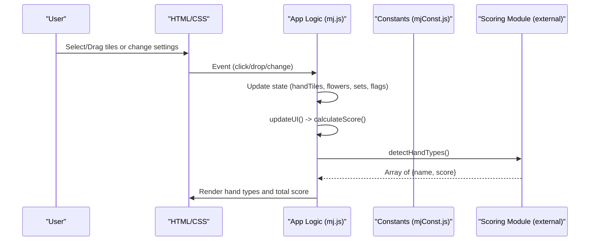
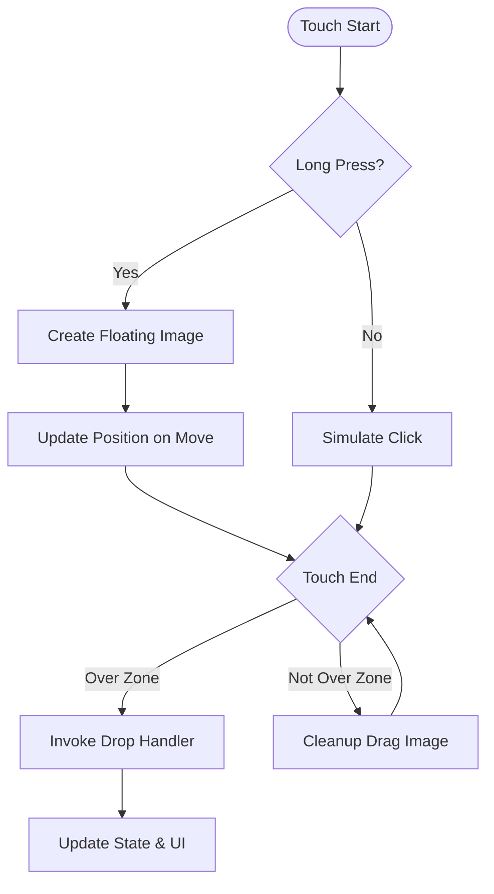
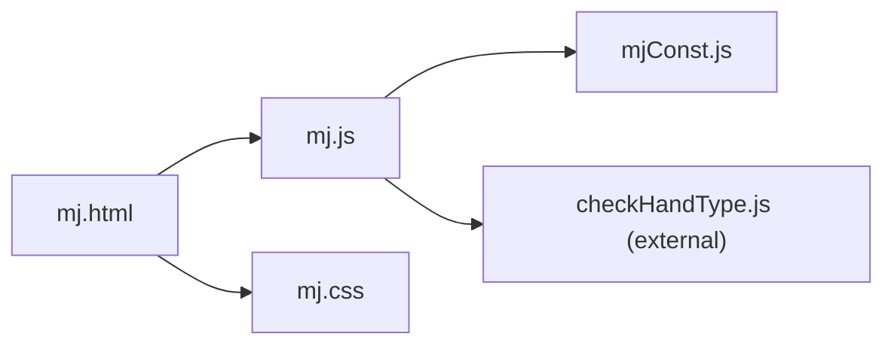

# Testing and Debugging

<cite>
**Referenced Files in This Document**
- [mj.html](file://mj.html)
- [mj.js](file://mj.js)
- [mjConst.js](file://mjConst.js)
- [mj.css](file://mj.css)
</cite>

## Table of Contents
1. Introduction
2. Project Structure
3. Core Components
4. Architecture Overview
5. Detailed Component Analysis
6. Dependency Analysis
7. Performance Considerations
8. Troubleshooting Guide
9. Conclusion
10. Appendices

## Introduction
This document provides a comprehensive testing and debugging guide for the OV MJ Calculator, focusing on manual testing procedures (scoring accuracy, drag-and-drop behavior, mobile responsiveness), debugging techniques using browser developer tools and console logging strategies, automated testing approaches for scoring algorithms, state management, and UI interactions, as well as troubleshooting guides for common issues and performance profiling for large hands and complex scenarios.

## Project Structure
The application is a single-page web app composed of:
- HTML layout defining tile selection areas, exposed sets, winning tile area, settings, special conditions, and score display.
- JavaScript implementing application state, drag-and-drop (mouse and touch), event binding, UI updates, and score calculation orchestration.
- Constants defining tile types and tile data.
- CSS styling including responsive design and drag-over visual feedback.

**Diagram sources**
- [mj.html:1-248](file://mj.html#L1-L248)
- [mj.js:1-1211](file://mj.js#L1-L1211)
- [mjConst.js:1-65](file://mjConst.js#L1-L65)
- [mj.css:1-493](file://mj.css#L1-L493)

**Section sources**
- [mj.html:1-248](file://mj.html#L1-L248)
- [mj.js:1-1211](file://mj.js#L1-L1211)
- [mjConst.js:1-65](file://mjConst.js#L1-L65)
- [mj.css:1-493](file://mj.css#L1-L493)

## Core Components
- Application state: central object holding hand tiles, flowers, exposed sets, winning tile, seat/round winds, dealer info, self-draw flags, special conditions, and history for undo.
- Drag-and-drop system: supports mouse drag and touch gestures with long-press to initiate dragging; drop zones include hand tiles, winning tile area, and trash icon.
- UI rendering: dynamic creation of tile elements, exposed groups, and updating counts and button states.
- Score calculation entry point: validates total tile count and delegates detection to an external module; aggregates dealer bonus and displays results.

Key responsibilities and locations:
- State definition and initialization: [mj.js:1-42](file://mj.js#L1-L42)
- Drag-and-drop setup and handlers: [mj.js:44-148](file://mj.js#L44-L148), [mj.js:179-377](file://mj.js#L179-L377), [mj.js:386-442](file://mj.js#L386-L442)
- Drop zone wiring: [mj.js:118-148](file://mj.js#L118-L148)
- Tile selection and movement: [mj.js:150-177](file://mj.js#L150-L177), [mj.js:449-522](file://mj.js#L449-L522)
- Exposed set creation (chow/pung/kong): [mj.js:713-829](file://mj.js#L713-L829)
- UI update pipeline: [mj.js:909-917](file://mj.js#L909-L917)
- Score calculation orchestration: [mj.js:1082-1129](file://mj.js#L1082-L1129)
- Tile constants: [mjConst.js:1-65](file://mjConst.js#L1-L65)

**Section sources**
- [mj.js:1-1211](file://mj.js#L1-L1211)
- [mjConst.js:1-65](file://mjConst.js#L1-L65)

## Architecture Overview
The app follows a simple MVC-like pattern:
- Model: state object in mj.js
- View: DOM elements rendered by functions in mj.js and styled by mj.css
- Controller: event listeners and handlers in mj.js that mutate state and trigger re-rendering

**Diagram sources**
- [mj.js:580-703](file://mj.js#L580-L703)
- [mj.js:909-917](file://mj.js#L909-L917)
- [mj.js:1082-1129](file://mj.js#L1082-L1129)
- [mj.html:237-242](file://mj.html#L237-L242)

**Section sources**
- [mj.js:580-703](file://mj.js#L580-L703)
- [mj.js:909-917](file://mj.js#L909-L917)
- [mj.js:1082-1129](file://mj.js#L1082-L1129)
- [mj.html:237-242](file://mj.html#L237-L242)

## Detailed Component Analysis

### Manual Testing Procedures

#### Scoring Accuracy
- Validate required tile count logic: ensure total tiles equals 17 plus number of kongs before scoring proceeds.
- Verify exposed sets are correctly recognized (chow sequences, pung triples, open/concealed quads).
- Confirm dealer bonus adds based on seat wind and dealer count when enabled.
- Test combinations of special condition flags to ensure they influence scoring through the external module.

Test cases:
- Empty hand: expect status message indicating insufficient tiles.
- Exactly 17 tiles without any exposed sets: expect scoring to proceed.
- With 1 open kong: expected total tiles should be 18; verify validation passes.
- Dealer active with multiple consecutive rounds: verify dealer bonus increments accordingly.

Validation points:
- Tile count check and early return path: [mj.js:1082-1101](file://mj.js#L1082-L1101)
- Dealer bonus addition: [mj.js:1118-1125](file://mj.js#L1118-L1125)
- Hand type detection call: [mj.js:1103-1116](file://mj.js#L1103-L1116)

**Section sources**
- [mj.js:1082-1129](file://mj.js#L1082-L1129)

#### Drag-and-Drop Functionality
- Mouse drag:
  - Start drag from tile containers; verify data transfer payload includes type, value, source, display.
  - Drop into hand-tiles, winning-tile, or trash-icon; verify state updates and UI refresh.
- Touch drag:
  - Long press to start drag; verify floating drag image appears and moves with finger.
  - Release over valid drop zone; verify correct handler invoked and state updated.
- Edge cases:
  - Drag from winning-tile back to hand-tiles; ensure winning tile clears and tile returns to hand.
  - Drag to trash; ensure removal from hand or clearing of winning tile.

Relevant flows:
- Mouse drag start/end and drop handling: [mj.js:386-442](file://mj.js#L386-L442), [mj.js:449-522](file://mj.js#L449-L522)
- Touch drag lifecycle and drop mapping: [mj.js:179-377](file://mj.js#L179-L377)
- Drop zone initialization: [mj.js:118-148](file://mj.js#L118-L148)

**Diagram sources**
- [mj.js:179-377](file://mj.js#L179-L377)

**Section sources**
- [mj.js:179-377](file://mj.js#L179-L377)
- [mj.js:386-442](file://mj.js#L386-L442)
- [mj.js:449-522](file://mj.js#L449-L522)
- [mj.js:118-148](file://mj.js#L118-L148)

#### Mobile Responsiveness
- Verify layout adapts at narrow widths; tile sizes and spacing adjust via media queries.
- Ensure touch targets are adequately sized and not overlapping.
- Confirm drag gestures do not trigger page scrolling unintentionally.

Checkpoints:
- Responsive styles for small screens: [mj.css:469-493](file://mj.css#L469-L493)
- Touch action and pointer events configuration: [mj.css:337-404](file://mj.css#L337-L404)

**Section sources**
- [mj.css:337-404](file://mj.css#L337-L404)
- [mj.css:469-493](file://mj.css#L469-L493)

### Automated Testing Approaches

#### Scoring Algorithms
- Unit tests for tile count validation:
  - Assert early return when total tiles differ from required count.
  - Assert no hand types rendered and score remains zero when invalid.
- Integration tests for exposed sets:
  - Add chow/pung/open-kong/concealed-kong programmatically and assert UI reflects changes.
  - Validate button enable/disable states based on selected tiles.

References:
- Tile count validation and early exit: [mj.js:1082-1101](file://mj.js#L1082-L1101)
- Button state updates: [mj.js:1054-1080](file://mj.js#L1054-L1080)
- Exposed set creation functions: [mj.js:713-829](file://mj.js#L713-L829)

**Section sources**
- [mj.js:1054-1080](file://mj.js#L1054-L1080)
- [mj.js:1082-1101](file://mj.js#L1082-L1101)
- [mj.js:713-829](file://mj.js#L713-L829)

#### State Management
- Snapshot-based tests:
  - Before and after actions (select tile, add chow/pung/kong, clear) compare serialized state snapshots.
- Undo functionality:
  - Perform multiple actions then undo; assert state matches previous snapshot.

References:
- History save and undo: [mj.js:864-894](file://mj.js#L864-L894)
- Clear selection: [mj.js:896-907](file://mj.js#L896-L907)

**Section sources**
- [mj.js:864-907](file://mj.js#L864-L907)

#### UI Interactions
- Event-driven tests:
  - Simulate click on tile container; assert tile added to handTiles and UI updated.
  - Simulate drag-and-drop to drop zones; assert state mutation and render updates.
- Accessibility and keyboard navigation:
  - Ensure controls are focusable and operable via keyboard where applicable.

References:
- Click handler for tiles: [mj.js:150-177](file://mj.js#L150-L177)
- Drop handlers: [mj.js:449-522](file://mj.js#L449-L522)

**Section sources**
- [mj.js:150-177](file://mj.js#L150-L177)
- [mj.js:449-522](file://mj.js#L449-L522)

## Dependency Analysis
- mj.js depends on mjConst.js for tile definitions and on mj.html for DOM structure.
- mj.js calls an external scoring module (checkHandType.js referenced in HTML) to detect hand types and scores.
- mj.css provides styling and responsive behavior used by the UI.

**Diagram sources**
- [mj.html:244-247](file://mj.html#L244-L247)
- [mj.js:1-1211](file://mj.js#L1-L1211)
- [mjConst.js:1-65](file://mjConst.js#L1-L65)

**Section sources**
- [mj.html:244-247](file://mj.html#L244-L247)
- [mj.js:1-1211](file://mj.js#L1-L1211)
- [mjConst.js:1-65](file://mjConst.js#L1-L65)

## Performance Considerations
- Large hands and many exposed sets can increase DOM manipulation cost during updateUI. Consider:
  - Batch updates and minimize reflows by reducing intermediate DOM writes.
  - Use efficient selectors and avoid repeated querySelectorAll calls inside tight loops.
- Drag-and-drop:
  - Avoid creating heavy drag images repeatedly; reuse or optimize cloning.
  - Debounce frequent move events if needed to reduce layout thrashing.
- Scoring:
  - Offload heavy computations to Web Workers if detectHandType becomes a bottleneck.
  - Cache intermediate results for repeated calculations when possible.

[No sources needed since this section provides general guidance]

## Troubleshooting Guide

### Common Issues and Fixes

#### Score Calculation Errors
Symptoms:
- Status message indicates insufficient tiles even when hand seems complete.
- Total score remains zero despite valid hand.

Debug steps:
- Inspect total tile count computation and required tiles logic.
- Verify exposed sets are correctly counted (chow/pung/open-kong/concealed-kong).
- Check if detectHandType is being called and returning expected results.

References:
- Tile count validation: [mj.js:1082-1101](file://mj.js#L1082-L1101)
- Hand type detection invocation: [mj.js:1103-1116](file://mj.js#L1103-L1116)

**Section sources**
- [mj.js:1082-1116](file://mj.js#L1082-L1116)

#### Tile Selection Problems
Symptoms:
- Tiles not added to hand or removed incorrectly.
- Winning tile not cleared when moved back to hand.

Debug steps:
- Inspect drag data payload and source identification.
- Verify drop handlers route to correct function based on target zone.
- Check constraints on maximum tiles per type and overall hand size.

References:
- Drag data and source handling: [mj.js:386-442](file://mj.js#L386-L442)
- Drop handlers for hand/winning/trash: [mj.js:449-522](file://mj.js#L449-L522)
- Tile selection limits: [mj.js:1172-1209](file://mj.js#L1172-L1209)

**Section sources**
- [mj.js:386-442](file://mj.js#L386-L442)
- [mj.js:449-522](file://mj.js#L449-L522)
- [mj.js:1172-1209](file://mj.js#L1172-L1209)

#### Mobile Device Compatibility
Symptoms:
- Drag does not start on touch devices.
- Page scrolls while attempting to drag tiles.

Debug steps:
- Ensure touch events are properly prevented from default scrolling during drag.
- Verify long-press threshold and drag image creation occur as expected.
- Check CSS touch-action and pointer-events configurations.

References:
- Touch event handling and prevention: [mj.js:179-377](file://mj.js#L179-L377)
- Touch-related CSS: [mj.css:337-404](file://mj.css#L337-L404)

**Section sources**
- [mj.js:179-377](file://mj.js#L179-L377)
- [mj.css:337-404](file://mj.css#L337-L404)

### Browser Developer Tools Techniques
- Console logging:
  - Log state mutations around key operations (tile selection, drop, exposed set creation).
  - Log drag data payloads to verify type/value/source correctness.
- Network tab:
  - If loading external modules, verify successful fetch and availability.
- Elements panel:
  - Inspect dynamically created tile elements and their dataset attributes.
  - Check classes applied during drag-over states.
- Performance panel:
  - Record user interactions to identify slow re-renders or excessive layout recalculations.
- Emulation:
  - Use device emulation to test responsive layouts and touch interactions across screen sizes.

[No sources needed since this section provides general guidance]

### Automated Testing Strategies
- Unit tests:
  - Validate tile count checks and early exits.
  - Validate exposed set creation rules (sequences for chow, triples for pung, quads for kong).
- Integration tests:
  - Simulate full user flows: select tiles, create sets, set winning tile, toggle settings, and assert final score.
- E2E tests:
  - Use headless browsers to automate drag-and-drop and touch gestures on mobile emulators.
  - Assert UI elements like status messages and score display update correctly.

[No sources needed since this section provides general guidance]

## Conclusion
The OV MJ Calculator’s architecture centers on a clear separation between state, UI, and interaction logic, with robust drag-and-drop support for both mouse and touch. Effective testing involves validating tile count constraints, ensuring accurate scoring flow, and verifying UI state transitions. Debugging benefits from targeted console logs and developer tool usage, particularly around drag-and-drop events and DOM updates. For performance, consider optimizing DOM updates and offloading heavy scoring computations. The provided references map directly to implementation details for precise verification and issue resolution.

[No sources needed since this section summarizes without analyzing specific files]

## Appendices

### Quick Reference: Key Functions and Locations
- Initialize app and setup: [mj.js:35-42](file://mj.js#L35-L42)
- Drag-and-drop setup: [mj.js:44-148](file://mj.js#L44-L148)
- Touch drag lifecycle: [mj.js:179-377](file://mj.js#L179-L377)
- Mouse drag handlers: [mj.js:386-442](file://mj.js#L386-L442)
- Drop handlers: [mj.js:449-522](file://mj.js#L449-L522)
- Exposed set creation: [mj.js:713-829](file://mj.js#L713-L829)
- UI update pipeline: [mj.js:909-917](file://mj.js#L909-L917)
- Score calculation entry: [mj.js:1082-1129](file://mj.js#L1082-L1129)
- Tile constants: [mjConst.js:1-65](file://mjConst.js#L1-L65)

**Section sources**
- [mj.js:35-148](file://mj.js#L35-L148)
- [mj.js:179-377](file://mj.js#L179-L377)
- [mj.js:386-442](file://mj.js#L386-L442)
- [mj.js:449-522](file://mj.js#L449-L522)
- [mj.js:713-829](file://mj.js#L713-L829)
- [mj.js:909-917](file://mj.js#L909-L917)
- [mj.js:1082-1129](file://mj.js#L1082-L1129)
- [mjConst.js:1-65](file://mjConst.js#L1-L65)