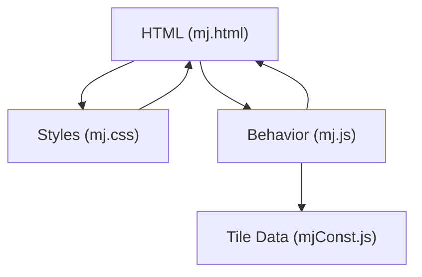
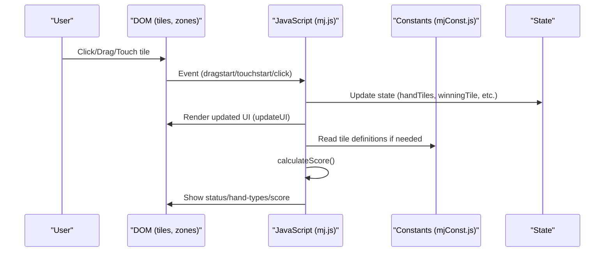
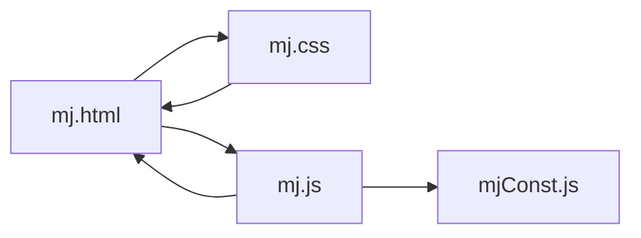

# User Interface Customization

<cite>
**Referenced Files in This Document**
- [mj.html](file://mj.html)
- [mj.css](file://mj.css)
- [mj.js](file://mj.js)
- [mjConst.js](file://mjConst.js)
</cite>

## Table of Contents
1. Introduction
2. Project Structure
3. Core Components
4. Architecture Overview
5. Detailed Component Analysis
6. Dependency Analysis
7. Performance Considerations
8. Troubleshooting Guide
9. Conclusion
10. Appendices

## Introduction
This document explains how to customize the Mahjong scoring assistant’s user interface by modifying HTML structure, CSS styling, and JavaScript behavior. It covers responsive design principles used in mj.css, a mobile-first approach, touch interaction handling, layout customization, adding new UI components, customizing tile appearance, adjusting color schemes, creating themes, improving accessibility, optimizing for different screen sizes, addressing browser compatibility, and understanding performance implications of UI changes.

## Project Structure
The project is a simple single-page application composed of:
- HTML markup that defines sections for tiles, selected tiles, exposed groups, winning tile selection, settings, special conditions, and results.
- A stylesheet that implements a mobile-first responsive layout with drag-and-drop visual feedback and touch-friendly interactions.
- JavaScript that manages state, renders tiles, handles click/drag/touch interactions, updates exposed groups and winning tile selection, and calculates scores.
- Constants that define tile types and tile data for characters, bamboos, dots, honors, and flowers.

**Diagram sources**
- [mj.html:1-248](file://mj.html#L1-L248)
- [mj.css:1-493](file://mj.css#L1-L493)
- [mj.js:1-1211](file://mj.js#L1-L1211)
- [mjConst.js:1-65](file://mjConst.js#L1-L65)

**Section sources**
- [mj.html:1-248](file://mj.html#L1-L248)
- [mj.css:1-493](file://mj.css#L1-L493)
- [mj.js:1-1211](file://mj.js#L1-L1211)
- [mjConst.js:1-65](file://mjConst.js#L1-L65)

## Core Components
- Tile palette and selection areas: containers for character, bamboo, dot, honor, and flower tiles; hand tiles area; exposed groups area; winning tile drop zone.
- Settings panel: seat wind, round wind, dealer flags, self-draw flag.
- Special conditions panel: basic conditions, special draws, heaven/earth conditions, other conditions, multi-win options, visible win tile count.
- Results panel: status messages, detected hand types, total score display.
- Drag-and-drop and touch interactions: mouse drag events and custom touch-based drag for mobile devices.
- State management: arrays for hand tiles, flowers, chows, pungs, open/concealed kongs, winning tile, and history for undo/clear.

Key responsibilities:
- Rendering tile sets from constants into the DOM.
- Handling user interactions (click, drag, touch) to move tiles between areas.
- Updating UI based on current state and validating constraints (e.g., max tiles per type).
- Calculating score and displaying results.

**Section sources**
- [mj.html:13-242](file://mj.html#L13-L242)
- [mj.js:1-1211](file://mj.js#L1-L1211)
- [mjConst.js:1-65](file://mjConst.js#L1-L65)

## Architecture Overview
The UI follows a unidirectional data flow:
- User actions (click/drag/touch) update application state.
- State changes trigger UI updates via render functions.
- Score calculation reads current state and updates result elements.

**Diagram sources**
- [mj.js:150-177](file://mj.js#L150-L177)
- [mj.js:179-377](file://mj.js#L179-L377)
- [mj.js:449-522](file://mj.js#L449-L522)
- [mj.js:909-917](file://mj.js#L909-L917)
- [mj.js:1082-1129](file://mj.js#L1082-L1129)
- [mjConst.js:1-65](file://mjConst.js#L1-L65)

## Detailed Component Analysis

### Responsive Design and Mobile-First Approach
- The stylesheet uses a base mobile-first layout with flexible containers and wrap behaviors to adapt to small screens.
- Media queries adjust spacing and sizing for smaller viewports.
- Touch-friendly styles disable default tap highlights and callouts, set touch-action properties, and provide visual feedback during drag operations.

How to customize:
- Adjust base font sizes, spacing, and tile dimensions in the root and tile classes.
- Extend or override media queries to target specific breakpoints.
- Modify touch feedback styles (active states, shadows, scaling) to match your theme.

**Section sources**
- [mj.css:1-15](file://mj.css#L1-L15)
- [mj.css:68-124](file://mj.css#L68-L124)
- [mj.css:337-404](file://mj.css#L337-L404)
- [mj.css:469-493](file://mj.css#L469-L493)

### Layout Elements and Sections
- The HTML organizes content into semantic sections: tile selection, selected tiles, exposed groups, winning tile, settings, special conditions, and results.
- Each section uses consistent container classes for alignment and spacing.

How to modify:
- Add new sections by inserting divs with appropriate classes and IDs.
- Reorder existing sections by moving blocks in the HTML.
- Ensure corresponding JavaScript references exist for any new interactive elements.

**Section sources**
- [mj.html:13-242](file://mj.html#L13-L242)

### Adding New UI Components
To add a new component:
1. Define the HTML element with a unique ID and appropriate class.
2. If it interacts with state, add event listeners in setupEventListeners or initialize them during DOMContentLoaded.
3. If it displays dynamic content, create or update a render function to reflect state changes.
4. Style the component using existing classes or add new ones in the stylesheet.

Examples:
- Add a new setting group under the settings section.
- Add a new condition checkbox/select under special conditions.
- Add a new action button and wire it to a handler that updates state and calls updateUI.

**Section sources**
- [mj.html:60-118](file://mj.html#L60-L118)
- [mj.html:120-235](file://mj.html#L120-L235)
- [mj.js:580-703](file://mj.js#L580-L703)
- [mj.js:909-917](file://mj.js#L909-L917)

### Customizing Tile Appearance
- Tiles are styled via classes for each type (characters, bamboos, dots, honors, flowers).
- Selected tiles and winning tiles have distinct styles.
- Hover and active states provide visual feedback.

How to customize:
- Change colors, borders, and sizes in tile-related classes.
- Add new tile types in constants and assign a CSS class.
- Override hover/selected/winning styles to match your theme.

**Section sources**
- [mj.css:85-124](file://mj.css#L85-L124)
- [mj.css:143-154](file://mj.css#L143-L154)
- [mj.css:115-118](file://mj.css#L115-L118)
- [mjConst.js:11-53](file://mjConst.js#L11-L53)

### Color Schemes and Themes
- Colors are defined in CSS classes for backgrounds, borders, text, and highlights.
- Theme creation involves overriding these classes or adding a theme-specific stylesheet linked after the main one.

Steps:
- Create a new stylesheet that imports or links after mj.css.
- Override key variables like background-color, border colors, and tile colors.
- Test across breakpoints to ensure readability and contrast.

**Section sources**
- [mj.css:7-15](file://mj.css#L7-L15)
- [mj.css:163-176](file://mj.css#L163-L176)
- [mj.css:178-186](file://mj.css#L178-L186)

### Touch Interaction Handling
- The JavaScript implements both native drag-and-drop and custom touch-based dragging for mobile devices.
- Touch events prevent default scrolling during drags and simulate click behavior for quick taps.
- Visual feedback includes scaling and shadows during touch-active states.

How to adjust:
- Modify thresholds for long press and drag initiation.
- Customize drag image positioning and styles.
- Adjust drop zone detection logic if you add new areas.

**Section sources**
- [mj.js:179-377](file://mj.js#L179-L377)
- [mj.js:379-442](file://mj.js#L379-L442)
- [mj.css:337-404](file://mj.css#L337-L404)

### Accessibility Features
- Use semantic headings and labels for form controls.
- Ensure sufficient color contrast for text and interactive elements.
- Provide keyboard navigation support where possible (e.g., focusable buttons and inputs).
- Avoid relying solely on color to convey state; add icons or text indicators.

Recommendations:
- Add aria attributes to dynamic regions (e.g., status messages) to announce changes to screen readers.
- Ensure all interactive elements have accessible names and roles.
- Test with keyboard-only navigation and screen readers.

**Section sources**
- [mj.html:60-118](file://mj.html#L60-L118)
- [mj.html:120-235](file://mj.html#L120-L235)
- [mj.css:163-176](file://mj.css#L163-L176)

### Optimizing for Different Screen Sizes
- Base styles target small screens; media queries refine layout for larger widths.
- Flexbox wrapping ensures tiles and controls reflow gracefully.
- Adjust padding, margins, and tile sizes in media queries for optimal usability on various devices.

Tips:
- Increase tile size slightly on larger screens for better visibility.
- Reduce padding on compact screens to maximize usable space.
- Ensure drop zones remain large enough for touch targets.

**Section sources**
- [mj.css:68-83](file://mj.css#L68-L83)
- [mj.css:156-161](file://mj.css#L156-L161)
- [mj.css:469-493](file://mj.css#L469-L493)

### Browser Compatibility Considerations
- Drag-and-drop relies on standard APIs; fallback touch interactions are implemented for broader mobile support.
- Vendor prefixes are used for touch-related properties to improve compatibility.
- Overscroll behavior and touch-action help prevent unintended scrolling during interactions.

Guidance:
- Test on iOS Safari and Android Chrome for touch behavior differences.
- Validate that drag-over visual cues appear consistently.
- Provide graceful degradation if certain features are unsupported.

**Section sources**
- [mj.js:179-377](file://mj.js#L179-L377)
- [mj.css:337-404](file://mj.css#L337-L404)

### Performance Implications of UI Changes
- Frequent DOM updates can impact performance; batch updates where possible.
- Avoid excessive event listener registrations; reuse setup functions.
- Minimize heavy computations in event handlers; defer to requestAnimationFrame if necessary.
- Keep tile rendering efficient by updating only changed parts of the DOM.

Optimization strategies:
- Debounce rapid input changes (e.g., selecting many tiles quickly).
- Use CSS transitions sparingly; prefer transforms for animations.
- Profile interactions on low-end devices to identify bottlenecks.

**Section sources**
- [mj.js:909-917](file://mj.js#L909-L917)
- [mj.js:535-578](file://mj.js#L535-L578)
- [mj.css:97-103](file://mj.css#L97-L103)

## Dependency Analysis
- HTML depends on CSS for presentation and on JavaScript for interactivity.
- JavaScript depends on constants for tile definitions and on DOM elements for rendering and event handling.
- Styles depend on class names present in HTML to apply formatting.

**Diagram sources**
- [mj.html:1-248](file://mj.html#L1-L248)
- [mj.css:1-493](file://mj.css#L1-L493)
- [mj.js:1-1211](file://mj.js#L1-L1211)
- [mjConst.js:1-65](file://mjConst.js#L1-L65)

**Section sources**
- [mj.html:1-248](file://mj.html#L1-L248)
- [mj.css:1-493](file://mj.css#L1-L493)
- [mj.js:1-1211](file://mj.js#L1-L1211)
- [mjConst.js:1-65](file://mjConst.js#L1-L65)

## Performance Considerations
- Prefer lightweight CSS animations and avoid layout thrashing.
- Limit the number of simultaneously rendered tiles to reduce DOM size.
- Use efficient selectors and avoid deep traversal in event handlers.
- Cache frequently accessed DOM nodes when possible.

[No sources needed since this section provides general guidance]

## Troubleshooting Guide
Common issues and resolutions:
- Tiles not draggable on mobile: Ensure touch events are properly bound and touch-action is set. Verify that drag images are created and removed correctly.
- Drop zones not responding: Confirm IDs match those referenced in JavaScript and that event listeners are attached after DOM load.
- Unexpected scroll during drag: Check touchmove handlers and overscroll-behavior settings.
- Inconsistent drag-over visuals: Ensure dragenter/dragleave handlers toggle classes correctly and that CSS rules target the right elements.

Debugging tips:
- Log drag data and target zones during touch events to verify coordinates and element resolution.
- Inspect computed styles to confirm theme overrides are applied.
- Use browser dev tools to monitor event firing and DOM mutations.

**Section sources**
- [mj.js:179-377](file://mj.js#L179-L377)
- [mj.js:421-442](file://mj.js#L421-L442)
- [mj.css:303-311](file://mj.css#L303-L311)
- [mj.css:337-404](file://mj.css#L337-L404)

## Conclusion
This customization guide covers how to adapt the Mahjong scoring assistant’s UI through HTML, CSS, and JavaScript modifications. By leveraging the mobile-first responsive design, touch interaction handling, and modular architecture, you can tailor layouts, add components, customize tile appearances, implement themes, enhance accessibility, optimize for various screen sizes, and address browser compatibility while maintaining performance.

[No sources needed since this section summarizes without analyzing specific files]

## Appendices

### Example Workflows

#### Creating a Custom Theme
- Add a new stylesheet linked after mj.css.
- Override color classes for tiles, buttons, and backgrounds.
- Adjust typography and spacing to match brand guidelines.
- Test across breakpoints and devices.

**Section sources**
- [mj.css:7-15](file://mj.css#L7-L15)
- [mj.css:163-176](file://mj.css#L163-L176)
- [mj.css:178-186](file://mj.css#L178-L186)

#### Adding a New Condition
- Insert a new checkbox/select in the special conditions section.
- Bind an event listener to update state and recalculate score.
- Style the new control to match existing patterns.

**Section sources**
- [mj.html:120-235](file://mj.html#L120-L235)
- [mj.js:613-703](file://mj.js#L613-L703)

#### Implementing Accessibility Enhancements
- Add aria-live regions for status messages.
- Ensure all inputs have associated labels.
- Provide keyboard shortcuts for common actions.

**Section sources**
- [mj.html:237-242](file://mj.html#L237-L242)
- [mj.html:60-118](file://mj.html#L60-L118)