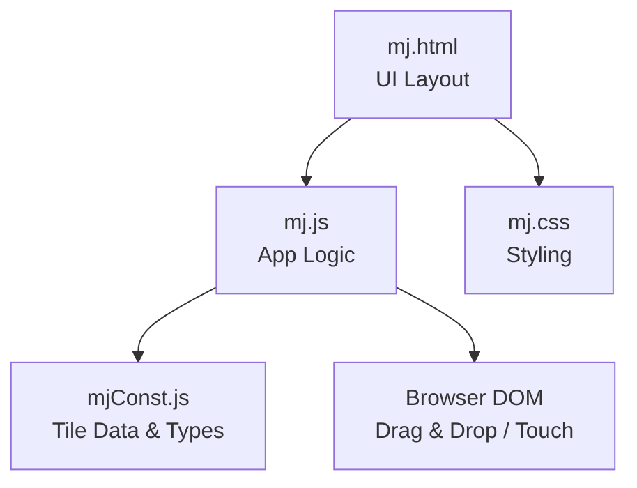
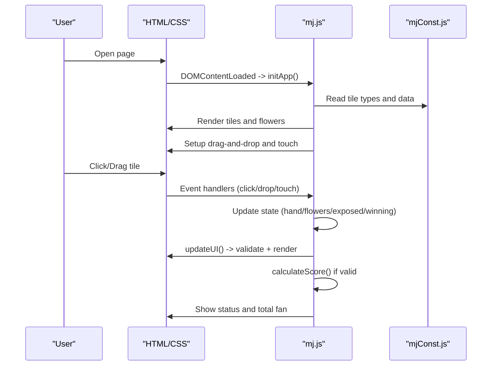
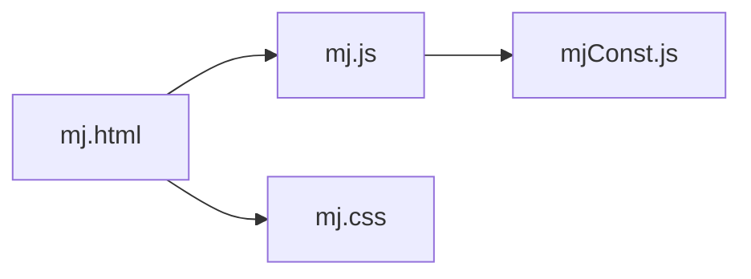

# Getting Started

<cite>
**Referenced Files in This Document**
- [mj.html](file://mj.html)
- [mj.js](file://mj.js)
- [mjConst.js](file://mjConst.js)
- [mj.css](file://mj.css)
</cite>

## Table of Contents
1. [Introduction](#introduction)
2. [Project Structure](#project-structure)
3. [Core Components](#core-components)
4. [Architecture Overview](#architecture-overview)
5. [Detailed Component Analysis](#detailed-component-analysis)
6. [Dependency Analysis](#dependency-analysis)
7. [Performance Considerations](#performance-considerations)
8. [Troubleshooting Guide](#troubleshooting-guide)
9. [Conclusion](#conclusion)

## Introduction
This guide helps you quickly start using the OV MJ Calculator to score Mahjong hands directly in your browser. You only need a modern web browser with HTML5 support. There is no installation or server required—just open the provided HTML file and begin scoring.

What you can do:
- Select tiles from the tile palette into your hand area
- Drag-and-drop tiles between areas (hand, winning tile, trash)
- Record exposed sets (chow, pung, open kong, concealed kong)
- Set game conditions (seat wind, round wind, dealer status, self-draw, special conditions)
- See real-time validation and total fan (points) calculation

## Project Structure
The application is a single-page web app composed of four files:
- mj.html: The user interface layout and sections for tile selection, exposed sets, winning tile, settings, special conditions, and results
- mj.js: Application logic including state management, drag-and-drop, UI updates, and scoring triggers
- mjConst.js: Tile definitions and constants used by the UI and logic
- mj.css: Styling for responsive layout, tile visuals, drop zones, and mobile-friendly interactions

**Diagram sources**
- [mj.html:1-248](file://mj.html#L1-L248)
- [mj.js:1-1211](file://mj.js#L1-L1211)
- [mjConst.js:1-65](file://mjConst.js#L1-L65)
- [mj.css:1-493](file://mj.css#L1-L493)

**Section sources**
- [mj.html:1-248](file://mj.html#L1-L248)
- [mj.js:1-1211](file://mj.js#L1-L1211)
- [mjConst.js:1-65](file://mjConst.js#L1-L65)
- [mj.css:1-493](file://mj.css#L1-L493)

## Core Components
- Tile Palette and Selection: Click or drag tiles from the palette into your hand area. Flowers are selected separately.
- Hand Area: Holds your current hand tiles. Supports drag-and-drop reordering and removal via trash.
- Exposed Sets: Add chow, pung, open kong, or concealed kong using buttons after selecting appropriate tiles.
- Winning Tile: Designate one tile as the winning tile; it must be exactly one.
- Settings: Configure seat wind, round wind, dealer status, consecutive dealer count, and self-draw.
- Special Conditions: Toggle options like declared ready, ippatsu, flower/kong draws, tenhou/chihou, last tile/discard, multi-win, and visible win tile count.
- Results: Real-time validation messages and total fan calculation based on configured state.

Key behaviors:
- Validation ensures correct tile counts and valid combinations before scoring
- Undo and Clear actions help manage mistakes
- Mobile-friendly touch interactions enable tap-to-add and long-press drag

**Section sources**
- [mj.html:13-242](file://mj.html#L13-L242)
- [mj.js:150-177](file://mj.js#L150-L177)
- [mj.js:449-522](file://mj.js#L449-L522)
- [mj.js:580-703](file://mj.js#L580-L703)
- [mj.js:831-862](file://mj.js#L831-L862)
- [mj.js:864-907](file://mj.js#L864-L907)
- [mj.js:909-1129](file://mj.js#L909-L1129)

## Architecture Overview
At runtime, the HTML loads the CSS and JavaScript. The JS initializes the UI, renders tiles, sets up drag-and-drop and touch events, and wires all controls to update state and calculate scores.

**Diagram sources**
- [mj.html:244-247](file://mj.html#L244-L247)
- [mj.js:35-42](file://mj.js#L35-L42)
- [mj.js:119-148](file://mj.js#L119-L148)
- [mj.js:535-578](file://mj.js#L535-L578)
- [mj.js:909-1129](file://mj.js#L909-L1129)
- [mjConst.js:1-65](file://mjConst.js#L1-L65)

## Detailed Component Analysis

### Installation and Setup
- Requirements: A modern web browser that supports HTML5, CSS3, and basic JavaScript (Chrome, Edge, Firefox, Safari).
- Steps:
  - Locate the folder containing mj.html, mj.js, mjConst.js, and mj.css.
  - Double-click mj.html to open it in your default browser.
  - No server or additional setup is needed.

Notes:
- Ensure your browser allows local file execution (most browsers allow opening local HTML files without restrictions).
- If you encounter blank screens or errors, try another modern browser or disable extensions that block local scripts.

**Section sources**
- [mj.html:1-12](file://mj.html#L1-L12)
- [mj.html:244-247](file://mj.html#L244-L247)

### Basic Usage: Calculating a Simple Hand
Follow these steps to set up and score a simple hand.

1. Choose your hand tiles
   - From the tile palette (characters, bamboos, dots, honors), click or drag tiles into the “Hand” area.
   - Each tile type has values 1–9; honor tiles include winds and dragons.
   - You can also select flower tiles in the “Flowers” section.

2. Mark your winning tile
   - Drag one tile into the “Winning Tile” area. Only one tile can be designated as the winning tile at a time.
   - To move it back to your hand, drag it back or use the trash icon to remove it.

3. Add exposed sets (optional)
   - Chow: Select three sequential tiles of the same suit in your hand, then click the “Chow” button.
   - Pung: Select three identical tiles in your hand, then click the “Pung” button.
   - Open Kong: Select four identical tiles in your hand, then click the “Open Kong” button.
   - Concealed Kong: Select four identical tiles in your hand, then click the “Concealed Kong” button.
   - After adding an exposed set, the corresponding tiles are removed from your hand and shown in the “Exposed” area.

4. Set game conditions
   - Seat Wind and Round Wind: Choose from East, South, West, North.
   - Dealer Status: Check if you are the dealer and set consecutive dealer count.
   - Self-draw: Check if the win was a self-draw.

5. Apply special conditions (as applicable)
   - Options include declared ready, ippatsu, flower draw, kong draw, double kong draw, robbing kong, tenhou/chihou, last tile/discard, multi-win, and visible win tile count.

6. View results
   - The app validates your hand composition and shows a message if more tiles are needed or if selections are invalid.
   - When valid, it lists detected hand types and displays the total fan.

Tips:
- Use the “Undo” button to revert the last action.
- Use the “Clear” button to reset everything.
- The trash icon removes tiles from your hand or clears the winning tile.

**Section sources**
- [mj.html:13-58](file://mj.html#L13-L58)
- [mj.html:60-242](file://mj.html#L60-L242)
- [mj.js:150-177](file://mj.js#L150-L177)
- [mj.js:449-522](file://mj.js#L449-L522)
- [mj.js:713-829](file://mj.js#L713-L829)
- [mj.js:864-907](file://mj.js#L864-L907)
- [mj.js:909-1129](file://mj.js#L909-L1129)

### Drag-and-Drop Mechanics
- Desktop:
  - Drag tiles from the palette to the hand area.
  - Drag tiles within the hand area to reorder or move them to the winning tile area or trash.
  - Drag the winning tile back to the hand area or trash.
- Mobile:
  - Tap a tile to add it to your hand.
  - Long-press a tile to start dragging; release over the target area to drop.
  - Quick taps (under threshold) act as clicks to add tiles.

Behavior details:
- The app prevents scrolling during drag operations on mobile.
- Drop zones highlight when a tile is dragged over them.
- Tiles have visual feedback when active or being dragged.

**Section sources**
- [mj.js:44-91](file://mj.js#L44-L91)
- [mj.js:179-377](file://mj.js#L179-L377)
- [mj.js:386-442](file://mj.js#L386-L442)
- [mj.css:329-394](file://mj.css#L329-L394)

### Scoring Concepts
- Validation:
  - The app checks that your total tiles match the required count based on exposed sets and winning tile presence.
  - If not valid, a status message indicates how many tiles are currently selected versus required.
- Fan Calculation:
  - Once valid, the app detects hand types and sums their fan values.
  - Additional fan may be added for dealer status and consecutive dealer count.
  - The total fan is displayed prominently.

Note:
- The exact detection rules are implemented in the scoring functions referenced by the UI.

**Section sources**
- [mj.js:1082-1129](file://mj.js#L1082-L1129)

### Mobile-Specific Instructions
- Tap tiles to add them to your hand quickly.
- Long-press and drag to move tiles between areas.
- Avoid accidental scrolling while dragging; the app disables scroll during drag gestures.
- If dragging feels unresponsive, ensure your browser supports standard touch events and that you are not using restrictive privacy modes.

**Section sources**
- [mj.js:179-377](file://mj.js#L179-L377)
- [mj.css:337-394](file://mj.css#L337-L394)

## Dependency Analysis
- UI depends on mj.js for interactivity and mj.css for styling.
- mj.js depends on mjConst.js for tile definitions and types.
- All components run client-side; there are no network requests or external dependencies beyond the listed files.

**Diagram sources**
- [mj.html:244-247](file://mj.html#L244-L247)
- [mj.js:1-33](file://mj.js#L1-L33)
- [mjConst.js:1-65](file://mjConst.js#L1-L65)
- [mj.css:1-493](file://mj.css#L1-L493)

**Section sources**
- [mj.html:244-247](file://mj.html#L244-L247)
- [mj.js:1-33](file://mj.js#L1-L33)
- [mjConst.js:1-65](file://mjConst.js#L1-L65)
- [mj.css:1-493](file://mj.css#L1-L493)

## Performance Considerations
- The app runs entirely in the browser with minimal overhead.
- Rendering updates occur only when state changes (tile additions/removals, exposed sets, settings).
- For best performance:
  - Keep the number of exposed sets reasonable.
  - Avoid excessive repeated undo/clear cycles in a single session.
  - Close other heavy tabs/apps if your device struggles with rendering animations.

[No sources needed since this section provides general guidance]

## Troubleshooting Guide
Common issues and fixes:
- Blank screen or no tiles:
  - Ensure all files (mj.html, mj.js, mjConst.js, mj.css) are in the same folder.
  - Open the page via a modern browser; avoid outdated browsers.
- Drag-and-drop not working:
  - On desktop, ensure your browser supports HTML5 drag-and-drop.
  - On mobile, try long-pressing instead of tapping to drag.
- Invalid hand message:
  - The app requires a specific total tile count based on your exposed sets and winning tile. Add or remove tiles until the message disappears.
- Buttons disabled:
  - Chow requires three sequential tiles of the same suit.
  - Pung requires at least three identical tiles.
  - Kong requires four identical tiles.
- Unexpected behavior after clearing:
  - Use the “Undo” button to revert recent actions.
  - Use “Clear” to reset everything if needed.

If problems persist:
- Try a different modern browser (Chrome, Edge, Firefox, Safari).
- Disable browser extensions that might interfere with local scripts or drag-and-drop.
- Ensure your device’s browser is updated to the latest version.

**Section sources**
- [mj.js:444-447](file://mj.js#L444-L447)
- [mj.js:713-829](file://mj.js#L713-L829)
- [mj.js:864-907](file://mj.js#L864-L907)
- [mj.js:1054-1129](file://mj.js#L1054-L1129)

## Conclusion
You now have everything you need to install, set up, and use the OV MJ Calculator effectively. Open mj.html in a modern browser, select your tiles, configure settings, and view your hand’s total fan instantly. Use drag-and-drop or tap-and-drag on mobile, and rely on built-in validation and undo features to refine your hand configuration.

[No sources needed since this section summarizes without analyzing specific files]