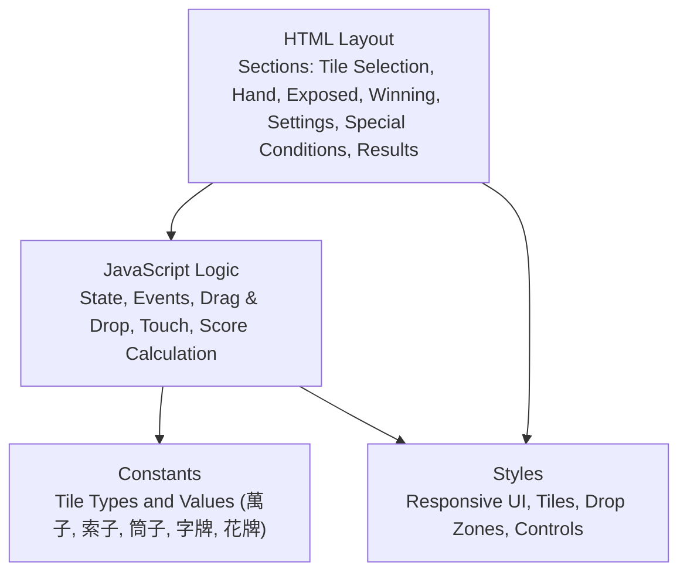
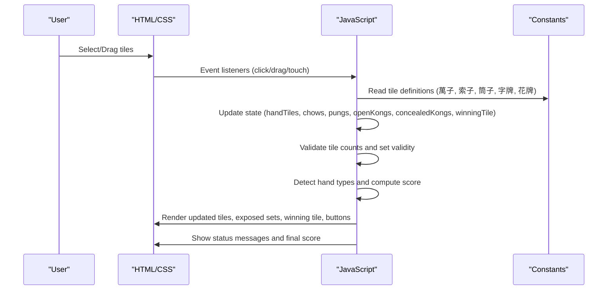
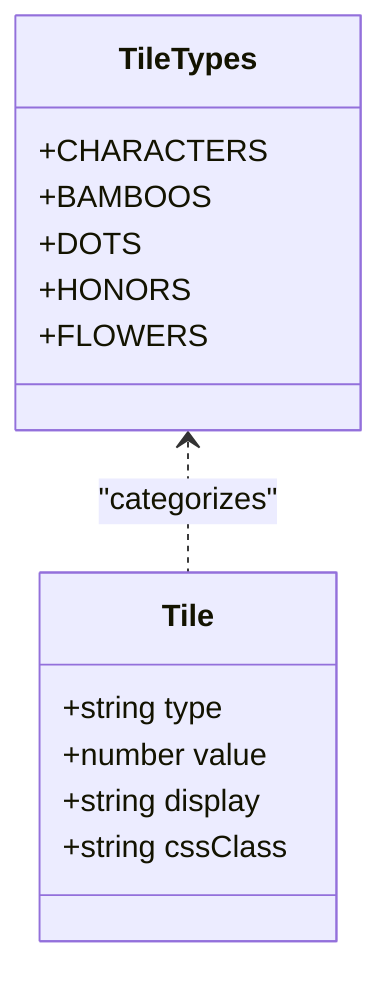
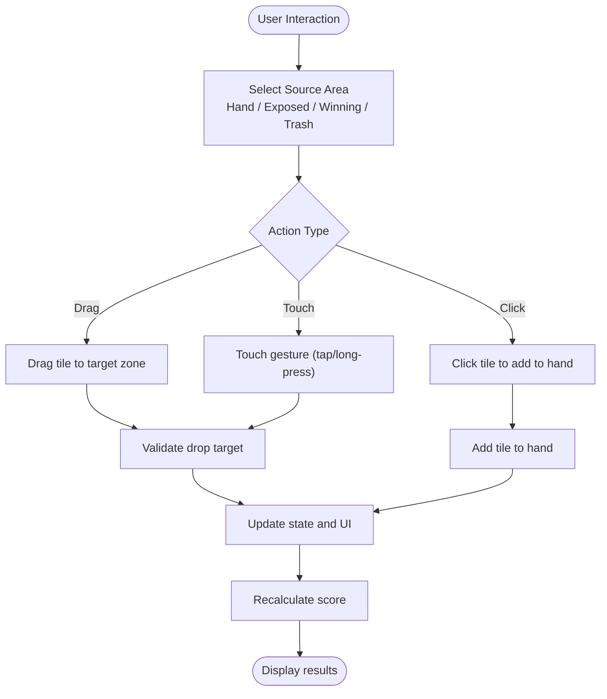
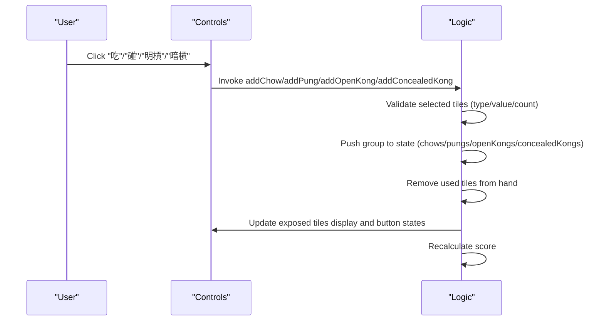
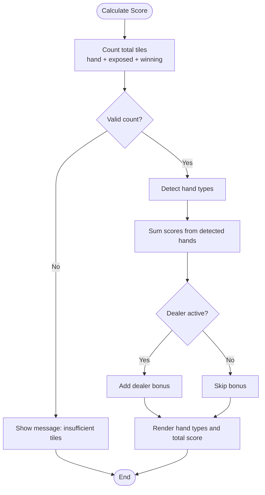
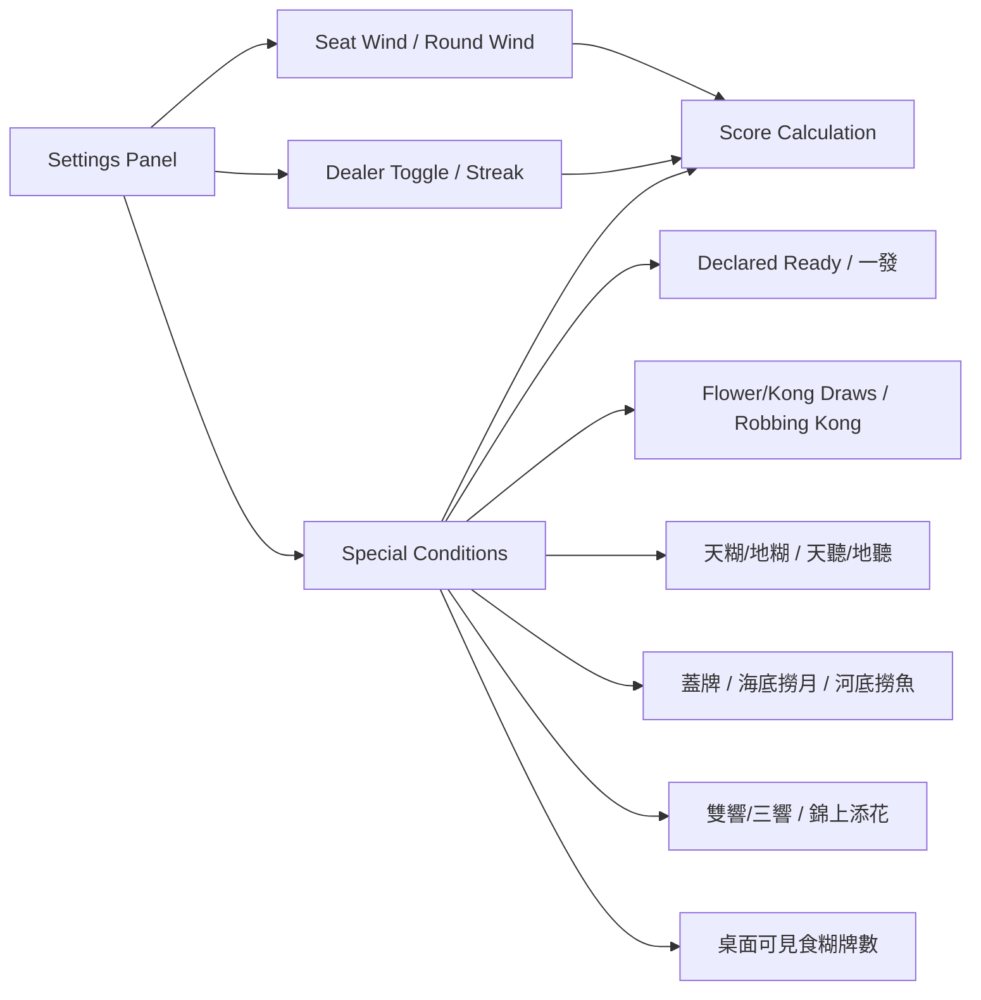
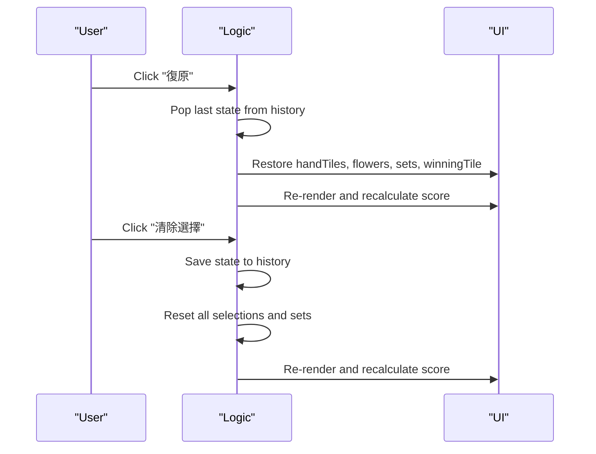
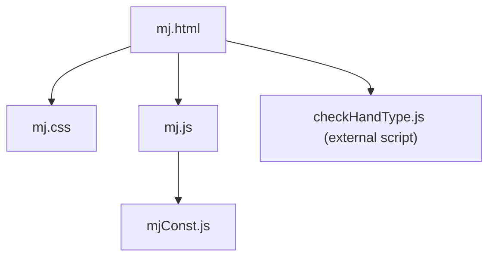

# Project Overview

<cite>
**Referenced Files in This Document**
- [mj.html](file://mj.html)
- [mj.js](file://mj.js)
- [mjConst.js](file://mjConst.js)
- [mj.css](file://mj.css)
</cite>

## Table of Contents
1. [Introduction](#introduction)
2. [Project Structure](#project-structure)
3. [Core Components](#core-components)
4. [Architecture Overview](#architecture-overview)
5. [Detailed Component Analysis](#detailed-component-analysis)
6. [Dependency Analysis](#dependency-analysis)
7. [Performance Considerations](#performance-considerations)
8. [Troubleshooting Guide](#troubleshooting-guide)
9. [Conclusion](#conclusion)

## Introduction
OV MJ Calculator is a Taiwanese Mahjong scoring calculator designed for players and enthusiasts who need quick, accurate hand evaluation during play or practice. It focuses on real-time score calculation as you build your hand, supports drag-and-drop tile selection, and works well on mobile devices with touch interactions. The tool uses the standard terminology found in the codebase: 萬子 (characters), 索子 (bamboos), 筒子 (dots), and 字牌 (honors).

Key features:
- Real-time score calculation that updates as you add tiles and declare sets
- Drag-and-drop interface to move tiles into your hand, exposed sets, winning tile, and trash area
- Mobile-friendly touch support for selecting and dragging tiles
- Configurable seat wind, round wind, dealer status, and special conditions such as self-draw, declared ready, 一發, flower/kong draws, 天地, multi-win, and more
- Undo and clear actions to manage your setup without starting over

Target audience:
- Mahjong players seeking an intuitive, fast way to calculate scores
- Learners who want to understand how different combinations and conditions affect scoring
- Players who prefer a visual, interactive approach rather than manual counting

How it differs from other tools:
- Built-in drag-and-drop and touch-first UX tailored for handheld use
- Explicit handling of Taiwanese-style conditions and terminology
- Immediate feedback via status messages and live score display
- Local, client-side implementation with no server dependencies

[No sources needed since this section provides general guidance]

## Project Structure
The project is a lightweight, single-page application composed of four core files:
- HTML layout defines sections for tile selection, hand/exposed/winning areas, settings, special conditions, and results
- JavaScript manages state, user interactions, drag-and-drop/touch logic, and score calculation
- Constants define all tile types and values using 萬子, 索子, 筒子, and 字牌
- CSS styles provide responsive design, tile visuals, and drop zone feedback

**Diagram sources**
- [mj.html:1-248](file://mj.html#L1-L248)
- [mj.js:1-1211](file://mj.js#L1-L1211)
- [mjConst.js:1-65](file://mjConst.js#L1-L65)
- [mj.css:1-493](file://mj.css#L1-L493)

**Section sources**
- [mj.html:1-248](file://mj.html#L1-L248)
- [mj.js:1-1211](file://mj.js#L1-L1211)
- [mjConst.js:1-65](file://mjConst.js#L1-L65)
- [mj.css:1-493](file://mj.css#L1-L493)

## Core Components
- Application State: Centralized object tracking hand tiles, flowers, exposed sets (吃/碰/明槓/暗槓), winning tile, winds, dealer info, special conditions, and history for undo
- Interaction Layer: Mouse drag-and-drop and touch gestures for adding/removing tiles and declaring sets; click-to-select for convenience
- Rendering Layer: Dynamic DOM updates for hand tiles, exposed groups, winning tile, flowers, and button states
- Scoring Engine: Validates total tile count, detects hand types, applies dealer bonuses, and aggregates points
- Configuration: Seat wind, round wind, dealer toggle and streak, self-draw flag, and numerous special condition toggles

Practical examples:
- Build a hand by dragging 萬子, 索子, 筒子, and 字牌 into the hand area; declare 吃 sequences or 碰/槓 sets; select one winning tile
- Toggle special conditions like 自摸, 宣告聽牌(叮), 一發, 花上自摸, 槓上自摸, 天糊/地糊, and multi-win to see immediate score changes
- Use undo to revert mistakes or clear to reset the entire board

**Section sources**
- [mj.js:1-1211](file://mj.js#L1-L1211)
- [mj.html:13-242](file://mj.html#L13-L242)

## Architecture Overview
The app follows a simple MVC-like pattern:
- Model: State object holds all game data and configuration
- View: HTML structure plus CSS styling renders tiles, controls, and results
- Controller: Event handlers update state and trigger re-renders and recalculations

**Diagram sources**
- [mj.html:13-242](file://mj.html#L13-L242)
- [mj.js:35-1211](file://mj.js#L35-L1211)
- [mjConst.js:1-65](file://mjConst.js#L1-L65)

## Detailed Component Analysis

### Tile Data and Types
- Tile categories are defined with constants for 萬子, 索子, 筒子, 字牌, and 花牌
- Each tile includes type, value, display text, and CSS class for rendering

**Diagram sources**
- [mjConst.js:1-65](file://mjConst.js#L1-L65)

**Section sources**
- [mjConst.js:1-65](file://mjConst.js#L1-L65)

### Interaction and Drag-and-Drop
- Supports mouse drag-and-drop and touch gestures for mobile
- Drop zones include hand tiles, winning tile area, and trash icon
- Click-to-select adds tiles to the hand; long press or short tap triggers appropriate actions on mobile

**Diagram sources**
- [mj.js:44-148](file://mj.js#L44-L148)
- [mj.js:150-522](file://mj.js#L150-L522)
- [mj.css:291-311](file://mj.css#L291-L311)

**Section sources**
- [mj.js:44-522](file://mj.js#L44-L522)
- [mj.css:291-311](file://mj.css#L291-L311)

### Hand Building and Set Declaration
- Users can declare 吃 (chow), 碰 (pung), 明槓 (open kong), and 暗槓 (concealed kong)
- Validation ensures correct composition: sequential same-type tiles for 吃, identical tiles for 碰/槓
- Button states enable/disable based on current selection

**Diagram sources**
- [mj.js:713-829](file://mj.js#L713-L829)
- [mj.js:1054-1080](file://mj.js#L1054-L1080)

**Section sources**
- [mj.js:713-829](file://mj.js#L713-L829)
- [mj.js:1054-1080](file://mj.js#L1054-L1080)

### Scoring Engine
- Validates total tile count against required number including exposed sets and winning tile
- Detects hand types and sums their scores
- Adds dealer bonus based on dealer status and streak
- Displays individual hand types and total score

**Diagram sources**
- [mj.js:1082-1129](file://mj.js#L1082-L1129)

**Section sources**
- [mj.js:1082-1129](file://mj.js#L1082-L1129)

### Settings and Special Conditions
- Seat wind and round wind influence scoring context
- Dealer toggle and streak multiplier adjust base points
- Self-draw and various special conditions (e.g., 一發, 花上自摸, 槓上自摸, 天糊/地糊, 多響, 明絕) modify scoring outcomes
- All changes trigger immediate recalculation

**Diagram sources**
- [mj.html:60-235](file://mj.html#L60-L235)
- [mj.js:580-703](file://mj.js#L580-L703)

**Section sources**
- [mj.html:60-235](file://mj.html#L60-L235)
- [mj.js:580-703](file://mj.js#L580-L703)

### Undo and Clear
- History stack stores previous states to allow undoing actions
- Clear resets all selections and sets while preserving history for potential recovery

**Diagram sources**
- [mj.js:864-907](file://mj.js#L864-L907)

**Section sources**
- [mj.js:864-907](file://mj.js#L864-L907)

## Dependency Analysis
- mj.html depends on mj.css for styling and mj.js for behavior
- mj.js depends on mjConst.js for tile definitions and references checkHandType.js for hand detection (loaded in HTML)
- mj.css provides responsive layout and interaction feedback

**Diagram sources**
- [mj.html:1-248](file://mj.html#L1-L248)
- [mj.js:1-1211](file://mj.js#L1-L1211)
- [mjConst.js:1-65](file://mjConst.js#L1-L65)

**Section sources**
- [mj.html:1-248](file://mj.html#L1-L248)
- [mj.js:1-1211](file://mj.js#L1-L1211)
- [mjConst.js:1-65](file://mjConst.js#L1-L65)

## Performance Considerations
- Lightweight vanilla JavaScript and CSS ensure fast load times and smooth interactions
- Minimal DOM updates occur only when state changes, keeping UI responsive
- Touch event handling prevents default scrolling during drag to improve mobile UX
- History stack capped at a reasonable size to avoid memory growth

[No sources needed since this section provides general guidance]

## Troubleshooting Guide
Common issues and resolutions:
- Insufficient tiles: The app shows a status message indicating the required tile count; add or remove tiles until valid
- Invalid set declaration: Ensure selected tiles meet requirements for 吃 (sequential same-type) or 碰/槓 (identical tiles)
- Mobile drag not working: Long press to start dragging; ensure touch-action manipulation is enabled in styles
- Undo not restoring expected state: Verify history entries exist before undoing; clear operations save state first

**Section sources**
- [mj.js:444-447](file://mj.js#L444-L447)
- [mj.js:713-829](file://mj.js#L713-L829)
- [mj.js:864-907](file://mj.js#L864-L907)
- [mj.css:379-404](file://mj.css#L379-L404)

## Conclusion
OV MJ Calculator offers a focused, efficient solution for Taiwanese Mahjong scoring with an intuitive drag-and-drop interface and robust mobile support. By combining real-time validation, comprehensive special conditions, and clear visual feedback, it helps players quickly determine scores and understand how different combinations and contexts affect outcomes. Its simple architecture and reliance on vanilla web technologies make it accessible, portable, and easy to extend.

[No sources needed since this section summarizes without analyzing specific files]