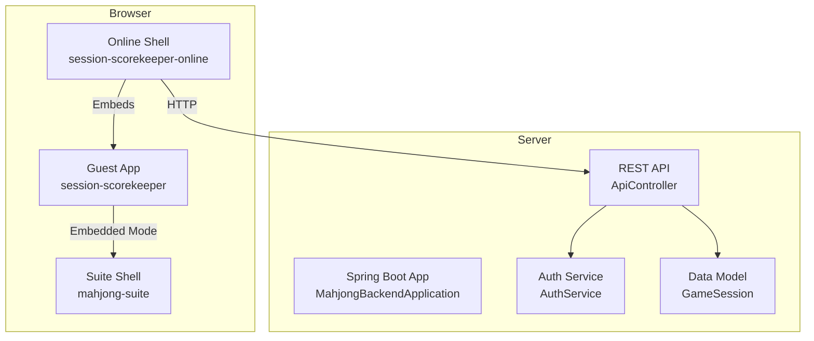
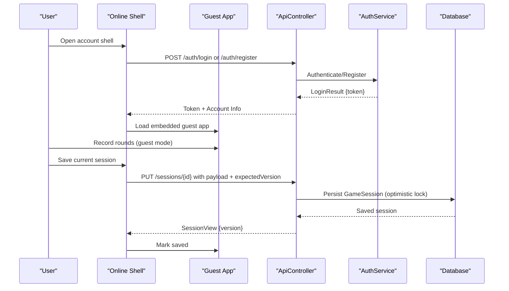
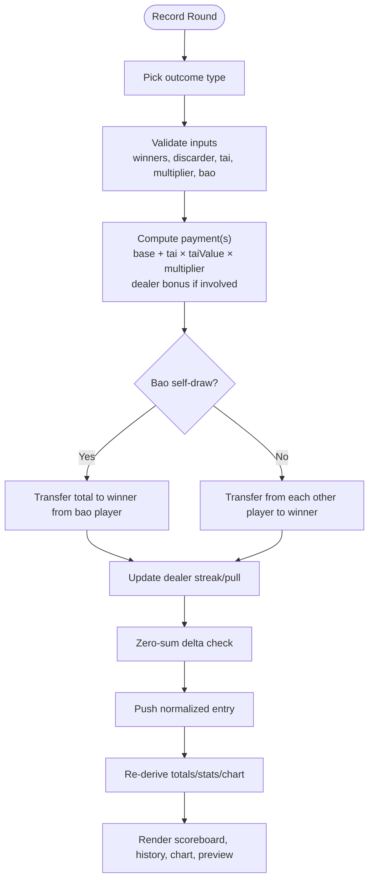
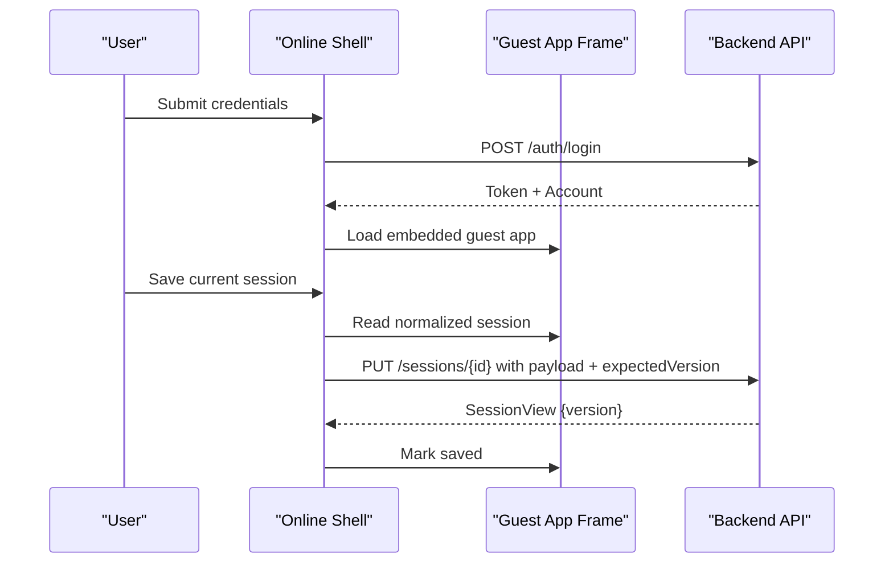
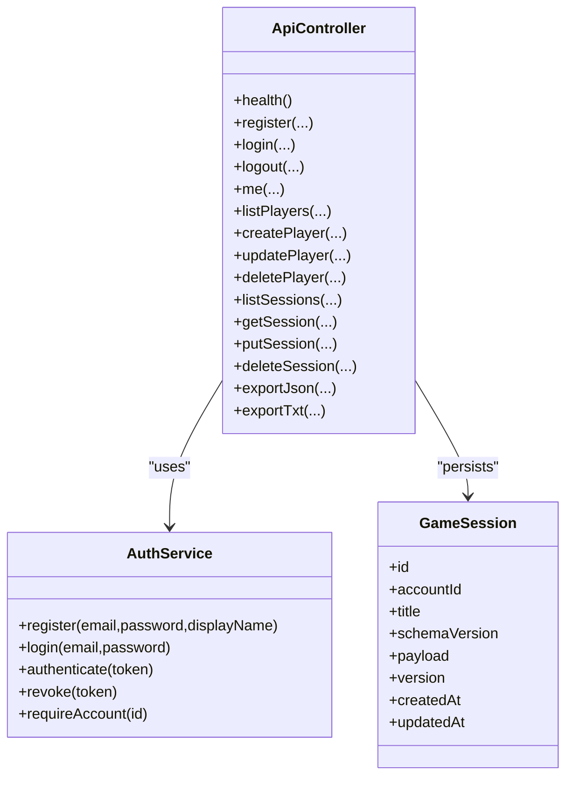
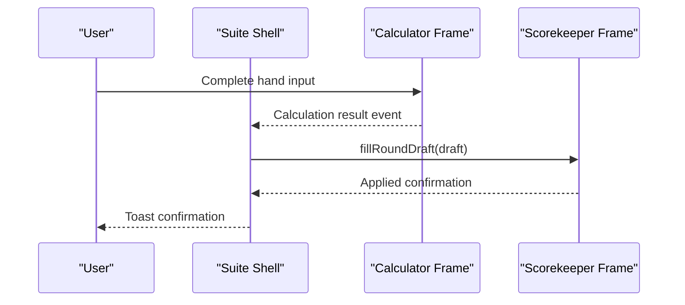
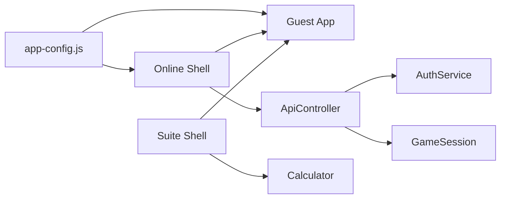

# Session Scorekeeper Application

<cite>
**Referenced Files in This Document**
- [index.html](file://session-scorekeeper/index.html)
- [app.js](file://session-scorekeeper/app.js)
- [styles.css](file://session-scorekeeper/styles.css)
- [index.html](file://session-scorekeeper-online/index.html)
- [app.js](file://session-scorekeeper-online/app.js)
- [MahjongBackendApplication.java](file://backend/src/main/java/com/onevictoria/mahjong/MahjongBackendApplication.java)
- [ApiController.java](file://backend/src/main/java/com/onevictoria/mahjong/web/ApiController.java)
- [AuthService.java](file://backend/src/main/java/com/onevictoria/mahjong/service/AuthService.java)
- [GameSession.java](file://backend/src/main/java/com/onevictoria/mahjong/model/GameSession.java)
- [app-config.js](file://app-config.js)
- [index.html](file://mahjong-suite/index.html)
- [app.js](file://mahjong-suite/app.js)
</cite>

## Table of Contents
1. [Introduction](#introduction)
2. [Project Structure](#project-structure)
3. [Core Components](#core-components)
4. [Architecture Overview](#architecture-overview)
5. [Detailed Component Analysis](#detailed-component-analysis)
6. [Dependency Analysis](#dependency-analysis)
7. [Performance Considerations](#performance-considerations)
8. [Troubleshooting Guide](#troubleshooting-guide)
9. [Conclusion](#conclusion)
10. [Appendices](#appendices)

## Introduction
This project provides a Taiwan-style Mahjong session scorekeeping application with two modes:
- Guest mode: runs entirely in the browser, stores data temporarily in memory, and supports export/import.
- Account mode: embeds the guest app inside an authenticated shell that persists sessions to a Java backend database.

The system includes:
- A responsive single-page UI for quick scoring, advanced round entry, history, charts, and settings.
- An online shell for authentication, workspace management, and saving/loading sessions to a Java API.
- A Spring Boot backend exposing REST endpoints for accounts, players, and sessions with strict payload validation and optimistic locking.

## Project Structure
At a high level:
- Frontend guest app: session-scorekeeper (HTML/CSS/JS).
- Frontend account shell: session-scorekeeper-online (HTML/JS).
- Suite shell: mahjong-suite (HTML/JS) integrates calculator and scorekeeper via iframes.
- Backend: Spring Boot application with controllers, services, models, and repositories.
- Shared configuration: app-config.js defines public runtime settings like API base URL.

**Diagram sources**
- [index.html](file://session-scorekeeper/index.html)
- [index.html](file://session-scorekeeper-online/index.html)
- [index.html](file://mahjong-suite/index.html)
- [MahjongBackendApplication.java](file://backend/src/main/java/com/onevictoria/mahjong/MahjongBackendApplication.java)
- [ApiController.java](file://backend/src/main/java/com/onevictoria/mahjong/web/ApiController.java)
- [AuthService.java](file://backend/src/main/java/com/onevictoria/mahjong/service/AuthService.java)
- [GameSession.java](file://backend/src/main/java/com/onevictoria/mahjong/model/GameSession.java)

**Section sources**
- [index.html](file://session-scorekeeper/index.html)
- [index.html](file://session-scorekeeper-online/index.html)
- [index.html](file://mahjong-suite/index.html)
- [MahjongBackendApplication.java](file://backend/src/main/java/com/onevictoria/mahjong/MahjongBackendApplication.java)

## Core Components
- Guest session engine: manages session state, entries, derived totals, dealer streak/pull logic, quick ledger, undo/redo, charting, and exports.
- Online shell: handles authentication, workspace lifecycle, session save/load/delete, player profiles, and iframe communication.
- Backend API: exposes secure endpoints for auth, players, and sessions; validates payloads strictly and enforces schema versioning and optimistic concurrency.

Key responsibilities:
- Scoring rules: base amount, tai value, multiplier, dealer bonus, streak/pull increments, draw handling, bao self-draw, zero-sum enforcement.
- Data integrity: normalization, validation, limits on entries and payload size, unique IDs, consistent schema version.
- UX: quick buttons, advanced form, preview, history filtering, undo/redo, settlement plan, CSV/TXT/JSON export.

**Section sources**
- [app.js](file://session-scorekeeper/app.js)
- [app.js](file://session-scorekeeper-online/app.js)
- [ApiController.java](file://backend/src/main/java/com/onevictoria/mahjong/web/ApiController.java)
- [AuthService.java](file://backend/src/main/java/com/onevictoria/mahjong/service/AuthService.java)
- [GameSession.java](file://backend/src/main/java/com/onevictoria/mahjong/model/GameSession.java)

## Architecture Overview
The architecture separates concerns into three layers:
- Presentation layer: responsive HTML/CSS with semantic structure and accessibility attributes.
- Application logic layer: JavaScript modules implementing game rules, state management, and UI updates.
- Persistence layer: Spring Boot REST API with JSON payload validation and database persistence.

**Diagram sources**
- [index.html](file://session-scorekeeper-online/index.html)
- [app.js](file://session-scorekeeper-online/app.js)
- [ApiController.java](file://backend/src/main/java/com/onevictoria/mahjong/web/ApiController.java)
- [AuthService.java](file://backend/src/main/java/com/onevictoria/mahjong/service/AuthService.java)
- [GameSession.java](file://backend/src/main/java/com/onevictoria/mahjong/model/GameSession.java)

## Detailed Component Analysis

### Guest App: Session Engine and UI
- Session model:
  - Players with seat positions and colors.
  - Physical seats mapping for quick ledger layout.
  - Configurable base amount, tai value, currency, dealer base/streak/pull tai, draw behavior.
  - Entries: discard, selfDraw, multiWin, draw, adjustment, breakPull.
- Derived state:
  - Totals per player, stats (wins, selfDraws, discards, paid/received), dealer state (playerId, streak, pull), hand count, chart points.
- Quick ledger:
  - Per-opponent weighted fan accumulation with segment grouping and rounding rules.
  - Instant settlement across all opponents when using quick fan actions.
- Advanced entry:
  - Outcome picker, winner/discarder selection, tai input, multiplier, bao player, dealer action override, notes.
  - Live preview with zero-sum check and transfer breakdown.
- History and chart:
  - Filterable history view with deltas and explanations.
  - SVG line chart of cumulative scores per player.
- Undo/redo:
  - Global undo stack and quick-action undo stack with snapshotting.
- Export:
  - JSON import/export, TXT export with summary and settlement plan, CSV export from chart view.

**Diagram sources**
- [app.js](file://session-scorekeeper/app.js)

**Section sources**
- [index.html](file://session-scorekeeper/index.html)
- [app.js](file://session-scorekeeper/app.js)
- [styles.css](file://session-scorekeeper/styles.css)

### Online Shell: Authentication and Workspace Management
- Authentication:
  - Validates API URL (HTTPS required except loopback HTTP).
  - Logs in or registers, stores token in sessionStorage, refreshes workspace.
- Workspace lifecycle:
  - Loads embedded guest app, polls status, marks dirty/saved states.
  - Creates new independent sessions, loads existing sessions, deletes sessions.
  - Saves current session with optimistic versioning; handles conflicts.
- Player profiles:
  - Lists, creates, updates, deletes shared player profiles.
  - Applies profile names/colors to current session’s stable player slots.
- Communication:
  - Uses iframe contentWindow API to interact with guest app host interface.
  - Enforces epoch-based cancellation to avoid race conditions during transitions.

**Diagram sources**
- [index.html](file://session-scorekeeper-online/index.html)
- [app.js](file://session-scorekeeper-online/app.js)
- [ApiController.java](file://backend/src/main/java/com/onevictoria/mahjong/web/ApiController.java)

**Section sources**
- [index.html](file://session-scorekeeper-online/index.html)
- [app.js](file://session-scorekeeper-online/app.js)

### Backend: REST API and Validation
- Endpoints:
  - Health check, auth register/login/logout, me, players CRUD, sessions CRUD, session export JSON/TXT.
- Payload validation:
  - Schema version enforcement, exactly four players, physical seats constraints, initial dealer validity, config ranges, entry types and fields, zero-sum not enforced server-side but structural integrity is validated.
- Concurrency control:
  - Optimistic locking via @Version field; conflict responses guide clients to reload latest version.
- Security:
  - Authenticated endpoints require Authorization header; tokens hashed and time-limited.

**Diagram sources**
- [ApiController.java](file://backend/src/main/java/com/onevictoria/mahjong/web/ApiController.java)
- [AuthService.java](file://backend/src/main/java/com/onevictoria/mahjong/service/AuthService.java)
- [GameSession.java](file://backend/src/main/java/com/onevictoria/mahjong/model/GameSession.java)

**Section sources**
- [ApiController.java](file://backend/src/main/java/com/onevictoria/mahjong/web/ApiController.java)
- [AuthService.java](file://backend/src/main/java/com/onevictoria/mahjong/service/AuthService.java)
- [GameSession.java](file://backend/src/main/java/com/onevictoria/mahjong/model/GameSession.java)

### Suite Shell: Calculator Integration
- Embeds both the scorekeeper and hand calculator in iframes.
- Bridges calculation results into the scorekeeper draft form.
- Supports account mode and guest mode switching.

**Diagram sources**
- [index.html](file://mahjong-suite/index.html)
- [app.js](file://mahjong-suite/app.js)

**Section sources**
- [index.html](file://mahjong-suite/index.html)
- [app.js](file://mahjong-suite/app.js)

## Dependency Analysis
- Frontend dependencies:
  - Guest app depends on app-config.js for public settings.
  - Online shell depends on app-config.js and communicates with backend via fetch with timeout and error handling.
  - Suite shell depends on both guest and calculator frames via postMessage-like events exposed by their APIs.
- Backend dependencies:
  - Controller depends on service and repository abstractions for auth and session management.
  - Models define persistence schema and versioning.

**Diagram sources**
- [app-config.js](file://app-config.js)
- [index.html](file://session-scorekeeper/index.html)
- [index.html](file://session-scorekeeper-online/index.html)
- [index.html](file://mahjong-suite/index.html)
- [ApiController.java](file://backend/src/main/java/com/onevictoria/mahjong/web/ApiController.java)
- [AuthService.java](file://backend/src/main/java/com/onevictoria/mahjong/service/AuthService.java)
- [GameSession.java](file://backend/src/main/java/com/onevictoria/mahjong/model/GameSession.java)

**Section sources**
- [app-config.js](file://app-config.js)
- [ApiController.java](file://backend/src/main/java/com/onevictoria/mahjong/web/ApiController.java)

## Performance Considerations
- Client-side rendering:
  - Re-derivation of totals and chart points occurs on every mutation; consider batching updates for large histories.
  - Quick ledger uses weighted segments to approximate compounding effects without full re-calculation per item.
- Network:
  - Online shell enforces request timeouts and abort signals to prevent hanging requests.
  - Polling interval for workspace status balances responsiveness with overhead.
- Storage:
  - Guest mode keeps data in memory; limit entries to MAX_ENTRIES to avoid excessive memory usage.
  - Backend enforces max payload size to protect server resources.

[No sources needed since this section provides general guidance]

## Troubleshooting Guide
Common issues and resolutions:
- Guest app initialization failure:
  - Error handler displays message in quick ledger grid if startup fails.
- Online shell connection errors:
  - Invalid API URL format or non-HTTPS for non-loopback triggers validation errors.
  - Timeout errors indicate backend unavailability; check service status.
- Authentication expiration:
  - 401 responses clear authentication and unload workspace safely; re-login required.
- Session save conflicts:
  - Version mismatch returns conflict; reload latest session before saving again.
- Import validation failures:
  - Schema version mismatch or invalid entries cause normalization errors; ensure correct format and limits.

**Section sources**
- [index.html](file://session-scorekeeper/index.html)
- [app.js](file://session-scorekeeper-online/app.js)
- [ApiController.java](file://backend/src/main/java/com/onevictoria/mahjong/web/ApiController.java)

## Conclusion
The Session Scorekeeper Application delivers a robust, accessible, and extensible platform for Taiwan-style Mahjong scoring. It supports both offline guest usage and cloud-backed account workflows with strong data validation and concurrency control. The modular design allows easy integration with additional tools like the hand calculator and future enhancements to scoring rules or analytics.

[No sources needed since this section summarizes without analyzing specific files]

## Appendices

### Configuration Reference
- Public configuration:
  - apiBaseUrl: default local development API endpoint.
  - guestEntryUrl: path to guest app entry.
  - accountEntryUrl: path to account shell entry.
  - requestTimeoutMs: network request timeout for online shell.

**Section sources**
- [app-config.js](file://app-config.js)