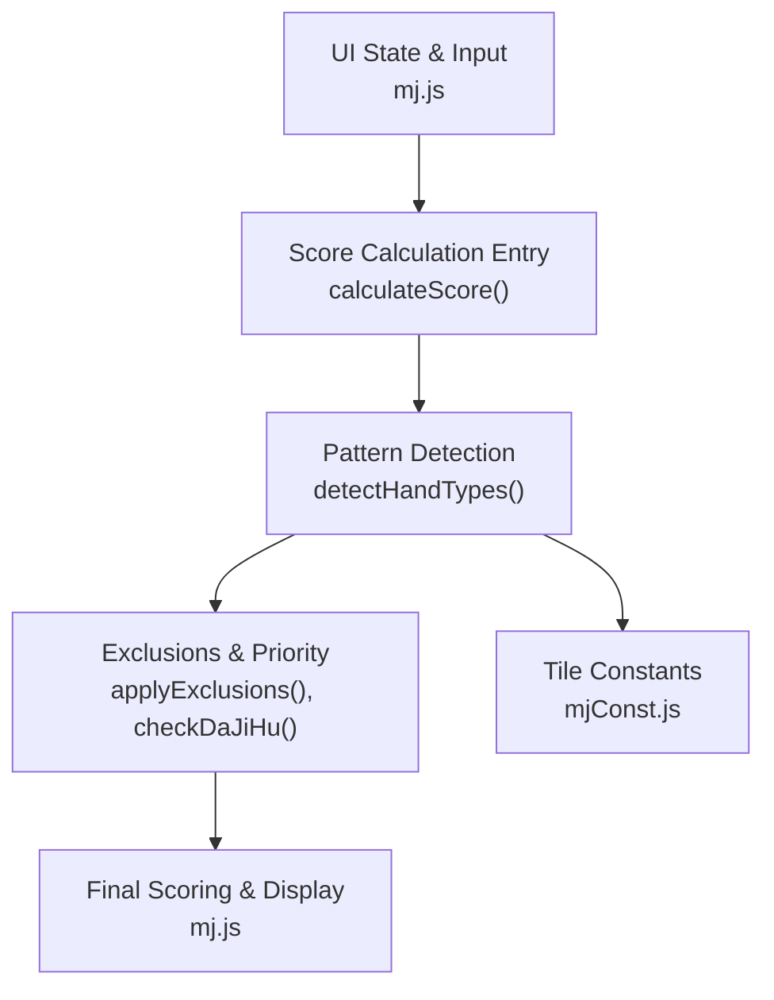
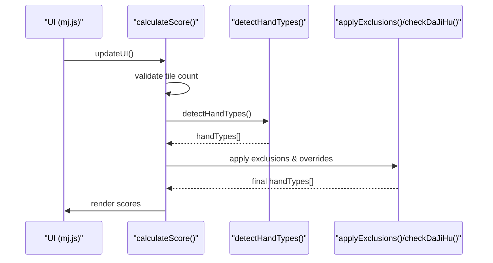
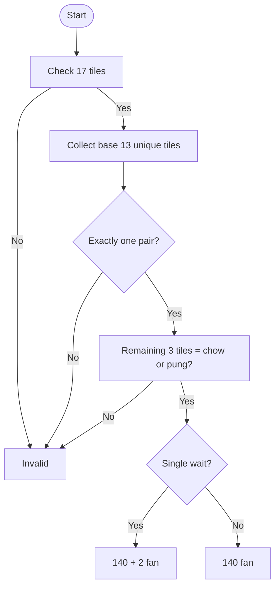
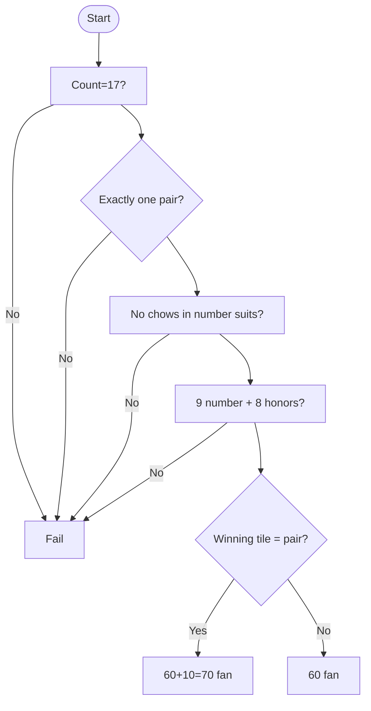
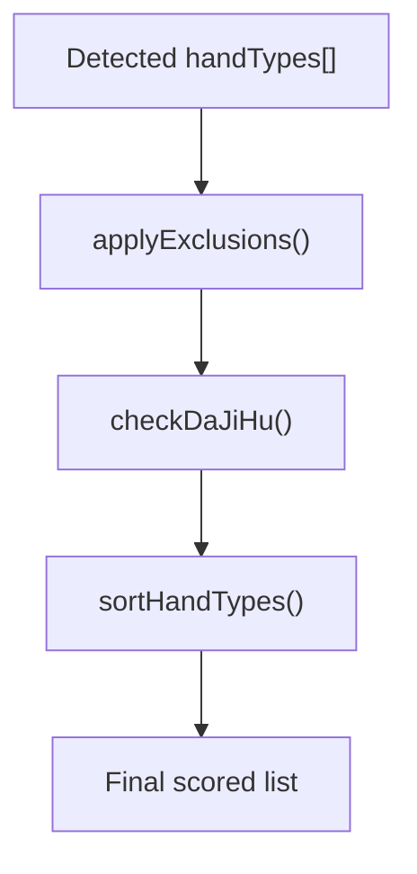
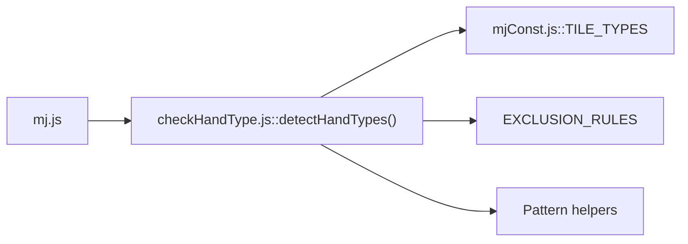

# Advanced Hand Patterns

<cite>
**Referenced Files in This Document**
- [mj.js](file://mj.js)
- [checkHandType.js](file://checkHandType.js)
- [mjConst.js](file://mjConst.js)
</cite>

## Table of Contents
1. [Introduction](#introduction)
2. [Project Structure](#project-structure)
3. [Core Components](#core-components)
4. [Architecture Overview](#architecture-overview)
5. [Detailed Component Analysis](#detailed-component-analysis)
6. [Dependency Analysis](#dependency-analysis)
7. [Performance Considerations](#performance-considerations)
8. [Troubleshooting Guide](#troubleshooting-guide)
9. [Conclusion](#conclusion)

## Introduction
This document explains how the Taiwanese Mahjong calculator detects and scores advanced and rare hand patterns, including thirteen orphans (十三么), sixteen non-consecutive (十六不搭), all honors (字一色), four winds (大四喜/小四喜), three dragons (大三元/小三元), and specialized patterns such as seven pairs plus pung (嚦咕嚦咕), all exposed (全求人), and semi-exposed (半求人). It covers detection algorithms, scoring rules, exclusion logic, edge cases, validation constraints, and priority handling when multiple patterns can apply simultaneously.

## Project Structure
The application is a browser-based Mahjong score calculator with:
- UI state management and tile interactions in mj.js
- Pattern detection and scoring in checkHandType.js
- Tile definitions and constants in mjConst.js

**Diagram sources**
- [mj.js:1082-1129](file://mj.js#L1082-L1129)
- [checkHandType.js:105-587](file://checkHandType.js#L105-L587)
- [mjConst.js:1-65](file://mjConst.js#L1-L65)

**Section sources**
- [mj.js:1-1211](file://mj.js#L1-L1211)
- [checkHandType.js:1-4286](file://checkHandType.js#L1-L4286)
- [mjConst.js:1-65](file://mjConst.js#L1-L65)

## Core Components
- State and UI orchestration: manages tiles, exposed groups, winning tile, and special conditions; triggers scoring on changes.
- Pattern detection engine: enumerates advanced patterns, applies exclusions, and returns scored hand types.
- Tile model: defines suits, values, and display names for characters, bamboos, dots, honors, and flowers.

Key responsibilities:
- Validate total tile counts and required structure before scoring.
- Detect high-value patterns first (e.g., thirteen orphans, sixteen non-consecutive).
- Apply exclusion rules to avoid double-counting overlapping patterns.
- Compute final fan totals and render results.

**Section sources**
- [mj.js:1082-1129](file://mj.js#L1082-L1129)
- [checkHandType.js:105-587](file://checkHandType.js#L105-L587)
- [mjConst.js:1-65](file://mjConst.js#L1-L65)

## Architecture Overview
The scoring pipeline is event-driven: user input updates state, which calls calculateScore(). That function validates tile count, invokes detectHandTypes() to collect candidate patterns, then applies exclusions and special overrides (e.g., Da Ji Hu), finally summing scores.

**Diagram sources**
- [mj.js:1082-1129](file://mj.js#L1082-L1129)
- [checkHandType.js:105-587](file://checkHandType.js#L105-L587)

## Detailed Component Analysis

### Thirteen Orphans (十三么)
- Detection: Requires 17 tiles including one each of 1/9 in three number suits and all seven honors, plus exactly one pair (eye). The remaining three tiles must form either a chow or a pung among themselves.
- Scoring: Base 140 fan; if it qualifies as “du du” (single wait), an additional 2 fan is added. If the pre-win hand has more than 10 waits, a variant “thirteen orphans (X waits)” scores 150 fan.
- Edge cases:
  - Four-of-a-kind on any required tile is allowed only if it does not break the “one pair” requirement; the algorithm ensures exactly one pair among the base set.
  - Extra three tiles must be a valid meld (chow or pung); otherwise invalid.
- Example arrangement: One each of 1w, 9w, 1p, 9p, 1s, 9s, East, South, West, North, Red, Green, White, plus a pair of any of those, plus a chow/pung formed by extra tiles.

**Diagram sources**
- [checkHandType.js:589-668](file://checkHandType.js#L589-L668)
- [checkHandType.js:3259-3376](file://checkHandType.js#L3259-L3376)
- [checkHandType.js:3487-3502](file://checkHandType.js#L3487-L3502)

**Section sources**
- [checkHandType.js:105-125](file://checkHandType.js#L105-L125)
- [checkHandType.js:589-668](file://checkHandType.js#L589-L668)
- [checkHandType.js:3259-3376](file://checkHandType.js#L3259-L3376)
- [checkHandType.js:3487-3502](file://checkHandType.js#L3487-L3502)

### Sixteen Non-Consecutive (十六不搭)
- Detection: 17 tiles with exactly one pair (no pungs/kongs), no chows within number suits, exactly 9 number tiles and 8 honor tiles.
- Variants:
  - “Sixteen fei” (十六飛): winning tile completes the pair.
  - “Three相逢” (三相逢): number tiles across three suits share the same three values; dark/bright variants depend on winning tile.
  - “Mixed dragon” (雜龍): each value 1–9 appears once across the three suits.
- Scoring: 60 fan base; 70 fan if “sixteen fei”. Additional bonuses for three相逢/mixed dragon.
- Edge cases:
  - Must strictly have no sequences in any suit among number tiles.
  - Honors must be exactly eight; number tiles exactly nine.

**Diagram sources**
- [checkHandType.js:3424-3485](file://checkHandType.js#L3424-L3485)

**Section sources**
- [checkHandType.js:127-157](file://checkHandType.js#L127-L157)
- [checkHandType.js:3424-3485](file://checkHandType.js#L3424-L3485)
- [checkHandType.js:3504-3723](file://checkHandType.js#L3504-L3723)
- [checkHandType.js:3725-3786](file://checkHandType.js#L3725-L3786)
- [checkHandType.js:3788-3847](file://checkHandType.js#L3788-L3847)

### All Honors (字一色)
- Detection: Every tile in the hand is an honor (East, South, West, North, Red, Green, White).
- Scoring: 150 fan.
- Exclusions: Overrides certain lower-scoring patterns like mixed/honors-only partial sets per exclusion rules.

**Section sources**
- [checkHandType.js:187-190](file://checkHandType.js#L187-L190)
- [checkHandType.js:2584-2587](file://checkHandType.js#L2584-L2587)
- [checkHandType.js:1-40](file://checkHandType.js#L1-L40)

### Four Winds (大四喜/小四喜)
- Big Four Winds (大四喜): All four winds are present as pungs/kongs (≥3 each).
- Small Four Winds (小四喜): Three winds as pungs/kongs and one wind as the pair.
- Scoring: Big 120 fan; Small 80 fan.
- Exclusions: These override generic “wind” pattern scoring.

**Section sources**
- [checkHandType.js:192-203](file://checkHandType.js#L192-L203)
- [checkHandType.js:2526-2582](file://checkHandType.js#L2526-L2582)
- [checkHandType.js:1-40](file://checkHandType.js#L1-L40)

### Three Dragons (大三元/小三元)
- Big Three Dragons (大三元): Red, Green, White each appear as pungs/kongs (≥3).
- Small Three Dragons (小三元): Two dragons as pungs/kongs and one dragon as the pair.
- Scoring: Big 60 fan; Small 30 fan.
- Exclusions: Override generic “dragon” pattern scoring.

**Section sources**
- [checkHandType.js:205-211](file://checkHandType.js#L205-L211)
- [checkHandType.js:2413-2464](file://checkHandType.js#L2413-L2464)
- [checkHandType.js:1-40](file://checkHandType.js#L1-L40)

### Seven Pairs Plus Pung (嚦咕嚦咕)
- Detection: Hand forms a seven-pairs-like structure combined with at least one pung; implemented via a dedicated checker that evaluates pair/single distributions and potential waits.
- Scoring: Base 50 fan; if six/eight waits are possible, variant scores 60 fan.
- Notes: The implementation counts potential waits based on pairs and singletons to determine the variant.

**Section sources**
- [checkHandType.js:470-478](file://checkHandType.js#L470-L478)
- [checkHandType.js:4249-4286](file://checkHandType.js#L4249-L4286)

### All Exposed (全求人) and Semi-Exposed (半求人)
- All Exposed (全求人): At least four exposed groups (chows/pungs/open kongs), zero concealed kongs, and two or fewer tiles left in hand; win by discard.
- Semi-Exposed (半求人): Same structural requirements but win by self-draw.
- Scoring: All exposed 30 fan; semi-exposed 15 fan.
- Exclusions: These exclude “du du” (獨獨) per exclusion rules.

**Section sources**
- [checkHandType.js:332-342](file://checkHandType.js#L332-L342)
- [checkHandType.js:1-40](file://checkHandType.js#L1-L40)

### Priority and Exclusion System
- Exclusion table: When a higher-priority pattern is detected, related lower-priority patterns are removed from the result set. Examples include:
  - 十三么 excludes 門清/宣告聽牌/自摸
  - 十六不搭 excludes 門清/宣告聽牌/自摸
  - 字一色 excludes 混么碰/混全帶么九
  - 大四喜/小四喜 exclude 風牌
  - 大三元/小三元 exclude 元牌
  - 全求人/半求人 exclude 獨獨
- Special override: checkDaJiHu() can replace the hand type set with “Da Ji Hu” or “Ya Hu” under specific low-fan conditions.

**Diagram sources**
- [checkHandType.js:1-40](file://checkHandType.js#L1-L40)
- [checkHandType.js:72-102](file://checkHandType.js#L72-L102)
- [checkHandType.js:584-587](file://checkHandType.js#L584-L587)

**Section sources**
- [checkHandType.js:1-40](file://checkHandType.js#L1-L40)
- [checkHandType.js:72-102](file://checkHandType.js#L72-L102)
- [checkHandType.js:584-587](file://checkHandType.js#L584-L587)

## Dependency Analysis
- mj.js orchestrates UI and calls detectHandTypes() through calculateScore().
- checkHandType.js depends on mjConst.js for tile type definitions.
- Internal dependencies:
  - detectHandTypes() calls numerous helper functions for each pattern.
  - applyExclusions() uses EXCLUSION_RULES to prune overlapping patterns.
  - checkDaJiHu() may replace the final set based on context.

**Diagram sources**
- [mj.js:1082-1129](file://mj.js#L1082-L1129)
- [checkHandType.js:105-587](file://checkHandType.js#L105-L587)
- [mjConst.js:1-65](file://mjConst.js#L1-L65)

**Section sources**
- [mj.js:1082-1129](file://mj.js#L1082-L1129)
- [checkHandType.js:105-587](file://checkHandType.js#L105-L587)
- [mjConst.js:1-65](file://mjConst.js#L1-L65)

## Performance Considerations
- Early exits: Many checks short-circuit on tile counts or simple predicates (e.g., length checks, presence of honors).
- Counting strategies: Frequent use of maps/counts reduces repeated scans.
- Avoid redundant work: Some checks guard against already-detected higher-priority patterns (e.g., skipping certain detections if 十六不搭 or 十三么 matched).
- Complexity: Most detectors operate over small fixed-size inputs (≤17 tiles), so performance is dominated by constant-time operations and small loops.

[No sources needed since this section provides general guidance]

## Troubleshooting Guide
Common issues and where to inspect:
- Incorrect total tile count: Ensure 17 tiles (including winning tile) after accounting for exposed groups; see validation in calculateScore().
- Misclassified patterns: Verify exclusion rules and order of detection; some patterns suppress others.
- Unexpected “du du” vs “all exposed”: Confirm exposed group counts and concealed kong status.
- Wait counting anomalies: For 十三么 and 嚦咕嚦咕, ensure pre-win analysis considers only relevant tiles and removes duplicates.

Relevant code paths:
- Tile count validation and entry point: [mj.js:1082-1129](file://mj.js#L1082-L1129)
- Exclusion rules and overrides: [checkHandType.js:1-40](file://checkHandType.js#L1-L40), [checkHandType.js:72-102](file://checkHandType.js#L72-L102)
- Pattern-specific validations: e.g., 十三么 [checkHandType.js:3259-3376](file://checkHandType.js#L3259-L3376), 十六不搭 [checkHandType.js:3424-3485](file://checkHandType.js#L3424-L3485), 全求人/半求人 [checkHandType.js:332-342](file://checkHandType.js#L332-L342)

**Section sources**
- [mj.js:1082-1129](file://mj.js#L1082-L1129)
- [checkHandType.js:1-40](file://checkHandType.js#L1-L40)
- [checkHandType.js:72-102](file://checkHandType.js#L72-L102)
- [checkHandType.js:3259-3376](file://checkHandType.js#L3259-L3376)
- [checkHandType.js:3424-3485](file://checkHandType.js#L3424-L3485)
- [checkHandType.js:332-342](file://checkHandType.js#L332-L342)

## Conclusion
The calculator implements robust detection for advanced Taiwanese Mahjong patterns with clear scoring and a comprehensive exclusion system to prevent double-counting. High-value patterns like thirteen orphans, sixteen non-consecutive, all honors, four winds, and three dragons are prioritized and validated with strict structural rules. Specialized patterns such as seven pairs plus pung, all exposed, and semi-exposed integrate seamlessly into the pipeline. Understanding the detection flow, exclusion rules, and edge-case handling enables accurate scoring and reliable behavior even when multiple patterns could apply simultaneously.