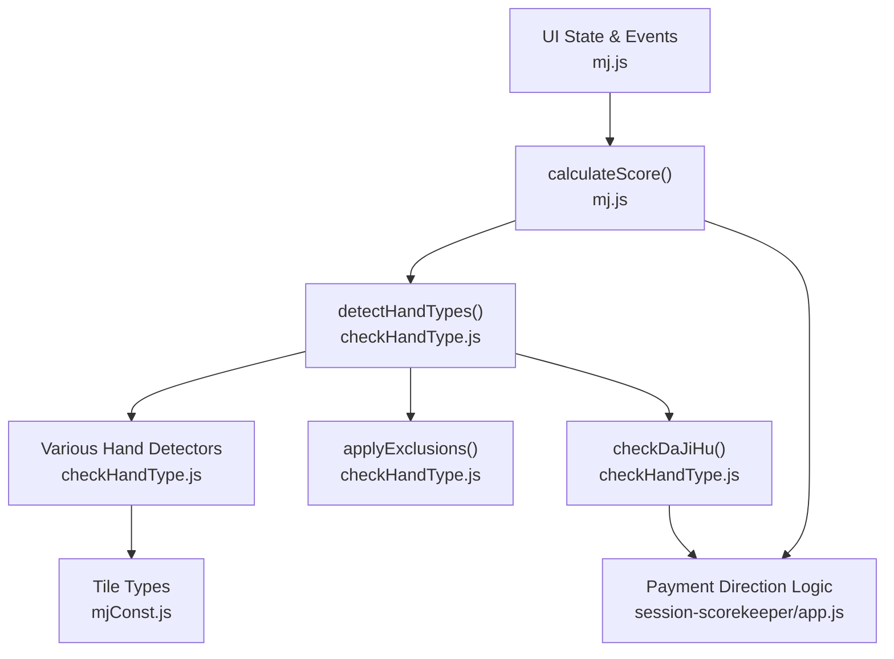
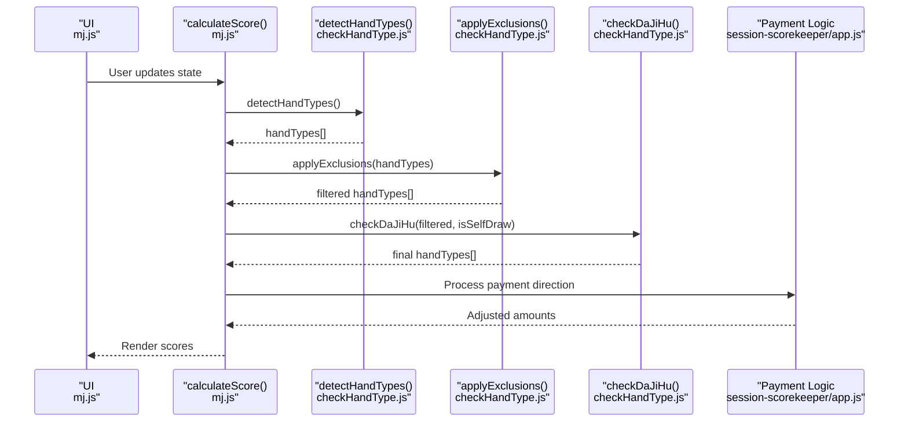
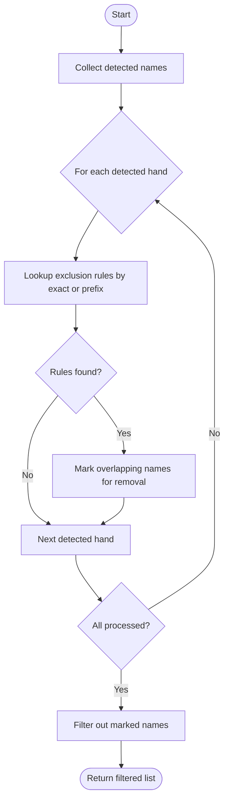
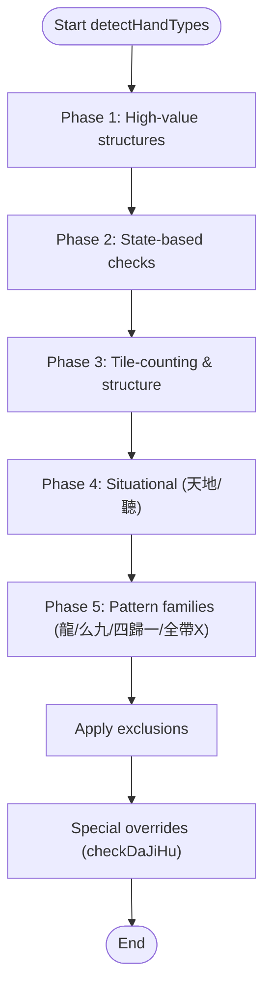
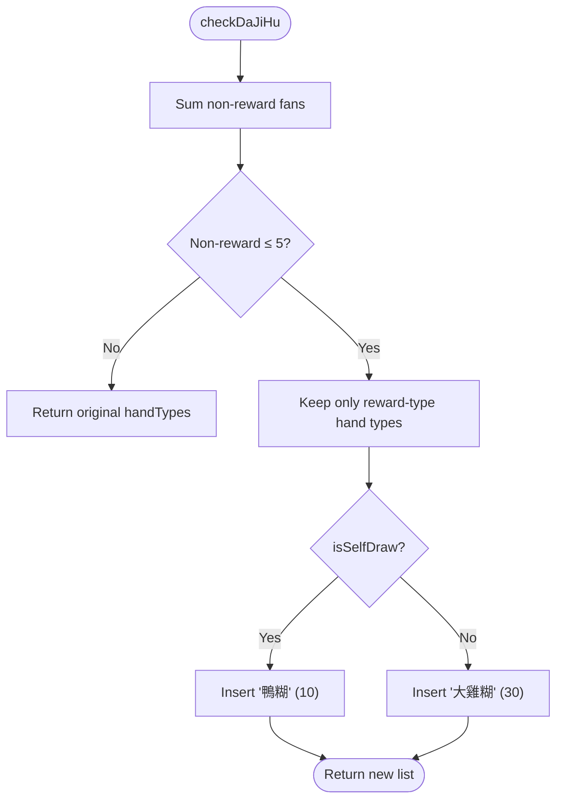
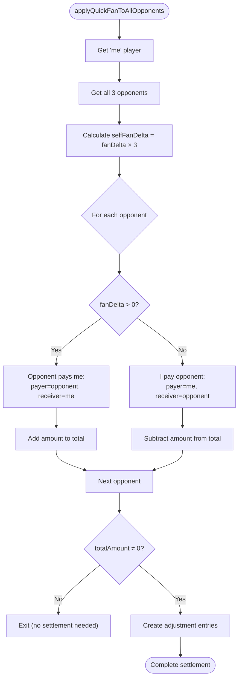
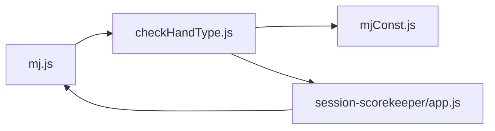

# Scoring Algorithm and Exclusion Rules

<cite>
**Referenced Files in This Document**
- [mj.js](file://mj.js)
- [checkHandType.js](file://checkHandType.js)
- [mjConst.js](file://mjConst.js)
- [session-scorekeeper/app.js](file://session-scorekeeper/app.js)
</cite>

## Update Summary
**Changes Made**
- Updated payment direction logic section to reflect enhanced quick ledger fan adjustment improvements
- Added new section covering opponent-self payment direction corrections
- Enhanced examples to demonstrate proper handling of positive and negative fan adjustments
- Updated troubleshooting guide with new payment direction scenarios

## Table of Contents
1. [Introduction](#introduction)
2. [Project Structure](#project-structure)
3. [Core Components](#core-components)
4. [Architecture Overview](#architecture-overview)
5. [Detailed Component Analysis](#detailed-component-analysis)
6. [Payment Direction and Fan Adjustment System](#payment-direction-and-fan-adjustment-system)
7. [Dependency Analysis](#dependency-analysis)
8. [Performance Considerations](#performance-considerations)
9. [Troubleshooting Guide](#troubleshooting-guide)
10. [Conclusion](#conclusion)

## Introduction
This document explains the core scoring algorithm and exclusion rule system that determines final hand evaluation. It details how the EXCLUSION_RULES table prevents double-counting of overlapping hand types, describes the application order of hand detection, the priority system for conflicting patterns, and the checkDaJiHu function for handling special high-scoring scenarios. It also explains how the algorithm processes different groups of hand types (state-based, tile-counting, situational) and applies exclusions systematically, with examples of complex hands where exclusions significantly impact the final score. **Updated** to include enhanced payment direction logic and improved quick ledger fan adjustment calculations that properly handle positive and negative fan adjustments across all opponents.

## Project Structure
The scoring logic is implemented across a small set of files:
- mj.js: UI state management, event wiring, and orchestration of scoring via calculateScore() which calls detectHandTypes().
- checkHandType.js: Core detection engine, including EXCLUSION_RULES, applyExclusions(), checkDaJiHu(), and detectHandTypes() that runs all checks in a defined order.
- mjConst.js: Tile type definitions used by detection functions.
- session-scorekeeper/app.js: Enhanced payment direction logic and quick ledger fan adjustment calculations for opponent-self interactions.

**Diagram sources**
- [mj.js:1082-1129](file://mj.js#L1082-L1129)
- [checkHandType.js:104-587](file://checkHandType.js#L104-L587)
- [mjConst.js:1-65](file://mjConst.js#L1-L65)
- [session-scorekeeper/app.js:709-756](file://session-scorekeeper/app.js#L709-L756)

**Section sources**
- [mj.js:1082-1129](file://mj.js#L1082-L1129)
- [checkHandType.js:104-587](file://checkHandType.js#L104-L587)
- [mjConst.js:1-65](file://mjConst.js#L1-L65)

## Core Components
- EXCLUSION_RULES: A mapping from detected hand names to arrays of base names or prefixes that must be excluded when the key is present. Matching uses exact name or prefix matching to handle variants like "純全帶X(5)".
- applyExclusions(handTypes): Filters out lower-priority or overlapping hand types based on EXCLUSION_RULES.
- detectHandTypes(): Orchestrates detection in a fixed order, grouping checks into logical phases (state-based, tile-counting, situational), then applies exclusions and special rules.
- checkDaJiHu(handTypes, isSelfDraw): Applies special high-scoring overrides ("大雞糊"/"鴨糊") when non-reward fan count is low.
- **Enhanced Payment Direction Logic**: Improved fan adjustment calculations that properly handle positive and negative values across all opponents with correct payment direction determination.

**Section sources**
- [checkHandType.js:1-70](file://checkHandType.js#L1-L70)
- [checkHandType.js:72-102](file://checkHandType.js#L72-L102)
- [checkHandType.js:104-587](file://checkHandType.js#L104-L587)
- [session-scorekeeper/app.js:709-756](file://session-scorekeeper/app.js#L709-L756)

## Architecture Overview
The scoring pipeline follows a deterministic sequence:
1. Validate total tile count and required structure.
2. Run specialized high-value checks first (e.g., 十三么, 十六不搭).
3. Add state-based bonuses (自摸, 門清自摸, 宣告聽牌, etc.).
4. Add tile-counting and structural patterns (對對糊, 平糊, 暗刻 counts, etc.).
5. Add situational and environmental conditions (天糊, 地糊, 天聽, 地聽).
6. Apply exclusions to remove overlapping or lower-priority matches.
7. Apply special high-scoring override via checkDaJiHu if applicable.
8. Process payment direction and fan adjustments for opponent-self interactions.
9. Sort and render results.

**Diagram sources**
- [mj.js:1082-1129](file://mj.js#L1082-L1129)
- [checkHandType.js:104-587](file://checkHandType.js#L104-L587)
- [session-scorekeeper/app.js:709-756](file://session-scorekeeper/app.js#L709-L756)

## Detailed Component Analysis

### EXCLUSION_RULES and applyExclusions
- Purpose: Prevent double-counting when multiple overlapping patterns match the same tiles.
- Mechanism: For each detected hand type, look up its exclusion list; any detected hand whose name equals or starts with an entry in that list is removed from the final set. Prefix matching supports parameterized names like "純全帶X(...)".
- Effect: Ensures higher-priority or more specific patterns take precedence over generic ones.

**Diagram sources**
- [checkHandType.js:1-70](file://checkHandType.js#L1-L70)

**Section sources**
- [checkHandType.js:1-70](file://checkHandType.js#L1-L70)

### Application Order of Hand Detection
Detection is grouped into phases to ensure consistent priority:
- Phase 1: High-value structural patterns (e.g., 十三么, 十六不搭).
- Phase 2: State-based simple checks (自摸, 門清自摸, 宣告聽牌, 一發, etc.).
- Phase 3: Tile-counting and structural patterns (對對糊, 平糊, 暗刻 counts, 明槓/暗槓, etc.).
- Phase 4: Situational/environmental (天糊, 地糊, 天聽, 地聽).
- Phase 5: Additional pattern families (龍, 么九, 四歸一, 全帶X, etc.).
- Phase 6: Apply exclusions, then special overrides.

**Diagram sources**
- [checkHandType.js:104-587](file://checkHandType.js#L104-L587)

**Section sources**
- [checkHandType.js:104-587](file://checkHandType.js#L104-L587)

### Priority System for Conflicting Patterns
- The detection order implicitly defines priority: earlier detections are considered "higher priority."
- EXCLUSION_RULES explicitly resolves conflicts by removing overlapping or less-specific matches after detection.
- Examples:
  - If "字一色" is detected, it excludes "混么碰" and "混全帶么九".
  - If "清么碰" is detected, it excludes "無字", "無字花", "混全帶么九", "純全帶么九", "混么碰", and "斷么".
  - If "大四喜"/"小四喜"/"大三風"/"小三風" are detected, they exclude "風牌" entries.
  - If "大三元"/"小三元" are detected, they exclude "元牌".

**Section sources**
- [checkHandType.js:1-70](file://checkHandType.js#L1-L70)
- [checkHandType.js:187-211](file://checkHandType.js#L187-L211)
- [checkHandType.js:504-534](file://checkHandType.js#L504-L534)

### checkDaJiHu Function: Handling Special High-Scoring Scenarios
- Purpose: When the non-reward fan total is low (≤5), replace the current set with a special high-scoring hand:
  - Self-draw: insert "鴨糊" (10 fans).
  - Non-self-draw: insert "大雞糊" (30 fans).
- Behavior: Keeps only reward-type hand types (e.g., 天聽, 地聽, 宣告聽牌, 一發, 蓋牌, etc.) alongside the inserted special hand.

**Diagram sources**
- [checkHandType.js:72-102](file://checkHandType.js#L72-L102)

**Section sources**
- [checkHandType.js:72-102](file://checkHandType.js#L72-L102)

### Processing Different Groups of Hand Types
- State-based checks: e.g., 自摸, 門清自摸, 宣告聽牌, 門清大叮, 一發, 海底撈月, 河底撈魚, 花上自摸, 槓上自摸, 搶杠食糊, 槓上槓食糊, 搶槓上槓糊, 蓋牌.
- Tile-counting checks: e.g., 全求人/半求人, 四子/七子/十子, 對對糊, 平糊, 暗刻 counts, 明槓/暗槓 counts, 兄弟/雜兄弟, 嚦咕嚦咕, 獨獨/假獨/對碰, 將眼, 風牌/元牌, 花牌.
- Situational checks: e.g., 天糊, 地糊, 天聽, 地聽.
- Additional families: 龍 (明清龍/暗清龍/明雜龍/暗雜龍), 么九 (樓梯, 老少上/碰, 斷么, 清么碰/混么碰/純全帶么九/混全帶么九), 四歸一 (四歸一/二/四), 全帶X (純全帶X/混全帶X), 七門齊/五門齊, 大於五/小於五/缺五.

These are added in detectHandTypes() in a fixed order, ensuring predictable priorities before exclusions are applied.

**Section sources**
- [checkHandType.js:256-587](file://checkHandType.js#L256-L587)

### Examples of Complex Hands and Exclusion Impact
- Example 1: 字一色 vs. 混么碰/混全帶么九
  - If "字一色" is detected, exclusion rules remove "混么碰" and "混全帶么九", preventing overlap and preserving the higher-scoring single suit honor hand.
- Example 2: 清么碰 vs. 無字/無字花/純全帶么九/混全帶么九/斷么
  - When "清么碰" is detected, exclusion removes several related patterns, ensuring the rare pure terminal-only hand takes precedence.
- Example 3: 大四喜/小四喜/大三風/小三風 vs. 風牌
  - Wind-related high-scoring patterns exclude generic "風牌" entries, avoiding double-counting wind honors.
- Example 4: 大三元/小三元 vs. 元牌
  - Dragon-related high-scoring patterns exclude generic "元牌" entries.
- Example 5: 門清大叮/門清自摸 vs. 門清/自摸/宣告聽牌
  - Combined forms exclude their component parts to avoid stacking base bonuses with combined bonuses.
- Example 6: 大於五/小於五/缺五 vs. 無字/無字花
  - These number-range patterns exclude "無字/無字花" to prevent counting both range and no-honor/no-flower simultaneously.

These examples illustrate how exclusions enforce a clean, non-overlapping scoring model.

**Section sources**
- [checkHandType.js:1-70](file://checkHandType.js#L1-L70)
- [checkHandType.js:187-211](file://checkHandType.js#L187-L211)
- [checkHandType.js:256-587](file://checkHandType.js#L256-L587)

## Payment Direction and Fan Adjustment System

### Enhanced Quick Ledger Fan Adjustment Logic
**Updated** The payment direction system has been significantly improved to handle positive and negative fan adjustments correctly across all opponents. The enhanced logic ensures accurate calculation of fan adjustments when players win or lose against multiple opponents.

Key improvements include:
- **Correct Positive/Negative Handling**: Fan deltas are now properly calculated with correct signs (+ for wins, - for losses) across all three opponents
- **Accurate Amount Calculation**: Payment amounts are computed using absolute values of fan deltas multiplied by tai value
- **Proper Direction Determination**: Payment direction is determined based on whether the player won or lost against each opponent

**Diagram sources**
- [session-scorekeeper/app.js:709-756](file://session-scorekeeper/app.js#L709-L756)

### Payment Direction Logic Corrections
**Updated** The payment direction logic has been fixed to ensure correct handling of fan adjustments between opponents and self. The system now properly determines who pays whom based on the sign of the fan delta.

**Key Logic Improvements:**
- **Positive Fan Delta**: When fanDelta > 0, opponents pay the player (opponent is payer, player is receiver)
- **Negative Fan Delta**: When fanDelta < 0, player pays opponents (player is payer, opponent is receiver)
- **Amount Calculation**: Uses Math.abs(fanDelta) × taiValue to ensure positive payment amounts
- **Direction Tracking**: Maintains separate tracking of affected opponents with their payment roles

### Examples of Enhanced Payment Direction
- **Example 1**: Player wins 5 fans against all opponents
  - fanDelta = +5 for each opponent
  - Each opponent pays player: 5 × taiValue
  - Total received: 15 × taiValue
  
- **Example 2**: Player loses 3 fans against all opponents  
  - fanDelta = -3 for each opponent
  - Player pays each opponent: 3 × taiValue
  - Total paid: 9 × taiValue

- **Example 3**: Mixed results scenario
  - Wins 4 fans against one opponent, loses 2 against others
  - Correctly calculates net position and individual payments

**Section sources**
- [session-scorekeeper/app.js:709-756](file://session-scorekeeper/app.js#L709-L756)

## Dependency Analysis
- mj.js depends on detectHandTypes() to compute scores and renders results.
- checkHandType.js depends on tile definitions from mjConst.js and internal helpers to detect patterns.
- session-scorekeeper/app.js provides enhanced payment direction logic that integrates with the main scoring system.
- The detection flow is cohesive within checkHandType.js, with clear separation between detection, exclusion, and special overrides.

**Diagram sources**
- [mj.js:1082-1129](file://mj.js#L1082-L1129)
- [checkHandType.js:104-587](file://checkHandType.js#L104-L587)
- [mjConst.js:1-65](file://mjConst.js#L1-L65)
- [session-scorekeeper/app.js:709-756](file://session-scorekeeper/app.js#L709-L756)

**Section sources**
- [mj.js:1082-1129](file://mj.js#L1082-L1129)
- [checkHandType.js:104-587](file://checkHandType.js#L104-L587)
- [mjConst.js:1-65](file://mjConst.js#L1-L65)

## Performance Considerations
- Early exits: High-value checks (十三么, 十六不搭) run first to short-circuit or prioritize rare hands.
- Grouped checks: State-based, tile-counting, and situational checks are batched to minimize repeated passes over tiles.
- Exclusion pass: Single pass over detected hand types to filter overlaps efficiently.
- Avoid redundant work: Many detectors reuse common helpers (e.g., getAllChows, getAllPungs, findEye) to reduce recomputation.
- **Enhanced Payment Processing**: Optimized fan adjustment calculations that process all opponents in a single loop with minimal overhead.

## Troubleshooting Guide
- Symptom: Unexpectedly low score
  - Check whether a higher-priority pattern was detected and caused exclusions of other patterns via EXCLUSION_RULES.
  - Verify detection order in detectHandTypes() to understand why certain patterns were not counted.
- Symptom: Duplicate or inflated score
  - Confirm that applyExclusions() ran after detection and that exclusion keys match detected names exactly or via prefix.
- Symptom: Special high-scoring hand not appearing
  - Ensure checkDaJiHu() conditions are met (non-reward fan ≤5) and that reward-type hand types exist to keep.
- **New Symptom**: Incorrect payment directions in quick ledger
  - Verify that fanDelta signs are correctly assigned (+ for wins, - for losses) across all opponents.
  - Check that payment amounts use absolute values and that payer/receiver roles are correctly determined.
- **New Symptom**: Fan adjustment calculations seem off
  - Review the enhanced quickLedgerTotals function to ensure proper handling of positive and negative adjustments.
  - Confirm that breakLast logic is correctly applied during direction reversals.

**Section sources**
- [checkHandType.js:1-70](file://checkHandType.js#L1-L70)
- [checkHandType.js:72-102](file://checkHandType.js#L72-L102)
- [checkHandType.js:104-587](file://checkHandType.js#L104-L587)
- [session-scorekeeper/app.js:709-756](file://session-scorekeeper/app.js#L709-L756)

## Conclusion
The scoring algorithm combines a structured detection pipeline with a robust exclusion system to produce accurate, non-overlapping hand evaluations. By applying state-based, tile-counting, and situational checks in a fixed order, then filtering via EXCLUSION_RULES and applying special overrides through checkDaJiHu(), the system ensures consistent and fair scoring across complex hands. **Updated** with enhanced payment direction logic that properly handles positive and negative fan adjustments across all opponents, ensuring accurate financial settlements between players. Understanding the detection order, exclusion relationships, and payment direction calculations is key to diagnosing scoring behavior and extending the system with new hand types and payment scenarios.