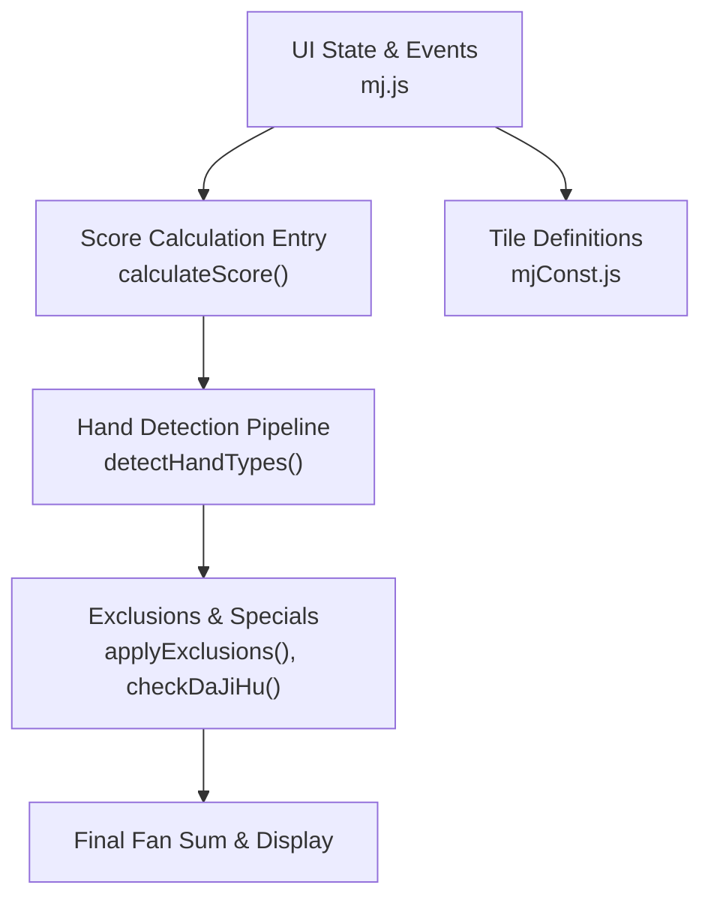
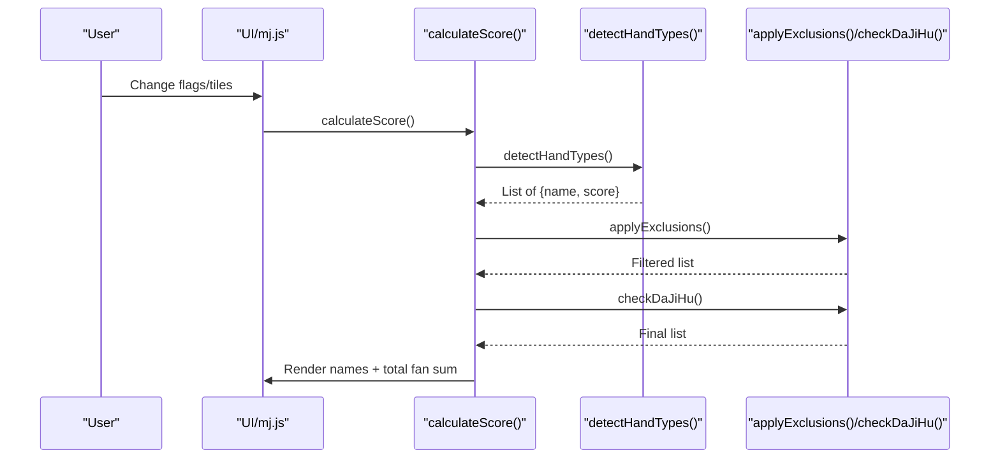
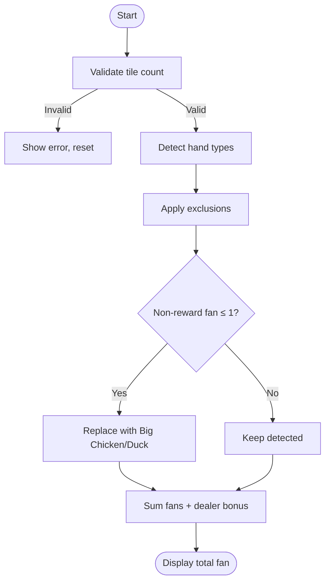
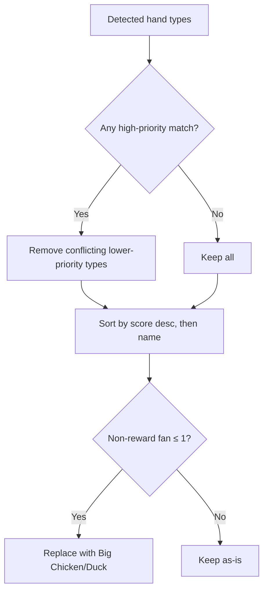
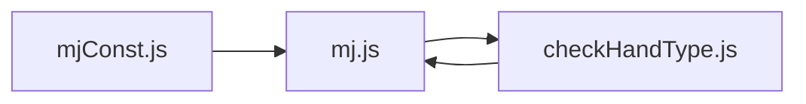

# Scoring System Reference

<cite>
**Referenced Files in This Document**
- [mj.js](file://mj.js)
- [checkHandType.js](file://checkHandType.js)
- [mjConst.js](file://mjConst.js)
</cite>

## Table of Contents
1. [Introduction](#introduction)
2. [Project Structure](#project-structure)
3. [Core Components](#core-components)
4. [Architecture Overview](#architecture-overview)
5. [Detailed Component Analysis](#detailed-component-analysis)
6. [Dependency Analysis](#dependency-analysis)
7. [Performance Considerations](#performance-considerations)
8. [Troubleshooting Guide](#troubleshooting-guide)
9. [Conclusion](#conclusion)
10. [Appendices](#appendices)

## Introduction
This document explains the Taiwanese Mahjong scoring system implemented by the calculator. It covers supported hand types, point values (fan), special conditions such as Tenhou and Chihou, bonus scenarios like Ippatsu and flower draws, exclusion rules, priority-based calculations, and how combinations affect final scores. It also includes examples of complex hands and reference tables for all possible scoring combinations recognized by the code.

## Project Structure
The application is a single-page web app with:
- UI state management and event handling in mj.js
- Scoring logic and hand detection in checkHandType.js
- Tile definitions and constants in mjConst.js

**Diagram sources**
- [mj.js:1082-1129](file://mj.js#L1082-L1129)
- [checkHandType.js:105-587](file://checkHandType.js#L105-L587)
- [mjConst.js:1-65](file://mjConst.js#L1-L65)

**Section sources**
- [mj.js:1-1211](file://mj.js#L1-L1211)
- [checkHandType.js:1-4286](file://checkHandType.js#L1-L4286)
- [mjConst.js:1-65](file://mjConst.js#L1-L65)

## Core Components
- Application state and UI interactions: tile input, exposed groups (chows/pungs/kongs), winning tile, and flags for special conditions (Tenhou, Chihou, Ippatsu, last-tile draw/discard, face-down, multi-win, visible win tiles).
- Score calculation entry: validates tile counts, invokes detection, aggregates fan points, adds dealer count bonus, and renders results.
- Hand detection pipeline: detects many Taiwanese patterns, applies exclusion rules, handles “big chicken”/“duck” overrides, and sorts results.

Key responsibilities:
- mj.js: orchestrates user input, maintains state, triggers calculateScore on changes.
- checkHandType.js: implements all pattern detectors, exclusion rules, and scoring aggregation.
- mjConst.js: defines tile categories and full tile sets used across the app.

**Section sources**
- [mj.js:1-1211](file://mj.js#L1-L1211)
- [checkHandType.js:1-587](file://checkHandType.js#L1-L587)
- [mjConst.js:1-65](file://mjConst.js#L1-L65)

## Architecture Overview
The scoring flow is triggered whenever the UI state changes. The pipeline validates the hand shape, detects eligible hand types, applies exclusions to avoid double-counting, optionally replaces low-scoring base hands with high-value “big chicken/duck” variants, and finally sums all remaining fans.

**Diagram sources**
- [mj.js:1082-1129](file://mj.js#L1082-L1129)
- [checkHandType.js:105-587](file://checkHandType.js#L105-L587)

## Detailed Component Analysis

### Scoring Algorithm Logic
- Validation: Ensures total tile count matches required 17 plus any kongs; otherwise shows an error and resets display.
- Detection: Runs a comprehensive set of checks for standard and advanced Taiwanese patterns.
- Exclusions: Removes lower-priority or conflicting patterns based on a prefix-matching rule table.
- Special override: If non-reward fan points are ≤1, replaces base hand with “Big Chicken” (discard win) or “Duck” (self-draw) while keeping reward-type bonuses.
- Aggregation: Sums all remaining fans and adds dealer count bonus if applicable.

**Diagram sources**
- [mj.js:1082-1129](file://mj.js#L1082-L1129)
- [checkHandType.js:42-102](file://checkHandType.js#L42-L102)
- [checkHandType.js:105-587](file://checkHandType.js#L105-L587)

**Section sources**
- [mj.js:1082-1129](file://mj.js#L1082-L1129)
- [checkHandType.js:42-102](file://checkHandType.js#L42-L102)
- [checkHandType.js:105-587](file://checkHandType.js#L105-L587)

### Supported Hand Types, Point Values, and Conditions
Below is a consolidated reference of all scoring combinations recognized by the code. Each entry lists the name as used in the UI, its fan value(s), and key conditions.

- Basic structure and state
  - Self-draw: 1 fan
  - Closed hand (no chows/pungs): 5 fans
  - Closed self-draw: 8 fans
  - Declared ready (叮): 5 fans
  - Closed declared ready: 15 fans
  - Ippatsu (一發): 5 fans
  - Last tile drawn (海底撈月): 20 fans
  - Last discard (河底撈魚): 10 fans
  - Flower draw self-draw (花上自摸): 1 fan
  - Kong draw self-draw (槓上自摸): 1 fan
  - Robbing kong (搶槓食糊): 5 fans
  - Double kong draw (槓上槓食糊): 30 fans
  - Robbing double kong (搶槓上槓糊): 30 fans
  - Face-down (蓋牌): 10 fans
  - Dealer count bonus: 2 × dealerCount + 1 fans

- High-value structural hands
  - Thirteen Orphans (十三么): 140 fans; variant with multiple waits up to 150 fans
  - Sixteen Unconnected (十六不搭): 60–70 fans depending on whether the winning tile completes the pair (“sixteen fly”)
  - Greater than Five (大於五): 50 fans
  - Less than Five (小於五): 50 fans
  - Missing Five (缺五): 10 fans
  - Seven Doors (七門齊): Small 20 fans, Big 25 fans
  - Five Doors (五門齊): Small 10 fans, Big 15 fans
  - All Honors (字一色): 150 fans
  - Four Winds (大四喜): 120 fans
  - Three Winds (大三風): 40 fans
  - Two Dragons (大三元): 60 fans
  - Mixed One Suit (混一色): 40 fans
  - Pure One Suit (清一色): 100 fans
  - Ping Hu (平糊): 5 fans (all chows, no pungs/kongs)
  - Dui Dui Hu (對對糊): 40 fans (all pungs/kongs)

- Wind and Dragon honors
  - Wind Pungs (風牌): Base 1 fan per pung; +1 if it matches round wind; +1 if it matches seat wind
  - Dragon Pungs (元牌): 2 fans each

- Flowers
  - Flower scoring: Positive flowers (matching seat wind) = 2 fans each; other flowers = 1 fan each
  - Eight flowers (兩台花): 80 fans (instant win condition)

- Multi-win and visibility
  - Visible win tile count 3 (明絕/絕絕): Single wait “絕絕” = 10 fans; otherwise “明絕” = 5 fans
  - Double win (雪上霜(雙響)): 5 fans
  - Triple win (雪上冰(三響)): 10 fans
  - Multi-win self-draw (錦上添花): Double 10 fans; Triple 20 fans

- Wait types and eyes
  - Single wait (獨獨): 2 fans
  - Fake single wait (假獨): 1 fan
  - Pair wait (對碰): 2 fans
  - Eye 2/5/8 (將眼): 2 fans

- Sequential and patterned hands
  - Stairs (樓梯): 30 fans
  - Old-Young Shun (老少上): 3 fans per occurrence
  - Old-Young Pung (老少碰): 5 fans per occurrence
  - Broken Yaojiu (斷么): 5 fans
  - Clear Yaojiu Pung (清么碰): 200 fans
  - Mixed Yaojiu Pung (混么碰): 60 fans
  - Pure All-Yaojiu (純全帶么九): 80 fans
  - Mixed All-Yaojiu (混全帶么九): 10–30 fans depending on number of distinct yaojiu numbers present

- Sister and brother patterns
  - Sisters (姊妹): From 二姊妹 (5) to 六小姊妹 (100) based on consecutive pung sequences and connected pairs
  - Brothers (兄弟): 兩兄弟 (5), 三小兄弟 (15), 三兄弟 (30); mixed variants 小雜兄弟 (8), 大雜兄弟 (15)

- Dragon and mixed dragon patterns
  - Qing Long (clear dragon): Ming 10 fans; An 20 fans per combination
  - Zha Long (mixed dragon): Ming 5 fans; An 10 fans per combination

- Full-hand constraints
  - Pure/Mixed All-X (純全帶X / 混全帶X): 10–80 fans depending on presence of specific numbers across all melds
  - No Honors (無字): 2 fans
  - No Flowers (無花): 2 fans
  - No Honors + No Flowers + Ping Hu (無字花大平糊): 15 fans

- Special situational hands
  - Tenhou (天糊): 100 fans (non-dealer)
  - Chihou (地糊): 90 fans (non-dealer)
  - Ten Ready (天聽): 40 fans
  - Chi Ready (地聽): 30 fans
  - Full求人 (全求人): 30 fans (all exposed, single wait, discard)
  - Half求人 (半求人): 15 fans (all exposed, single wait, self-draw)
  - Concealed counts: 四子 (30), 七子 (20), 十子 (10)
  - Liguligu (嚦咕嚦咕): 50 fans; 6/8-wait variant 60 fans
  - Eight pairs + one pung (七對+刻子): part of liguligu detection

Notes:
- Many patterns have both “ming” (exposed) and “an” (concealed) variants with different scores.
- Some patterns are mutually exclusive via exclusion rules; see next section.

**Section sources**
- [checkHandType.js:105-587](file://checkHandType.js#L105-L587)
- [checkHandType.js:766-1005](file://checkHandType.js#L766-L1005)
- [checkHandType.js:1028-1117](file://checkHandType.js#L1028-L1117)
- [checkHandType.js:1119-1241](file://checkHandType.js#L1119-L1241)
- [checkHandType.js:1257-1500](file://checkHandType.js#L1257-L1500)
- [checkHandType.js:1590-1877](file://checkHandType.js#L1590-L1877)
- [checkHandType.js:1879-2032](file://checkHandType.js#L1879-L2032)
- [checkHandType.js:2034-2055](file://checkHandType.js#L2034-L2055)
- [checkHandType.js:2057-2198](file://checkHandType.js#L2057-L2198)
- [checkHandType.js:2200-2341](file://checkHandType.js#L2200-L2341)
- [checkHandType.js:2413-2587](file://checkHandType.js#L2413-L2587)
- [checkHandType.js:2589-2742](file://checkHandType.js#L2589-L2742)
- [checkHandType.js:2744-2845](file://checkHandType.js#L2744-L2845)
- [checkHandType.js:2847-2947](file://checkHandType.js#L2847-L2947)
- [checkHandType.js:3048-3129](file://checkHandType.js#L3048-L3129)
- [checkHandType.js:3131-3257](file://checkHandType.js#L3131-L3257)
- [checkHandType.js:3259-3485](file://checkHandType.js#L3259-L3485)
- [checkHandType.js:3487-3847](file://checkHandType.js#L3487-L3847)
- [checkHandType.js:3849-3991](file://checkHandType.js#L3849-L3991)

### Exclusion Rules and Priority-Based Calculations
- Exclusion table: When a hand type is detected, certain other types are excluded using prefix matching. Examples include:
  - “門清大叮” excludes “門清”, “宣告聽牌”
  - “門清自摸” excludes “門清”, “自摸”
  - “無字花大平糊” excludes “無字”, “無字花”, “平糊”
  - “清么碰” excludes several overlapping patterns including “斷么”
  - “天糊”/“地糊” exclude “四子” and “天聽”
  - “十三么”/“十六不搭”/“嚦咕嚦咕” exclude “門清”, “門清自摸”, “自摸”
- Sorting: After exclusions, the list is sorted by descending score, then alphabetically by name.
- Big Chicken/Duck override: If the total non-reward fan points are ≤1, the base hand is replaced by “Big Chicken” (30 fans) for discard wins or “Duck” (10 fans) for self-draws, while preserving reward-type bonuses (e.g., Tenhou, Ippatsu).

**Diagram sources**
- [checkHandType.js:1-70](file://checkHandType.js#L1-L70)
- [checkHandType.js:72-102](file://checkHandType.js#L72-L102)
- [checkHandType.js:2949-2958](file://checkHandType.js#L2949-L2958)

**Section sources**
- [checkHandType.js:1-70](file://checkHandType.js#L1-L70)
- [checkHandType.js:72-102](file://checkHandType.js#L72-L102)
- [checkHandType.js:2949-2958](file://checkHandType.js#L2949-L2958)

### How Different Combinations Affect Final Scores
- Multiple identical patterns can be counted multiple times when allowed (e.g., “老少上xN”, “老少碰xN”, “三相逢xN”).
- Some patterns are mutually exclusive due to exclusion rules (e.g., “清么碰” vs “斷么”; “無字花大平糊” vs “平糊”).
- Hidden vs exposed matters: many patterns have higher scores when fully concealed (e.g., “暗清龍”, “暗雜龍”, “四般高 (暗)”).
- Flower draws and special draws add small bonuses but can combine with high-value hands.
- Dealer count increases total fans linearly.

**Section sources**
- [checkHandType.js:1257-1500](file://checkHandType.js#L1257-L1500)
- [checkHandType.js:1590-1877](file://checkHandType.js#L1590-L1877)
- [checkHandType.js:2034-2055](file://checkHandType.js#L2034-L2055)
- [mj.js:1118-1125](file://mj.js#L1118-L1125)

### Examples of Complex Hands
- Example 1: Fully concealed pure suit with clear dragons and multiple sisters
  - Expected detections: Pure One Suit (清一色), Clear Dragons (暗清龍), Sisters (e.g., 五姊妹/六小姊妹), possibly “All X” patterns if numbers align.
  - Exclusions may remove lower-level patterns like “平糊”.
  - Final score sums all remaining fans plus dealer bonus if applicable.

- Example 2: Thirteen Orphans with extra meld forming a sequence or pung
  - Detected as “十三么” (base 140) or “十三么（N 飛）” up to 150 fans if many waits exist.
  - Excludes “門清”, “門清自摸”, “自摸”.

- Example 3: Sixteen Unconnected with three-same-number across suits
  - Detected as “十六不搭” and potentially “十六不搭三相逢” depending on configuration.
  - Excludes “門清”, “門清自摸”, “自摸”.

- Example 4: Big Chicken scenario
  - If only reward-type bonuses exist (e.g., Tenhou + Ippatsu) and non-reward fan ≤1, the base hand is replaced by “大雞糊” (30 fans) for discard wins or “鴨糊” (10 fans) for self-draws, while keeping reward bonuses.

These examples illustrate how detection, exclusions, and overrides interact to produce the final fan total.

**Section sources**
- [checkHandType.js:105-587](file://checkHandType.js#L105-L587)
- [checkHandType.js:3259-3485](file://checkHandType.js#L3259-L3485)
- [checkHandType.js:3487-3847](file://checkHandType.js#L3487-L3847)
- [checkHandType.js:72-102](file://checkHandType.js#L72-L102)

## Dependency Analysis
- mj.js depends on checkHandType.js for scoring and on mjConst.js for tile data.
- checkHandType.js uses mjConst.js tile types to identify suits and honor categories.
- The UI triggers recalculation on any change to flags or tiles, ensuring real-time feedback.

**Diagram sources**
- [mjConst.js:1-65](file://mjConst.js#L1-L65)
- [mj.js:1082-1129](file://mj.js#L1082-L1129)
- [checkHandType.js:105-587](file://checkHandType.js#L105-L587)

**Section sources**
- [mj.js:1082-1129](file://mj.js#L1082-L1129)
- [checkHandType.js:105-587](file://checkHandType.js#L105-L587)
- [mjConst.js:1-65](file://mjConst.js#L1-L65)

## Performance Considerations
- The detection pipeline performs multiple passes over tiles and melds; complexity grows with the number of possible combinations (e.g., permutations for zha long, recursive meld formation).
- Exclusion rules reduce output size early, improving downstream performance.
- UI recalculates on every state change; heavy operations are localized to the detection function.

[No sources needed since this section provides general guidance]

## Troubleshooting Guide
- Invalid tile count: If the total tiles do not equal 17 plus the number of kongs, the UI displays an error and clears hand-type display. Ensure correct number of exposed groups and hand tiles.
- Unexpected exclusions: Review the exclusion table; some patterns intentionally suppress others (e.g., “清么碰” excludes “斷么”). Adjust your hand composition or exposed status accordingly.
- Big Chicken/Duck override: If you expected a base hand but got “大雞糊” or “鴨糊”, check that non-reward fan points were ≤1 and that the win was discard vs self-draw.
- Visibility and multi-win: Ensure “visible win tile count” and “multi-win” flags reflect actual game state to correctly award “明絕/絕絕” and “錦上添花”.

**Section sources**
- [mj.js:1082-1101](file://mj.js#L1082-L1101)
- [checkHandType.js:1-70](file://checkHandType.js#L1-L70)
- [checkHandType.js:72-102](file://checkHandType.js#L72-L102)

## Conclusion
The calculator implements a comprehensive Taiwanese Mahjong scoring system with extensive pattern detection, robust exclusion rules, and special overrides. It supports rare and complex hands, accurately applies priority-based calculations, and provides immediate feedback. Users should ensure correct state inputs (tiles, flags) to achieve accurate scoring.

[No sources needed since this section summarizes without analyzing specific files]

## Appendices

### Appendix A: Key Functions and Their Roles
- calculateScore(): Validates tile count, calls detection, aggregates fans, adds dealer bonus.
- detectHandTypes(): Orchestrates all pattern checks, applies exclusions, handles big chicken/duck override, sorts results.
- applyExclusions(): Removes conflicting patterns based on prefix rules.
- checkDaJiHu(): Replaces low-scoring base hands with “Big Chicken/Duck” under specific conditions.

**Section sources**
- [mj.js:1082-1129](file://mj.js#L1082-L1129)
- [checkHandType.js:105-587](file://checkHandType.js#L105-L587)
- [checkHandType.js:1-70](file://checkHandType.js#L1-L70)
- [checkHandType.js:72-102](file://checkHandType.js#L72-L102)

### Appendix B: Edge Cases and Rare Patterns
- Thirteen Orphans with extra melds and multiple waits
- Sixteen Unconnected with three-same-number across suits or mixed dragon configurations
- Full hands satisfying “Greater/Less than Five” or “Missing Five” constraints
- Multi-win self-draw with triple wins (“錦上添花(三響劈)”)
- Face-down wins combined with other bonuses

**Section sources**
- [checkHandType.js:3259-3485](file://checkHandType.js#L3259-L3485)
- [checkHandType.js:3487-3847](file://checkHandType.js#L3487-L3847)
- [checkHandType.js:3849-3991](file://checkHandType.js#L3849-L3991)