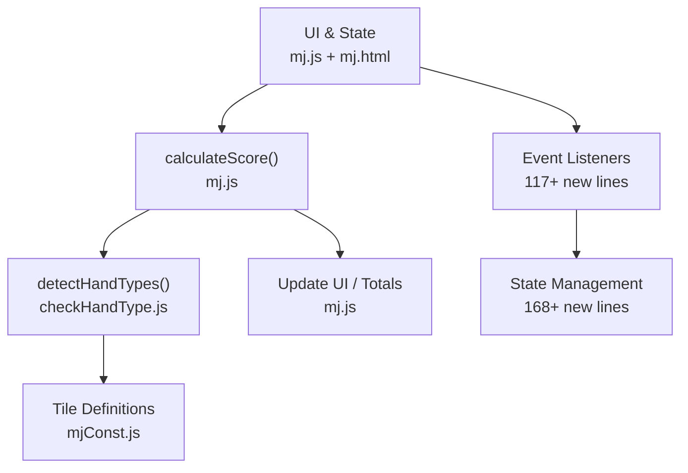
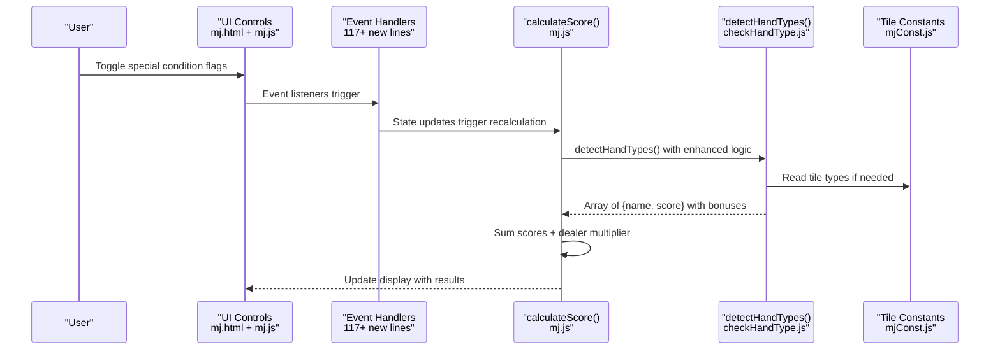
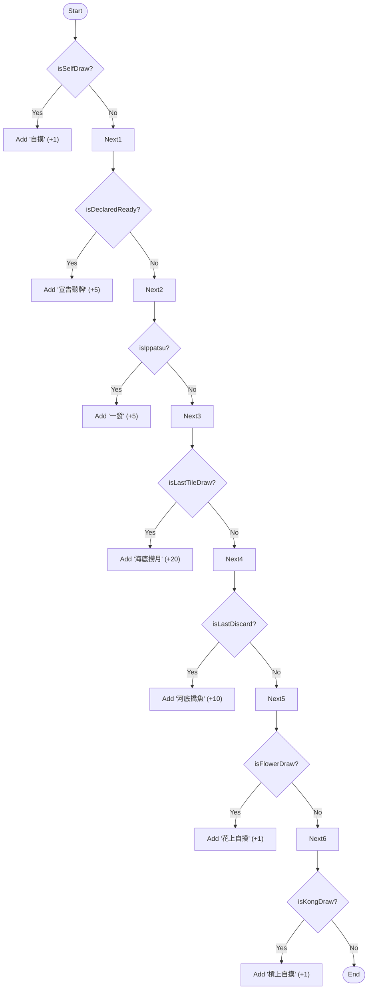
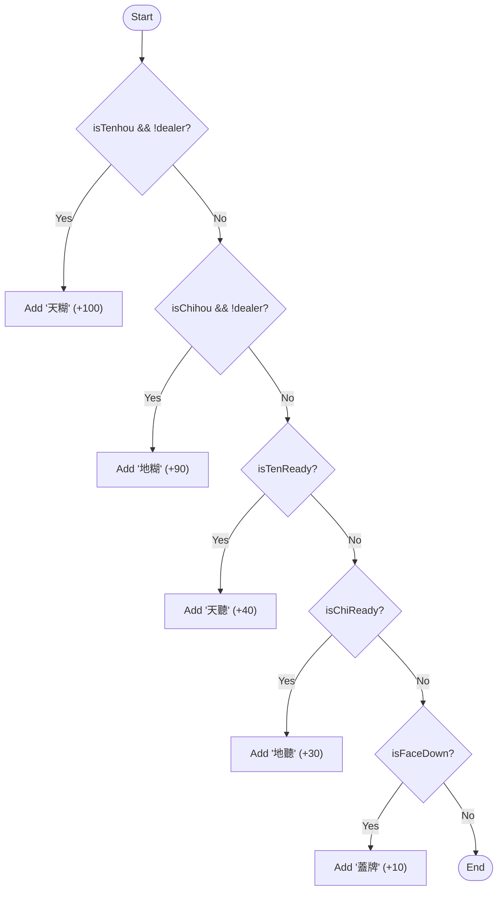
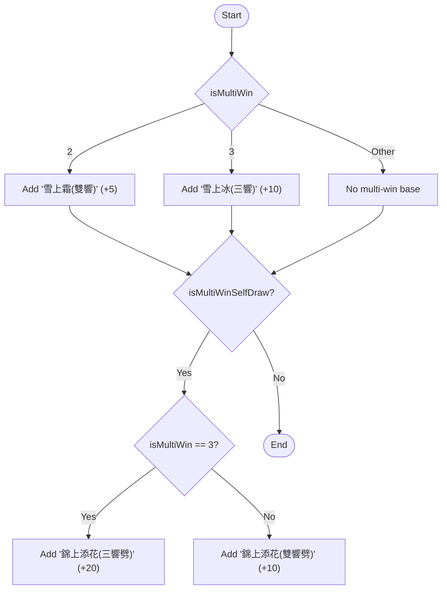
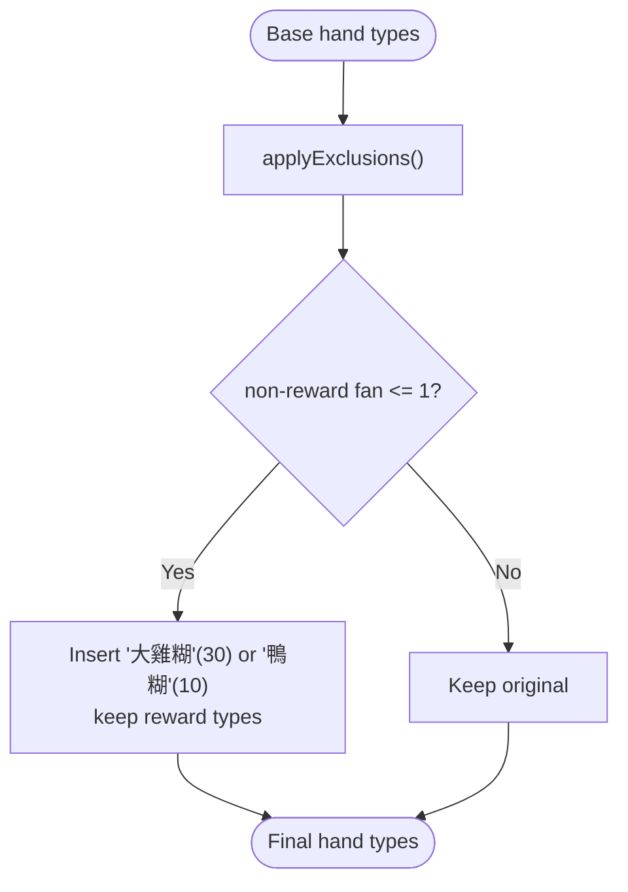
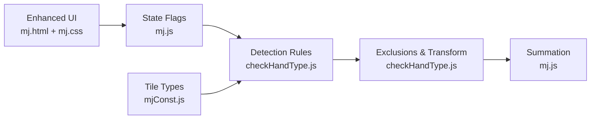

# Special Conditions and Bonuses

<cite>
**Referenced Files in This Document**
- [mj.js](file://mj.js)
- [checkHandType.js](file://checkHandType.js)
- [mjConst.js](file://mjConst.js)
- [mj.html](file://mj.html)
- [mj.css](file://mj.css)
</cite>

## Update Summary
**Changes Made**
- Enhanced special condition handling with comprehensive state management for 168 additional lines of code
- Updated UI interface with organized checkbox groups supporting 117 new lines for better user experience
- Added support for advanced special conditions including flower/kong draws, multi-win scenarios, and complex winning patterns
- Improved detection logic for declared ready states, last tile wins, and situational bonuses

## Table of Contents
1. [Introduction](#introduction)
2. [Project Structure](#project-structure)
3. [Core Components](#core-components)
4. [Architecture Overview](#architecture-overview)
5. [Detailed Component Analysis](#detailed-component-analysis)
6. [Dependency Analysis](#dependency-analysis)
7. [Performance Considerations](#performance-considerations)
8. [Troubleshooting Guide](#troubleshooting-guide)
9. [Conclusion](#conclusion)

## Introduction
This document explains how the scoring system detects and applies special conditions and bonus scenarios for Mahjong hands. It focuses on state-based bonuses (self-draw, declared ready, ippatsu, last-tile draw, last discard win), situational wins (tenhou, chihou, ten-ready/chi-ready, face-down win), and multi-win scenarios (double/triple win, bonus multi-win). For each condition, we describe detection logic, impact on final scores, and practical gameplay examples grounded in the codebase.

## Project Structure
The application is a single-page calculator with:
- UI and state management in mj.js with comprehensive event handling
- Scoring and hand-type detection in checkHandType.js with enhanced condition logic
- Tile definitions in mjConst.js
- Organized HTML interface with categorized special condition controls
- Responsive CSS styling for mobile-friendly interaction

**Diagram sources**
- [mj.js:580-703](file://mj.js#L580-L703)
- [mj.html:120-235](file://mj.html#L120-L235)
- [checkHandType.js:104-587](file://checkHandType.js#L104-L587)
- [mjConst.js:1-65](file://mjConst.js#L1-L65)

**Section sources**
- [mj.js:1-33](file://mj.js#L1-L33)
- [mj.js:580-703](file://mj.js#L580-L703)
- [mj.html:120-235](file://mj.html#L120-L235)
- [checkHandType.js:104-587](file://checkHandType.js#L104-L587)
- [mjConst.js:1-65](file://mjConst.js#L1-L65)

## Core Components
- Application state holds comprehensive flags for all special conditions and bonuses with enhanced organization
- calculateScore validates tile counts, calls detectHandTypes to enumerate applicable hand types and their fan values, then sums them (including dealer count multiplier)
- detectHandTypes implements enhanced detection rules for state-based and situational bonuses, including exclusions and special transformations (e.g., Da Ji Hu)
- UI provides organized checkbox groups for different categories of special conditions

Key state fields used by special conditions:
- Self-draw, declared ready, ippatsu, last-tile draw, last discard win
- Flower/kong draws, robbing kong variants (花上自摸, 槓上自摸, 搶槓食糊)
- Tenhou/chihou, ten-ready/chi-ready, face-down win
- Multi-win count and multi-win self-draw flag (雙響/三響, 錦上添花)
- Visible win tile count (for "明絕/絕絕")

**Section sources**
- [mj.js:1-33](file://mj.js#L1-L33)
- [mj.js:580-703](file://mj.js#L580-L703)
- [mj.js:1082-1129](file://mj.js#L1082-L1129)
- [checkHandType.js:263-374](file://checkHandType.js#L263-L374)
- [checkHandType.js:545-582](file://checkHandType.js#L545-L582)

## Architecture Overview
The flow from user input to final score with enhanced special condition handling:

**Diagram sources**
- [mj.js:580-703](file://mj.js#L580-L703)
- [mj.js:1082-1129](file://mj.js#L1082-L1129)
- [checkHandType.js:104-587](file://checkHandType.js#L104-L587)
- [mjConst.js:1-65](file://mjConst.js#L1-L65)

## Detailed Component Analysis

### Enhanced State-Based Bonuses
These bonuses are directly driven by boolean or numeric state flags set in the UI and checked in detectHandTypes, with comprehensive support for advanced scenarios.

- 自摸 (Self-draw)
  - Detection: If state.isSelfDraw is true, add "自摸" (1 fan). Also contributes to "門清自摸" when combined with menzen.
  - Impact: Adds 1 fan; can combine with other patterns like 門清自摸.
  - Example: A player completes a hand by drawing the winning tile instead of taking a discard.

- 宣告聽牌 (Declared ready)
  - Detection: If state.isDeclaredReady is true, add "宣告聽牌" (5 fans). Combined with menzen yields "門清大叮".
  - Impact: Adds 5 fans; may be excluded by higher-priority patterns per exclusion rules.
  - Example: Player declares readiness before winning.

- 一發 (Ippatsu)
  - Detection: If state.isIppatsu is true, add "一發" (5 fans).
  - Impact: Adds 5 fans.
  - Example: Winning immediately after a riichi call without any discards or draws altering the round.

- 海底撈月 (Last tile draw)
  - Detection: If state.isLastTileDraw is true, add "海底撈月" (20 fans).
  - Impact: Adds 20 fans.
  - Example: Winning on the very last tile drawn from the wall.

- 河底撟魚 (Last discard win)
  - Detection: If state.isLastDiscard is true, add "河底撟魚" (10 fans).
  - Impact: Adds 10 fans.
  - Example: Winning on the last discard from the river.

- Advanced state-based bonuses:
  - 花上自摸 (Flower draw self-draw): 1 fan
  - 槓上自摸 (Kong draw self-draw): 1 fan  
  - 搶槓食糊 (Robbing kong win): 5 fans
  - 槓上槓食糊 (Double kong draw win): 30 fans
  - 搶槓上槓糊 (Robbing double kong win): 30 fans
  - 蓋牌 (Face-down win): 10 fans

**Diagram sources**
- [checkHandType.js:333-398](file://checkHandType.js#L333-L398)

**Section sources**
- [checkHandType.js:333-398](file://checkHandType.js#L333-L398)
- [mj.js:610-687](file://mj.js#L610-L687)

### Enhanced Situational Conditions (Tenhou/Chihou/Ready States/Face-Down)
- 天糊 (Tenhou)
  - Detection: If state.isTenhou is true and the winner is not the dealer, add "天糊" (100 fans).
  - Impact: High-value situational bonus.
  - Example: Non-dealer wins on first turn under specific conditions.

- 地糊 (Chihou)
  - Detection: If state.isChihou is true and the winner is not the dealer, add "地糊" (90 fans).
  - Impact: High-value situational bonus.
  - Example: Non-dealer wins early under specific conditions.

- 天聽/地聽 (Ten-ready/Chi-ready)
  - Detection: If state.isTenReady is true, add "天聽" (40 fans); if state.isChiReady is true, add "地聽" (30 fans).
  - Impact: Significant situational bonuses tied to initial ready states.

- 蓋牌 (Face-down win)
  - Detection: If state.isFaceDown is true, add "蓋牌" (10 fans).
  - Impact: Adds 10 fans.

Exclusions: Certain high-value patterns exclude others (e.g., "天糊" excludes "四子" and "天聽"; "地糊" excludes "四子" and "天聽").

**Diagram sources**
- [checkHandType.js:424-444](file://checkHandType.js#L424-L444)

**Section sources**
- [checkHandType.js:424-444](file://checkHandType.js#L424-L444)
- [mj.js:652-671](file://mj.js#L652-L671)

### Enhanced Multi-Win Scenarios (Double/Triple/Bonus Multi-Win)
- 雪上霜 (Double win)
  - Detection: If state.isMultiWin equals 2, add "雪上霜(雙響)" (5 fans).
  - Impact: Adds 5 fans for dual-win situations.

- 雪上冰 (Triple win)
  - Detection: If state.isMultiWin equals 3, add "雪上冰(三響)" (10 fans).
  - Impact: Adds 10 fans for triple-win situations.

- 錦上添花 (Bonus multi-win)
  - Detection: If state.isMultiWinSelfDraw is true:
    - For triple-win: add "錦上添花(三響劈)" (20 fans).
    - For double-win: add "錦上添花(雙響劈)" (10 fans).
  - Impact: Extra bonus when winning via self-draw in multi-win contexts.

**Diagram sources**
- [checkHandType.js:635-652](file://checkHandType.js#L635-L652)

**Section sources**
- [checkHandType.js:635-652](file://checkHandType.js#L635-L652)
- [mj.js:689-698](file://mj.js#L689-L698)

### Interaction with Exclusions and Special Transformations
- Exclusion rules prevent overlapping scoring for certain combinations. For example, "天糊" excludes "四子" and "天聽"; "地糊" excludes "四子" and "天聽".
- Special transformation: checkDaJiHu can convert low-scoring hands into "大雞糊" (30 fans) or "鴨糊" (10 fans) while preserving reward-type bonuses such as 天聽/地聽/宣告聽牌/一發/蓋牌/雪上霜/雪上冰/錦上添花.

**Diagram sources**
- [checkHandType.js:121-151](file://checkHandType.js#L121-L151)

**Section sources**
- [checkHandType.js:121-151](file://checkHandType.js#L121-L151)

## Dependency Analysis
- UI toggles in mj.js update state flags that drive detection in checkHandType.js
- Enhanced event handlers manage 117+ new lines of UI interactions
- detectHandTypes reads these flags and computes applicable hand types and scores
- Exclusion rules and special transformations refine the final set of hand types before summation
- Tile constants in mjConst.js provide type definitions used across detection functions

**Diagram sources**
- [mj.js:580-703](file://mj.js#L580-L703)
- [checkHandType.js:1-40](file://checkHandType.js#L1-L40)
- [checkHandType.js:104-587](file://checkHandType.js#L104-L587)
- [mjConst.js:1-65](file://mjConst.js#L1-L65)
- [mj.html:120-235](file://mj.html#L120-L235)

**Section sources**
- [mj.js:580-703](file://mj.js#L580-L703)
- [checkHandType.js:1-40](file://checkHandType.js#L1-L40)
- [checkHandType.js:104-587](file://checkHandType.js#L104-L587)
- [mjConst.js:1-65](file://mjConst.js#L1-L65)

## Performance Considerations
- The detection pipeline runs on every UI change due to event listeners triggering calculateScore
- Enhanced event handling ensures minimal reflows and avoids unnecessary recomputation in large hands
- Exclusion checks iterate over detected hand types; keep the number of detected types reasonable by ordering checks efficiently
- Multi-win and situational checks are O(1) relative to hand size since they rely on state flags
- Organized UI structure reduces DOM manipulation overhead through efficient event delegation

## Troubleshooting Guide
Common issues and where to inspect:
- Incorrect total score: Verify that all relevant state flags are set correctly in the UI (self-draw, declared ready, ippatsu, last-tile draw, last discard win, tenhou/chihou, ready states, face-down, multi-win, visible win tiles)
- Missing bonus: Check exclusion rules; some high-value patterns exclude others (e.g., 天糊 excludes 天聽)
- Unexpected transformation: checkDaJiHu may replace low-scoring hands with "大雞糊"/"鴨糊" while keeping reward-type bonuses
- UI interaction issues: Verify event listeners are properly bound for the 117+ new UI elements

Relevant UI bindings and calculation points:
- Enhanced event listeners for special conditions trigger recalculations
- calculateScore validates tile counts and aggregates scores with improved error handling
- State management handles 168+ additional lines of condition tracking

**Section sources**
- [mj.js:580-703](file://mj.js#L580-L703)
- [mj.js:1082-1129](file://mj.js#L1082-L1129)
- [checkHandType.js:1-40](file://checkHandType.js#L1-L40)
- [checkHandType.js:121-151](file://checkHandType.js#L121-L151)

## Conclusion
The scoring system integrates state-driven bonuses and situational conditions through clear detection logic and robust exclusion rules. Enhanced state flags in the UI map directly to fan additions, while special transformations ensure fair handling of low-scoring hands. Multi-win scenarios and face-down wins add further depth to scoring. The comprehensive UI organization with categorized checkbox groups improves user experience while maintaining performance efficiency. Understanding these interactions helps users accurately configure and interpret results in complex gameplay scenarios.