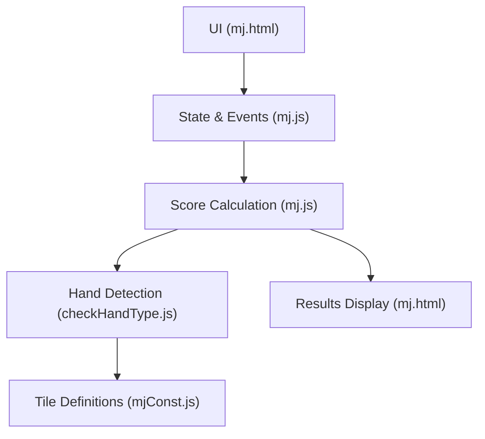
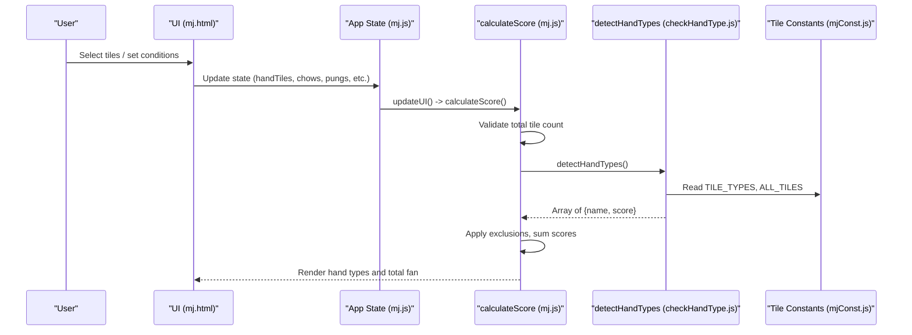
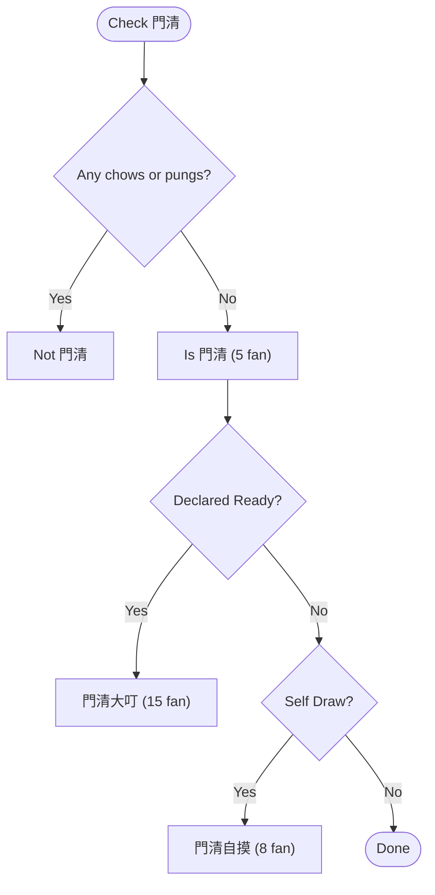
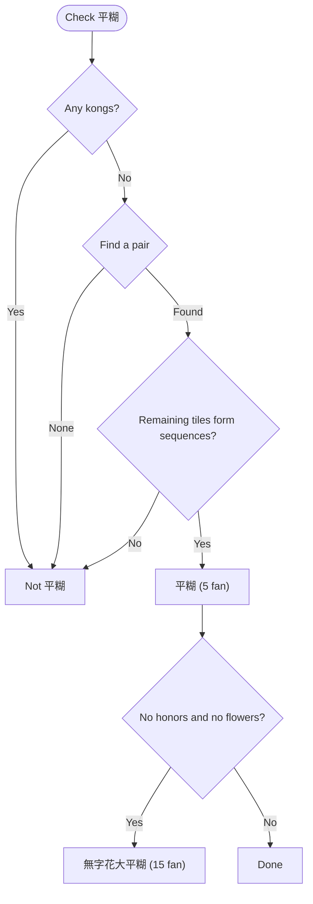
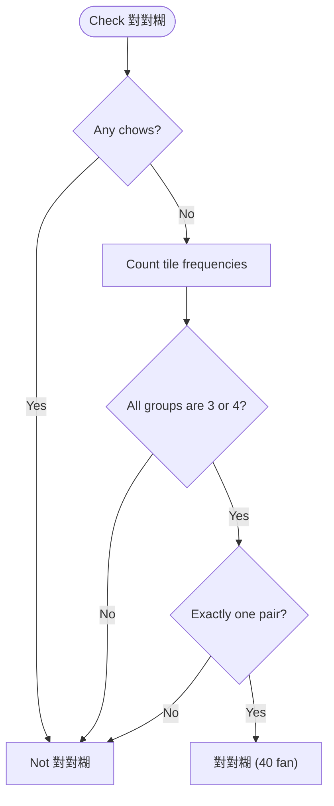
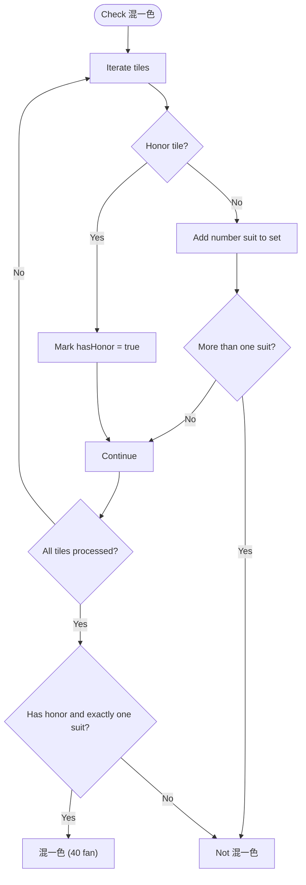
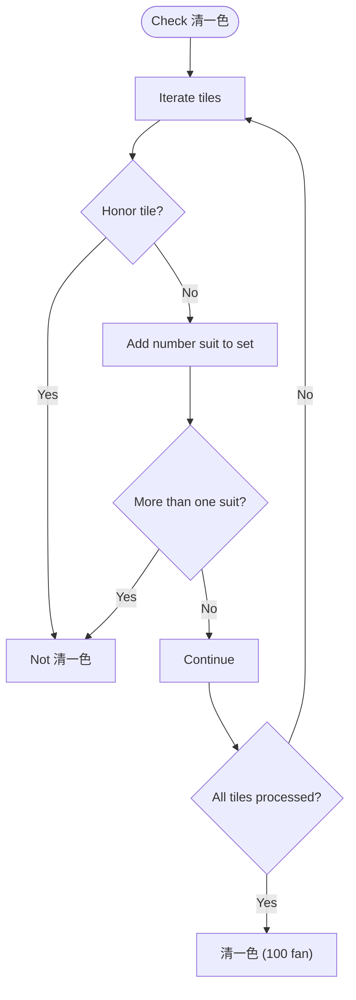
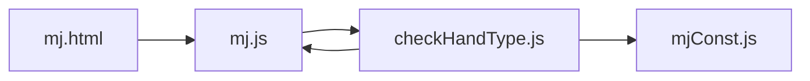

# Standard Hand Types

<cite>
**Referenced Files in This Document**
- [mj.html](file://mj.html)
- [mj.js](file://mj.js)
- [mjConst.js](file://mjConst.js)
- [checkHandType.js](file://checkHandType.js)
</cite>

## Table of Contents
1. [Introduction](#introduction)
2. [Project Structure](#project-structure)
3. [Core Components](#core-components)
4. [Architecture Overview](#architecture-overview)
5. [Detailed Component Analysis](#detailed-component-analysis)
6. [Dependency Analysis](#dependency-analysis)
7. [Performance Considerations](#performance-considerations)
8. [Troubleshooting Guide](#troubleshooting-guide)
9. [Conclusion](#conclusion)
10. [Appendices](#appendices)

## Introduction
This document explains the standard Taiwanese Mahjong hand types implemented in the calculator, focusing on four basic patterns:
- 門清 (Concealed Hand)
- 平糊 (Pure Sequence)
- 對對糊 (All Pungs)
- 混一色 (Mixed One Suit)
- 清一色 (Pure One Suit)

For each hand type, we detail detection logic, scoring values, exclusion rules, and how these hands interact with other scoring conditions. We also provide examples of qualifying tile combinations and reference tables for all possible combinations.

## Project Structure
The application is a single-page web app with three main files:
- mj.html: UI layout and controls
- mj.js: Application state, drag-and-drop handling, and score calculation orchestration
- checkHandType.js: Core hand-type detection and scoring logic
- mjConst.js: Tile definitions and constants

**Diagram sources**
- [mj.html:10-247](file://mj.html#L10-L247)
- [mj.js:1082-1129](file://mj.js#L1082-L1129)
- [checkHandType.js:105-587](file://checkHandType.js#L105-L587)
- [mjConst.js:1-65](file://mjConst.js#L1-L65)

**Section sources**
- [mj.html:10-247](file://mj.html#L10-L247)
- [mj.js:1-1211](file://mj.js#L1-L1211)
- [checkHandType.js:1-4286](file://checkHandType.js#L1-L4286)
- [mjConst.js:1-65](file://mjConst.js#L1-L65)

## Core Components
- State management and event binding: Tracks hand tiles, exposed groups, winning tile, and special conditions; triggers recalculation on changes.
- Score calculation pipeline: Validates tile counts, detects hand types, applies exclusions, and sums scores.
- Hand detection engine: Implements checks for basic and advanced hand types, including the five requested patterns.
- Tile data model: Defines suits, values, and display names for characters, bamboos, dots, honors, and flowers.

Key responsibilities:
- mj.js: Orchestrates user input, maintains state, validates tile counts, and calls detectHandTypes().
- checkHandType.js: Contains the actual detection functions for 門清, 平糊, 對對糊, 混一色, 清一色, plus many others.
- mjConst.js: Provides TILE_TYPES and ALL_TILES used across detection logic.
- mj.html: Renders tile selection areas, exposed groups, winning tile area, and results.

**Section sources**
- [mj.js:1-1211](file://mj.js#L1-L1211)
- [checkHandType.js:105-587](file://checkHandType.js#L105-L587)
- [mjConst.js:1-65](file://mjConst.js#L1-L65)
- [mj.html:10-247](file://mj.html#L10-L247)

## Architecture Overview
The flow from user input to final score:

**Diagram sources**
- [mj.js:1082-1129](file://mj.js#L1082-L1129)
- [checkHandType.js:105-587](file://checkHandType.js#L105-L587)
- [mjConst.js:1-65](file://mjConst.js#L1-L65)

## Detailed Component Analysis

### 門清 (Concealed Hand)
- Definition: No chows or pungs are exposed; only concealed kongs are allowed.
- Detection logic:
  - Checks that there are no chows and no pungs.
  - Excluded by higher-priority hands like 門清大叮 and 門清自摸 when combined with specific conditions.
- Scoring:
  - Base value: 5 fan.
  - Combined with self-draw yields 門清自摸 at 8 fan.
  - Combined with declared ready yields 門清大叮 at 15 fan.
- Exclusions:
  - When 門清大叮 or 門清自摸 are detected, base 門清 is excluded via exclusion rules.
- Examples:
  - All 4 melds formed entirely from concealed sets (pungs/kongs) plus a pair, with no chows/pungs exposed.
  - Any valid hand with zero chows and zero pungs qualifies.

**Diagram sources**
- [checkHandType.js:257-283](file://checkHandType.js#L257-L283)
- [checkHandType.js:1-70](file://checkHandType.js#L1-L70)

**Section sources**
- [checkHandType.js:257-283](file://checkHandType.js#L257-L283)
- [checkHandType.js:1-70](file://checkHandType.js#L1-L70)

### 平糊 (Pure Sequence)
- Definition: The hand consists entirely of sequences (chows) plus one pair; no pungs or kongs.
- Detection logic:
  - Ensures no pungs or kongs exist.
  - Finds a pair (eyes), then verifies the remaining tiles can be fully partitioned into sequences.
- Scoring:
  - Base value: 5 fan.
  - If both no honors and no flowers are present, it may be superseded by 無字花大平糊 (15 fan).
- Exclusions:
  - 無字花大平糊 excludes 平糊 when applicable.
- Examples:
  - Four sequences and one pair using only number tiles without honors/flowers.
  - Any arrangement where all non-pair tiles form consecutive triplets within a suit.

**Diagram sources**
- [checkHandType.js:2057-2124](file://checkHandType.js#L2057-L2124)
- [checkHandType.js:376-418](file://checkHandType.js#L376-L418)

**Section sources**
- [checkHandType.js:2057-2124](file://checkHandType.js#L2057-L2124)
- [checkHandType.js:376-418](file://checkHandType.js#L376-L418)

### 對對糊 (All Pungs)
- Definition: The hand consists entirely of pungs (triplets) and one pair; no sequences.
- Detection logic:
  - Ensures no chows exist.
  - Counts tile frequencies; every group must be 3 or 4 copies, with exactly one pair.
- Scoring:
  - Base value: 40 fan.
  - Excluded by higher-priority patterns such as 五暗刻 or 坎坎糊 when applicable.
- Exclusions:
  - 五暗刻 and 坎坎糊 exclude 對對糊 via exclusion rules.
- Examples:
  - Four pungs and one pair, or three pungs, one kong, and one pair.
  - Any configuration where all non-pair tiles form triplets or quads.

**Diagram sources**
- [checkHandType.js:2126-2155](file://checkHandType.js#L2126-L2155)
- [checkHandType.js:379-382](file://checkHandType.js#L379-L382)

**Section sources**
- [checkHandType.js:2126-2155](file://checkHandType.js#L2126-L2155)
- [checkHandType.js:379-382](file://checkHandType.js#L379-L382)

### 混一色 (Mixed One Suit)
- Definition: The hand uses only one suit of number tiles plus honor tiles; no other suits.
- Detection logic:
  - Collects suits from number tiles; ensures at most one suit appears.
  - Requires presence of at least one honor tile.
- Scoring:
  - Base value: 40 fan.
  - Excluded by 清一色 when applicable.
- Exclusions:
  - 清一色 excludes 混一色 via exclusion rules.
- Examples:
  - A hand composed of characters and honors only, or bamboos and honors only, or dots and honors only.
  - Must include at least one honor tile.

**Diagram sources**
- [checkHandType.js:2157-2178](file://checkHandType.js#L2157-L2178)
- [checkHandType.js:384-387](file://checkHandType.js#L384-L387)

**Section sources**
- [checkHandType.js:2157-2178](file://checkHandType.js#L2157-L2178)
- [checkHandType.js:384-387](file://checkHandType.js#L384-L387)

### 清一色 (Pure One Suit)
- Definition: The hand uses only one suit of number tiles; no honor tiles.
- Detection logic:
  - Rejects any honor tiles.
  - Ensures only one number suit appears.
- Scoring:
  - Base value: 100 fan.
  - Excludes 混一色 via exclusion rules.
- Exclusions:
  - 混一色 is excluded when 清一色 is detected.
- Examples:
  - A hand composed entirely of characters, or entirely of bamboos, or entirely of dots, with no honors.

**Diagram sources**
- [checkHandType.js:2180-2198](file://checkHandType.js#L2180-L2198)
- [checkHandType.js:389-392](file://checkHandType.js#L389-L392)

**Section sources**
- [checkHandType.js:2180-2198](file://checkHandType.js#L2180-L2198)
- [checkHandType.js:389-392](file://checkHandType.js#L389-L392)

## Dependency Analysis
- mj.js depends on checkHandType.js for hand detection and on mjConst.js for tile definitions.
- checkHandType.js reads state from mj.js (e.g., chows, pungs, open/concealed kongs, winning tile) and uses TILE_TYPES from mjConst.js.
- mj.html wires UI events to mj.js functions which trigger recalculations.

**Diagram sources**
- [mj.html:244-247](file://mj.html#L244-L247)
- [mj.js:1082-1129](file://mj.js#L1082-L1129)
- [checkHandType.js:105-587](file://checkHandType.js#L105-L587)
- [mjConst.js:1-65](file://mjConst.js#L1-L65)

**Section sources**
- [mj.html:244-247](file://mj.html#L244-L247)
- [mj.js:1082-1129](file://mj.js#L1082-L1129)
- [checkHandType.js:105-587](file://checkHandType.js#L105-L587)
- [mjConst.js:1-65](file://mjConst.js#L1-L65)

## Performance Considerations
- Tile validation occurs before detection to avoid unnecessary computation.
- Detection functions use early exits (e.g., rejecting hands with any pungs for 平糊) to minimize work.
- Sorting and grouping operations are bounded by the fixed size of a Mahjong hand (17 tiles max), keeping complexity low.
- Exclusion rules are applied once after detection to prevent redundant scoring.

[No sources needed since this section provides general guidance]

## Troubleshooting Guide
Common issues and resolutions:
- Incorrect tile count: Ensure total tiles match required count based on exposed groups and kongs. The app displays a status message if invalid.
- Missing winning tile: If the hand reaches maximum tiles without setting a winning tile, the app auto-selects the last added tile as the winning tile.
- Unexpected exclusions: Review exclusion rules; some hands are suppressed by higher-priority patterns (e.g., 平糊 excluded by 無字花大平糊).
- Confusion between 混一色 and 清一色: 混一色 requires at least one honor tile; 清一色 forbids honor tiles.

**Section sources**
- [mj.js:1082-1129](file://mj.js#L1082-L1129)
- [mj.js:1185-1209](file://mj.js#L1185-L1209)
- [checkHandType.js:1-70](file://checkHandType.js#L1-L70)

## Conclusion
The calculator implements robust detection for core Taiwanese Mahjong hand types:
- 門清 (5 fan), with combined forms 門清自摸 (8 fan) and 門清大叮 (15 fan)
- 平糊 (5 fan), potentially upgraded to 無字花大平糊 (15 fan)
- 對對糊 (40 fan), with higher forms like 五暗刻 and 坎坎糊
- 混一色 (40 fan), excluded by 清一色
- 清一色 (100 fan), excludes 混一色

These hands integrate with numerous other scoring conditions through a structured detection pipeline and explicit exclusion rules, ensuring accurate and consistent scoring.

[No sources needed since this section summarizes without analyzing specific files]

## Appendices

### Reference Tables: Basic Hands

- 門清 (Concealed Hand)
  - Condition: No chows or pungs; any number of concealed kongs allowed.
  - Score: 5 fan
  - Combined: 門清自摸 (8 fan), 門清大叮 (15 fan)
  - Exclusions: Suppressed by 門清自摸 and 門清大叮 when applicable

- 平糊 (Pure Sequence)
  - Condition: Only sequences and one pair; no pungs/kongs
  - Score: 5 fan
  - Combined: 無字花大平糊 (15 fan) when no honors and no flowers
  - Exclusions: Suppressed by 無字花大平糊 when applicable

- 對對糊 (All Pungs)
  - Condition: Only pungs/kongs and one pair; no sequences
  - Score: 40 fan
  - Exclusions: Suppressed by 五暗刻 and 坎坎糊 when applicable

- 混一色 (Mixed One Suit)
  - Condition: One number suit plus honors; at least one honor tile
  - Score: 40 fan
  - Exclusions: Suppressed by 清一色 when applicable

- 清一色 (Pure One Suit)
  - Condition: One number suit only; no honors
  - Score: 100 fan
  - Exclusions: Suppresses 混一色

[No sources needed since this section lists summarized information]

### Example Tile Combinations

- 門清
  - Example: Four concealed pungs and one pair; no chows or pungs exposed
  - Points: 5 fan (or 8/15 when combined)

- 平糊
  - Example: Four sequences and one pair using only number tiles
  - Points: 5 fan (or 15 when no honors and no flowers)

- 對對糊
  - Example: Three pungs, one kong, and one pair; no sequences
  - Points: 40 fan

- 混一色
  - Example: Characters and honors only, with at least one honor tile
  - Points: 40 fan

- 清一色
  - Example: All characters, no honors
  - Points: 100 fan

[No sources needed since this section provides illustrative examples]