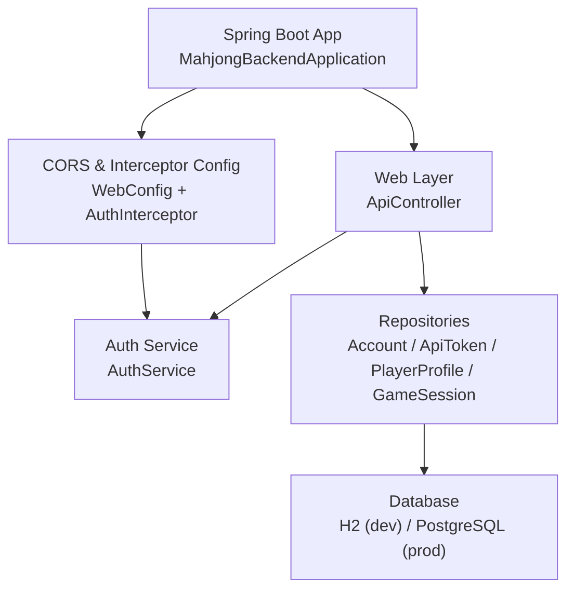
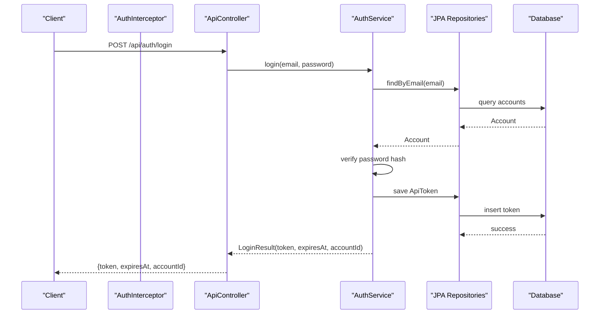
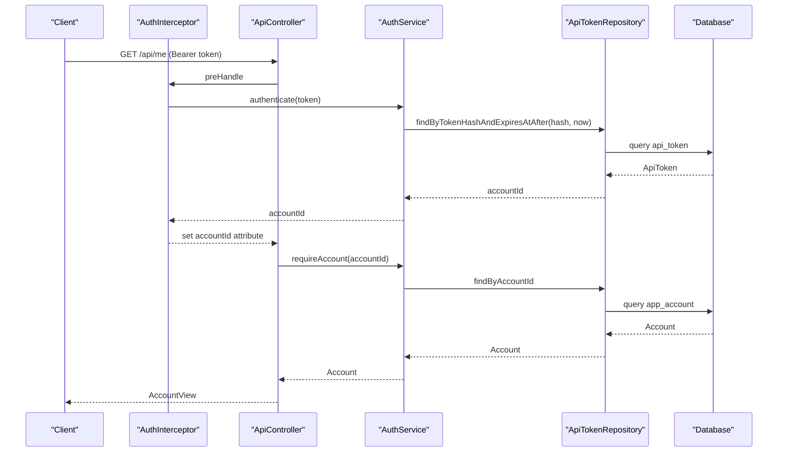
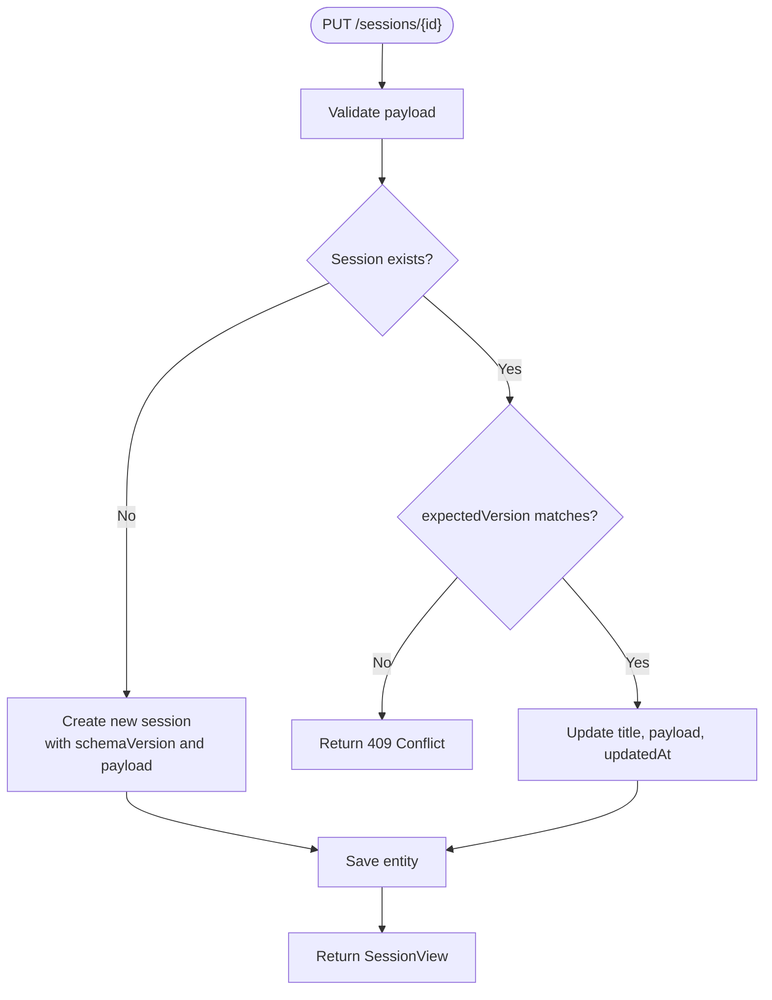
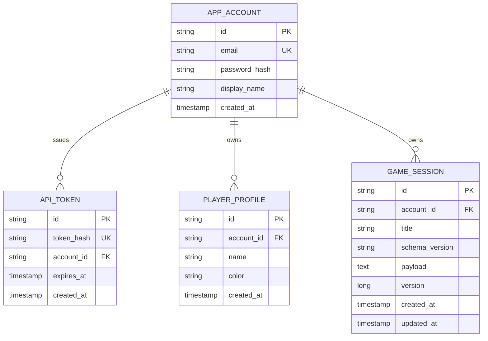
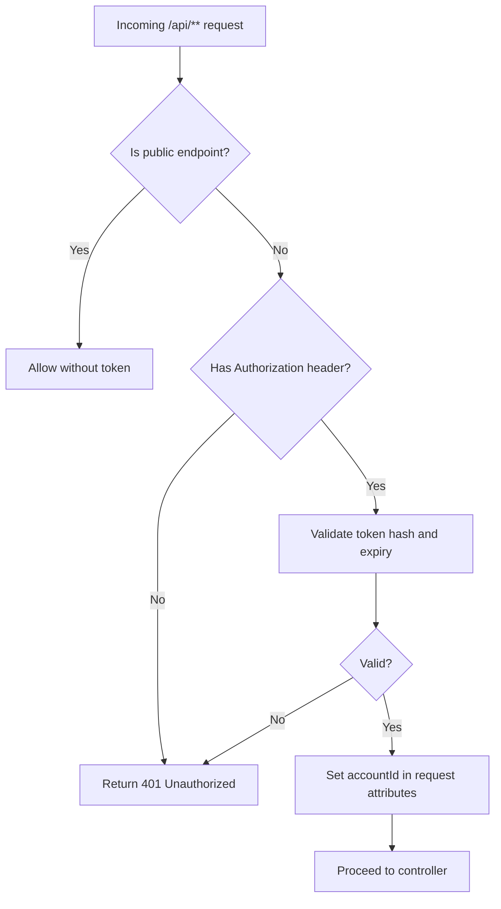
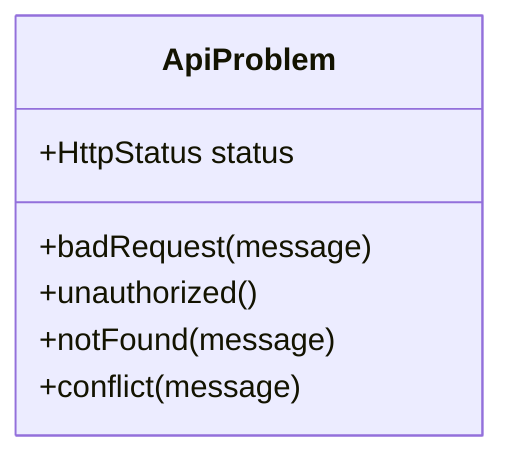
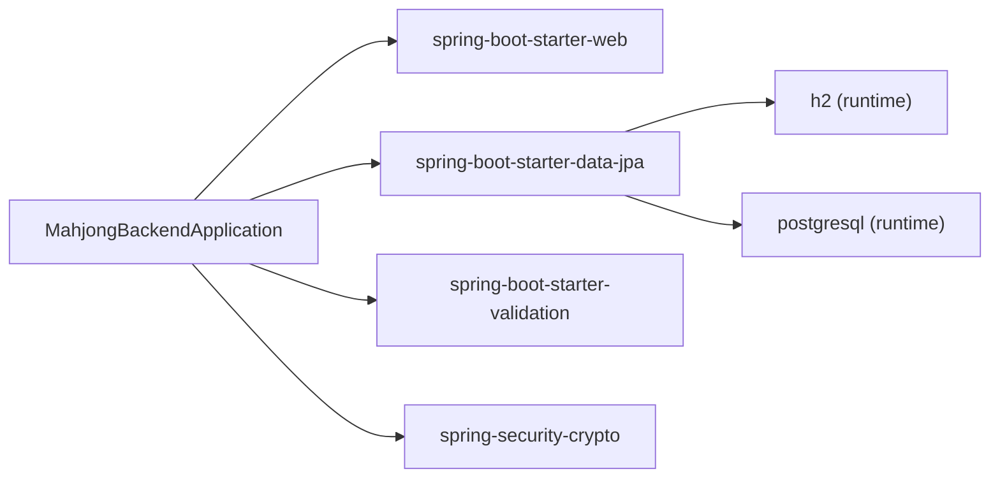

# Backend API System

<cite>
**Referenced Files in This Document**
- [MahjongBackendApplication.java](file://backend/src/main/java/com/onevictoria/mahjong/MahjongBackendApplication.java)
- [ApiController.java](file://backend/src/main/java/com/onevictoria/mahjong/web/ApiController.java)
- [AuthInterceptor.java](file://backend/src/main/java/com/onevictoria/mahjong/web/AuthInterceptor.java)
- [WebConfig.java](file://backend/src/main/java/com/onevictoria/mahjong/web/WebConfig.java)
- [ApiProblem.java](file://backend/src/main/java/com/onevictoria/mahjong/web/ApiProblem.java)
- [AuthService.java](file://backend/src/main/java/com/onevictoria/mahjong/service/AuthService.java)
- [Account.java](file://backend/src/main/java/com/onevictoria/mahjong/model/Account.java)
- [ApiToken.java](file://backend/src/main/java/com/onevictoria/mahjong/model/ApiToken.java)
- [PlayerProfile.java](file://backend/src/main/java/com/onevictoria/mahjong/model/PlayerProfile.java)
- [GameSession.java](file://backend/src/main/java/com/onevictoria/mahjong/model/GameSession.java)
- [AccountRepository.java](file://backend/src/main/java/com/onevictoria/mahjong/repo/AccountRepository.java)
- [ApiTokenRepository.java](file://backend/src/main/java/com/onevictoria/mahjong/repo/ApiTokenRepository.java)
- [PlayerProfileRepository.java](file://backend/src/main/java/com/onevictoria/mahjong/repo/PlayerProfileRepository.java)
- [GameSessionRepository.java](file://backend/src/main/java/com/onevictoria/mahjong/repo/GameSessionRepository.java)
- [application.properties](file://backend/src/main/resources/application.properties)
- [pom.xml](file://backend/pom.xml)
- [ApiIntegrationTest.java](file://backend/src/test/java/com/onevictoria/mahjong/ApiIntegrationTest.java)
</cite>

## Table of Contents
1. Introduction
2. Project Structure
3. Core Components
4. Architecture Overview
5. Detailed Component Analysis
6. Dependency Analysis
7. Performance Considerations
8. Troubleshooting Guide
9. Conclusion

## Introduction
This document describes the backend API system for a Mahjong scorekeeper application built with Spring Boot. It covers the system architecture, core components, data models, authentication flow, session management, validation rules, configuration, and testing approach. The goal is to provide both high-level understanding and code-level details so that developers can extend or maintain the service confidently.

## Project Structure
The backend is a standard Spring Boot application under the package com.onevictoria.mahjong:
- Application entry point
- Web layer: REST controllers, interceptors, CORS, and exception mapping
- Service layer: authentication and token handling
- Data layer: JPA entities and repositories
- Configuration: application properties for database, CORS, and tokens
- Tests: integration tests covering auth, sessions, and exports

**Diagram sources**
- [MahjongBackendApplication.java:6-10](file://backend/src/main/java/com/onevictoria/mahjong/MahjongBackendApplication.java#L6-L10)
- [WebConfig.java:16-19](file://backend/src/main/java/com/onevictoria/mahjong/web/WebConfig.java#L16-L19)
- [ApiController.java:17-29](file://backend/src/main/java/com/onevictoria/mahjong/web/ApiController.java#L17-L29)
- [AuthService.java:16-26](file://backend/src/main/java/com/onevictoria/mahjong/service/AuthService.java#L16-L26)
- [GameSessionRepository.java:1-6](file://backend/src/main/java/com/onevictoria/mahjong/repo/GameSessionRepository.java#L1-L6)

**Section sources**
- [MahjongBackendApplication.java:6-10](file://backend/src/main/java/com/onevictoria/mahjong/MahjongBackendApplication.java#L6-L10)
- [pom.xml:10-17](file://backend/pom.xml#L10-L17)
- [application.properties:3-16](file://backend/src/main/resources/application.properties#L3-L16)

## Core Components
- REST API controller exposing health, authentication, player profiles, and game sessions endpoints.
- Authentication service managing account registration, login, token issuance, and revocation.
- Interceptor enforcing bearer token authorization on protected routes.
- JPA entities and repositories for accounts, tokens, player profiles, and game sessions.
- Validation logic ensuring payload integrity for game sessions.
- Configuration for server port, datasource, CORS, and token lifetime.

Key responsibilities:
- ApiController: request routing, input validation, business orchestration, response shaping.
- AuthService: password hashing, token lifecycle, account lookup.
- AuthInterceptor: pre-flight checks, token extraction, account context injection.
- Repositories: data access via Spring Data JPA.
- Entities: persistent schema for accounts, tokens, players, sessions.

**Section sources**
- [ApiController.java:17-29](file://backend/src/main/java/com/onevictoria/mahjong/web/ApiController.java#L17-L29)
- [AuthService.java:16-26](file://backend/src/main/java/com/onevictoria/mahjong/service/AuthService.java#L16-L26)
- [AuthInterceptor.java:8-21](file://backend/src/main/java/com/onevictoria/mahjong/web/AuthInterceptor.java#L8-L21)
- [GameSessionRepository.java:1-6](file://backend/src/main/java/com/onevictoria/mahjong/repo/GameSessionRepository.java#L1-L6)
- [AccountRepository.java:1-6](file://backend/src/main/java/com/onevictoria/mahjong/repo/AccountRepository.java#L1-L6)
- [PlayerProfileRepository.java:1-6](file://backend/src/main/java/com/onevictoria/mahjong/repo/PlayerProfileRepository.java#L1-L6)
- [ApiTokenRepository.java:1-6](file://backend/src/main/java/com/onevictoria/mahjong/repo/ApiTokenRepository.java#L1-L6)

## Architecture Overview
The API follows a layered architecture:
- Web layer handles HTTP requests, validates inputs, and delegates to services.
- Service layer encapsulates authentication and token operations.
- Data layer persists entities through JPA repositories.
- Interceptors enforce security policies before reaching controllers.
- Configuration centralizes runtime settings.

**Diagram sources**
- [ApiController.java:36-37](file://backend/src/main/java/com/onevictoria/mahjong/web/ApiController.java#L36-L37)
- [AuthService.java:38-43](file://backend/src/main/java/com/onevictoria/mahjong/service/AuthService.java#L38-L43)
- [AccountRepository.java:1-6](file://backend/src/main/java/com/onevictoria/mahjong/repo/AccountRepository.java#L1-L6)
- [ApiTokenRepository.java:1-6](file://backend/src/main/java/com/onevictoria/mahjong/repo/ApiTokenRepository.java#L1-L6)

**Section sources**
- [WebConfig.java:16-19](file://backend/src/main/java/com/onevictoria/mahjong/web/WebConfig.java#L16-L19)
- [AuthInterceptor.java:12-20](file://backend/src/main/java/com/onevictoria/mahjong/web/AuthInterceptor.java#L12-L20)
- [ApiController.java:17-29](file://backend/src/main/java/com/onevictoria/mahjong/web/ApiController.java#L17-L29)

## Detailed Component Analysis

### Authentication Flow
- Registration creates an account with hashed password and issues a token.
- Login verifies credentials and issues a token with expiration.
- Protected endpoints require Authorization: Bearer <token>.
- Logout revokes the token by deleting it from storage.

**Diagram sources**
- [AuthInterceptor.java:12-20](file://backend/src/main/java/com/onevictoria/mahjong/web/AuthInterceptor.java#L12-L20)
- [AuthService.java:45-55](file://backend/src/main/java/com/onevictoria/mahjong/service/AuthService.java#L45-L55)
- [ApiController.java:42-46](file://backend/src/main/java/com/onevictoria/mahjong/web/ApiController.java#L42-L46)
- [ApiTokenRepository.java:1-6](file://backend/src/main/java/com/onevictoria/mahjong/repo/ApiTokenRepository.java#L1-L6)
- [AccountRepository.java:1-6](file://backend/src/main/java/com/onevictoria/mahjong/repo/AccountRepository.java#L1-L6)

**Section sources**
- [AuthService.java:28-64](file://backend/src/main/java/com/onevictoria/mahjong/service/AuthService.java#L28-L64)
- [AuthInterceptor.java:12-20](file://backend/src/main/java/com/onevictoria/mahjong/web/AuthInterceptor.java#L12-L20)
- [ApiController.java:33-46](file://backend/src/main/java/com/onevictoria/mahjong/web/ApiController.java#L33-L46)

### Session Management
- Sessions are owned by accounts; only owners can read/update/delete.
- PUT /sessions/{id} supports create and update with optimistic locking via expectedVersion.
- Payload validation enforces schema version, player count, seat mappings, entries, and size limits.
- Export endpoints return JSON and text representations of session payloads.

**Diagram sources**
- [ApiController.java:75-91](file://backend/src/main/java/com/onevictoria/mahjong/web/ApiController.java#L75-L91)
- [ApiController.java:127-190](file://backend/src/main/java/com/onevictoria/mahjong/web/ApiController.java#L127-L190)
- [GameSession.java:6-21](file://backend/src/main/java/com/onevictoria/mahjong/model/GameSession.java#L6-L21)

**Section sources**
- [ApiController.java:69-106](file://backend/src/main/java/com/onevictoria/mahjong/web/ApiController.java#L69-L106)
- [ApiController.java:127-190](file://backend/src/main/java/com/onevictoria/mahjong/web/ApiController.java#L127-L190)
- [GameSessionRepository.java:1-6](file://backend/src/main/java/com/onevictoria/mahjong/repo/GameSessionRepository.java#L1-L6)

### Data Models
Entities define the persistence schema:
- Account: user identity and credentials.
- ApiToken: issued tokens with hashes and expiry.
- PlayerProfile: per-account player records.
- GameSession: owner-scoped sessions with payload and versioning.

**Diagram sources**
- [Account.java:6-18](file://backend/src/main/java/com/onevictoria/mahjong/model/Account.java#L6-L18)
- [ApiToken.java:6-18](file://backend/src/main/java/com/onevictoria/mahjong/model/ApiToken.java#L6-L18)
- [PlayerProfile.java:6-18](file://backend/src/main/java/com/onevictoria/mahjong/model/PlayerProfile.java#L6-L18)
- [GameSession.java:6-21](file://backend/src/main/java/com/onevictoria/mahjong/model/GameSession.java#L6-L21)

**Section sources**
- [Account.java:6-18](file://backend/src/main/java/com/onevictoria/mahjong/model/Account.java#L6-L18)
- [ApiToken.java:6-18](file://backend/src/main/java/com/onevictoria/mahjong/model/ApiToken.java#L6-L18)
- [PlayerProfile.java:6-18](file://backend/src/main/java/com/onevictoria/mahjong/model/PlayerProfile.java#L6-L18)
- [GameSession.java:6-21](file://backend/src/main/java/com/onevictoria/mahjong/model/GameSession.java#L6-L21)

### Security and CORS
- All /api/** routes except health and auth endpoints require Bearer token.
- Token is validated against stored hashes and expiry.
- CORS allows configured origins for browser clients.

**Diagram sources**
- [AuthInterceptor.java:12-20](file://backend/src/main/java/com/onevictoria/mahjong/web/AuthInterceptor.java#L12-L20)
- [AuthService.java:45-52](file://backend/src/main/java/com/onevictoria/mahjong/service/AuthService.java#L45-L52)
- [WebConfig.java:16-19](file://backend/src/main/java/com/onevictoria/mahjong/web/WebConfig.java#L16-L19)

**Section sources**
- [AuthInterceptor.java:12-20](file://backend/src/main/java/com/onevictoria/mahjong/web/AuthInterceptor.java#L12-L20)
- [WebConfig.java:16-19](file://backend/src/main/java/com/onevictoria/mahjong/web/WebConfig.java#L16-L19)
- [application.properties:15-16](file://backend/src/main/resources/application.properties#L15-L16)

### Error Handling
- Centralized error type maps exceptions to HTTP status codes.
- Controllers throw domain-specific problems for bad requests, unauthorized access, not found, and conflicts.

**Diagram sources**
- [ApiProblem.java:5-12](file://backend/src/main/java/com/onevictoria/mahjong/web/ApiProblem.java#L5-L12)

**Section sources**
- [ApiProblem.java:5-12](file://backend/src/main/java/com/onevictoria/mahjong/web/ApiProblem.java#L5-L12)
- [ApiController.java:57-66](file://backend/src/main/java/com/onevictoria/mahjong/web/ApiController.java#L57-L66)
- [ApiController.java:75-100](file://backend/src/main/java/com/onevictoria/mahjong/web/ApiController.java#L75-L100)

## Dependency Analysis
Core dependencies include Spring Boot starters for web, JPA, validation, and security crypto. Databases supported are H2 (local/dev) and PostgreSQL (production).

**Diagram sources**
- [pom.xml:10-17](file://backend/pom.xml#L10-L17)

**Section sources**
- [pom.xml:10-17](file://backend/pom.xml#L10-L17)
- [application.properties:3-16](file://backend/src/main/resources/application.properties#L3-L16)

## Performance Considerations
- Optimistic locking on GameSession prevents concurrent write conflicts; clients must supply expectedVersion for updates and deletes.
- Payload size limit protects against large uploads; validation ensures schema compliance early.
- Database indexes on account-scoped queries improve performance for listing sessions and players.
- Open-in-view disabled to avoid lazy loading outside transaction boundaries.

Recommendations:
- Keep payloads minimal; use export endpoints for full data retrieval.
- Batch operations where possible at the client side.
- Monitor database query plans for list endpoints if datasets grow large.

[No sources needed since this section provides general guidance]

## Troubleshooting Guide
Common issues and resolutions:
- Unauthorized errors: ensure Authorization header uses Bearer scheme and token is valid and not expired.
- Not Found: verify session/player ownership; endpoints restrict access to the requesting account’s resources.
- Conflict: when updating or deleting sessions, provide correct expectedVersion; mismatch indicates concurrent modification.
- Bad Request: validate payload structure, schema version, player IDs, seat mappings, and numeric ranges.

Debugging steps:
- Use /api/health to confirm service availability.
- Inspect error messages returned by ApiProblem instances.
- Review test cases for example payloads and expected behaviors.

**Section sources**
- [ApiProblem.java:5-12](file://backend/src/main/java/com/onevictoria/mahjong/web/ApiProblem.java#L5-L12)
- [ApiController.java:57-100](file://backend/src/main/java/com/onevictoria/mahjong/web/ApiController.java#L57-L100)
- [ApiController.java:127-190](file://backend/src/main/java/com/onevictoria/mahjong/web/ApiController.java#L127-L190)
- [ApiIntegrationTest.java:31-70](file://backend/src/test/java/com/onevictoria/mahjong/ApiIntegrationTest.java#L31-L70)

## Conclusion
The backend API provides secure, account-scoped management of player profiles and Mahjong game sessions with robust validation and optimistic concurrency control. Authentication is token-based with configurable lifetime, and CORS is tailored for frontend integration. The design separates concerns across web, service, and data layers, making it straightforward to extend features such as additional endpoints or enhanced validation while maintaining clarity and safety.

[No sources needed since this section summarizes without analyzing specific files]