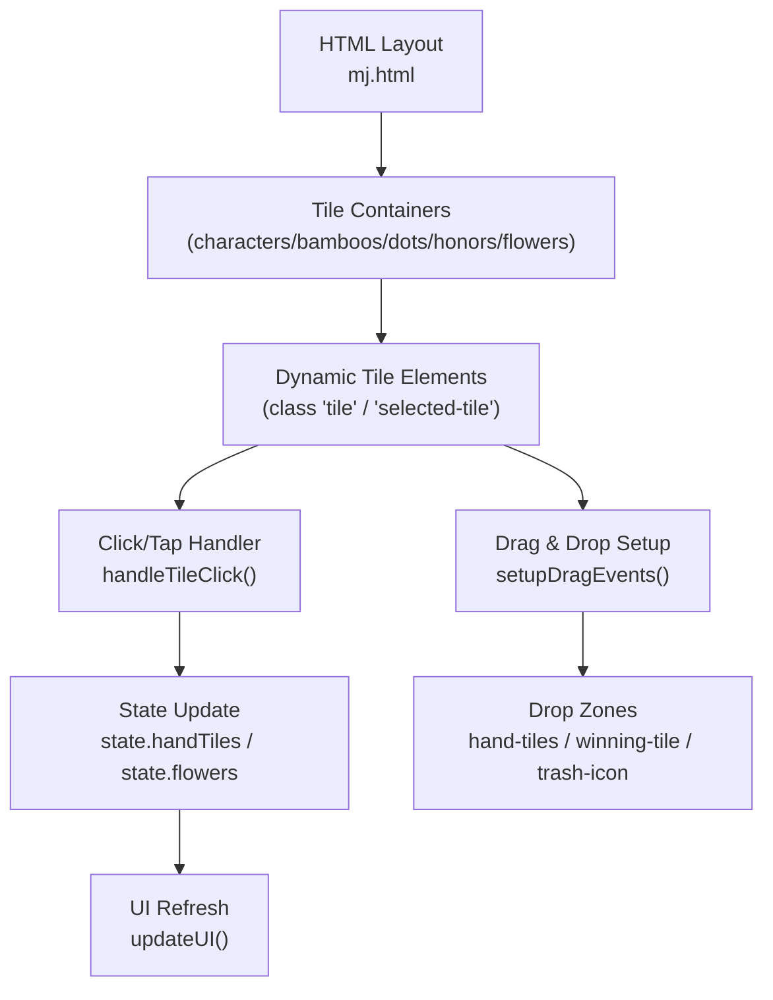
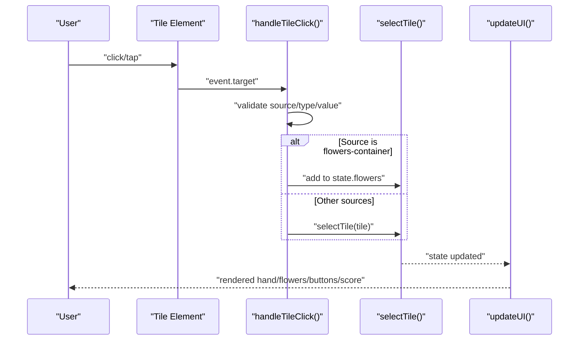
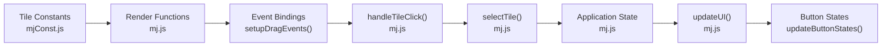
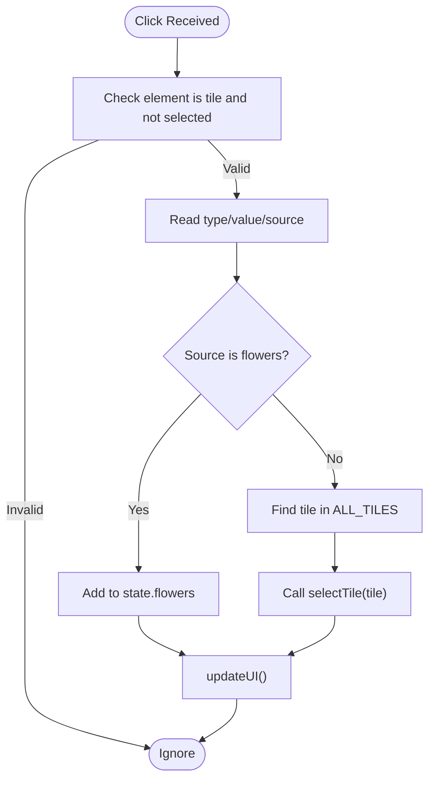

# Click Event Handlers

<cite>
**Referenced Files in This Document**
- [mj.js](file://mj.js)
- [mj.html](file://mj.html)
- [mjConst.js](file://mjConst.js)
</cite>

## Table of Contents
1. [Introduction](#introduction)
2. [Project Structure](#project-structure)
3. [Core Components](#core-components)
4. [Architecture Overview](#architecture-overview)
5. [Detailed Component Analysis](#detailed-component-analysis)
6. [Dependency Analysis](#dependency-analysis)
7. [Performance Considerations](#performance-considerations)
8. [Troubleshooting Guide](#troubleshooting-guide)
9. [Conclusion](#conclusion)
10. [Appendices](#appendices)

## Introduction
This document explains the click event handling system in the OV MJ Calculator, focusing on how tile selection works through clicks and touch interactions, how validation prevents invalid or duplicate selections, and how click events integrate with the application state to update hand tiles and flower collections. It also covers event delegation patterns used for dynamically created tile elements, accessibility considerations, and the relationship between click events and drag-and-drop interactions.

## Project Structure
The application is a single-page interface composed of:
- HTML layout defining containers for selectable tiles (characters, bamboos, dots, honors), flowers, hand tiles, exposed groups, winning tile area, and controls.
- JavaScript that renders tile elements, attaches event listeners, manages application state, and updates the UI.
- Constants that define tile types and tile data.

**Diagram sources**
- [mj.html:13-58](file://mj.html#L13-L58)
- [mj.js:535-578](file://mj.js#L535-L578)
- [mj.js:151-177](file://mj.js#L151-L177)
- [mj.js:909-917](file://mj.js#L909-L917)

**Section sources**
- [mj.html:13-58](file://mj.html#L13-L58)
- [mj.js:535-578](file://mj.js#L535-L578)
- [mj.js:909-917](file://mj.js#L909-L917)

## Core Components
- Tile rendering and source assignment:
  - Tiles are created per container with dataset attributes (type, value, source) and made draggable.
  - Flowers are rendered separately into the flowers container.
- Click handler:
  - handleTileClick processes clicks on tiles from different sources and routes them to either flower collection or hand tile selection.
- State management:
  - selectTile validates and updates hand tiles; flower addition updates the flowers array.
- UI synchronization:
  - updateUI refreshes counts, displays, button states, and score calculations after any state change.

**Section sources**
- [mj.js:535-578](file://mj.js#L535-L578)
- [mj.js:151-177](file://mj.js#L151-L177)
- [mj.js:1172-1209](file://mj.js#L1172-L1209)
- [mj.js:909-917](file://mj.js#L909-L917)

## Architecture Overview
The click-to-select flow integrates with drag-and-drop and state updates:

**Diagram sources**
- [mj.js:151-177](file://mj.js#L151-L177)
- [mj.js:1172-1209](file://mj.js#L1172-L1209)
- [mj.js:909-917](file://mj.js#L909-L917)

## Detailed Component Analysis

### Click Handler: handleTileClick
Responsibilities:
- Identify the clicked element and ensure it is a valid tile and not already selected.
- Extract tile metadata (type, value, source).
- Route to appropriate logic:
  - If source is flowers-container, add the matching flower tile to state.flowers.
  - Otherwise, find the corresponding tile in ALL_TILES and call selectTile to add to hand tiles.
- Show status feedback and trigger UI update.

Validation rules enforced here:
- Ignore non-tile elements.
- Ignore tiles already marked as selected-tile.
- Ensure tile exists in the relevant dataset before acting.

Integration points:
- Uses constants for tile definitions.
- Updates state via selectTile or direct push to state.flowers.
- Calls updateUI to reflect changes.

**Section sources**
- [mj.js:151-177](file://mj.js#L151-L177)
- [mjConst.js:1-65](file://mjConst.js#L1-L65)

### Tile Selection Logic: selectTile
Responsibilities:
- Save current state to history for undo support.
- Enforce maximum count per tile type (up to 4).
- Enforce total hand tile limit based on exposed groups.
- Auto-set winning tile when hand reaches required length and no winning tile is set.
- Push tile to state.handTiles and refresh UI.

Validation rules enforced here:
- Per-tile cap: prevent selecting more than four identical tiles.
- Hand size cap: respect 16 minus exposed-group penalty.
- Winning tile auto-selection when hand is complete.

Error handling:
- Alerts user when limits are exceeded.
- Prevents invalid state transitions.

**Section sources**
- [mj.js:1172-1209](file://mj.js#L1172-L1209)

### Touch Interaction and Tap-as-Click
Responsibilities:
- Detect long press vs quick tap to differentiate drag initiation from click behavior.
- On short taps (duration under threshold), simulate a click by invoking handleTileClick.
- Maintain touch-active class during interaction and clean up on end.

Key behaviors:
- Long press threshold triggers drag image creation.
- Quick tap bypasses drag and treats as click.
- Ensures proper cleanup of temporary drag images and state.

**Section sources**
- [mj.js:179-308](file://mj.js#L179-L308)

### Event Delegation and Dynamic Elements
Responsibilities:
- setupDragEvents attaches consistent handlers to each tile element at creation time.
- For newly created tiles (e.g., selected tiles added to hand), setupDragEvents ensures they can be dragged and supports click handling only if not already selected.
- initializeTiles re-applies event bindings to existing static tiles on DOMContentLoaded.

Patterns used:
- Per-element binding for dynamic content rather than global delegation, ensuring precise control over event lifecycle and avoiding duplicate bindings.
- Removal of previous listeners before adding new ones to prevent memory leaks and double-firing.

**Section sources**
- [mj.js:67-91](file://mj.js#L67-L91)
- [mj.js:535-578](file://mj.js#L535-L578)
- [mj.js:926-942](file://mj.js#L926-L942)
- [mj.js:1157-1170](file://mj.js#L1157-L1170)

### Drag-and-Drop Integration
Responsibilities:
- All tiles are draggable; drop zones include hand-tiles, winning-tile, and trash-icon.
- Drag start captures tile metadata; drop handlers update state accordingly.
- Touch-based drag uses custom events to emulate native drag-and-drop behavior.

Relationship to clicks:
- Clicking a tile adds it to hand or flowers; dragging allows moving tiles between areas (e.g., from selection to winning tile or trash).
- Selected tiles remain draggable for repositioning or removal.

**Section sources**
- [mj.js:44-65](file://mj.js#L44-L65)
- [mj.js:386-442](file://mj.js#L386-L442)
- [mj.js:449-522](file://mj.js#L449-L522)
- [mj.js:310-370](file://mj.js#L310-L370)

### Flower Handling
Responsibilities:
- Flowers are rendered in a dedicated container and are not added to hand tiles.
- Clicking a flower adds it to state.flowers directly without selection constraints.
- Flowers display updates reflect additions.

Validation rules:
- No duplicate prevention beyond dataset lookup; multiple instances of the same flower can be added as per design.

**Section sources**
- [mj.js:151-177](file://mj.js#L151-L177)
- [mj.js:562-578](file://mj.js#L562-L578)
- [mj.js:944-954](file://mj.js#L944-L954)

### Accessibility Considerations
Current implementation:
- Tiles are div elements with text content; no explicit keyboard navigation or ARIA attributes are present.
- Click/tap interactions rely on mouse/touch events; keyboard activation is not implemented.

Recommendations:
- Add tabindex="0" and role="button" to tile elements to enable keyboard focus.
- Implement keydown handlers for Enter/Space to trigger selection.
- Use aria-live regions for status messages to announce changes to screen readers.
- Provide visible focus indicators via CSS for keyboard users.

[No sources needed since this section provides general guidance]

### Validation Rules and Examples
Examples of validation enforced by the system:
- Prevent clicking already selected tiles: handled by ignoring elements with selected-tile class in the click handler.
- Prevent exceeding per-tile count: selectTile checks count per type and blocks additional selections beyond four.
- Prevent exceeding hand size: selectTile enforces maximum hand tiles based on exposed groups.
- Invalid combinations for actions: buttons like Chow/Pung/Kong are disabled unless conditions are met; attempting invalid actions shows error messages.

These rules ensure consistent game state and prevent illegal moves.

**Section sources**
- [mj.js:151-177](file://mj.js#L151-L177)
- [mj.js:1172-1209](file://mj.js#L1172-L1209)
- [mj.js:1054-1080](file://mj.js#L1054-L1080)

## Dependency Analysis
The click system depends on:
- Tile data definitions (types and values).
- Rendering functions that create and bind events to tile elements.
- State management functions that validate and update hand tiles and flowers.
- UI update functions that synchronize visual representation and button states.

**Diagram sources**
- [mjConst.js:1-65](file://mjConst.js#L1-L65)
- [mj.js:535-578](file://mj.js#L535-L578)
- [mj.js:67-91](file://mj.js#L67-L91)
- [mj.js:151-177](file://mj.js#L151-L177)
- [mj.js:1172-1209](file://mj.js#L1172-L1209)
- [mj.js:909-917](file://mj.js#L909-L917)
- [mj.js:1054-1080](file://mj.js#L1054-L1080)

**Section sources**
- [mjConst.js:1-65](file://mjConst.js#L1-L65)
- [mj.js:535-578](file://mj.js#L535-L578)
- [mj.js:67-91](file://mj.js#L67-L91)
- [mj.js:151-177](file://mj.js#L151-L177)
- [mj.js:1172-1209](file://mj.js#L1172-L1209)
- [mj.js:909-917](file://mj.js#L909-L917)
- [mj.js:1054-1080](file://mj.js#L1054-L1080)

## Performance Considerations
- Event listener management:
  - Removing old listeners before adding new ones avoids duplicates and reduces memory usage.
- Dynamic element creation:
  - Creating tiles per container and binding events immediately ensures efficient interaction without heavy delegation overhead.
- Touch handling:
  - Using passive listeners where appropriate and preventing default scroll during drag improves responsiveness.
- UI updates:
  - Batched updates via updateUI minimize reflows and repaints.

[No sources needed since this section provides general guidance]

## Troubleshooting Guide
Common issues and resolutions:
- Click does nothing:
  - Ensure the element has the correct class and dataset attributes; verify source is set.
  - Check that the element is not already marked as selected-tile.
- Duplicate selection prevented unexpectedly:
  - Verify per-tile count limits and hand size caps; check exposed groups affecting max hand tiles.
- Touch tap treated as drag:
  - Adjust tap duration threshold or ensure touchmove is not triggered prematurely.
- Drag-and-drop not working:
  - Confirm drop zones exist and have correct IDs; verify dataTransfer payload contains required fields.

**Section sources**
- [mj.js:151-177](file://mj.js#L151-L177)
- [mj.js:1172-1209](file://mj.js#L1172-L1209)
- [mj.js:386-442](file://mj.js#L386-L442)
- [mj.js:449-522](file://mj.js#L449-L522)

## Conclusion
The OV MJ Calculator’s click event handling system provides a robust mechanism for selecting tiles from various sources, enforcing validation rules to maintain valid game states, and integrating seamlessly with drag-and-drop interactions. The architecture leverages per-element event binding for dynamic tiles, clear separation of concerns between rendering, event handling, state management, and UI updates, and includes touch support for mobile devices. While functional, accessibility enhancements such as keyboard navigation and ARIA attributes would improve usability for all users.

[No sources needed since this section summarizes without analyzing specific files]

## Appendices

### Flowchart: Click Validation and Selection

**Diagram sources**
- [mj.js:151-177](file://mj.js#L151-L177)
- [mj.js:1172-1209](file://mj.js#L1172-L1209)
- [mj.js:909-917](file://mj.js#L909-L917)