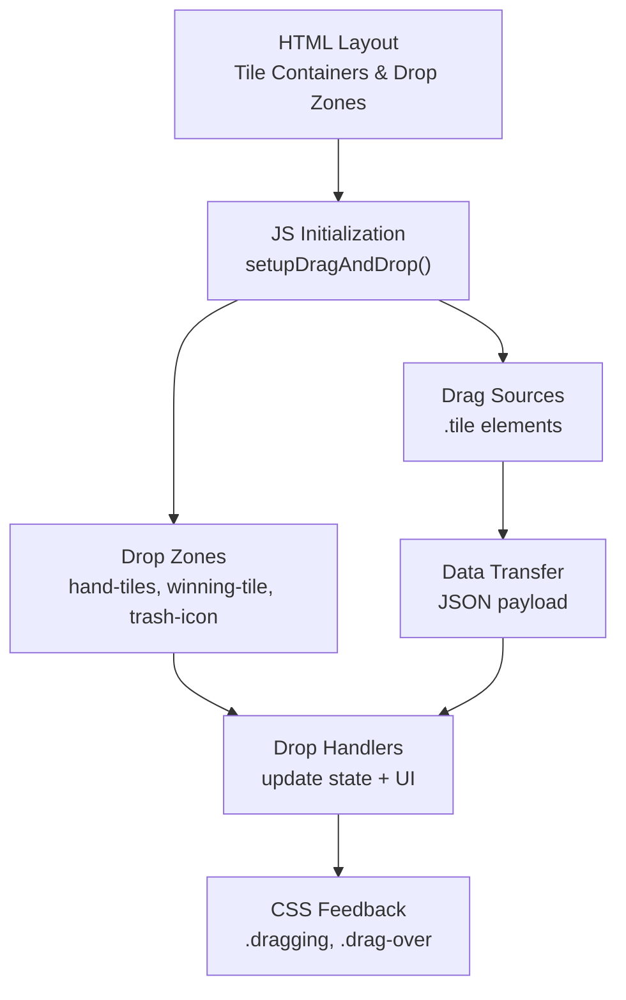
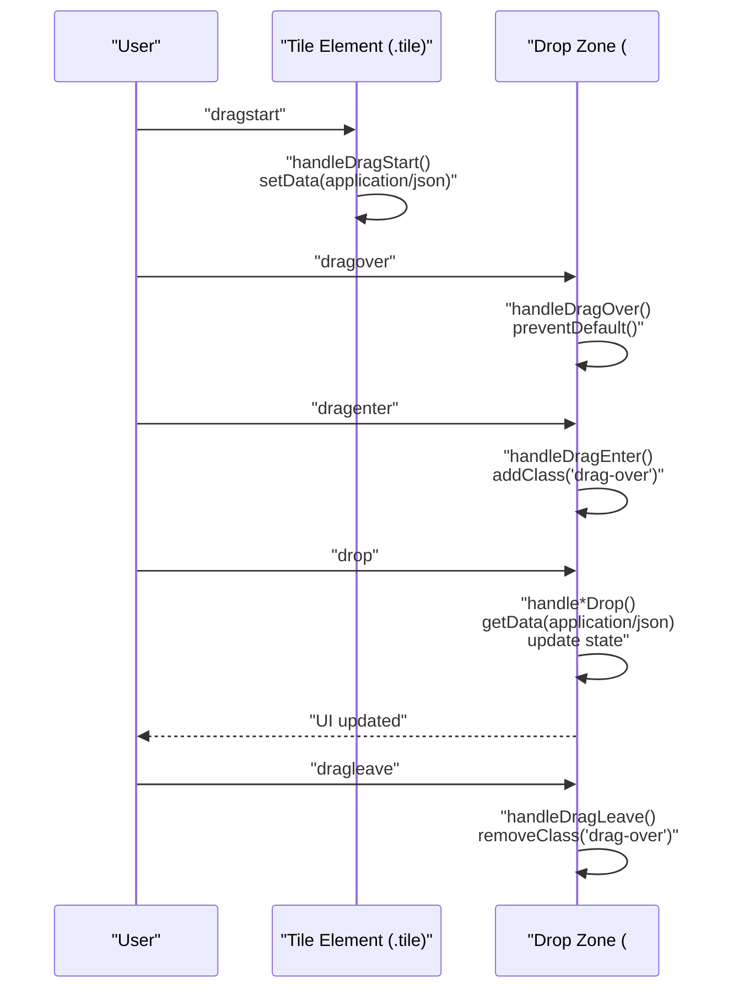
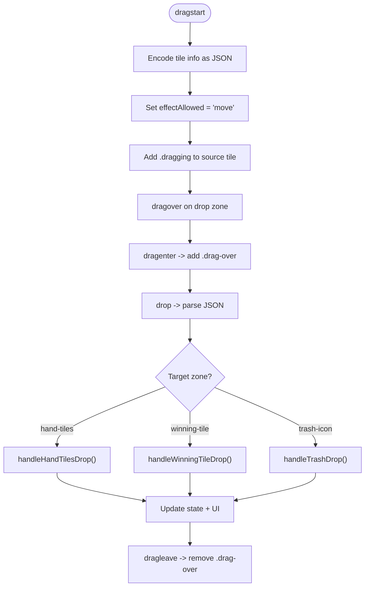
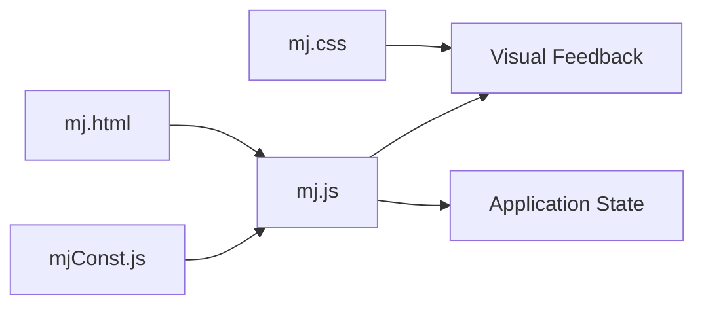

# Drag and Drop System

<cite>
**Referenced Files in This Document**
- [mj.html](file://mj.html)
- [mj.js](file://mj.js)
- [mj.css](file://mj.css)
- [mjConst.js](file://mjConst.js)
</cite>

## Table of Contents
1. [Introduction](#introduction)
2. [Project Structure](#project-structure)
3. [Core Components](#core-components)
4. [Architecture Overview](#architecture-overview)
5. [Detailed Component Analysis](#detailed-component-analysis)
6. [Dependency Analysis](#dependency-analysis)
7. [Performance Considerations](#performance-considerations)
8. [Troubleshooting Guide](#troubleshooting-guide)
9. [Conclusion](#conclusion)

## Introduction
This document explains the drag-and-drop system used in the OV MJ Calculator to move Mahjong tiles between source containers, hand area, winning tile slot, and trash. It covers:
- HTML5 Drag and Drop API usage (dragstart, dragover, dragenter, dragleave, drop)
- Custom data transfer using JSON serialization for tile metadata
- Visual feedback via CSS classes such as dragging and drag-over states
- Setup process for draggable tiles and drop zones, including dynamic element creation and event listener attachment
- Handling different tile types (萬子, 索子, 筒子, 字牌) and their behaviors
- Browser compatibility considerations and fallback mechanisms (touch-based drag simulation)

## Project Structure
The drag-and-drop feature spans three files:
- HTML defines the UI layout with containers for tile sources and drop zones
- JavaScript implements initialization, event binding, drag handlers, drop handlers, and state updates
- CSS provides visual feedback for dragging and drop targets
- Constants define tile types and tile sets

**Diagram sources**
- [mj.html:13-58](file://mj.html#L13-L58)
- [mj.js:36-65](file://mj.js#L36-L65)
- [mj.js:386-442](file://mj.js#L386-L442)
- [mj.js:449-522](file://mj.js#L449-L522)
- [mj.css:291-311](file://mj.css#L291-L311)
- [mj.css:329-335](file://mj.css#L329-L335)

**Section sources**
- [mj.html:13-58](file://mj.html#L13-L58)
- [mj.js:36-65](file://mj.js#L36-L65)
- [mj.css:291-311](file://mj.css#L291-L311)
- [mj.css:329-335](file://mj.css#L329-L335)

## Core Components
- Tile sources: Four containers render all standard tiles by type (萬子, 索子, 筒子, 字牌). Each tile is a draggable div with dataset attributes describing its type, value, display text, and source container.
- Drop zones:
  - Hand area (手牌): Accepts tiles into the player’s hand
  - Winning tile slot (糊牌): Accepts exactly one tile as the winning tile
  - Trash icon (🗑️): Removes tiles from hand or clears the winning tile
- Data transfer: Uses application/json to pass tile metadata (type, value, source, display)
- Visual feedback:
  - .dragging on the original tile during drag
  - .drag-over on drop zones when a valid drag enters
- Touch support: A custom touch-based drag simulation mimics drag behavior on mobile devices

**Section sources**
- [mjConst.js:1-65](file://mjConst.js#L1-L65)
- [mj.js:535-578](file://mj.js#L535-L578)
- [mj.js:386-442](file://mj.js#L386-L442)
- [mj.js:449-522](file://mj.js#L449-L522)
- [mj.css:291-311](file://mj.css#L291-L311)
- [mj.css:329-335](file://mj.css#L329-L335)

## Architecture Overview
The system initializes on DOMContentLoaded, renders tile sources, attaches drag events to all tiles, and configures drop zones. During drag, JSON-encoded tile data is attached to the drag event. Drop handlers update application state and re-render relevant UI sections.

**Diagram sources**
- [mj.js:386-442](file://mj.js#L386-L442)
- [mj.js:449-522](file://mj.js#L449-L522)

## Detailed Component Analysis

### Drag Source Setup and Event Binding
- Tiles are created dynamically for each tile type and appended to their respective containers. Each tile receives:
  - class names for styling and type identification
  - dataset attributes: type, value, source, display
  - draggable attribute set to true
  - event listeners for dragstart and dragend
- Selected tiles in the hand area also receive these attributes and listeners so they can be moved back or discarded.

Key responsibilities:
- Dynamic creation and configuration of tile elements
- Attaching consistent drag event listeners across all tiles
- Ensuring newly added tiles are draggable after rendering

**Section sources**
- [mj.js:535-578](file://mj.js#L535-L578)
- [mj.js:926-942](file://mj.js#L926-L942)
- [mj.js:1037-1052](file://mj.js#L1037-L1052)
- [mj.js:1157-1170](file://mj.js#L1157-L1170)

### Drag Events (dragstart, dragover, dragenter, dragleave, drop)
- dragstart: Encodes tile metadata as JSON under application/json and sets effectAllowed to move; adds .dragging class to the source tile
- dragover: Prevents default and allows drop with move effect
- dragenter/dragleave: Adds/removes .drag-over on valid drop zones for visual feedback
- drop: Parses JSON data and routes to specific handlers based on target zone

**Diagram sources**
- [mj.js:386-442](file://mj.js#L386-L442)
- [mj.js:449-522](file://mj.js#L449-L522)

**Section sources**
- [mj.js:386-442](file://mj.js#L386-L442)
- [mj.js:449-522](file://mj.js#L449-L522)

### Drop Handlers and State Updates
- handleHandTilesDrop:
  - If dropped from winning tile, moves it back to hand
  - Otherwise selects the tile into the hand (if not already there)
- handleWinningTileDrop:
  - Moves current winning tile back to hand if present
  - Sets new winning tile from dragged source
  - Removes the tile from hand if it was dragged from hand
- handleTrashDrop:
  - Removes tile from hand if dragged from hand
  - Clears winning tile if dragged from winning slot

All handlers parse JSON data and call updateUI to reflect changes.

**Section sources**
- [mj.js:449-522](file://mj.js#L449-L522)

### Visual Feedback System (CSS Classes)
- .dragging: Applied to the source tile during drag to indicate it is being moved
- .drag-over: Applied to drop zones when a valid drag enters to highlight them
- Additional styles ensure proper z-indexing, pointer-events handling, and responsive behavior

These classes are toggled by dragenter/dragleave and during drag lifecycle.

**Section sources**
- [mj.css:291-311](file://mj.css#L291-L311)
- [mj.css:329-335](file://mj.css#L329-L335)

### Touch-Based Drag Simulation (Fallback Mechanism)
To support mobile browsers where native drag-and-drop may be limited:
- touchstart records initial position and starts a long-press timer
- touchmove calculates movement threshold; once exceeded, creates a floating clone with .dragging class that follows the finger
- touchend determines the drop target and triggers the appropriate drop handler with a synthetic dataTransfer-like object containing JSON stringified tile data
- Prevents scrolling during drag and ensures drop zones respond correctly

This approach mirrors the desktop drag-and-drop flow while providing a consistent UX on touch devices.

**Section sources**
- [mj.js:179-377](file://mj.js#L179-L377)
- [mj.css:337-342](file://mj.css#L337-L342)
- [mj.css:360-370](file://mj.css#L360-L370)

### Handling Different Tile Types (萬子, 索子, 筒子, 字牌)
- Tile types are defined centrally and used to:
  - Render tiles with appropriate CSS classes (character, bamboo, dot, honor)
  - Identify tiles during drag and drop operations
  - Apply correct styling and validation rules
- The same drag-and-drop logic applies uniformly across all tile types; differences are handled via type/value metadata and CSS classes

Examples of behavior:
- 萬子 (characters), 索子 (bamboos), 筒子 (dots), 字牌 (honors) are all draggable and droppable into hand or winning tile areas
- Flowers (花牌) are rendered separately and can be added to the flowers selection via click or drag

**Section sources**
- [mjConst.js:1-65](file://mjConst.js#L1-L65)
- [mj.js:524-533](file://mj.js#L524-L533)
- [mj.js:535-578](file://mj.js#L535-L578)

### Setup Process Summary
- On DOMContentLoaded:
  - Initialize tiles and attach drag events to existing elements
  - Configure drop zones for hand, winning tile, and trash
- When tiles are rendered or updated:
  - Ensure draggable attribute and event listeners are attached to new elements
  - Re-initialize drag events for selected tiles in the hand area

**Section sources**
- [mj.js:118-148](file://mj.js#L118-L148)
- [mj.js:535-578](file://mj.js#L535-L578)
- [mj.js:926-942](file://mj.js#L926-L942)
- [mj.js:1157-1170](file://mj.js#L1157-L1170)

## Dependency Analysis
- mj.html provides structural anchors (IDs) for drop zones and tile containers
- mjConst.js defines tile types and tile datasets used throughout rendering and drag logic
- mj.js orchestrates:
  - Rendering of tiles and selection areas
  - Drag-and-drop event wiring
  - State management and UI updates
- mj.css supplies visual states for interaction feedback

**Diagram sources**
- [mj.html:13-58](file://mj.html#L13-L58)
- [mjConst.js:1-65](file://mjConst.js#L1-L65)
- [mj.js:36-65](file://mj.js#L36-L65)
- [mj.css:291-311](file://mj.css#L291-L311)

**Section sources**
- [mj.html:13-58](file://mj.html#L13-L58)
- [mjConst.js:1-65](file://mjConst.js#L1-L65)
- [mj.js:36-65](file://mj.js#L36-L65)
- [mj.css:291-311](file://mj.css#L291-L311)

## Performance Considerations
- Event listener deduplication: Before attaching listeners, existing ones are removed to prevent duplicates when elements are re-rendered
- Efficient DOM updates: Only relevant sections are re-rendered after state changes
- Minimal overhead during drag: Lightweight JSON payload and simple class toggling keep interactions responsive
- Touch simulation avoids heavy computations; only clones the tile once per drag session

[No sources needed since this section provides general guidance]

## Troubleshooting Guide
Common issues and resolutions:
- Drag does not start:
  - Ensure the element has draggable="true" and event listeners attached
  - Check that setupDragEvents is called for dynamically created tiles
- Drop not recognized:
  - Verify drop zones have dragover listeners calling preventDefault
  - Confirm dataTransfer contains application/json with valid payload
- Visual feedback missing:
  - Ensure dragenter/dragleave toggle .drag-over on correct IDs
  - Check CSS rules for .drag-over and .dragging are applied
- Mobile drag not working:
  - Confirm touch listeners are active and long-press threshold is reached
  - Validate that touchmove prevents default scrolling during drag

**Section sources**
- [mj.js:67-91](file://mj.js#L67-L91)
- [mj.js:93-116](file://mj.js#L93-L116)
- [mj.js:386-442](file://mj.js#L386-L442)
- [mj.js:179-377](file://mj.js#L179-L377)
- [mj.css:291-311](file://mj.css#L291-L311)
- [mj.css:329-335](file://mj.css#L329-L335)

## Conclusion
The OV MJ Calculator implements a robust drag-and-drop system combining HTML5 Drag and Drop with a touch-based fallback. It uses JSON serialization to transfer tile metadata, applies clear visual feedback through CSS classes, and supports all tile types uniformly. The architecture cleanly separates concerns across HTML structure, JavaScript logic, and CSS styling, ensuring maintainability and cross-device compatibility.

[No sources needed since this section summarizes without analyzing specific files]