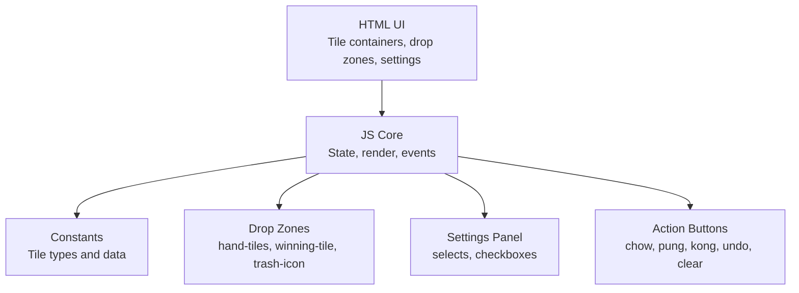
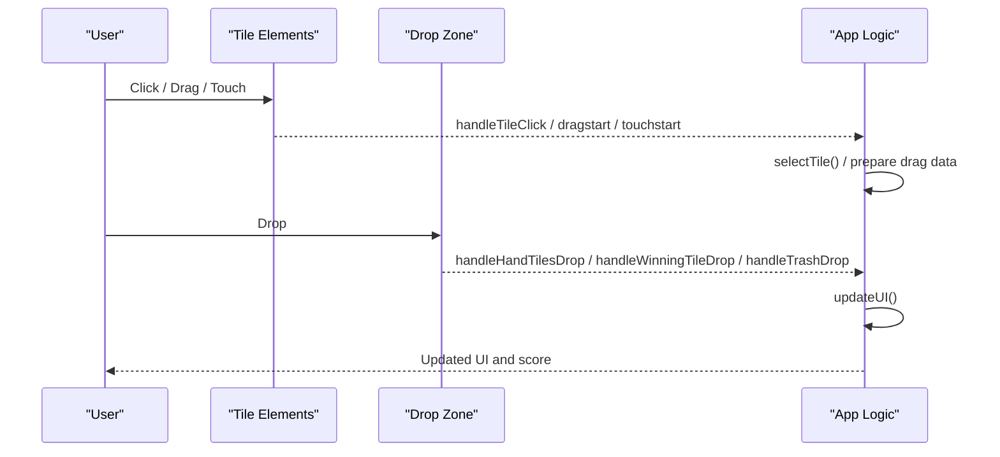
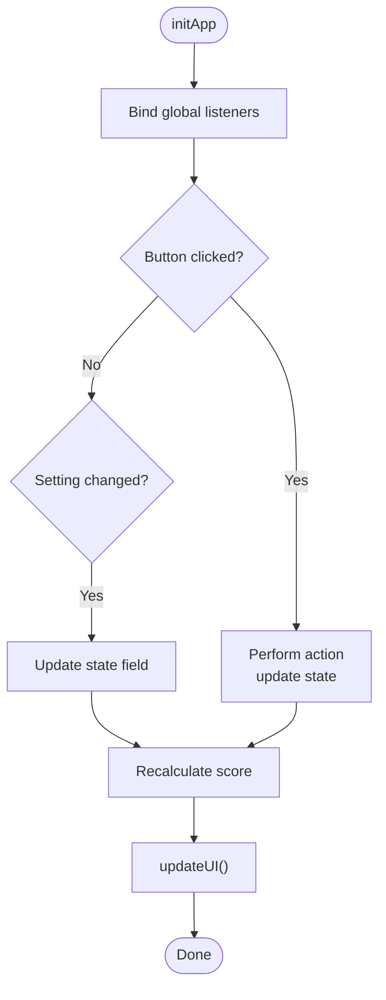
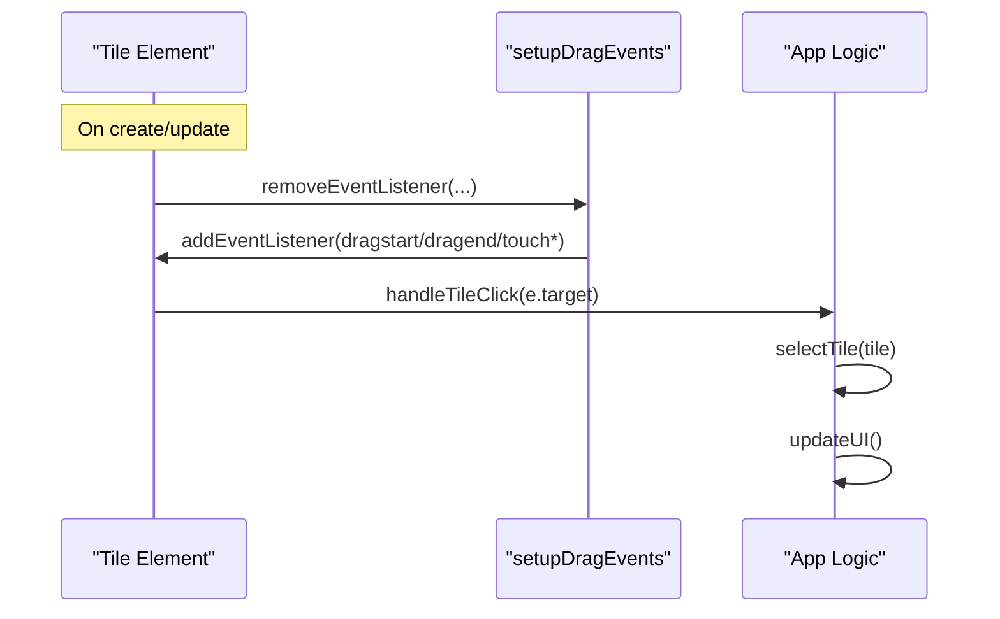
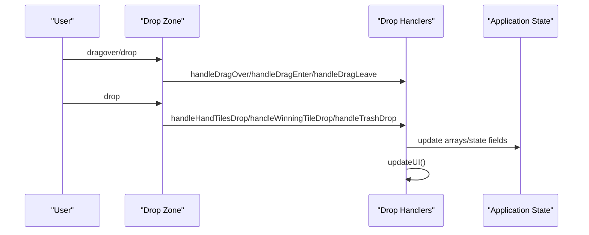
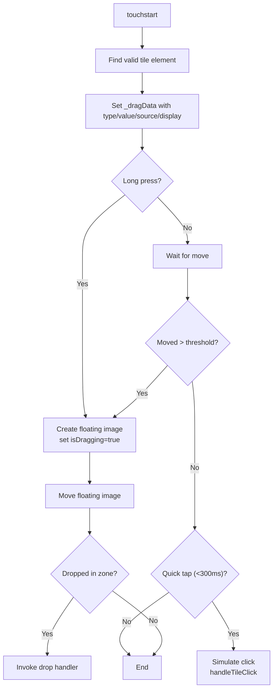
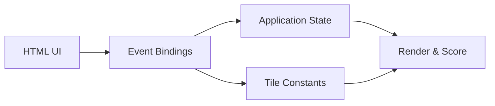

# Event Delegation Patterns

<cite>
**Referenced Files in This Document**
- [mj.js](file://mj.js)
- [mj.html](file://mj.html)
- [mjConst.js](file://mjConst.js)
</cite>

## Table of Contents
1. [Introduction](#introduction)
2. [Project Structure](#project-structure)
3. [Core Components](#core-components)
4. [Architecture Overview](#architecture-overview)
5. [Detailed Component Analysis](#detailed-component-analysis)
6. [Dependency Analysis](#dependency-analysis)
7. [Performance Considerations](#performance-considerations)
8. [Troubleshooting Guide](#troubleshooting-guide)
9. [Conclusion](#conclusion)
10. [Appendices](#appendices)

## Introduction
This document explains the event delegation patterns used in the OV MJ Calculator to achieve optimal performance and maintainability. The application attaches centralized listeners to parent containers for dynamic tile elements and uses a single setup function to bind global UI controls, form inputs, and action buttons. It covers how listeners are added, removed, and updated as the DOM changes; how multiple similar elements (tiles and settings) are handled efficiently; examples of event bubbling prevention and target identification; memory leak prevention through proper cleanup; and guidance for extending the system with new interactive components.

## Project Structure
The calculator is implemented with three primary files:
- HTML defines the UI structure, including tile containers, selection areas, drop zones, and settings controls.
- JavaScript implements state management, rendering, drag-and-drop, and event binding.
- Constants define tile types and data for tiles and flowers.

**Diagram sources**
- [mj.html:13-58](file://mj.html#L13-L58)
- [mj.html:60-235](file://mj.html#L60-L235)
- [mj.js:580-703](file://mj.js#L580-L703)
- [mj.js:118-148](file://mj.js#L118-L148)
- [mjConst.js:1-65](file://mjConst.js#L1-L65)

**Section sources**
- [mj.html:13-58](file://mj.html#L13-L58)
- [mj.html:60-235](file://mj.html#L60-L235)
- [mj.js:580-703](file://mj.js#L580-L703)
- [mj.js:118-148](file://mj.js#L118-L148)
- [mjConst.js:1-65](file://mjConst.js#L1-L65)

## Core Components
- Centralized event listener setup for UI controls and settings via a dedicated function that binds click and change handlers to specific IDs.
- Dynamic tile interaction using per-element listeners attached only when tiles are created or updated, with explicit removal before re-binding to avoid duplicates.
- Drop zone handling for drag-and-drop interactions across hand tiles, winning tile area, and trash icon.
- Touch-based drag-and-drop with long-press detection and simulated clicks for quick taps.

Key responsibilities:
- Global bindings: action buttons and all settings inputs update state and trigger score recalculation.
- Tile interactions: click-to-select, drag-and-drop, and touch gestures.
- Drop zones: accept dropped tiles and update state accordingly.
- Rendering updates: after any state change, UI reflects current selections and scoring.

**Section sources**
- [mj.js:580-703](file://mj.js#L580-L703)
- [mj.js:44-65](file://mj.js#L44-L65)
- [mj.js:67-91](file://mj.js#L67-L91)
- [mj.js:93-116](file://mj.js#L93-L116)
- [mj.js:118-148](file://mj.js#L118-L148)
- [mj.js:150-177](file://mj.js#L150-L177)
- [mj.js:179-308](file://mj.js#L179-L308)
- [mj.js:386-442](file://mj.js#L386-L442)
- [mj.js:449-522](file://mj.js#L449-L522)

## Architecture Overview
The application follows a hybrid approach:
- For static UI controls (buttons and settings), it uses direct ID-based listeners bound once during initialization.
- For dynamic tile elements, it attaches listeners at creation/update time, ensuring each element has exactly one set of handlers.
- Drag-and-drop targets are configured centrally and reused across mouse and touch flows.

**Diagram sources**
- [mj.js:150-177](file://mj.js#L150-L177)
- [mj.js:386-442](file://mj.js#L386-L442)
- [mj.js:449-522](file://mj.js#L449-L522)
- [mj.js:909-917](file://mj.js#L909-L917)

## Detailed Component Analysis

### Centralized Event Listener Setup (Global Controls and Settings)
The application binds listeners for action buttons and all settings inputs in a single function. Each control updates the application state and triggers recalculations. This centralization simplifies maintenance and ensures consistent behavior.

- Action buttons: add chow/pung/kong actions, undo last action, and clear selection.
- Settings panel: seat wind, round wind, dealer flags and counts, special conditions, multi-win options, and visibility counters.
- All change handlers call a common calculation routine to keep the score display current.

**Diagram sources**
- [mj.js:36-42](file://mj.js#L36-L42)
- [mj.js:580-703](file://mj.js#L580-L703)
- [mj.js:909-917](file://mj.js#L909-L917)

**Section sources**
- [mj.js:580-703](file://mj.js#L580-L703)
- [mj.js:36-42](file://mj.js#L36-L42)
- [mj.js:909-917](file://mj.js#L909-L917)

### Dynamic Tile Interaction and Delegation Pattern
While many modern apps use true event delegation on a parent container, this implementation uses a pragmatic hybrid:
- Per-element listeners are attached to each tile when it is created or updated.
- Before attaching new listeners, old ones are explicitly removed to prevent duplicate bindings and memory leaks.
- This pattern ensures efficient handling of many similar elements without scanning a large parent for every event.

Key behaviors:
- Click-to-select tiles adds them to the hand or flowers based on source context.
- Drag-and-drop supports both mouse and touch interactions with visual feedback.
- Touch gestures include long-press detection to start dragging and quick tap simulation for clicks.

**Diagram sources**
- [mj.js:67-91](file://mj.js#L67-L91)
- [mj.js:150-177](file://mj.js#L150-L177)
- [mj.js:926-942](file://mj.js#L926-L942)

**Section sources**
- [mj.js:67-91](file://mj.js#L67-L91)
- [mj.js:150-177](file://mj.js#L150-L177)
- [mj.js:926-942](file://mj.js#L926-L942)

### Drop Zone Management and Target Identification
Drop zones are configured centrally and reused for both mouse and touch flows. The code identifies the correct drop target by element IDs and delegates to appropriate handlers.

- Mouse dragover/drop/enter/leave events manage visual states and process drops.
- Touch flows simulate drag-and-drop by creating a floating image and invoking the same handlers.
- Target identification uses closest traversal and explicit IDs to ensure correct routing.

**Diagram sources**
- [mj.js:93-116](file://mj.js#L93-L116)
- [mj.js:118-148](file://mj.js#L118-L148)
- [mj.js:386-442](file://mj.js#L386-L442)
- [mj.js:449-522](file://mj.js#L449-L522)

**Section sources**
- [mj.js:93-116](file://mj.js#L93-L116)
- [mj.js:118-148](file://mj.js#L118-L148)
- [mj.js:386-442](file://mj.js#L386-L442)
- [mj.js:449-522](file://mj.js#L449-L522)

### Touch-Based Drag-and-Drop with Long Press and Click Simulation
Touch interactions are carefully managed to support both dragging and clicking:
- Long press threshold starts a drag operation with a floating image.
- Quick taps simulate clicks to add tiles to the hand or flowers.
- Prevent default scrolling during drag operations improves UX.

**Diagram sources**
- [mj.js:179-308](file://mj.js#L179-L308)
- [mj.js:310-370](file://mj.js#L310-L370)
- [mj.js:372-384](file://mj.js#L372-L384)

**Section sources**
- [mj.js:179-308](file://mj.js#L179-L308)
- [mj.js:310-370](file://mj.js#L310-L370)
- [mj.js:372-384](file://mj.js#L372-L384)

### Event Bubbling Prevention and Target Identification
- Bubbling prevention: In selected contexts, propagation is stopped to avoid unintended parent handlers interfering with drag-and-drop interactions.
- Target identification: The code frequently uses e.target and closest traversal to determine the actual element involved, ensuring robust handling even when nested elements trigger events.

Examples:
- Stop propagation when touching selected tiles within drop zones to avoid triggering parent handlers.
- Identify drop zones by IDs and use closest to find the nearest valid container.

**Section sources**
- [mj.js:109-113](file://mj.js#L109-L113)
- [mj.js:188-202](file://mj.js#L188-L202)
- [mj.js:336-348](file://mj.js#L336-L348)

### Memory Leak Prevention Through Proper Cleanup
To prevent memory leaks and duplicate bindings:
- Before adding new listeners to an element, existing listeners are removed explicitly.
- When tiles are re-rendered or updated, listeners are reattached only to newly created or modified elements.
- Temporary properties and references (like floating images and drag data) are cleaned up on touch end.

Practices observed:
- Remove all relevant listeners (dragstart, dragend, touch*, click) before reattaching.
- Clear timeouts and delete temporary properties on element teardown.
- Ensure floating images are removed from the DOM after drag ends.

**Section sources**
- [mj.js:67-91](file://mj.js#L67-L91)
- [mj.js:270-308](file://mj.js#L270-L308)
- [mj.js:926-942](file://mj.js#L926-L942)

### Handling Multiple Similar Elements Efficiently
The application handles many similar tile elements efficiently by:
- Attaching listeners at creation/update time rather than scanning a large parent for every event.
- Using data attributes to identify tile type, value, and source, enabling uniform processing logic.
- Reusing helper functions to set up drag events consistently across all tile containers.

This approach scales well as the number of tiles grows and keeps event handling predictable.

**Section sources**
- [mj.js:535-578](file://mj.js#L535-L578)
- [mj.js:926-942](file://mj.js#L926-L942)
- [mj.js:1157-1170](file://mj.js#L1157-L1170)

## Dependency Analysis
The event system depends on:
- HTML structure: IDs for drop zones, buttons, and settings inputs.
- Constants: Tile types and data used to render tiles and assign classes.
- Application state: Changes triggered by events update state and drive UI updates.

**Diagram sources**
- [mj.html:13-58](file://mj.html#L13-L58)
- [mj.html:60-235](file://mj.html#L60-L235)
- [mj.js:580-703](file://mj.js#L580-L703)
- [mjConst.js:1-65](file://mjConst.js#L1-L65)

**Section sources**
- [mj.html:13-58](file://mj.html#L13-L58)
- [mj.html:60-235](file://mj.html#L60-L235)
- [mj.js:580-703](file://mj.js#L580-L703)
- [mjConst.js:1-65](file://mjConst.js#L1-L65)

## Performance Considerations
- Centralized bindings for static controls reduce overhead and simplify maintenance.
- Per-element listeners for dynamic tiles avoid expensive parent-level delegation scans while keeping interactions responsive.
- Explicit removal of listeners before reattachment prevents duplicate handlers and memory growth.
- Touch handling minimizes layout thrashing by updating a single floating image and deferring heavy operations until drop.

[No sources needed since this section provides general guidance]

## Troubleshooting Guide
Common issues and remedies:
- Duplicate listeners: Ensure removeEventListener is called before addEventListener for each relevant event type.
- Missing drop zones: Verify IDs exist and are present before binding; log errors if not found.
- Touch interference: Use passive:false where necessary and call preventDefault to avoid scrolling during drag.
- Floating image not removed: Clean up on touchend and dragend to prevent orphaned nodes.

**Section sources**
- [mj.js:67-91](file://mj.js#L67-L91)
- [mj.js:118-148](file://mj.js#L118-L148)
- [mj.js:270-308](file://mj.js#L270-L308)

## Conclusion
The OV MJ Calculator employs a hybrid event strategy that balances performance and maintainability:
- Centralized bindings for static controls ensure consistency and ease of updates.
- Per-element listeners for dynamic tiles provide efficient, scalable interactions with careful cleanup to prevent memory leaks.
- Robust drop zone handling supports both mouse and touch inputs with clear target identification and bubbling control.
- The system is extensible: new interactive components can follow the established patterns for listener setup, cleanup, and state-driven UI updates.

[No sources needed since this section summarizes without analyzing specific files]

## Appendices

### Extending the Event Delegation System
Guidance for adding new interactive components:
- Add new controls to the HTML with stable IDs.
- Bind listeners in the centralized setup function to update state and trigger recalculation.
- For dynamic elements, attach listeners at creation/update time using the established helper to remove old listeners first.
- If introducing new drop zones, configure them similarly to existing zones and route to appropriate handlers.
- Always clean up temporary references and remove listeners when elements are destroyed or replaced.

[No sources needed since this section provides general guidance]