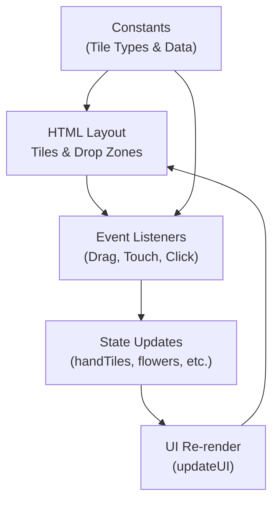
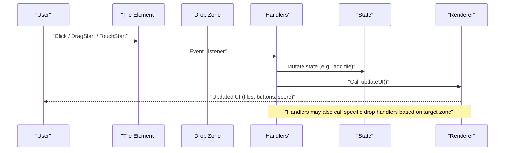
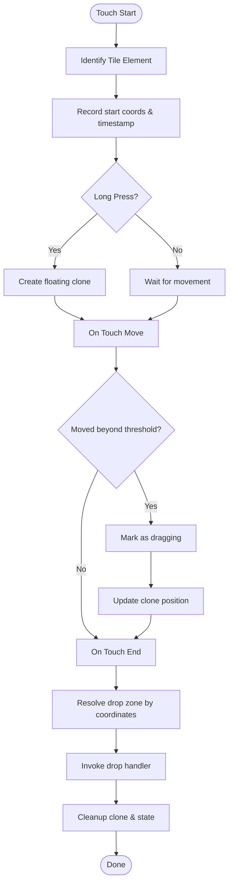
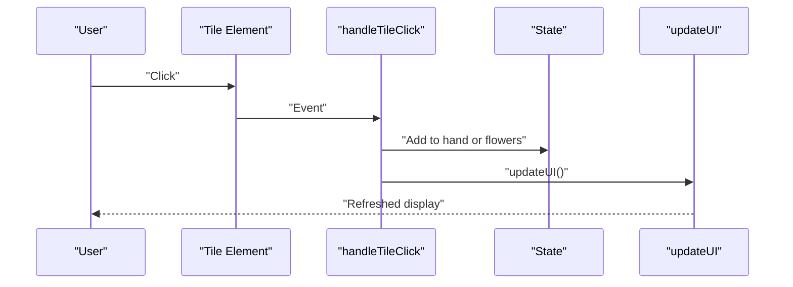
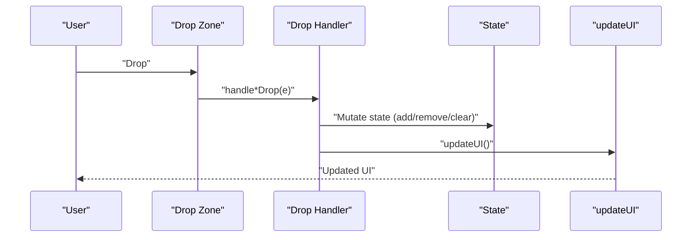
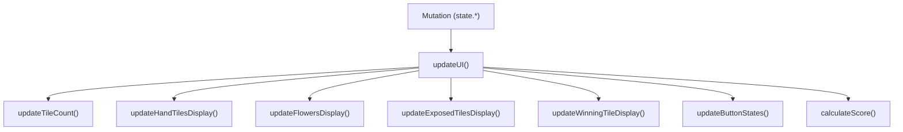
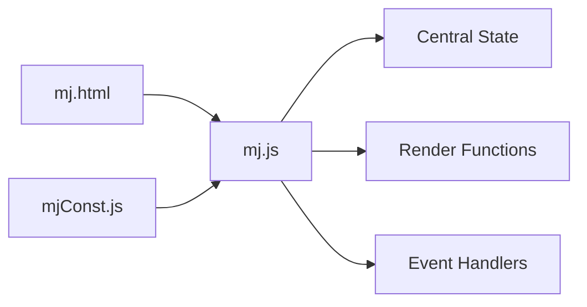

# Event Handling System

<cite>
**Referenced Files in This Document**
- [mj.js](file://mj.js)
- [mj.html](file://mj.html)
- [mjConst.js](file://mjConst.js)
</cite>

## Table of Contents
1. [Introduction](#introduction)
2. [Project Structure](#project-structure)
3. [Core Components](#core-components)
4. [Architecture Overview](#architecture-overview)
5. [Detailed Component Analysis](#detailed-component-analysis)
6. [Dependency Analysis](#dependency-analysis)
7. [Performance Considerations](#performance-considerations)
8. [Troubleshooting Guide](#troubleshooting-guide)
9. [Conclusion](#conclusion)

## Introduction
This document explains the event-driven architecture of the OV MJ Calculator with a focus on:
- Comprehensive event listener setup for drag-and-drop operations (mouse and touch)
- Touch events enabling mobile support, including long-press detection and gesture handling
- Click handlers for tile selection
- The end-to-end flow from user interactions to state updates and UI re-renders
- Event delegation patterns used across interactive elements
- Performance considerations when handling large numbers of tiles

The system is implemented as a single-page application where DOM elements represent Mahjong tiles and drop zones. User actions trigger event handlers that mutate a central state object and then update the UI accordingly.

## Project Structure
The application consists of:
- HTML layout defining containers for tile sources, hand area, exposed groups, winning tile zone, and controls
- JavaScript module implementing state management, rendering, and all event handling logic
- Constants module defining tile types and tile data

**Diagram sources**
- [mj.html:13-58](file://mj.html#L13-L58)
- [mj.js:36-42](file://mj.js#L36-L42)
- [mjConst.js:1-65](file://mjConst.js#L1-L65)

**Section sources**
- [mj.html:1-248](file://mj.html#L1-L248)
- [mj.js:1-1211](file://mj.js#L1-L1211)
- [mjConst.js:1-65](file://mjConst.js#L1-L65)

## Core Components
- Central state object holds hand tiles, flowers, exposed groups, winning tile, and various flags used for scoring and validation.
- Rendering functions create tile elements, attach attributes, and bind per-tile event listeners.
- Drag-and-drop subsystem supports both native mouse drag and custom touch-based drag with long-press detection.
- Click handler adds tiles to the hand or flowers depending on source context.
- Drop zone handlers move tiles between hand, winning tile, and trash areas.
- UI update pipeline refreshes counts, displays, button states, and calculates scores.

Key responsibilities:
- Event registration and cleanup to avoid duplicate bindings
- Cross-device interaction via unified touch/mouse flows
- State mutation followed by UI synchronization

**Section sources**
- [mj.js:2-33](file://mj.js#L2-L33)
- [mj.js:36-42](file://mj.js#L36-L42)
- [mj.js:45-116](file://mj.js#L45-L116)
- [mj.js:150-177](file://mj.js#L150-L177)
- [mj.js:179-377](file://mj.js#L179-L377)
- [mj.js:449-522](file://mj.js#L449-L522)
- [mj.js:909-917](file://mj.js#L909-L917)

## Architecture Overview
The event system follows an event-driven pattern:
- Initialization sets up renderers and event listeners
- User interactions (click, drag, touch) invoke handlers that mutate state
- State changes trigger UI updates which rebind necessary listeners for dynamic content

**Diagram sources**
- [mj.js:36-42](file://mj.js#L36-L42)
- [mj.js:150-177](file://mj.js#L150-L177)
- [mj.js:449-522](file://mj.js#L449-L522)
- [mj.js:909-917](file://mj.js#L909-L917)

## Detailed Component Analysis

### Drag-and-Drop Subsystem (Mouse + Touch)
The app provides a robust drag-and-drop experience across devices:
- Mouse drag uses native dragstart/dragover/drop events
- Touch drag is implemented manually with long-press detection and a floating clone as the visual drag image
- Drop zones are configured once and reused for multiple targets (hand tiles, winning tile, trash)

Key behaviors:
- Per-tile event binding with removal before re-addition to prevent duplicates
- Long-press threshold triggers creation of a draggable clone
- Movement threshold prevents accidental drags on small taps
- Drop resolution maps touch coordinates to nearest drop zone and invokes appropriate handler

**Diagram sources**
- [mj.js:179-308](file://mj.js#L179-L308)
- [mj.js:310-377](file://mj.js#L310-L377)
- [mj.js:386-442](file://mj.js#L386-L442)

**Section sources**
- [mj.js:45-116](file://mj.js#L45-L116)
- [mj.js:179-377](file://mj.js#L179-L377)
- [mj.js:386-442](file://mj.js#L386-L442)

### Click Handlers for Tile Selection
Clicking a tile from source containers adds it to the hand or flowers:
- If the tile originates from the flowers container, it is added to the flowers array
- Otherwise, the tile is selected into the hand with validation
- After selection, the UI updates to reflect the new state

**Diagram sources**
- [mj.js:150-177](file://mj.js#L150-L177)
- [mj.js:909-917](file://mj.js#L909-L917)

**Section sources**
- [mj.js:150-177](file://mj.js#L150-L177)

### Drop Zone Handlers
Three primary drop targets exist:
- Hand tiles: accept tiles from other sources; moving from winning tile back to hand clears the winning tile
- Winning tile: accepts one tile; moving from hand to winning tile removes it from hand
- Trash: removes tiles from hand or clears the winning tile

Each handler parses drag data, mutates state accordingly, and calls updateUI.

**Diagram sources**
- [mj.js:449-522](file://mj.js#L449-L522)
- [mj.js:909-917](file://mj.js#L909-L917)

**Section sources**
- [mj.js:449-522](file://mj.js#L449-L522)

### Event Delegation Patterns
While most tile interactions use per-element listeners attached during rendering, the app also employs delegated behavior in key places:
- Drop zones register listeners once and handle events for any child element within the zone
- Touch move prevention on drop zones avoids scrolling interference while dragging
- Global dragend cleanup ensures consistent visual state after drag operations

These patterns reduce overhead and simplify maintenance when dealing with many tiles.

**Section sources**
- [mj.js:93-116](file://mj.js#L93-L116)
- [mj.js:118-148](file://mj.js#L118-L148)
- [mj.js:414-419](file://mj.js#L414-L419)

### State Updates and UI Re-renders
After any state mutation, the application calls a centralized update function that:
- Refreshes tile count indicators
- Renders hand tiles, flowers, exposed groups, and winning tile
- Updates button enablement based on current selections
- Calculates and displays scores

This separation keeps event handlers focused on intent and delegates presentation to dedicated renderers.

**Diagram sources**
- [mj.js:909-917](file://mj.js#L909-L917)
- [mj.js:919-1129](file://mj.js#L919-L1129)

**Section sources**
- [mj.js:909-1129](file://mj.js#L909-L1129)

## Dependency Analysis
- mj.html defines the DOM structure and IDs referenced by event listeners and renderers
- mjConst.js provides tile type constants and tile datasets used during rendering and selection
- mj.js wires everything together: initialization, event binding, state mutations, and UI updates

**Diagram sources**
- [mj.html:13-58](file://mj.html#L13-L58)
- [mjConst.js:1-65](file://mjConst.js#L1-L65)
- [mj.js:36-42](file://mj.js#L36-L42)

**Section sources**
- [mj.html:1-248](file://mj.html#L1-L248)
- [mjConst.js:1-65](file://mjConst.js#L1-L65)
- [mj.js:1-1211](file://mj.js#L1-L1211)

## Performance Considerations
- Avoid redundant listeners: per-tile listeners are removed before re-adding to prevent duplication, especially important when tiles are re-rendered frequently
- Use passive listeners where appropriate for touchmove/touchend to minimize scroll jank; the code uses passive:false only where preventing default is required
- Batch UI updates: centralize mutations and call updateUI once per action to limit DOM thrashing
- Minimize heavy computations in hot paths: drag image positioning is lightweight; complex calculations (score) are deferred until needed
- Limit history size: the undo stack caps entries to prevent unbounded memory growth
- Prefer targeted selectors: drop zones resolve targets efficiently using closest/id checks rather than scanning entire DOM trees

[No sources needed since this section provides general guidance]

## Troubleshooting Guide
Common issues and resolutions:
- Duplicate event bindings: ensure removeEventListener is called before addEventListener for each tile lifecycle change
- Touch not triggering drag: verify long-press threshold and movement threshold; check that touch events are cancelable and default prevented appropriately
- Drop zone not recognized: confirm target element has correct id and that coordinate mapping resolves to expected zone
- Status messages not clearing: ensure updateUI resets status message area before recalculating
- Undo not working: verify history entries are saved before mutations and that restore logic replaces all relevant state fields

**Section sources**
- [mj.js:67-91](file://mj.js#L67-L91)
- [mj.js:179-308](file://mj.js#L179-L308)
- [mj.js:310-377](file://mj.js#L310-L377)
- [mj.js:444-447](file://mj.js#L444-L447)
- [mj.js:864-894](file://mj.js#L864-L894)

## Conclusion
The OV MJ Calculator implements a cohesive event-driven architecture that unifies mouse and touch interactions through a consistent drag-and-drop model. Event handlers mutate a central state and delegate UI updates to a centralized renderer, ensuring predictable behavior and maintainability. By leveraging drop zone delegation, careful listener management, and structured state updates, the system scales well to the number of tiles typical in Mahjong gameplay.

[No sources needed since this section summarizes without analyzing specific files]