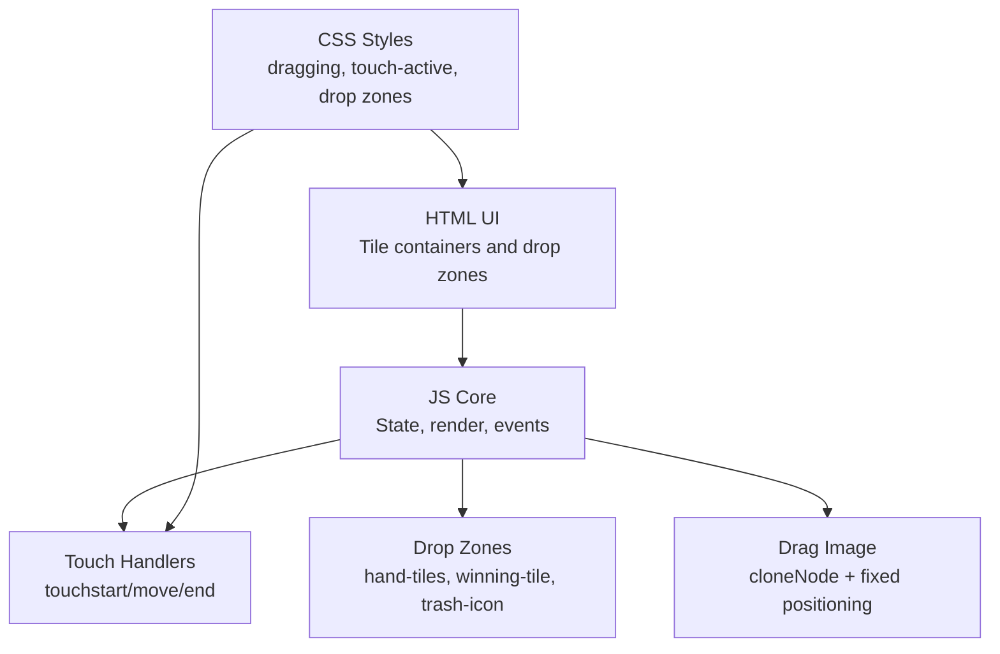
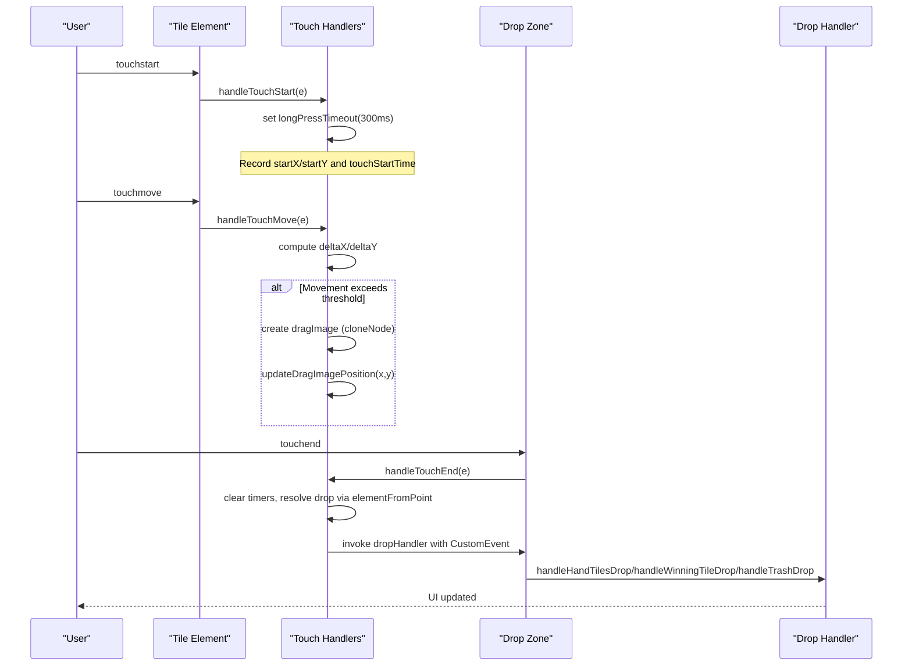
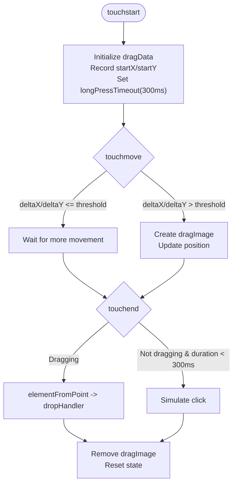
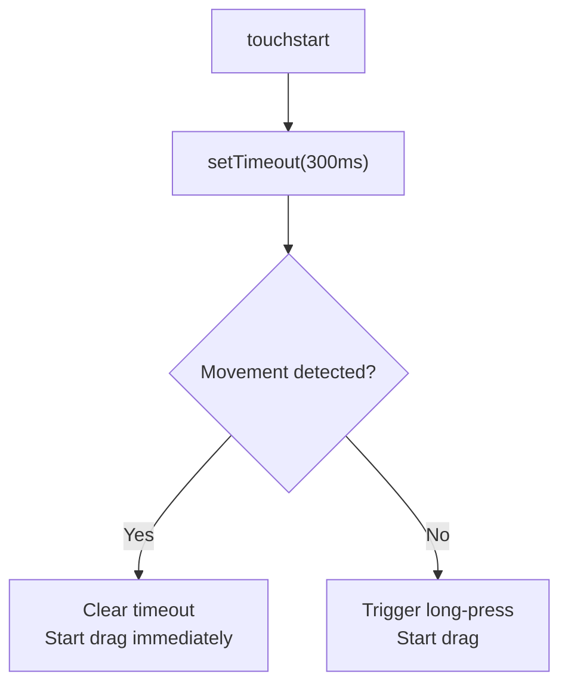
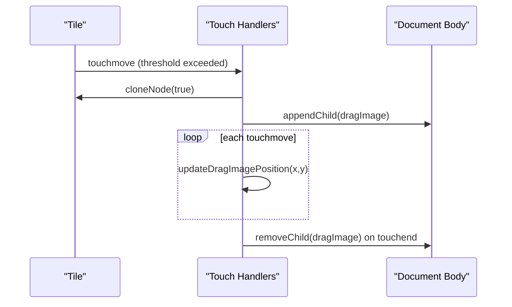
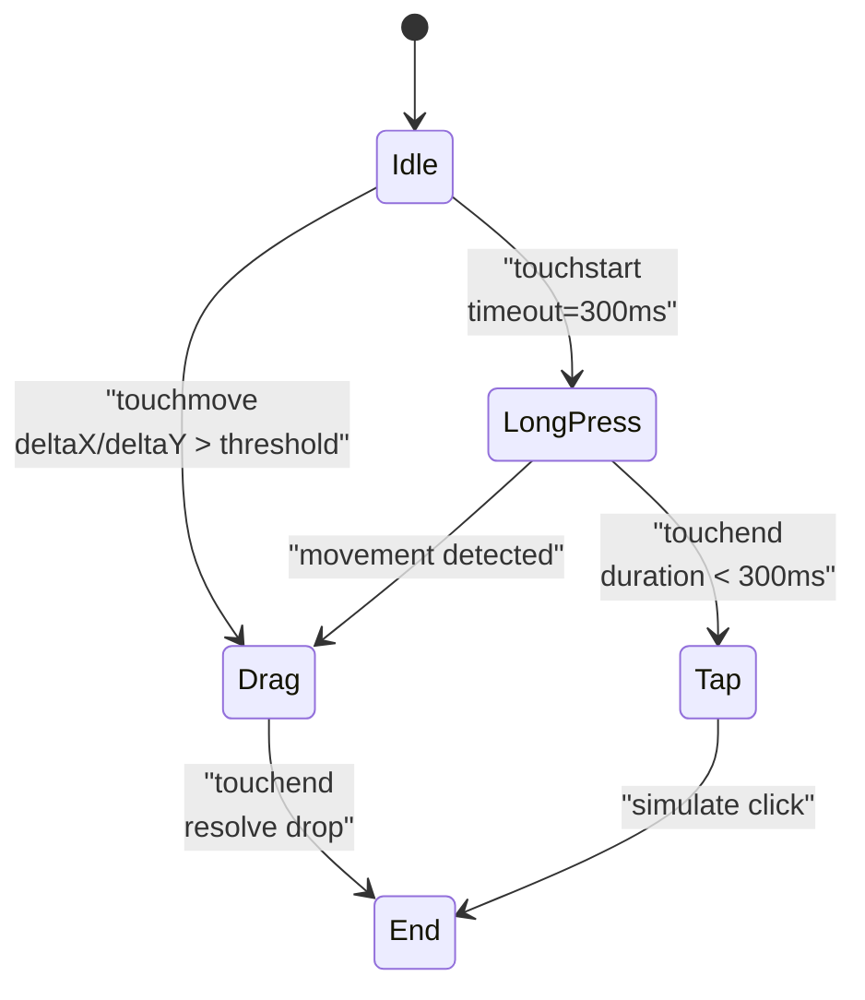
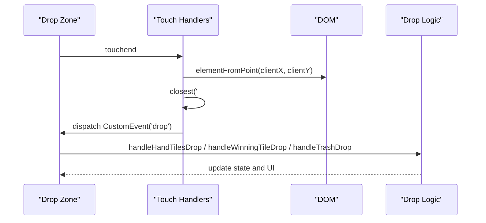
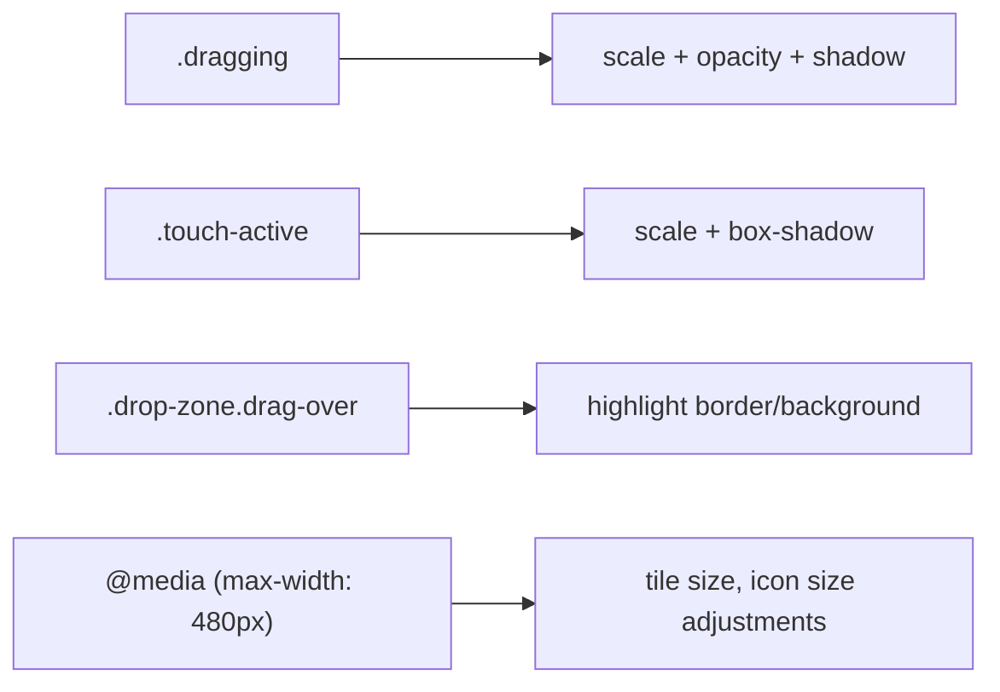
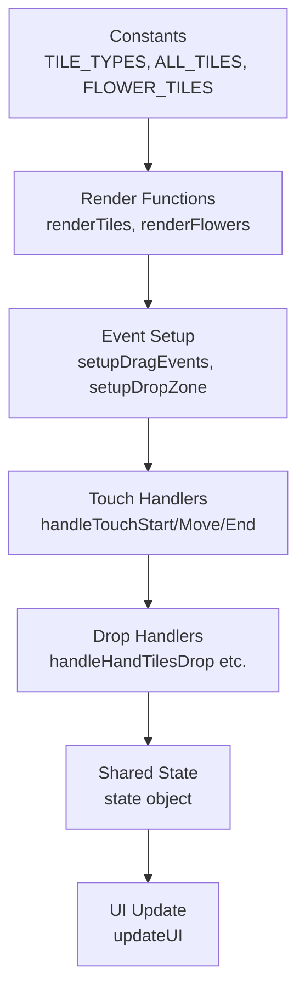

# Touch Interaction System

<cite>
**Referenced Files in This Document**
- [mj.js](file://mj.js)
- [mj.html](file://mj.html)
- [mj.css](file://mj.css)
- [mjConst.js](file://mjConst.js)
</cite>

## Table of Contents
1. [Introduction](#introduction)
2. [Project Structure](#project-structure)
3. [Core Components](#core-components)
4. [Architecture Overview](#architecture-overview)
5. [Detailed Component Analysis](#detailed-component-analysis)
6. [Dependency Analysis](#dependency-analysis)
7. [Performance Considerations](#performance-considerations)
8. [Troubleshooting Guide](#troubleshooting-guide)
9. [Conclusion](#conclusion)
10. [Appendices](#appendices)

## Introduction
This document explains the touch interaction system that enables mobile device support for the OV MJ Calculator. It covers the custom touch event implementation (touchstart, touchmove, touchend), long-press detection with a 300ms threshold to initiate drag operations, creation and positioning of a drag image that mimics desktop drag behavior, gesture recognition logic to distinguish taps, drags, and long-presses, touch-specific drop zone handling and coordinate calculations, performance optimizations for smooth interactions, memory management for event listeners, and touch-specific CSS styling and responsive design considerations.

## Project Structure
The application is organized into three primary files:
- HTML defines the interactive UI including tile containers, drop zones, and controls.
- JavaScript implements state management, rendering, and both mouse and touch-based drag-and-drop.
- CSS provides visual feedback for drag states, touch interactions, and responsive layout.

**Diagram sources**
- [mj.html:13-58](file://mj.html#L13-L58)
- [mj.js:44-116](file://mj.js#L44-L116)
- [mj.css:329-394](file://mj.css#L329-L394)

**Section sources**
- [mj.html:13-58](file://mj.html#L13-L58)
- [mj.js:36-42](file://mj.js#L36-L42)
- [mj.css:1-15](file://mj.css#L1-L15)

## Core Components
- Touch event handlers:
  - touchstart initializes drag data, adds active state, and sets a long-press timer.
  - touchmove detects movement thresholds, creates a drag image if needed, and updates its position.
  - touchend resolves drops or simulates clicks for short touches; cleans up resources.
- Drop zone setup:
  - Configures dragover/drop and touchmove/touchend on target areas.
  - Uses elementFromPoint to determine the drop target at release.
- Drag image system:
  - Clones the source tile, positions it fixed with z-index, scales and fades it, and removes it after completion.
- Gesture recognition:
  - Differentiates between tap (<300ms without movement), long-press (>=300ms), and drag (movement > small threshold).
- Coordinate calculation:
  - Tracks startX/startY and computes deltaX/deltaY to decide when to start dragging.
  - Positions drag image relative to current touch coordinates.

**Section sources**
- [mj.js:179-308](file://mj.js#L179-L308)
- [mj.js:310-377](file://mj.js#L310-L377)
- [mj.js:93-116](file://mj.js#L93-L116)

## Architecture Overview
The touch interaction architecture integrates event listeners on tiles and drop zones, maintains per-element drag state, and bridges touch gestures to the existing drag-and-drop handlers used by desktop interactions.

**Diagram sources**
- [mj.js:179-308](file://mj.js#L179-L308)
- [mj.js:310-377](file://mj.js#L310-L377)
- [mj.js:449-522](file://mj.js#L449-L522)

## Detailed Component Analysis

### Touch Event Implementation
- touchstart:
  - Prevents default scrolling during interaction.
  - Resolves the correct tile element and ensures dataset attributes are present.
  - Stores drag metadata (type, value, source, display, startX, startY, timestamps).
  - Adds a temporary class for visual feedback and starts a 300ms long-press timer.
- touchmove:
  - Prevents default scrolling.
  - Computes movement deltas; if exceeding a small threshold, marks as dragging and clears the long-press timer.
  - Creates a clone of the tile as a floating drag image with fixed positioning and elevated z-index.
  - Updates the drag image’s left/top based on current touch coordinates.
- touchend:
  - Clears any pending long-press timer.
  - If dragging, uses changedTouches to find the drop target via elementFromPoint and invokes the appropriate drop handler through a CustomEvent.
  - If not dragging and touch duration < 300ms, simulates a click to add the tile to hand/flowers.
  - Removes the drag image from DOM, resets classes, and deletes temporary properties to free memory.

**Diagram sources**
- [mj.js:179-308](file://mj.js#L179-L308)
- [mj.js:310-377](file://mj.js#L310-L377)

**Section sources**
- [mj.js:179-308](file://mj.js#L179-L308)
- [mj.js:310-377](file://mj.js#L310-L377)

### Long-Press Detection Mechanism
- A 300ms timeout is set on touchstart to detect long-press intent.
- If the user moves beyond a small threshold before the timeout fires, the timeout is cleared and immediate drag initiation occurs.
- If the timeout fires without significant movement, the system treats it as a long-press and initiates drag mode.

**Diagram sources**
- [mj.js:217-230](file://mj.js#L217-L230)
- [mj.js:248-263](file://mj.js#L248-L263)

**Section sources**
- [mj.js:217-230](file://mj.js#L217-L230)
- [mj.js:248-263](file://mj.js#L248-L263)

### Drag Image Creation and Positioning
- On drag initiation (either via movement threshold or long-press), the system clones the original tile element to create a floating representation.
- The clone is appended to the document body with fixed positioning, scaled up slightly, reduced opacity, and raised z-index to float above other elements.
- During touchmove, the drag image’s left and top are updated to follow the finger, offset slightly to avoid covering the touch point.

**Diagram sources**
- [mj.js:252-267](file://mj.js#L252-L267)
- [mj.js:372-377](file://mj.js#L372-L377)

**Section sources**
- [mj.js:252-267](file://mj.js#L252-L267)
- [mj.js:372-377](file://mj.js#L372-L377)

### Gesture Recognition Logic
- Tap: Short touch (<300ms) without significant movement triggers a click-like action to add tiles to hand or flowers.
- Long-press: Touch held for >=300ms without movement transitions into drag mode.
- Drag: Any touch movement exceeding a small threshold (deltaX > 3 or deltaY > 3) immediately starts drag mode and cancels the long-press timer.

**Diagram sources**
- [mj.js:217-230](file://mj.js#L217-L230)
- [mj.js:248-263](file://mj.js#L248-L263)
- [mj.js:293-299](file://mj.js#L293-L299)

**Section sources**
- [mj.js:217-230](file://mj.js#L217-L230)
- [mj.js:248-263](file://mj.js#L248-L263)
- [mj.js:293-299](file://mj.js#L293-L299)

### Touch-Specific Drop Zone Handling and Coordinates
- Drop zones include hand-tiles, winning-tile, and trash-icon.
- On touchend, the system uses elementFromPoint(touch.clientX, touch.clientY) to identify the target element and then finds the nearest valid drop zone ancestor.
- A CustomEvent named 'drop' is created with dataTransfer containing serialized drag data, and the corresponding drop handler is invoked on the target zone.
- Coordinates are derived from the last touch change to ensure accurate placement even if the finger lifts off slightly away from the final target.

**Diagram sources**
- [mj.js:317-370](file://mj.js#L317-L370)
- [mj.js:449-522](file://mj.js#L449-L522)

**Section sources**
- [mj.js:317-370](file://mj.js#L317-L370)
- [mj.js:449-522](file://mj.js#L449-L522)

### Performance Optimizations and Memory Management
- Passive vs non-passive listeners:
  - Touch listeners are attached with { passive: false } to allow preventDefault calls for scroll prevention during drag.
- Minimal DOM mutations:
  - Drag images are created only when necessary and removed promptly on touchend to avoid memory leaks.
- Efficient cleanup:
  - Temporary properties (_dragData, _dragImage, _longPressTimeout) are deleted after use.
  - Classes like .dragging and .touch-active are toggled to manage visual state without heavy reflows.
- Scroll interference mitigation:
  - html/body overscroll-behavior and touch-action manipulation reduce unintended scrolling during interactions.
- Event listener lifecycle:
  - setupDragEvents removes previous listeners before adding new ones to prevent duplicates when tiles are re-rendered.

**Section sources**
- [mj.js:67-91](file://mj.js#L67-L91)
- [mj.js:301-308](file://mj.js#L301-L308)
- [mj.css:401-404](file://mj.css#L401-L404)

### Touch-Specific CSS Styling and Responsive Design
- Visual feedback:
  - .dragging applies scale, opacity, shadow, and pointer-events none to the floating tile.
  - .touch-active scales and highlights the active tile during touch interactions.
  - Drop zones highlight on drag-over or touch-active to indicate valid targets.
- Cross-browser compatibility:
  - Disables tap highlights and callouts across vendors to prevent unwanted behaviors on mobile.
- Responsive adjustments:
  - Media queries adjust tile sizes and control spacing for smaller screens.
  - Touch-friendly sizing for icons and buttons improves usability on mobile devices.

**Diagram sources**
- [mj.css:329-335](file://mj.css#L329-L335)
- [mj.css:337-342](file://mj.css#L337-L342)
- [mj.css:360-370](file://mj.css#L360-L370)
- [mj.css:469-493](file://mj.css#L469-L493)

**Section sources**
- [mj.css:329-335](file://mj.css#L329-L335)
- [mj.css:337-342](file://mj.css#L337-L342)
- [mj.css:360-370](file://mj.css#L360-L370)
- [mj.css:469-493](file://mj.css#L469-L493)

## Dependency Analysis
- Data model:
  - Tile types and tile definitions are centralized in constants for consistent rendering and interaction.
- Rendering and interaction coupling:
  - Tiles are rendered with draggable attributes and event listeners bound via a unified setup function.
  - Drop zones rely on IDs to map to specific handlers, ensuring clear separation of concerns.
- State-driven UI:
  - All interactions update shared state and trigger UI updates, keeping the interface consistent across mouse and touch inputs.

**Diagram sources**
- [mjConst.js:1-65](file://mjConst.js#L1-L65)
- [mj.js:535-578](file://mj.js#L535-L578)
- [mj.js:44-116](file://mj.js#L44-L116)
- [mj.js:449-522](file://mj.js#L449-L522)
- [mj.js:909-917](file://mj.js#L909-L917)

**Section sources**
- [mjConst.js:1-65](file://mjConst.js#L1-L65)
- [mj.js:535-578](file://mj.js#L535-L578)
- [mj.js:44-116](file://mj.js#L44-L116)
- [mj.js:449-522](file://mj.js#L449-L522)
- [mj.js:909-917](file://mj.js#L909-L917)

## Performance Considerations
- Avoid unnecessary reflows:
  - Use transform and opacity changes for animations where possible; the drag image leverages these for smooth visuals.
- Limit DOM operations:
  - Create and remove drag images only during active drags; clean up immediately on touchend.
- Debounce heavy computations:
  - While not explicitly implemented here, consider throttling expensive calculations during rapid touchmove events if added later.
- Prevent default scrolling:
  - Using preventDefault during touch interactions avoids janky scrolling while dragging tiles.
- Memory hygiene:
  - Delete temporary properties and remove event listeners when elements are recreated to prevent leaks.

[No sources needed since this section provides general guidance]

## Troubleshooting Guide
Common issues and resolutions:
- No valid drag element found:
  - Ensure the touched element has the correct class or can be resolved to a parent with the required attributes.
- Missing data-source attribute:
  - The code attempts to infer the source if missing; verify container IDs and dataset population during rendering.
- No valid drop zone found:
  - Confirm that the drop target is within one of the recognized zones and that IDs match expected values.
- Scroll interference:
  - Verify that touch-action and overscroll-behavior are applied to html/body and that preventDefault is called appropriately.
- Duplicate event listeners:
  - setupDragEvents removes old listeners before adding new ones; ensure this runs whenever tiles are re-rendered.

**Section sources**
- [mj.js:190-202](file://mj.js#L190-L202)
- [mj.js:336-348](file://mj.js#L336-L348)
- [mj.js:67-91](file://mj.js#L67-L91)

## Conclusion
The OV MJ Calculator’s touch interaction system provides a robust, mobile-friendly experience by implementing custom touch handlers, long-press detection, drag image creation, and precise drop zone resolution. It mirrors desktop drag-and-drop behavior while optimizing for touch devices through careful performance tuning and memory management. The integration with existing state and UI updates ensures consistency across input methods, and the CSS styles deliver clear visual feedback and responsive layouts.

[No sources needed since this section summarizes without analyzing specific files]

## Appendices

### Example Touch-Specific CSS Patterns
- Dragging state:
  - Apply scaling, opacity, and shadow to indicate an active drag.
- Active touch state:
  - Highlight the touched tile temporarily to provide immediate feedback.
- Drop zone highlighting:
  - Change background and border color when a tile is dragged over a valid target.
- Responsive adjustments:
  - Adjust tile and icon sizes for smaller screens to maintain usability.

**Section sources**
- [mj.css:329-335](file://mj.css#L329-L335)
- [mj.css:337-342](file://mj.css#L337-L342)
- [mj.css:360-370](file://mj.css#L360-L370)
- [mj.css:469-493](file://mj.css#L469-L493)