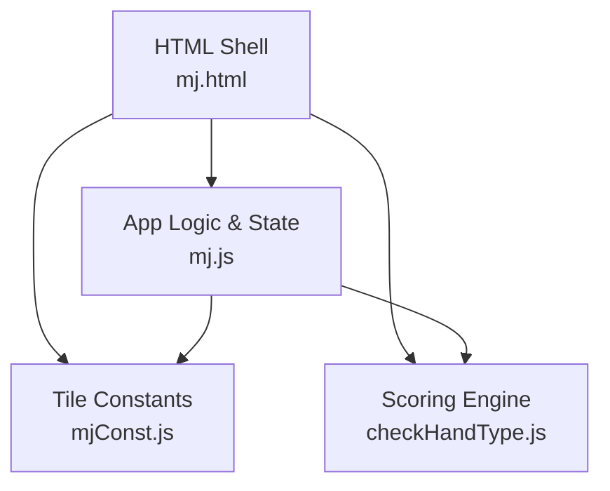
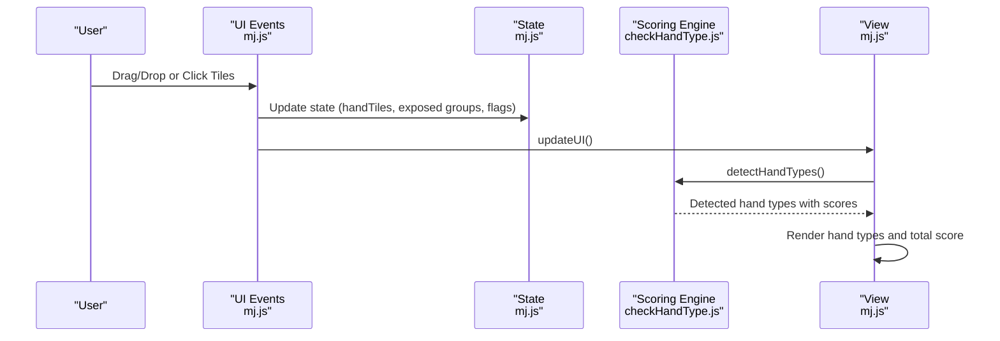
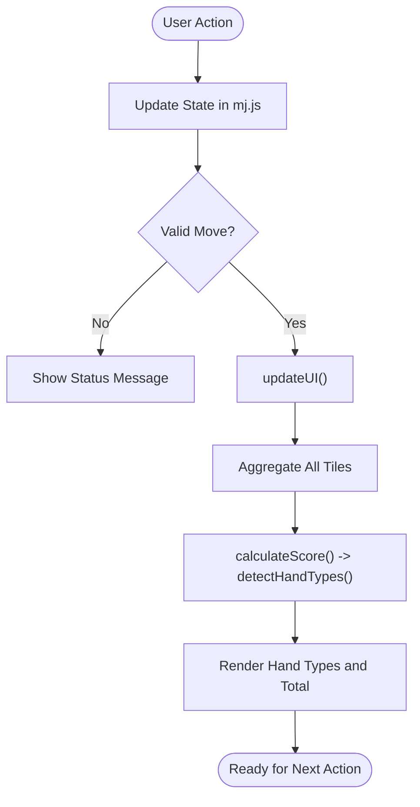
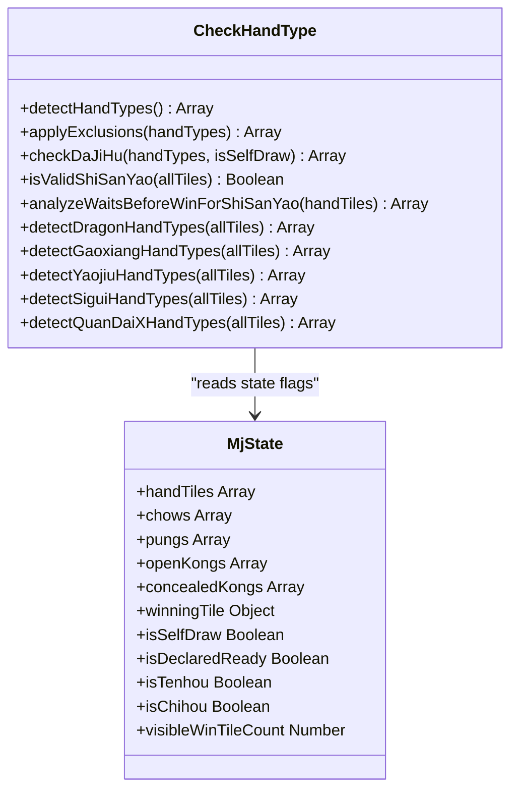
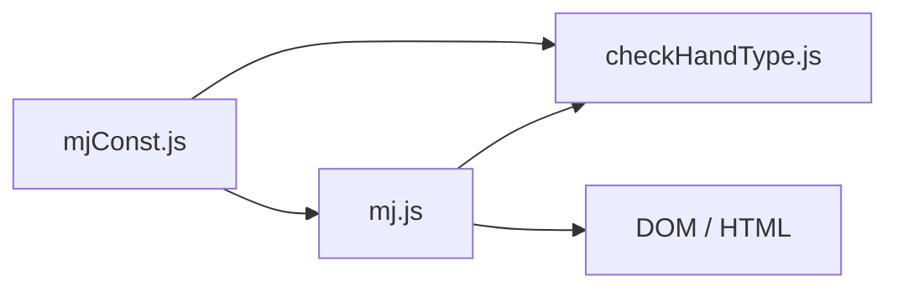

# Module Organization

<cite>
**Referenced Files in This Document**
- [mj.html](file://mj.html)
- [mjConst.js](file://mjConst.js)
- [mj.js](file://mj.js)
- [checkHandType.js](file://checkHandType.js)
</cite>

## Table of Contents
1. [Introduction](#introduction)
2. [Project Structure](#project-structure)
3. [Core Components](#core-components)
4. [Architecture Overview](#architecture-overview)
5. [Detailed Component Analysis](#detailed-component-analysis)
6. [Dependency Analysis](#dependency-analysis)
7. [Performance Considerations](#performance-considerations)
8. [Troubleshooting Guide](#troubleshooting-guide)
9. [Conclusion](#conclusion)

## Introduction
This document explains the modular architecture of the OV MJ Calculator and how responsibilities are separated across three core modules:
- mjConst.js: Tile definitions and constant data
- mj.js: Application logic, UI state management, and event handling
- checkHandType.js: Scoring engine and rule validation

The design emphasizes separation of concerns, clear module boundaries, and maintainability. It also clarifies how modules communicate through function calls and shared state, and how changes in one module affect others.

## Project Structure
The application is a single-page web app with a simple HTML shell that loads scripts in a specific order to establish dependencies:
- mjConst.js defines tile types and tile sets used by other modules
- mj.js initializes the UI, manages user interactions, and updates application state
- checkHandType.js provides scoring functions invoked by mj.js during score calculation

**Diagram sources**
- [mj.html:244-246](file://mj.html#L244-L246)

**Section sources**
- [mj.html:244-246](file://mj.html#L244-L246)

## Core Components
- mjConst.js
  - Defines tile type constants (characters, bamboos, dots, honors, flowers)
  - Provides complete tile lists for number suits and flower tiles
  - Acts as a read-only data source consumed by mj.js and checkHandType.js

- mj.js
  - Maintains application state (hand tiles, exposed melds, winning tile, flags for special conditions)
  - Handles drag-and-drop, click-to-select, and form controls
  - Updates UI and triggers score recalculation on state changes
  - Aggregates all tiles from hand and exposed groups to pass to the scoring engine

- checkHandType.js
  - Implements detection of mahjong hand patterns and scoring rules
  - Applies exclusion rules to avoid double-counting overlapping patterns
  - Returns an ordered list of detected hand types with associated scores

**Section sources**
- [mjConst.js:1-65](file://mjConst.js#L1-L65)
- [mj.js:1-42](file://mj.js#L1-L42)
- [mj.js:580-703](file://mj.js#L580-L703)
- [mj.js:1082-1129](file://mj.js#L1082-L1129)
- [checkHandType.js:1-40](file://checkHandType.js#L1-L40)
- [checkHandType.js:104-587](file://checkHandType.js#L104-L587)

## Architecture Overview
The application follows a unidirectional flow:
- User interactions update state in mj.js
- mj.js aggregates current tiles and invokes the scoring engine
- checkHandType.js analyzes the aggregated tiles and returns detected hand types
- mj.js renders results and totals

**Diagram sources**
- [mj.js:580-703](file://mj.js#L580-L703)
- [mj.js:909-917](file://mj.js#L909-L917)
- [mj.js:1082-1129](file://mj.js#L1082-L1129)
- [checkHandType.js:104-587](file://checkHandType.js#L104-L587)

## Detailed Component Analysis

### mjConst.js: Tile Definitions and Constant Data
- Responsibilities
  - Centralizes tile type constants and tile arrays
  - Ensures consistent tile representation across modules
- Key elements
  - TILE_TYPES enum-like object for suit categories
  - ALL_TILES array enumerating all number-suit tiles
  - FLOWER_TILES array enumerating flower tiles with seat wind associations
- Impact of changes
  - Adding/removing tiles affects rendering in mj.js and pattern detection in checkHandType.js
  - Changes here should be backward-compatible to avoid breaking UI or scoring logic

**Section sources**
- [mjConst.js:1-65](file://mjConst.js#L1-L65)

### mj.js: Application Logic and State Management
- Responsibilities
  - Initializes the app and sets up drag-and-drop and event listeners
  - Manages application state including hand tiles, exposed melds, winning tile, and condition flags
  - Validates user actions (e.g., chow/pung/kong constraints), updates state, and refreshes UI
  - Aggregates all tiles and calls the scoring engine
- Key flows
  - Event setup binds UI controls to state updates and triggers calculateScore()
  - Drag-and-drop handlers update hand tiles and winning tile
  - updateUI() orchestrates display updates and recalculates scores
  - calculateScore() validates tile counts, aggregates tiles, and invokes detectHandTypes()
- Communication with other modules
  - Reads TILE_TYPES from mjConst.js to render tiles and map CSS classes
  - Invokes detectHandTypes() from checkHandType.js to compute scoring
- Impact of changes
  - Modifying state shape requires updates to history/undo logic and UI rendering
  - Changing aggregation logic affects scoring accuracy
  - Event binding changes may alter when scoring is recalculated

**Diagram sources**
- [mj.js:580-703](file://mj.js#L580-L703)
- [mj.js:909-917](file://mj.js#L909-L917)
- [mj.js:1082-1129](file://mj.js#L1082-L1129)

**Section sources**
- [mj.js:1-42](file://mj.js#L1-L42)
- [mj.js:580-703](file://mj.js#L580-L703)
- [mj.js:909-917](file://mj.js#L909-L917)
- [mj.js:1082-1129](file://mj.js#L1082-L1129)

### checkHandType.js: Scoring Engine and Rule Validation
- Responsibilities
  - Detects valid mahjong hand patterns and assigns scores
  - Applies exclusion rules to prevent overlapping pattern counts
  - Handles complex combinations (e.g., sister hands, dragon patterns, yaojiu patterns, quanDaiX patterns)
  - Integrates state-based bonuses (self-draw, last tile draw, kong draws, multi-win, etc.)
- Key flows
  - detectHandTypes() aggregates tiles via getAllTiles(), runs multiple detectors, applies exclusions, and sorts results
  - Exclusion rules ensure high-priority patterns take precedence and avoid double counting
  - Special checks incorporate mj.js state flags (e.g., self-draw, declared ready, tenhou/chihou)
- Communication with other modules
  - Depends on TILE_TYPES from mjConst.js for tile classification
  - Consumes mj.js state directly to evaluate conditional bonuses
- Impact of changes
  - Adding new patterns requires updating detectors and possibly exclusion rules
  - Changing scoring weights affects totals rendered by mj.js
  - Modifying exclusion logic can change which patterns are counted together

**Diagram sources**
- [checkHandType.js:1-40](file://checkHandType.js#L1-L40)
- [checkHandType.js:104-587](file://checkHandType.js#L104-L587)
- [mj.js:1-33](file://mj.js#L1-L33)

**Section sources**
- [checkHandType.js:1-40](file://checkHandType.js#L1-L40)
- [checkHandType.js:104-587](file://checkHandType.js#L104-L587)

## Dependency Analysis
- Script loading order establishes dependency hierarchy:
  - mjConst.js must load first to provide constants
  - mj.js depends on mjConst.js for tile rendering and mapping
  - checkHandType.js depends on mjConst.js for tile classification and reads mj.js state directly
- Coupling and cohesion:
  - mjConst.js is cohesive (data only) and loosely coupled (consumed by others)
  - mj.js has higher coupling due to UI and state management; it delegates scoring to checkHandType.js
  - checkHandType.js is cohesive (scoring logic) but tightly coupled to mj.js state structure
- External integration points:
  - DOM manipulation in mj.js ties UI events to state changes
  - HTML script tags define execution order and module boundaries

**Diagram sources**
- [mj.html:244-246](file://mj.html#L244-L246)
- [mjConst.js:1-65](file://mjConst.js#L1-L65)
- [mj.js:580-703](file://mj.js#L580-L703)
- [checkHandType.js:104-587](file://checkHandType.js#L104-L587)

**Section sources**
- [mj.html:244-246](file://mj.html#L244-L246)
- [mjConst.js:1-65](file://mjConst.js#L1-L65)
- [mj.js:580-703](file://mj.js#L580-L703)
- [checkHandType.js:104-587](file://checkHandType.js#L104-L587)

## Performance Considerations
- Tile aggregation cost:
  - mj.js builds an aggregated tile list each time scoring is triggered; this is O(n) over hand and exposed groups
- Scanning complexity:
  - checkHandType.js runs multiple detectors; overall complexity grows with number of pattern checks and tile count
- Optimization opportunities:
  - Cache aggregated tiles if state hasn’t changed between updates
  - Short-circuit expensive checks when basic validity fails (already partially implemented in calculateScore)
  - Minimize re-renders by batching UI updates after scoring completes

[No sources needed since this section provides general guidance]

## Troubleshooting Guide
- Common issues and where to look:
  - Incorrect tile counts: validate required tile totals in calculateScore before scoring
  - Missing or extra tiles: verify selection limits and exposed group sizes in mj.js
  - Unexpected scores: inspect exclusion rules and overlapping patterns in checkHandType.js
  - UI not updating: ensure updateUI() is called after state changes and event listeners are bound
- Debugging tips:
  - Use status messages to surface validation errors early
  - Temporarily log detected hand types to confirm expected patterns
  - Verify script loading order in HTML to avoid undefined references

**Section sources**
- [mj.js:1082-1129](file://mj.js#L1082-L1129)
- [checkHandType.js:1-40](file://checkHandType.js#L1-L40)

## Conclusion
The OV MJ Calculator’s modular architecture cleanly separates data, application logic, and scoring rules:
- mjConst.js centralizes tile definitions, enabling consistent rendering and analysis
- mj.js manages state and UI, delegating complex scoring to a dedicated engine
- checkHandType.js encapsulates rule validation and scoring, with explicit exclusion logic to prevent double counting

This separation supports maintainability and testing:
- Tile data can evolve without altering UI logic
- Scoring rules can be updated independently of user interactions
- State-driven design allows deterministic tests for both UI flows and scoring outcomes

Changes propagate predictably:
- Tile definition changes impact rendering and scoring
- State shape changes require updates to history/undo and UI components
- Scoring rule changes affect totals and displayed patterns

[No sources needed since this section summarizes without analyzing specific files]