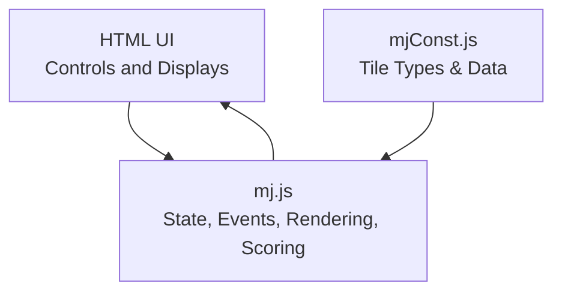
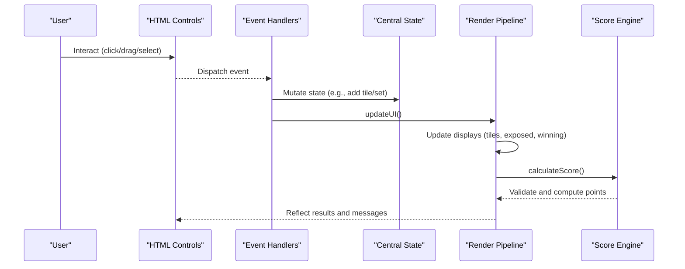
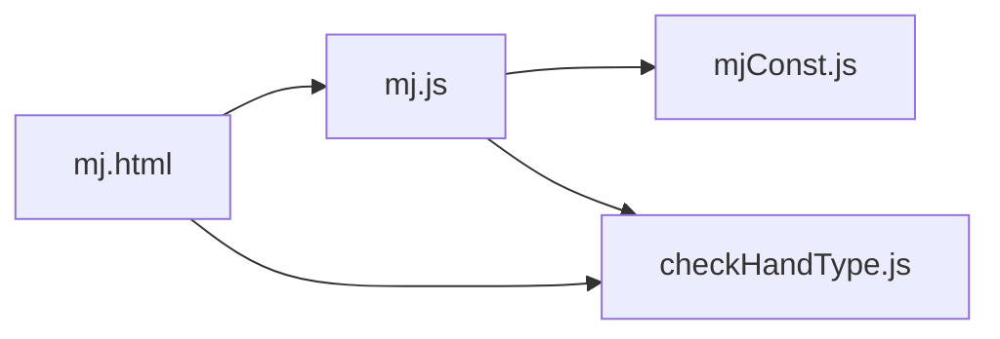

# State Management

<cite>
**Referenced Files in This Document**
- [mj.js](file://mj.js)
- [mjConst.js](file://mjConst.js)
- [mj.html](file://mj.html)
</cite>

## Table of Contents
1. [Introduction](#introduction)
2. [Project Structure](#project-structure)
3. [Core Components](#core-components)
4. [Architecture Overview](#architecture-overview)
5. [Detailed Component Analysis](#detailed-component-analysis)
6. [Dependency Analysis](#dependency-analysis)
7. [Performance Considerations](#performance-considerations)
8. [Troubleshooting Guide](#troubleshooting-guide)
9. [Conclusion](#conclusion)

## Introduction
This document explains the state management system of the OV MJ Calculator. It focuses on the centralized state object that tracks all game variables (hand tiles, flowers, exposed sets, winning tile, and special conditions), how state changes trigger UI updates and score recalculations, the history mechanism for undo functionality, and how persistence is handled during user interactions. It also provides examples of common state mutations and their effects.

## Project Structure
The application consists of:
- A central JavaScript file that defines the global state, event handling, rendering, scoring, and undo/redo-like operations.
- A constants file defining tile types and tile data.
- An HTML page that renders the UI and wires controls to the JavaScript logic.

**Diagram sources**
- [mj.html:1-248](file://mj.html#L1-L248)
- [mj.js:1-1211](file://mj.js#L1-L1211)
- [mjConst.js:1-65](file://mjConst.js#L1-L65)

**Section sources**
- [mj.html:1-248](file://mj.html#L1-L248)
- [mj.js:1-1211](file://mj.js#L1-L1211)
- [mjConst.js:1-65](file://mjConst.js#L1-L65)

## Core Components
- Centralized state object: Holds all mutable game variables including hand tiles, flowers, exposed sets (chows, pungs, open kongs, concealed kongs), winning tile, seat/round winds, dealer status, draw conditions, special conditions (Tenhou, Chihou, etc.), multi-win flags, visible win tile count, and a history stack for undo.
- Event handlers: Bind UI controls to state mutations and trigger recalculations.
- Rendering pipeline: Updates DOM elements based on current state.
- Scoring engine: Validates tile counts and computes total points based on detected hand types and configuration flags.
- History and undo: Saves snapshots before mutating state and restores previous states.

Key responsibilities by area:
- State definition and initialization
- Drag-and-drop and click-to-add flows
- Exposed set creation (chow/pung/kong)
- Winning tile assignment
- Special condition toggles
- UI update orchestration
- Score calculation and validation
- Undo/clear operations

**Section sources**
- [mj.js:1-33](file://mj.js#L1-L33)
- [mj.js:580-703](file://mj.js#L580-L703)
- [mj.js:713-829](file://mj.js#L713-L829)
- [mj.js:864-894](file://mj.js#L864-L894)
- [mj.js:909-1129](file://mj.js#L909-L1129)

## Architecture Overview
The application follows a unidirectional data flow:
- User actions mutate the central state via event handlers.
- Each mutation triggers a standardized update cycle that refreshes UI components and recalculates scores.
- Before significant mutations, a snapshot of relevant state fields is saved to the history stack to support undo.

**Diagram sources**
- [mj.js:580-703](file://mj.js#L580-L703)
- [mj.js:909-917](file://mj.js#L909-L917)
- [mj.js:1082-1129](file://mj.js#L1082-L1129)

## Detailed Component Analysis

### Centralized State Object
The state object is the single source of truth for the application’s runtime data. It includes:
- Hand tiles array
- Flowers array
- Exposed sets arrays: chows, pungs, openKongs, concealedKongs
- Winning tile object or null
- Seat wind and round wind strings
- Dealer-related flags and counters
- Draw and special condition booleans/integers (self-draw, Tenhou, Chihou, Ippatsu, last tile/discard, flower/kong draws, robbing kong variants, double kong draw, face-down, multi-win flags, visible win tile count)
- History array for undo snapshots

Design notes:
- Arrays are used for collections; objects represent individual tiles with type/value/display/cssClass.
- Boolean flags model special conditions; integer fields track counts or multipliers.
- The history stores only the subset of state necessary to restore tile-related state.

**Section sources**
- [mj.js:1-33](file://mj.js#L1-L33)

### Event Handling and State Mutations
- Tile selection and drag-and-drop:
  - Clicking or dragging tiles into the hand area adds them to the handTiles array.
  - Dragging from winning tile area back to hand removes it from winningTile and adds to handTiles.
  - Dragging to trash removes from handTiles or clears winningTile.
- Exposed sets:
  - Chow requires three consecutive same-type tiles at the end of handTiles; creates a chow entry and removes those tiles from handTiles.
  - Pung requires at least three identical tiles; creates a pung entry and removes up to three matching tiles from handTiles.
  - Open/Concealed Kong require four identical tiles; creates respective kong entries and removes four matching tiles from handTiles.
- Special conditions:
  - All checkboxes and selects in the settings section bind directly to state fields and call calculateScore() on change.

Each mutation path typically calls updateUI(), which orchestrates rendering and scoring.

**Section sources**
- [mj.js:151-177](file://mj.js#L151-L177)
- [mj.js:449-522](file://mj.js#L449-L522)
- [mj.js:580-703](file://mj.js#L580-L703)
- [mj.js:713-829](file://mj.js#L713-L829)

### Rendering Pipeline and UI Updates
updateUI() performs:
- Tile count display update
- Hand tiles re-render
- Flowers re-render
- Exposed tiles re-render (chow/pung/open kong/concealed kong)
- Winning tile re-render
- Button enable/disable states based on selection rules
- Score calculation

This ensures the UI always reflects the current state after any mutation.

**Section sources**
- [mj.js:909-917](file://mj.js#L909-L917)
- [mj.js:919-1080](file://mj.js#L919-L1080)

### Score Calculation and Validation
calculateScore():
- Computes total tile count across hand, exposed sets, and winning tile.
- Validates against required count (17 + number of kongs).
- If invalid, shows a message and resets displayed hand types and score.
- If valid, detects hand types (via external module referenced in HTML), aggregates scores, adds dealer-related bonus if applicable, and updates the score display.

Validation prevents inconsistent states from producing incorrect scores.

**Section sources**
- [mj.js:1082-1129](file://mj.js#L1082-L1129)

### History Mechanism and Undo
- saveStateToHistory():
  - Serializes a snapshot of key state fields (handTiles, flowers, chows, pungs, openKongs, concealedKongs, winningTile).
  - Appends to state.history.
  - Caps history length to prevent unbounded growth.
- undoLastAction():
  - Pops the last snapshot and restores the corresponding state fields.
  - Calls updateUI() to reflect the restored state.
- clearSelection():
  - Saves current state to history first, then resets all tile-related state to empty/null.
  - Calls updateUI().

Important note: History snapshots do not include special condition flags or dealer/wind settings. Undo restores tile-related state only.

**Section sources**
- [mj.js:864-894](file://mj.js#L864-L894)
- [mj.js:896-907](file://mj.js#L896-L907)

### Persistence During User Interactions
- No explicit localStorage/sessionStorage usage was found in the analyzed files.
- State persists in memory for the duration of the page session.
- Reloading the page resets state to initial values defined in the state object.

Recommendation: If cross-session persistence is desired, integrate browser storage around state mutations and restore on init.

**Section sources**
- [mj.js:1-33](file://mj.js#L1-L33)

### Common State Mutations and Effects
- Add tile to hand:
  - Effect: Increases handTiles length; may auto-set winningTile when constraints are met; triggers UI and score recalculation.
- Move tile from winning tile area to hand:
  - Effect: Clears winningTile and adds tile to handTiles; triggers UI and score recalculation.
- Create chow:
  - Effect: Adds a chow group and removes three specific tiles from handTiles; updates button states and score.
- Create pung:
  - Effect: Adds a pung group and removes up to three matching tiles from handTiles; updates button states and score.
- Create open/concealed kong:
  - Effect: Adds a kong group and removes four matching tiles from handTiles; increases required total tile count for validity.
- Toggle special conditions:
  - Effect: Updates boolean/integer flags; immediately recalculates score without changing tile layout.
- Undo:
  - Effect: Restores previous tile-related state snapshot; UI and score reflect restored state.

**Section sources**
- [mj.js:1172-1209](file://mj.js#L1172-L1209)
- [mj.js:449-522](file://mj.js#L449-L522)
- [mj.js:713-829](file://mj.js#L713-L829)
- [mj.js:580-703](file://mj.js#L580-L703)
- [mj.js:864-894](file://mj.js#L864-L894)

## Dependency Analysis
- mj.js depends on:
  - mjConst.js for tile definitions and types.
  - External script checkHandType.js (referenced in HTML) for hand type detection used in scoring.
- mj.html wires UI elements to functions in mj.js and loads dependencies in order.

**Diagram sources**
- [mj.html:244-247](file://mj.html#L244-L247)
- [mj.js:1103-1116](file://mj.js#L1103-L1116)
- [mjConst.js:1-65](file://mjConst.js#L1-L65)

**Section sources**
- [mj.html:244-247](file://mj.html#L244-L247)
- [mj.js:1103-1116](file://mj.js#L1103-L1116)
- [mjConst.js:1-65](file://mjConst.js#L1-L65)

## Performance Considerations
- Rendering:
  - Rebuilding DOM nodes per update is straightforward but can be optimized by diffing or batching updates for large hands.
- History:
  - History is capped to a fixed size to avoid memory growth; consider limiting deep clones if performance becomes an issue.
- Selection logic:
  - Counting and filtering arrays are O(n); acceptable for typical Mahjong hand sizes.
- Event binding:
  - Ensure events are not duplicated; existing code removes listeners before adding new ones for robustness.

[No sources needed since this section provides general guidance]

## Troubleshooting Guide
- Invalid tile count:
  - Symptom: Status message indicates insufficient or extra tiles; score remains zero.
  - Cause: Total tiles do not match required count (17 + number of kongs).
  - Resolution: Adjust hand/exposed tiles until the count matches.
- Buttons disabled:
  - Symptom: Chow/Pung/Kong buttons are disabled.
  - Cause: Selected tiles do not meet requirements (sequential same-type for chow; at least three identical for pung; exactly four identical for kong).
  - Resolution: Select appropriate tiles according to rules.
- Undo not restoring expected state:
  - Symptom: After undo, some settings appear unchanged.
  - Cause: History snapshots exclude special condition flags and dealer/wind settings; they are not restored by undo.
  - Resolution: Manually reset settings or extend history to include these fields if needed.
- Drag-and-drop issues:
  - Symptom: Tiles not moving as expected.
  - Cause: Missing drop zones or event conflicts.
  - Resolution: Verify container IDs and ensure event listeners are attached correctly.

**Section sources**
- [mj.js:1082-1129](file://mj.js#L1082-L1129)
- [mj.js:1054-1080](file://mj.js#L1054-L1080)
- [mj.js:864-894](file://mj.js#L864-L894)

## Conclusion
The OV MJ Calculator uses a centralized state object to manage all game variables, with a clear separation between state mutations, rendering, and scoring. The history mechanism supports undo for tile-related changes, while special conditions and dealer settings are managed independently and affect scoring directly. The architecture is simple and effective for the app’s scope, with opportunities to enhance persistence and performance if needed.

[No sources needed since this section summarizes without analyzing specific files]