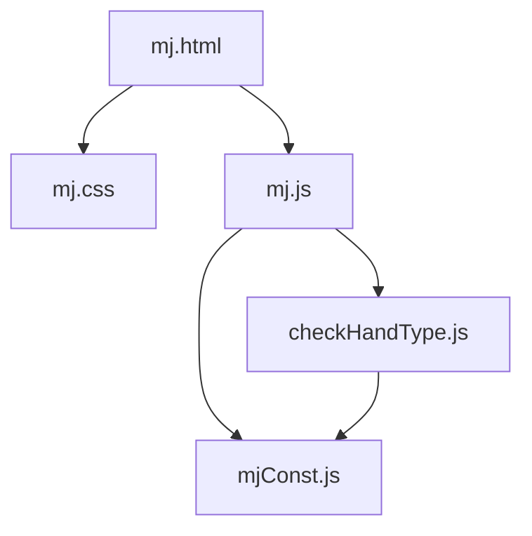
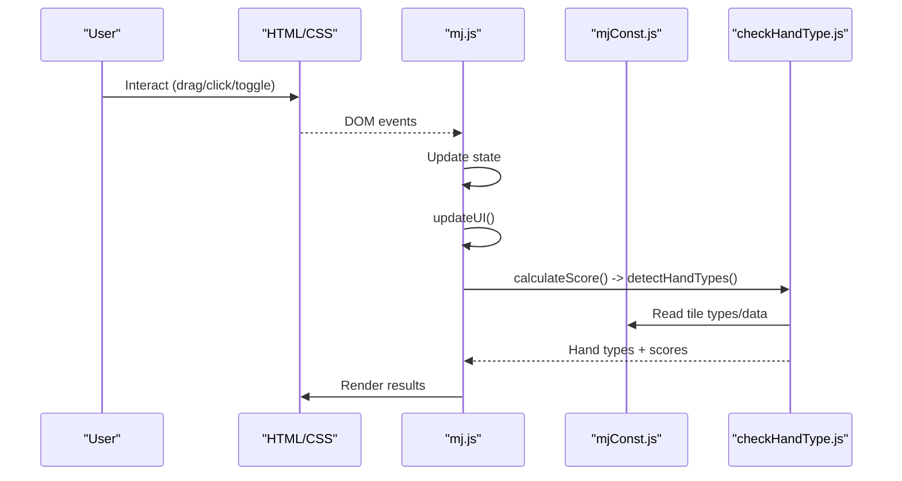
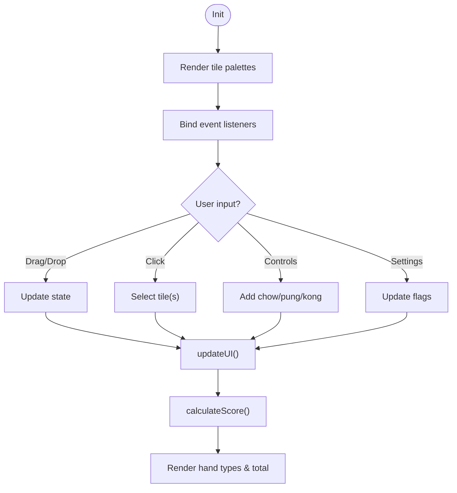
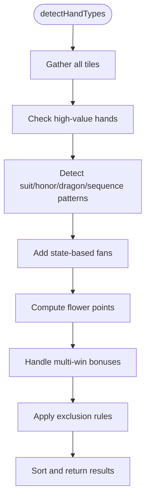
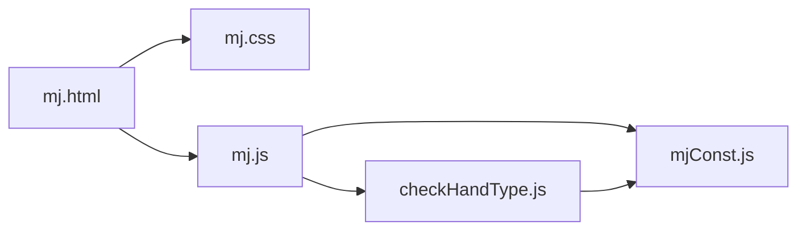

# Technical Architecture

<cite>
**Referenced Files in This Document**
- [mj.html](file://mj.html)
- [mj.css](file://mj.css)
- [mj.js](file://mj.js)
- [mjConst.js](file://mjConst.js)
- [checkHandType.js](file://checkHandType.js)
</cite>

## Table of Contents
1. [Introduction](#introduction)
2. [Project Structure](#project-structure)
3. [Core Components](#core-components)
4. [Architecture Overview](#architecture-overview)
5. [Detailed Component Analysis](#detailed-component-analysis)
6. [Dependency Analysis](#dependency-analysis)
7. [Performance Considerations](#performance-considerations)
8. [Troubleshooting Guide](#troubleshooting-guide)
9. [Conclusion](#conclusion)

## Introduction
This document describes the technical architecture of the OV MJ Calculator, a single-page application (SPA) built with vanilla JavaScript for calculating Mahjong hand scores. The app follows a clear separation between:
- UI layer (HTML/CSS): presentation and user interactions
- Application logic (JavaScript): state management, event handling, and rendering
- Data layer (constants): tile definitions and types

The design emphasizes simplicity, performance, and maintainability by avoiding frameworks and using an event-driven, state-based flow.

## Project Structure
The project is organized into four primary files:
- mj.html: Defines the page layout, sections for tiles, controls, settings, and results
- mj.css: Styles the UI, including responsive design and drag-and-drop visual feedback
- mj.js: Central application logic; manages state, DOM rendering, events, and orchestrates scoring
- mjConst.js: Data definitions for tile types and tile sets
- checkHandType.js: Scoring engine that detects hand patterns and computes fan points

**Diagram sources**
- [mj.html:1-248](file://mj.html#L1-L248)
- [mj.js:1-120](file://mj.js#L1-L120)
- [mjConst.js:1-65](file://mjConst.js#L1-L65)
- [checkHandType.js:1-120](file://checkHandType.js#L1-L120)

**Section sources**
- [mj.html:1-248](file://mj.html#L1-L248)
- [mj.css:1-493](file://mj.css#L1-L493)
- [mj.js:1-120](file://mj.js#L1-L120)
- [mjConst.js:1-65](file://mjConst.js#L1-L65)
- [checkHandType.js:1-120](file://checkHandType.js#L1-L120)

## Core Components
- State Management (mj.js): A central state object holds all game-related data (hand tiles, flowers, exposed melds, winning tile, flags for special conditions). It drives UI updates and triggers score recalculation on changes.
- Event Handling (mj.js): Mouse and touch drag-and-drop, click selection, and control buttons update state and call calculateScore().
- Rendering (mj.js): Functions render tile palettes, selected tiles, exposed melds, and results. They bind event listeners to dynamic elements.
- Data Definitions (mjConst.js): Enumerates tile types and provides arrays of all tiles and flower tiles used across the app.
- Scoring Engine (checkHandType.js): Detects hand patterns, applies exclusion rules, computes fan points, and returns sorted results.

Key responsibilities are cleanly separated:
- UI concerns live in mj.html/mj.css
- State and orchestration live in mj.js
- Pure data lives in mjConst.js
- Business rules live in checkHandType.js

**Section sources**
- [mj.js:1-120](file://mj.js#L1-L120)
- [mj.js:535-578](file://mj.js#L535-L578)
- [mj.js:580-703](file://mj.js#L580-L703)
- [mjConst.js:1-65](file://mjConst.js#L1-L65)
- [checkHandType.js:104-587](file://checkHandType.js#L104-L587)

## Architecture Overview
The application uses a unidirectional data flow:
- User actions (drag-and-drop, clicks, toggles) trigger event handlers in mj.js
- Handlers mutate the central state object
- State changes invoke updateUI() to refresh visuals and calculateScore() to recompute scoring
- calculateScore() calls detectHandTypes() from checkHandType.js
- detectHandTypes() reads state and mjConst.js data to produce scored hand types
- Results are rendered back into the UI

**Diagram sources**
- [mj.js:36-42](file://mj.js#L36-L42)
- [mj.js:580-703](file://mj.js#L580-L703)
- [checkHandType.js:104-587](file://checkHandType.js#L104-L587)
- [mjConst.js:1-65](file://mjConst.js#L1-L65)

## Detailed Component Analysis

### State Management and Event Flow (mj.js)
- Central state object stores hand tiles, flowers, exposed melds, winning tile, seat/round winds, dealer info, and many boolean flags for special conditions
- Initialization renders tile palettes, flowers, binds events, and performs initial UI update
- Drag-and-drop supports both mouse and touch with robust fallbacks and error logging
- Click-to-select adds tiles to hand or flowers; drag-and-drop moves tiles between zones (hand, winning tile, trash)
- Control buttons add chows/pungs/kongs, undo last action, clear selection
- Settings change handlers update state and immediately recalculate score
- Rendering functions create DOM nodes for tiles and bind events dynamically

**Diagram sources**
- [mj.js:36-42](file://mj.js#L36-L42)
- [mj.js:118-148](file://mj.js#L118-L148)
- [mj.js:150-177](file://mj.js#L150-L177)
- [mj.js:449-522](file://mj.js#L449-L522)
- [mj.js:580-703](file://mj.js#L580-L703)

**Section sources**
- [mj.js:1-120](file://mj.js#L1-L120)
- [mj.js:118-148](file://mj.js#L118-L148)
- [mj.js:150-177](file://mj.js#L150-L177)
- [mj.js:449-522](file://mj.js#L449-L522)
- [mj.js:580-703](file://mj.js#L580-L703)

### Scoring Engine (checkHandType.js)
- Entry point detectHandTypes() aggregates detected hand types based on current state and tile composition
- Applies exclusion rules to avoid double-counting overlapping patterns
- Handles high-value special hands (e.g., Shi San Yao, Shi Liu Bu Da) first
- Detects suits, honors, dragons, sequences, kongs, and various combinations
- Adds state-based fans (self-draw, ready declaration, last-tile draws, etc.)
- Computes flower points and multi-win bonuses
- Finalizes with exclusions and sorting

**Diagram sources**
- [checkHandType.js:104-587](file://checkHandType.js#L104-L587)
- [checkHandType.js:1-40](file://checkHandType.js#L1-L40)

**Section sources**
- [checkHandType.js:1-40](file://checkHandType.js#L1-L40)
- [checkHandType.js:104-587](file://checkHandType.js#L104-L587)

### Data Layer (mjConst.js)
- TILE_TYPES enumerates categories: characters, bamboos, dots, honors, flowers
- ALL_TILES defines every number and honor tile with display text and CSS class
- FLOWER_TILES defines eight flower tiles with associated seat wind mapping

These constants are consumed by rendering and scoring modules to ensure consistency.

**Section sources**
- [mjConst.js:1-65](file://mjConst.js#L1-L65)

### UI Layer (mj.html and mj.css)
- mj.html organizes sections for tile selection, hand area, exposed melds, winning tile, flowers, settings, special conditions, and results
- Controls include buttons for adding melds, undo, and clear
- Settings include seat/round wind, dealer status/count, self-draw flag, and numerous special condition toggles
- mj.css provides responsive layout, tile styling, drag-and-drop feedback, and accessibility considerations

**Section sources**
- [mj.html:1-248](file://mj.html#L1-L248)
- [mj.css:1-493](file://mj.css#L1-L493)

## Dependency Analysis
- mj.js depends on mjConst.js for tile definitions and on checkHandType.js for scoring
- checkHandType.js depends on mjConst.js for tile type enums and on mj.js’s global state for context
- mj.html loads scripts in order: constants, application logic, then scoring engine
- mj.css styles are referenced by mj.html and affect how mj.js renders interactive elements

**Diagram sources**
- [mj.html:244-247](file://mj.html#L244-L247)
- [mj.js:1-42](file://mj.js#L1-L42)
- [checkHandType.js:1-40](file://checkHandType.js#L1-L40)
- [mjConst.js:1-65](file://mjConst.js#L1-L65)

**Section sources**
- [mj.html:244-247](file://mj.html#L244-L247)
- [mj.js:1-42](file://mj.js#L1-L42)
- [checkHandType.js:1-40](file://checkHandType.js#L1-L40)
- [mjConst.js:1-65](file://mjConst.js#L1-L65)

## Performance Considerations
- Vanilla JavaScript avoids framework overhead, reducing bundle size and runtime cost
- Minimal DOM manipulation: rendering functions rebuild only necessary containers
- Efficient event binding: reusable setup functions prevent duplicate listeners
- Touch support implemented with passive listeners where appropriate to improve scrolling performance
- Scoring computations run only on relevant state changes, minimizing unnecessary recalculations

[No sources needed since this section provides general guidance]

## Troubleshooting Guide
Common issues and mitigations:
- Missing drop zones: Console logs errors if hand tiles, winning tile, or trash icon elements are not found during initialization
- Invalid drag data: Logs warnings when drag data is missing or invalid; ensures safe fallback behavior
- Touch interaction conflicts: Uses passive:false for critical touch handlers and prevents default scrolling during drag
- Status messages: Provides user feedback via status message element for success/error states

Operational tips:
- Ensure DOM elements exist before initializing drag-and-drop
- Verify script load order: constants → app logic → scoring engine
- Check console for warnings about missing elements or invalid inputs

**Section sources**
- [mj.js:118-148](file://mj.js#L118-L148)
- [mj.js:180-308](file://mj.js#L180-L308)
- [mj.js:310-370](file://mj.js#L310-L370)
- [mj.js:444-447](file://mj.js#L444-L447)

## Conclusion
The OV MJ Calculator employs a clean, modular SPA architecture:
- UI layer (HTML/CSS) focuses on presentation and responsiveness
- Application logic (JavaScript) manages state and orchestrates interactions
- Data layer (constants) centralizes tile definitions
- Scoring engine encapsulates business rules and pattern detection

Using vanilla JavaScript yields simplicity, predictability, and strong performance, while the event-driven design ensures a responsive user experience. The separation of concerns makes the codebase maintainable and extensible for future enhancements.