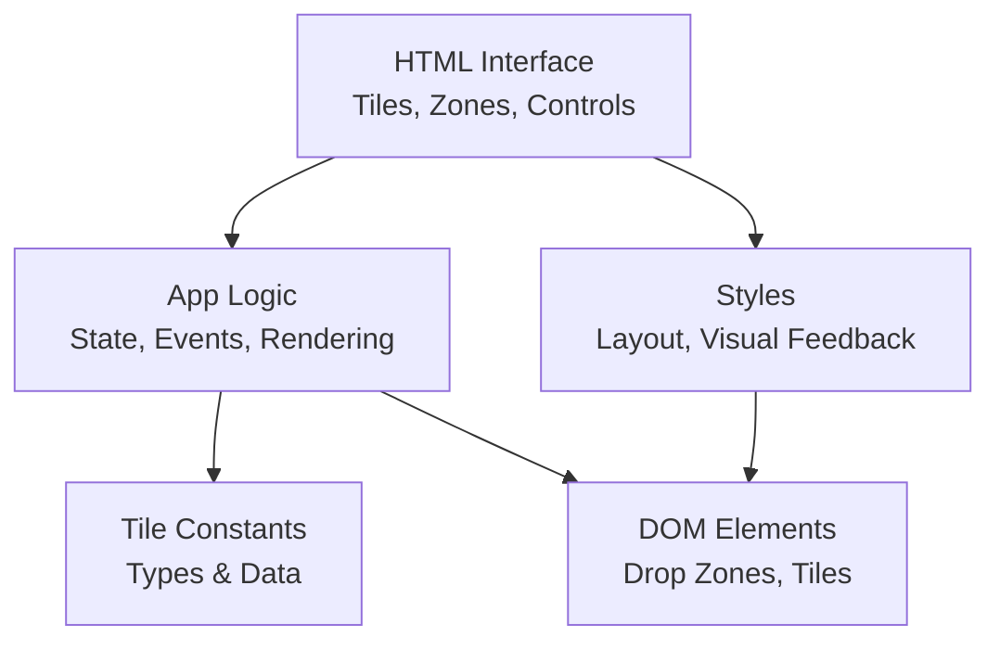
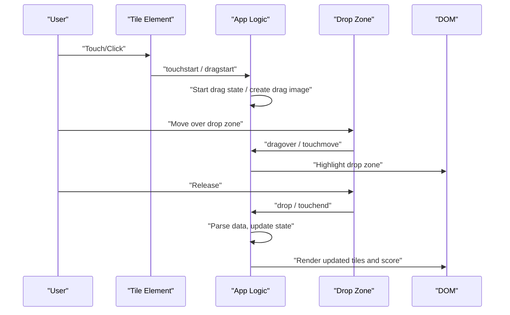
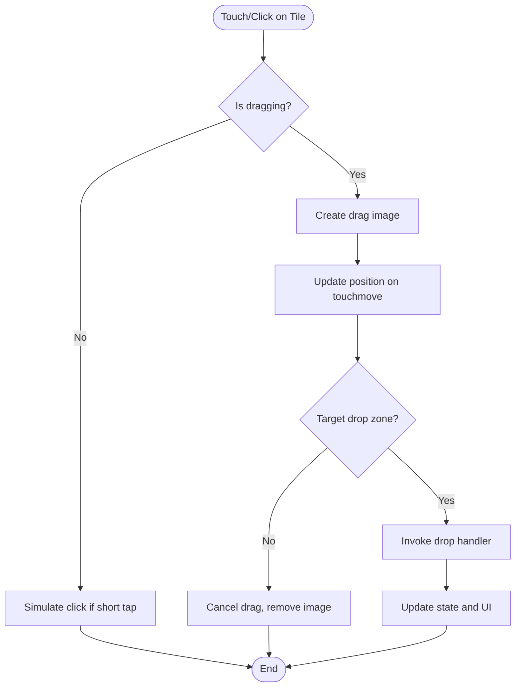
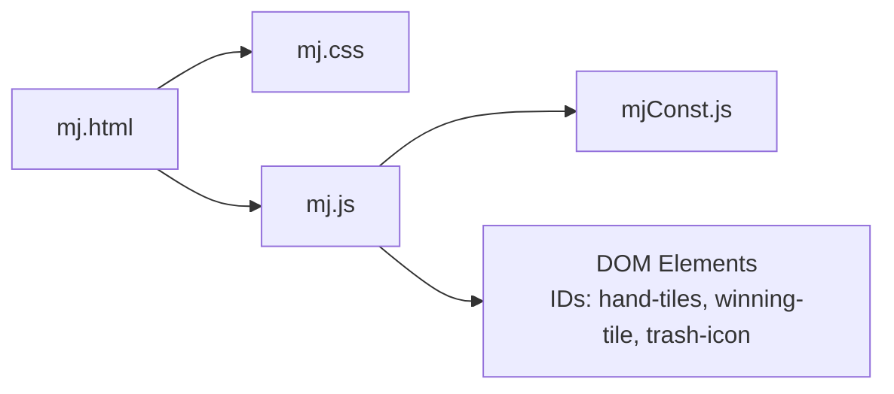

# Browser Compatibility Issues

<cite>
**Referenced Files in This Document**
- [mj.html](file://mj.html)
- [mj.js](file://mj.js)
- [mj.css](file://mj.css)
- [mjConst.js](file://mjConst.js)
</cite>

## Table of Contents
1. [Introduction](#introduction)
2. [Project Structure](#project-structure)
3. [Core Components](#core-components)
4. [Architecture Overview](#architecture-overview)
5. [Detailed Component Analysis](#detailed-component-analysis)
6. [Dependency Analysis](#dependency-analysis)
7. [Performance Considerations](#performance-considerations)
8. [Troubleshooting Guide](#troubleshooting-guide)
9. [Conclusion](#conclusion)
10. [Appendices](#appendices)

## Introduction
This document provides a focused guide to browser compatibility for the OV MJ Calculator, with emphasis on:
- HTML5 Drag and Drop API support across desktop and mobile browsers
- Touch event handling differences between iOS Safari, Android Chrome, and desktop browsers
- Workarounds for missing features such as localStorage, CSS Grid, and modern JavaScript features
- Specific error messages observed in the codebase and their solutions per major browser/version
- Testing recommendations and fallback strategies for unsupported browsers

The goal is to help developers ensure consistent behavior across older Internet Explorer versions, Safari (including iOS), and mobile browsers while preserving the calculator’s drag-and-drop tile selection experience.

## Project Structure
The application consists of:
- A single-page HTML interface that defines tiles, drop zones, controls, and settings
- A JavaScript module implementing state management, drag-and-drop, touch interactions, and UI updates
- A stylesheet providing responsive layout and visual feedback for drag and touch states
- A constants file defining tile types and data

**Diagram sources**
- [mj.html:13-58](file://mj.html#L13-L58)
- [mj.js:1-42](file://mj.js#L1-L42)
- [mj.css:68-141](file://mj.css#L68-L141)
- [mjConst.js:1-65](file://mjConst.js#L1-L65)

**Section sources**
- [mj.html:1-248](file://mj.html#L1-L248)
- [mj.js:1-1211](file://mj.js#L1-L1211)
- [mj.css:1-493](file://mj.css#L1-L493)
- [mjConst.js:1-65](file://mjConst.js#L1-L65)

## Core Components
- Drag-and-Drop System: Uses HTML5 DnD events for mouse-based dragging and a custom touch implementation for mobile devices.
- Touch Handling: Implements long-press detection, simulated drag images, and drop zone targeting via elementFromPoint.
- State Management: Centralized state object tracks hand tiles, exposed sets, winning tile, and scoring flags.
- UI Rendering: Dynamic rendering of tiles and update of selected tiles, exposed sets, and score display.

Key behaviors:
- Tiles are rendered with draggable attributes and event listeners for both mouse and touch.
- Drop zones accept tiles into hand or winning areas; trash icon removes tiles.
- Status messages provide user feedback for errors and actions.

**Section sources**
- [mj.js:44-116](file://mj.js#L44-L116)
- [mj.js:179-370](file://mj.js#L179-L370)
- [mj.js:386-523](file://mj.js#L386-L523)
- [mj.js:535-578](file://mj.js#L535-L578)
- [mj.js:580-703](file://mj.js#L580-L703)
- [mj.css:291-311](file://mj.css#L291-L311)
- [mj.css:329-385](file://mj.css#L329-L385)

## Architecture Overview
The interaction flow combines HTML5 Drag and Drop with touch event emulation to unify UX across platforms.

**Diagram sources**
- [mj.js:179-370](file://mj.js#L179-L370)
- [mj.js:386-523](file://mj.js#L386-L523)
- [mj.css:291-311](file://mj.css#L291-L311)

## Detailed Component Analysis

### Drag-and-Drop and Touch Handling
- Mouse-based drag uses standard HTML5 DnD events: dragstart, dragover, dragenter, dragleave, drop, dragend.
- Mobile touch uses:
  - Long press threshold to initiate drag
  - Simulated drag image appended to body
  - Touch move prevents default scrolling during drag
  - Drop target resolved via elementFromPoint at touch end
- Event listeners are attached dynamically to tiles and drop zones, with removal before re-adding to avoid duplicates.

Potential issues and mitigations:
- Older IE lacks full DnD support; touch fallback ensures basic functionality on mobile.
- iOS Safari may block programmatic scroll prevention; passive listener flags warn when preventDefault fails.
- elementFromPoint can return null if overlay or timing issues occur; robust checks log warnings and bail out safely.

**Diagram sources**
- [mj.js:179-370](file://mj.js#L179-L370)
- [mj.js:386-523](file://mj.js#L386-L523)

**Section sources**
- [mj.js:44-116](file://mj.js#L44-L116)
- [mj.js:179-370](file://mj.js#L179-L370)
- [mj.js:386-523](file://mj.js#L386-L523)
- [mj.css:329-385](file://mj.css#L329-L385)

### UI Rendering and Interaction
- Tiles are rendered from constants and assigned dataset attributes for type/value/source.
- Selected tiles become draggable and can be moved to hand or winning areas.
- Exposed sets (chow/pung/kong) and winning tile are managed via state and rendered accordingly.
- Buttons trigger actions like addChow, addPung, undo, clear, which validate inputs and update UI.

**Section sources**
- [mj.js:535-578](file://mj.js#L535-L578)
- [mj.js:705-711](file://mj.js#L705-L711)
- [mj.js:713-800](file://mj.js#L713-L800)
- [mj.html:13-58](file://mj.html#L13-L58)

### Styling and Responsive Behavior
- Flexbox used for layouts; no reliance on CSS Grid.
- Visual feedback classes for drag-over and touch-active states.
- Touch-action and user-select properties set to improve mobile interaction.

**Section sources**
- [mj.css:68-141](file://mj.css#L68-L141)
- [mj.css:291-311](file://mj.css#L291-L311)
- [mj.css:329-385](file://mj.css#L329-L385)
- [mj.css:469-493](file://mj.css#L469-L493)

## Dependency Analysis
- mj.html depends on mj.css and mj.js for presentation and behavior.
- mj.js depends on mjConst.js for tile definitions.
- mj.js manipulates DOM elements identified by IDs for drop zones and controls.

**Diagram sources**
- [mj.html:244-246](file://mj.html#L244-L246)
- [mj.js:118-148](file://mj.js#L118-L148)
- [mjConst.js:1-65](file://mjConst.js#L1-L65)

**Section sources**
- [mj.html:244-246](file://mj.html#L244-L246)
- [mj.js:118-148](file://mj.js#L118-L148)
- [mjConst.js:1-65](file://mjConst.js#L1-L65)

## Performance Considerations
- Avoid excessive DOM queries inside event handlers; reuse references where possible.
- Debounce frequent touchmove updates if performance degrades on low-end devices.
- Minimize cloning of nodes for drag images; reuse a single temporary element when feasible.
- Use passive listeners for non-preventing scroll events to improve scrolling performance on mobile.

[No sources needed since this section provides general guidance]

## Troubleshooting Guide

### HTML5 Drag and Drop Support
- Symptom: Dragging does not work on older Internet Explorer or certain mobile browsers.
- Observed behavior: The app attaches both DnD and touch listeners; if DnD fails, touch fallback should activate.
- Solutions:
  - Ensure tiles have draggable attribute set and event listeners attached.
  - Confirm drop zones exist and have correct IDs.
  - Validate that dataTransfer is available; otherwise rely on touch path.
- Relevant logs:
  - “Hand tiles element not found”
  - “Winning tile element not found”
  - “Trash icon element not found”

**Section sources**
- [mj.js:118-148](file://mj.js#L118-L148)

### Touch Event Handling Differences
- iOS Safari:
  - May ignore preventDefault on some events; warnings logged when cancelable is false.
  - Long press thresholds and simulated drag images are used to emulate DnD.
- Android Chrome:
  - Generally supports touchmove prevention; ensure passive listeners do not block necessary preventDefault calls.
- Desktop browsers:
  - Prefer native DnD; touch path acts as fallback.

Observed warnings and fixes:
- “touchstart event is not cancelable” → Indicates platform restrictions; continue logic without preventing default.
- “touchmove event is not cancelable” → Same as above; proceed with movement handling.
- “touchend event is not cancelable, possible scrolling interference” → Ensure drop logic still executes even if preventDefault fails.

**Section sources**
- [mj.js:179-231](file://mj.js#L179-L231)
- [mj.js:233-268](file://mj.js#L233-L268)
- [mj.js:270-370](file://mj.js#L270-L370)

### Missing Features Workarounds
- localStorage:
  - Not used in current code; if added later, wrap usage with feature detection and fallbacks (e.g., in-memory storage).
- CSS Grid:
  - App uses Flexbox; no dependency on Grid. If introducing Grid, provide fallback layouts for older browsers.
- Modern JavaScript:
  - Ensure ES6+ features are transpiled if supporting older environments. Current code uses standard DOM APIs and JSON parsing.

[No sources needed since this section provides general guidance]

### Error Messages and Resolutions
- “No valid drag element found” → Verify element.closest('.tile, .selected-tile') resolves correctly; check parent containers.
- “No drag data found during touch move” → Ensure touchstart stored _dragData; confirm long press or movement triggers drag initiation.
- “No dragging element found” → Confirm drag image exists; reset state if missing.
- “No touch data found” → Guard against undefined changedTouches; abort gracefully.
- “No element found at touch point” → Retry or inform user; consider adjusting hit testing.
- “No valid drop zone found” → Ensure target zones exist and are reachable; verify z-index and pointer-events.

**Section sources**
- [mj.js:179-231](file://mj.js#L179-L231)
- [mj.js:233-268](file://mj.js#L233-L268)
- [mj.js:270-370](file://mj.js#L270-L370)

### Validation and User Feedback
- Actions like addChow, addPung validate selections and show status messages.
- Errors indicate invalid combinations or insufficient tiles; users should adjust selections accordingly.

**Section sources**
- [mj.js:713-800](file://mj.js#L713-L800)

## Conclusion
The OV MJ Calculator implements a robust hybrid approach combining HTML5 Drag and Drop with a custom touch fallback to deliver consistent interactions across desktop and mobile browsers. While most modern browsers handle DnD natively, older Internet Explorer and certain mobile environments require careful handling of touch events and event prevention. The code includes defensive checks and logging to aid debugging. For broader compatibility, consider adding feature detection for localStorage, ensuring ES6+ transpilation, and validating drop zones and event capabilities at runtime.

[No sources needed since this section summarizes without analyzing specific files]

## Appendices

### Testing Recommendations
- Cross-browser matrix:
  - Desktop: Chrome, Firefox, Edge, Safari, Internet Explorer 11 (if supported)
  - Mobile: iOS Safari (latest and one prior major version), Android Chrome (latest and one prior major version)
- Test scenarios:
  - Drag tiles from source containers to hand and winning zones
  - Drag from hand to winning zone and back
  - Drag to trash icon to remove tiles
  - Long press and drag on mobile devices
  - Rapid taps to simulate clicks on mobile
- Fallback strategy:
  - If DnD is unavailable, ensure touch path functions fully
  - Provide explicit instructions or hints for users on unsupported browsers
  - Log capability checks and degrade gracefully

[No sources needed since this section provides general guidance]