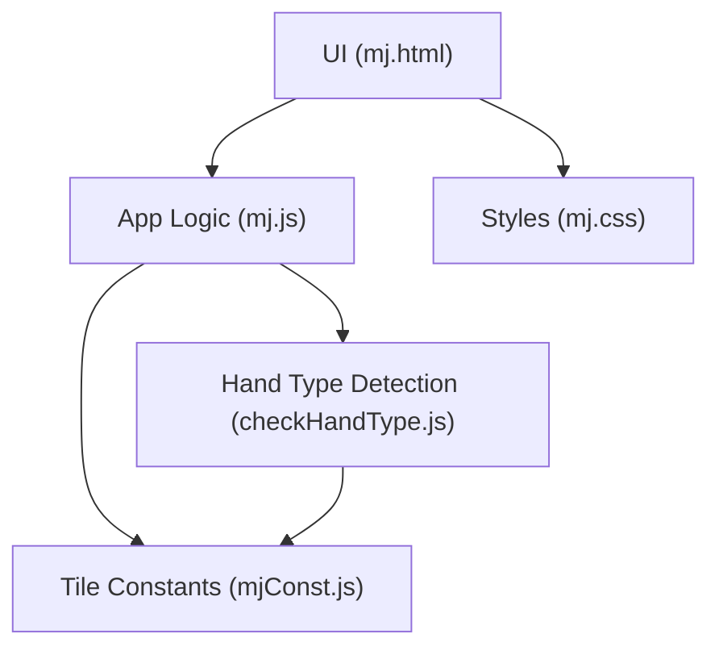
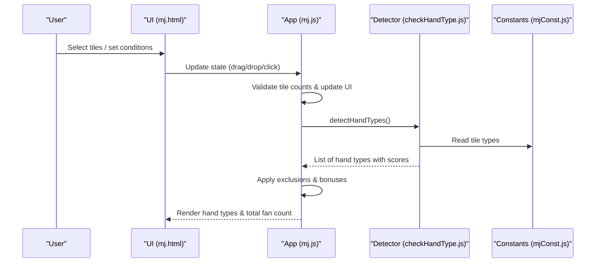
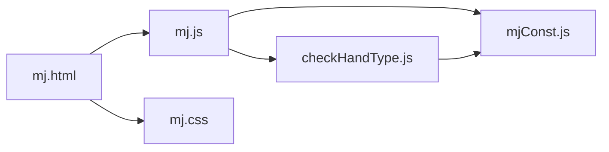

# Frequently Asked Questions

<cite>
**Referenced Files in This Document**
- [mj.html](file://mj.html)
- [mj.js](file://mj.js)
- [mjConst.js](file://mjConst.js)
- [checkHandType.js](file://checkHandType.js)
- [mj.css](file://mj.css)
</cite>

## Table of Contents
1. [Introduction](#introduction)
2. [Project Structure](#project-structure)
3. [Core Components](#core-components)
4. [Architecture Overview](#architecture-overview)
5. [Detailed Component Analysis](#detailed-component-analysis)
6. [Dependency Analysis](#dependency-analysis)
7. [Performance Considerations](#performance-considerations)
8. [Troubleshooting Guide](#troubleshooting-guide)
9. [Conclusion](#conclusion)
10. [Appendices](#appendices)

## Introduction
This FAQ answers the most common questions about the OV MJ Calculator, a web-based Taiwanese Mahjong scoring assistant. It explains supported variants and rules, how hand types are identified, how special conditions affect scoring, and why certain features behave as they do. It also includes troubleshooting tips for common user errors and misunderstandings about game mechanics.

## Project Structure
The calculator is a single-page web app with:
- UI layout and controls (HTML)
- State management, drag-and-drop interactions, and score calculation triggers (JavaScript)
- Tile definitions and constants (JavaScript)
- Hand type detection and scoring logic (JavaScript)
- Styling and responsive layout (CSS)

**Diagram sources**
- [mj.html:1-248](file://mj.html#L1-L248)
- [mj.js:1-1211](file://mj.js#L1-L1211)
- [mjConst.js:1-65](file://mjConst.js#L1-L65)
- [checkHandType.js:1-800](file://checkHandType.js#L1-L800)
- [mj.css:1-493](file://mj.css#L1-L493)

**Section sources**
- [mj.html:1-248](file://mj.html#L1-L248)
- [mj.js:1-1211](file://mj.js#L1-L1211)
- [mjConst.js:1-65](file://mjConst.js#L1-L65)
- [checkHandType.js:1-800](file://checkHandType.js#L1-L800)
- [mj.css:1-493](file://mj.css#L1-L493)

## Core Components
- Tile selection and exposure: Drag-and-drop or click to add tiles to hand, exposed groups (chow/pung/kong), and winning tile area.
- Settings: Seat wind, round wind, dealer status and streak, self-draw flag, and many special condition toggles.
- Scoring engine: Validates tile counts, detects hand types, applies exclusion rules, adds state-based bonuses, and displays breakdown and total fan count.

Key behaviors:
- The app enforces correct total tile counts before calculating scores.
- Many high-value hands are detected automatically based on tile composition and state flags.
- Exclusion rules prevent double-counting overlapping patterns.

**Section sources**
- [mj.html:13-242](file://mj.html#L13-L242)
- [mj.js:150-800](file://mj.js#L150-L800)
- [mj.js:801-1211](file://mj.js#L801-L1211)
- [checkHandType.js:104-587](file://checkHandType.js#L104-L587)

## Architecture Overview
The flow from user input to final score:

**Diagram sources**
- [mj.html:13-242](file://mj.html#L13-L242)
- [mj.js:580-703](file://mj.js#L580-L703)
- [mj.js:1082-1129](file://mj.js#L1082-L1129)
- [checkHandType.js:104-587](file://checkHandType.js#L104-L587)
- [mjConst.js:1-65](file://mjConst.js#L1-L65)

## Detailed Component Analysis

### General Usage
- How do I select tiles?
  - Click tiles in the selection areas to add them to your hand. You can also drag tiles into the hand area. Flowers are selected separately.
  - Use the trash icon to remove tiles from hand or winning tile area.
- How do I declare chow/pung/kong?
  - Select three consecutive same-suit tiles to enable “Chow.”
  - Select at least three identical tiles to enable “Pung.”
  - Select four identical tiles to enable “Open Kong” or “Concealed Kong.”
- How do I set up the winning tile?
  - Drag one tile into the “Winning Tile” area. Only one tile is allowed there.
- What settings affect scoring?
  - Seat wind, round wind, dealer status and streak, self-draw, and many special condition checkboxes/selects under “Special Conditions.”

**Section sources**
- [mj.html:13-242](file://mj.html#L13-L242)
- [mj.js:150-177](file://mj.js#L150-L177)
- [mj.js:713-829](file://mj.js#L713-L829)
- [mj.js:580-703](file://mj.js#L580-L703)

### Scoring Rules and Hand Types
- Which Mahjong variant does this support?
  - Taiwanese Mahjong scoring with extensive hand types and special conditions typical of Taiwan play.
- Why do some hand types not appear?
  - The app validates that you have the correct number of tiles before scoring. If the count is wrong, no hand types will be shown until corrected.
- How are overlapping hand types handled?
  - Exclusion rules prevent double-counting when multiple patterns overlap. For example, higher-value patterns may exclude lower ones.
- What are “state-based” bonuses?
  - Flags like self-draw, declared ready, last-tile draws, kong draws, multi-win, and others add specific fan values when enabled.
- How are flowers counted?
  - Flowers contribute points based on positive/other flower classification; the app shows a combined entry when applicable.
- How are winds and dragons scored?
  - Wind pungs may include round/seat wind bonuses; dragon pungs add their own value.

Common examples of detected patterns include (not exhaustive):
- High-value patterns such as pure/hybrid suits, all honors, big/small triple dragons/winds, thirteen wonders, sixteen non-connecting, etc.
- Mid-range patterns such as full sequences, concealed kongs, brother sets, missing one suit, etc.
- Low-value base patterns such as plain hand, no-honors/no-flowers, etc.

**Section sources**
- [mj.js:1082-1129](file://mj.js#L1082-L1129)
- [checkHandType.js:1-70](file://checkHandType.js#L1-L70)
- [checkHandType.js:104-587](file://checkHandType.js#L104-L587)
- [checkHandType.js:589-764](file://checkHandType.js#L589-L764)
- [mjConst.js:1-65](file://mjConst.js#L1-L65)

### Technical Issues and Behavior
- Why does the app say “Please choose enough tiles”?
  - The total tile count must match the required amount given your exposed groups and whether you have a winning tile. Adjust your hand or exposed groups accordingly.
- Why are some buttons disabled?
  - Chow/Pung/Kong buttons are enabled only when the selected tiles meet the pattern requirements.
- Why did my hand reset after adding a tile?
  - When the hand reaches the maximum size without a winning tile set, the app may auto-set the winning tile or prompt you to adjust. Check the winning tile area and exposed groups.
- How do I undo an action?
  - Use the Undo button to revert to the previous state. History is maintained internally.

**Section sources**
- [mj.js:1054-1080](file://mj.js#L1054-L1080)
- [mj.js:1082-1129](file://mj.js#L1082-L1129)
- [mj.js:864-907](file://mj.js#L864-L907)
- [mj.js:1172-1209](file://mj.js#L1172-L1209)

### Advanced Features
- Multi-win and “snow on snow” bonuses:
  - Enable “Double/Triple win” and optional “锦上添花” to apply additional fan values when applicable.
- “Mingjue/Juejue” (visible winning tile count):
  - Set the visible winning tile count to capture rare conditions where the winning tile is the fourth visible tile.
- Special draws:
  - Flower draw, kong draw, double kong draw, robbing kong, and robbing double kong each add specific fan values when checked.
- Tenhou/Chihou and readiness:
  - Tenhou/Chihou and Ten-ready/Chi-ready flags add significant fan values when appropriate.

**Section sources**
- [mj.html:120-235](file://mj.html#L120-L235)
- [mj.js:613-703](file://mj.js#L613-L703)
- [checkHandType.js:265-374](file://checkHandType.js#L265-L374)
- [checkHandType.js:545-583](file://checkHandType.js#L545-L583)

## Dependency Analysis
- UI (HTML) drives state changes via event listeners in JavaScript.
- mj.js manages application state, handles drag-and-drop, and calls the detector.
- checkHandType.js performs complex pattern detection and returns a list of hand types with scores.
- mjConst.js provides tile type definitions used across the app.
- mj.css styles the interface and feedback states.

**Diagram sources**
- [mj.html:1-248](file://mj.html#L1-L248)
- [mj.js:1-1211](file://mj.js#L1-L1211)
- [checkHandType.js:1-800](file://checkHandType.js#L1-L800)
- [mjConst.js:1-65](file://mjConst.js#L1-L65)
- [mj.css:1-493](file://mj.css#L1-L493)

**Section sources**
- [mj.html:1-248](file://mj.html#L1-L248)
- [mj.js:1-1211](file://mj.js#L1-L1211)
- [checkHandType.js:1-800](file://checkHandType.js#L1-L800)
- [mjConst.js:1-65](file://mjConst.js#L1-L65)
- [mj.css:1-493](file://mj.css#L1-L493)

## Performance Considerations
- The app runs entirely in the browser; performance depends on device capability and screen size.
- Large hands with many exposed groups increase UI updates but remain lightweight.
- Avoid unnecessary reflows by using the provided drag-and-drop and click interfaces rather than manual DOM edits.

[No sources needed since this section provides general guidance]

## Troubleshooting Guide
- No hand types displayed:
  - Ensure the total tile count matches the requirement. The app enforces this before scoring.
  - Verify you have exactly one winning tile if applicable.
- Buttons disabled:
  - Select the correct combination of tiles for chow/pung/kong as described above.
- Unexpected exclusions:
  - Some high-value patterns exclude lower ones by design. Review the hand type list to see which patterns were applied.
- Confusion about “self-draw” vs “winning tile”:
  - Self-draw is a separate flag from the winning tile. Use the self-draw checkbox when you drew the winning tile yourself.
- Flowers not counting:
  - Add flowers in the dedicated area. Points are aggregated and shown when applicable.
- Multi-win not applying:
  - Set the multi-win level and optionally “锦上添花” to receive the corresponding bonus.

**Section sources**
- [mj.js:1082-1129](file://mj.js#L1082-L1129)
- [mj.js:1054-1080](file://mj.js#L1054-L1080)
- [mj.js:150-177](file://mj.js#L150-L177)
- [checkHandType.js:1-70](file://checkHandType.js#L1-L70)
- [checkHandType.js:265-374](file://checkHandType.js#L265-L374)
- [checkHandType.js:545-583](file://checkHandType.js#L545-L583)

## Conclusion
The OV MJ Calculator implements a comprehensive Taiwanese Mahjong scoring system with robust hand type detection, clear UI controls, and detailed special condition handling. Most user confusion stems from tile count validation, proper use of the winning tile area, and understanding exclusion rules. By following the usage steps and setting the correct flags, users can reliably obtain accurate hand type identification and score breakdowns.

[No sources needed since this section summarizes without analyzing specific files]

## Appendices

### Quick Reference: Supported Patterns and Conditions
- Base patterns: plain hand, no-honors/no-flowers, missing one suit, etc.
- Suit patterns: mixed/pure one suit, various dragon and wind combinations.
- High-value patterns: thirteen wonders, sixteen non-connecting, big/small triple dragons/winds, all honors, etc.
- State-based bonuses: self-draw, declared ready, last-tile draws, kong draws, multi-win, tenhou/chihou, etc.

**Section sources**
- [checkHandType.js:104-587](file://checkHandType.js#L104-L587)
- [mj.html:120-235](file://mj.html#L120-L235)