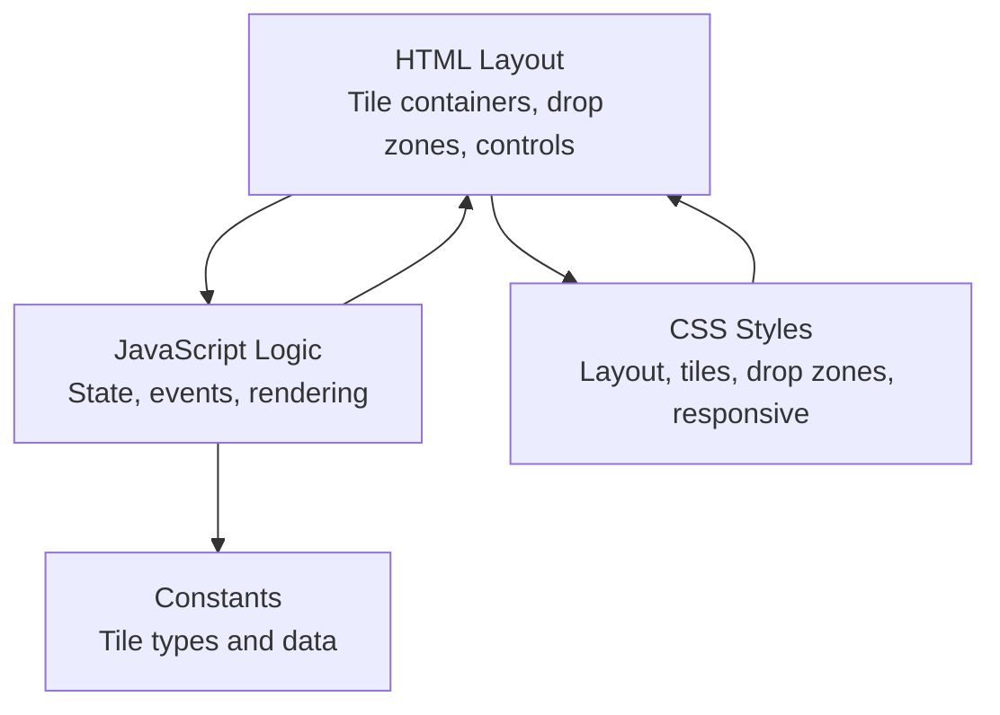
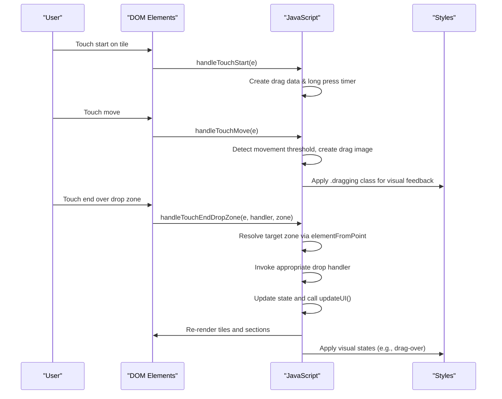
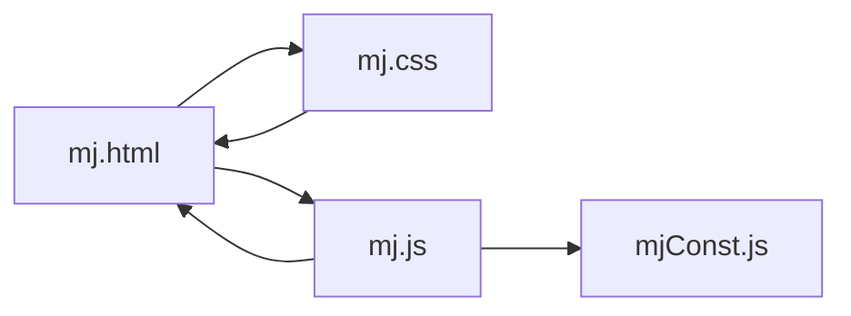

# Mobile Device Problems

<cite>
**Referenced Files in This Document**
- [mj.html](file://mj.html)
- [mj.js](file://mj.js)
- [mj.css](file://mj.css)
- [mjConst.js](file://mjConst.js)
</cite>

## Table of Contents
1. [Introduction](#introduction)
2. [Project Structure](#project-structure)
3. [Core Components](#core-components)
4. [Architecture Overview](#architecture-overview)
5. [Detailed Component Analysis](#detailed-component-analysis)
6. [Dependency Analysis](#dependency-analysis)
7. [Performance Considerations](#performance-considerations)
8. [Troubleshooting Guide](#troubleshooting-guide)
9. [Conclusion](#conclusion)
10. [Appendices](#appendices)

## Introduction
This document provides comprehensive troubleshooting guidance for mobile device-specific issues with the OV MJ Calculator. It focuses on touch interaction problems (drag-and-drop failures, gesture conflicts, input sensitivity), responsive design limitations across screen sizes and orientations, memory constraints on low-end devices, performance optimization for smooth scrolling and animations, keyboard overlay and viewport scaling issues, and orientation change handling. The guidance is grounded in the application’s HTML structure, JavaScript event handling, and CSS styling to help diagnose and resolve real-world mobile issues.

## Project Structure
The application consists of:
- A single-page interface that renders tile selection areas, hand/exposed/winning tile sections, settings, special conditions, and score display.
- A JavaScript module that manages state, drag-and-drop (mouse and touch), UI updates, and scoring logic.
- A stylesheet providing layout, tile visuals, drop zones, and basic responsive rules.
- Constants defining tile types and data used by the UI and logic.

**Diagram sources**
- [mj.html:13-247](file://mj.html#L13-L247)
- [mj.js:1-1211](file://mj.js#L1-L1211)
- [mj.css:1-493](file://mj.css#L1-L493)
- [mjConst.js:1-65](file://mjConst.js#L1-L65)

**Section sources**
- [mj.html:1-247](file://mj.html#L1-L247)
- [mj.js:1-1211](file://mj.js#L1-L1211)
- [mj.css:1-493](file://mj.css#L1-L493)
- [mjConst.js:1-65](file://mjConst.js#L1-L65)

## Core Components
- Touch and drag-and-drop system: Implements both mouse drag events and custom touch handlers to simulate drag behavior on mobile. Includes long press detection, dragging image creation, and drop zone resolution via elementFromPoint.
- Drop zones: Hand tiles, winning tile area, and trash icon are configured as drop targets with visual feedback classes.
- Tile rendering and selection: Tiles are dynamically created and attached with drag attributes and event listeners; selected tiles become draggable from the hand area.
- State management and UI updates: Centralized state object tracks all selections and settings; updateUI orchestrates rendering and recalculates scores.
- Responsive styles: Basic media queries adjust spacing and tile sizes for small screens.

Key implementation references:
- Touch event setup and prevention of default behaviors: [mj.js:67-116](file://mj.js#L67-L116)
- Long press threshold and drag image creation: [mj.js:179-231](file://mj.js#L179-L231)
- Drag move and drop resolution: [mj.js:233-377](file://mj.js#L233-L377)
- Drop zone configuration and initialization: [mj.js:118-148](file://mj.js#L118-L148)
- Tile rendering and attaching events: [mj.js:535-578](file://mj.js#L535-L578)
- Selected tiles becoming draggable: [mj.js:926-942](file://mj.js#L926-L942)
- CSS for tiles, drop zones, and touch behavior: [mj.css:85-394](file://mj.css#L85-L394)

**Section sources**
- [mj.js:67-116](file://mj.js#L67-L116)
- [mj.js:179-231](file://mj.js#L179-L231)
- [mj.js:233-377](file://mj.js#L233-L377)
- [mj.js:535-578](file://mj.js#L535-L578)
- [mj.js:926-942](file://mj.js#L926-L942)
- [mj.css:85-394](file://mj.css#L85-L394)

## Architecture Overview
The app follows a simple MVC-like pattern:
- Model: State object holds current selections and settings.
- View: HTML elements render tiles, drop zones, and controls; CSS styles define layout and interactions.
- Controller: JavaScript handles user interactions (clicks, touches, drags), updates state, and refreshes the view.

**Diagram sources**
- [mj.js:179-231](file://mj.js#L179-L231)
- [mj.js:233-377](file://mj.js#L233-L377)
- [mj.js:909-917](file://mj.js#L909-L917)
- [mj.css:329-394](file://mj.css#L329-L394)

## Detailed Component Analysis

### Touch Interaction and Drag-and-Drop
- Event binding strategy: Each tile gets mouse drag events and touch events bound via setupDragEvents. Touch events use passive:false to allow preventDefault where needed.
- Long press vs. tap: A 300ms threshold distinguishes between quick taps (treated as clicks) and longer presses (initiate drag).
- Drag image: On movement or long press, a cloned node is appended to body with fixed positioning and z-index to simulate native drag visuals.
- Drop resolution: Uses elementFromPoint at touch end to find the nearest valid drop zone among hand-tiles, winning-tile, and trash-icon.
- Scroll interference: Prevent default on touchmove during drag; overscroll-behavior set to none on html/body to avoid accidental scrolling while dragging.

Potential mobile pitfalls:
- Inconsistent elementFromPoint results due to transformed/dragging overlays.
- Gesture conflicts when preventing default on touchmove can block legitimate scroll actions outside drag.
- Long press thresholds may feel unresponsive on some devices; consider adaptive thresholds based on device type.

**Section sources**
- [mj.js:67-116](file://mj.js#L67-L116)
- [mj.js:179-231](file://mj.js#L179-L231)
- [mj.js:233-377](file://mj.js#L233-L377)
- [mj.css:401-404](file://mj.css#L401-L404)

### Drop Zones and Visual Feedback
- Drop zones are initialized once per page load and re-bound when necessary.
- Visual cues: Classes like drag-over and touch-active provide immediate feedback during interactions.
- Trash icon acts as a drop target to remove tiles from hand or winning areas.

Common issues:
- If drop zones are not present at init time, errors are logged; ensure DOM readiness before binding.
- Overlapping elements or high z-index stacking contexts can interfere with hit testing.

**Section sources**
- [mj.js:118-148](file://mj.js#L118-L148)
- [mj.css:291-315](file://mj.css#L291-L315)
- [mj.css:329-394](file://mj.css#L329-L394)

### Tile Rendering and Selection
- Tiles are created dynamically with dataset attributes for type/value/source, enabling consistent event handling and logic.
- Selected tiles in the hand area become draggable and can be moved to winning area or trash.
- Flower tiles have separate click-to-add behavior distinct from regular tiles.

Mobile considerations:
- Ensure tiles are large enough for touch targets; current sizes are small but acceptable on most phones.
- Avoid excessive DOM nodes to reduce memory pressure on low-end devices.

**Section sources**
- [mj.js:535-578](file://mj.js#L535-L578)
- [mj.js:926-942](file://mj.js#L926-L942)
- [mj.css:85-124](file://mj.css#L85-L124)

### State Management and UI Updates
- Central state object tracks hands, exposed groups, winning tile, and various flags affecting scoring.
- updateUI orchestrates multiple sub-updates: counts, displays, button states, and score calculation.
- History stack supports undo operations; limited to 50 entries to control memory growth.

Optimization tips:
- Batch DOM updates where possible to minimize reflows.
- Debounce frequent updates if adding many tiles rapidly.

**Section sources**
- [mj.js:1-33](file://mj.js#L1-L33)
- [mj.js:909-917](file://mj.js#L909-L917)
- [mj.js:864-878](file://mj.js#L864-L878)

### Scoring and Validation
- calculateScore validates total tile count against required count based on exposed groups and winning tile presence.
- Displays detected hand types and accumulates scores; integrates dealer/round wind settings.

Mobile relevance:
- Frequent recalculations on every change are fine for this scale, but ensure heavy computations are isolated from UI thread if extended.

**Section sources**
- [mj.js:1082-1129](file://mj.js#L1082-L1129)

## Dependency Analysis
- mj.html depends on mj.css for styling and mj.js for interactivity; it also loads mjConst.js for tile definitions.
- mj.js depends on mjConst.js for tile data and types; it manipulates DOM elements defined in mj.html.
- mj.css defines layout and interaction visuals consumed by both HTML and JS-driven classes.

**Diagram sources**
- [mj.html:1-247](file://mj.html#L1-L247)
- [mj.js:1-1211](file://mj.js#L1-L1211)
- [mj.css:1-493](file://mj.css#L1-L493)
- [mjConst.js:1-65](file://mjConst.js#L1-L65)

**Section sources**
- [mj.html:1-247](file://mj.html#L1-L247)
- [mj.js:1-1211](file://mj.js#L1-L1211)
- [mj.css:1-493](file://mj.css#L1-L493)
- [mjConst.js:1-65](file://mjConst.js#L1-L65)

## Performance Considerations
- Minimize layout thrashing: When updating multiple tiles, batch DOM changes and trigger reflow only once.
- Use requestAnimationFrame for animations involving transforms to keep them off the main thread where possible.
- Limit history size: Already capped at 50 entries; consider reducing further on low-memory devices.
- Avoid heavy synchronous work during touch events: Offload calculations to Web Workers if scoring becomes complex.
- Optimize drag images: Reuse a single drag image element instead of cloning repeatedly to reduce memory churn.

[No sources needed since this section provides general guidance]

## Troubleshooting Guide

### Touch Interaction Problems
Symptoms:
- Drag-and-drop does not start on tap.
- Dragging triggers unintended scrolling.
- Drop zone not recognized; tiles drop in wrong places.

Checks and fixes:
- Verify touch events are bound with passive:false and preventDefault is called appropriately during drag: [mj.js:67-116](file://mj.js#L67-L116), [mj.js:233-268](file://mj.js#L233-L268).
- Confirm long press threshold is suitable for your device; adjust the timeout if taps feel too slow to initiate drag: [mj.js:217-231](file://mj.js#L217-L231).
- Ensure elementFromPoint resolves to a valid drop zone; add console logs around hit testing to debug overlaps: [mj.js:336-348](file://mj.js#L336-L348).
- Check that drag images are appended to body and removed properly to avoid ghosting: [mj.js:217-231](file://mj.js#L217-L231), [mj.js:301-308](file://mj.js#L301-L308).
- Disable overscroll on html/body to prevent scroll interference during drag: [mj.css:401-404](file://mj.css#L401-L404).

**Section sources**
- [mj.js:67-116](file://mj.js#L67-L116)
- [mj.js:217-231](file://mj.js#L217-L231)
- [mj.js:233-268](file://mj.js#L233-L268)
- [mj.js:301-308](file://mj.js#L301-L308)
- [mj.js:336-348](file://mj.js#L336-L348)
- [mj.css:401-404](file://mj.css#L401-L404)

### Gesture Conflicts
Symptoms:
- Swiping to scroll conflicts with dragging tiles.
- Double-tap zoom interferes with tile selection.

Checks and fixes:
- Use touch-action: manipulation on interactive elements to disable double-tap zoom and improve responsiveness: [mj.css:379-385](file://mj.css#L379-L385).
- Restrict preventDefault to within drag sequences; allow normal scrolling outside drag to avoid blocking gestures: [mj.js:233-268](file://mj.js#L233-L268).
- Add meta viewport tag to control initial scale and zoom behavior: [mj.html:5](file://mj.html#L5).

**Section sources**
- [mj.css:379-385](file://mj.css#L379-L385)
- [mj.js:233-268](file://mj.js#L233-L268)
- [mj.html:5](file://mj.html#L5)

### Input Sensitivity Issues
Symptoms:
- Tiles respond too slowly to taps or require hard presses.
- Accidental taps register as drags.

Checks and fixes:
- Adjust long press threshold to balance tap vs. drag initiation: [mj.js:217-231](file://mj.js#L231-L231).
- Increase tile touch target size if necessary; current sizes are compact but functional: [mj.css:85-98](file://mj.css#L85-L98).
- Ensure user-select and touch-callout are disabled to avoid text selection interfering with taps: [mj.css:344-358](file://mj.css#L344-L358).

**Section sources**
- [mj.js:217-231](file://mj.js#L217-L231)
- [mj.css:85-98](file://mj.css#L85-L98)
- [mj.css:344-358](file://mj.css#L344-L358)

### Responsive Design Limitations and Layout Problems
Symptoms:
- Tiles overflow or wrap awkwardly on narrow screens.
- Controls overlap or become difficult to tap.

Checks and fixes:
- Review media query adjustments for small screens; ensure tile sizes and gaps remain usable: [mj.css:469-493](file://mj.css#L469-L493).
- Consider using flex-wrap and gap properties already applied to tile containers; test on various widths: [mj.css:68-75](file://mj.css#L68-L75).
- Validate that drop zones maintain minimum dimensions for reliable drops: [mj.css:313-315](file://mj.css#L313-L315).

**Section sources**
- [mj.css:68-75](file://mj.css#L68-L75)
- [mj.css:313-315](file://mj.css#L313-L315)
- [mj.css:469-493](file://mj.css#L469-L493)

### Memory Constraints on Low-End Devices
Symptoms:
- App becomes sluggish after many selections or repeated undos.
- Occasional crashes or freezes during drag operations.

Checks and fixes:
- Limit history entries to reduce memory footprint; already capped at 50: [mj.js:864-878](file://mj.js#L864-L878).
- Avoid creating excessive DOM nodes; reuse elements where possible (e.g., single drag image): [mj.js:217-231](file://mj.js#L217-L231).
- Debounce rapid updates if adding many tiles quickly; batch DOM writes: [mj.js:909-917](file://mj.js#L909-L917).

**Section sources**
- [mj.js:864-878](file://mj.js#L864-L878)
- [mj.js:909-917](file://mj.js#L909-L917)

### Performance Optimization for Smooth Scrolling and Animations
Symptoms:
- Janky scrolling when dragging tiles near content.
- Laggy transitions on tile hover or selection.

Checks and fixes:
- Use transform-based animations instead of layout-affecting properties: [mj.css:329-335](file://mj.css#L329-L335).
- Keep touch event handlers lightweight; defer heavy work out of event loops: [mj.js:233-268](file://mj.js#L233-L268).
- Ensure drag images are positioned with fixed coordinates and minimal style changes: [mj.js:372-377](file://mj.js#L372-L377).

**Section sources**
- [mj.css:329-335](file://mj.css#L329-L335)
- [mj.js:233-268](file://mj.js#L233-L268)
- [mj.js:372-377](file://mj.js#L372-L377)

### Keyboard Overlay Issues
Symptoms:
- Virtual keyboard covers controls or drop zones.
- Inputs shift layout unexpectedly.

Checks and fixes:
- Ensure viewport meta tag sets proper scaling: [mj.html:5](file://mj.html#L5).
- Avoid fixed positioning for critical interactive elements; prefer relative/flex layouts that adapt to keyboard height: [mj.css:126-141](file://mj.css#L126-L141).
- Test on iOS Safari and Android Chrome; adjust padding/margins if needed to keep key areas visible above the keyboard.

**Section sources**
- [mj.html:5](file://mj.html#L5)
- [mj.css:126-141](file://mj.css#L126-L141)

### Viewport Scaling Problems
Symptoms:
- Content appears too small or too large on different devices.
- Zoom gestures cause layout breakage.

Checks and fixes:
- Confirm width=device-width and initial-scale=1.0 in viewport meta: [mj.html:5](file://mj.html#L5).
- Use relative units (rem/em) and flexible layouts to scale gracefully: [mj.css:7-15](file://mj.css#L7-L15).
- Disable unnecessary zoom via touch-action and meta tags if app should not support pinch-zoom: [mj.css:379-385](file://mj.css#L379-L385).

**Section sources**
- [mj.html:5](file://mj.html#L5)
- [mj.css:7-15](file://mj.css#L7-L15)
- [mj.css:379-385](file://mj.css#L379-L385)

### Orientation Change Handling
Symptoms:
- Layout breaks when switching from portrait to landscape.
- Drop zones misalign or become unusable.

Checks and fixes:
- Test orientation changes thoroughly; ensure flex-wrap and media queries adapt correctly: [mj.css:469-493](file://mj.css#L469-L493).
- Avoid absolute positioning for critical elements; rely on flow-based layouts: [mj.css:68-75](file://mj.css#L68-L75).
- If needed, add orientationchange listeners to reset or recalculate layout metrics.

**Section sources**
- [mj.css:68-75](file://mj.css#L68-L75)
- [mj.css:469-493](file://mj.css#L469-L493)

### Testing Guidance for iOS and Android
- iOS Safari:
  - Verify touch-action and preventDefault behavior; iOS can be strict about scroll hijacking.
  - Test long press thresholds; iOS may interpret long presses differently.
  - Ensure virtual keyboard does not obscure controls; check safe-area insets if applicable.
- Android Chrome:
  - Confirm elementFromPoint accuracy across different densities and zoom levels.
  - Test drag-and-drop with hardware keyboards and external mice if available.
  - Validate performance under memory pressure; monitor with device developer tools.

[No sources needed since this section provides general guidance]

## Conclusion
The OV MJ Calculator implements a robust touch-enabled drag-and-drop system with careful attention to mobile interactions. Most mobile issues stem from event handling nuances, viewport scaling, and layout responsiveness. By adjusting long press thresholds, ensuring proper touch-action usage, optimizing DOM updates, and validating responsive styles across devices, you can achieve a smooth and reliable experience on smartphones and tablets. Continuous testing on iOS and Android devices will uncover edge cases specific to each platform’s browser behavior.

[No sources needed since this section summarizes without analyzing specific files]

## Appendices

### Quick Reference: Key Mobile-Focused Code Areas
- Touch event binding and prevention: [mj.js:67-116](file://mj.js#L67-L116)
- Long press and drag image creation: [mj.js:217-231](file://mj.js#L217-L231)
- Drag move and drop resolution: [mj.js:233-377](file://mj.js#L233-L377)
- Drop zone initialization: [mj.js:118-148](file://mj.js#L118-L148)
- Tile rendering and event attachment: [mj.js:535-578](file://mj.js#L535-L578)
- Selected tiles draggable: [mj.js:926-942](file://mj.js#L926-L942)
- CSS touch behavior and drop zones: [mj.css:291-394](file://mj.css#L291-L394)
- Viewport meta tag: [mj.html:5](file://mj.html#L5)

[No sources needed since this section lists references already cited above]