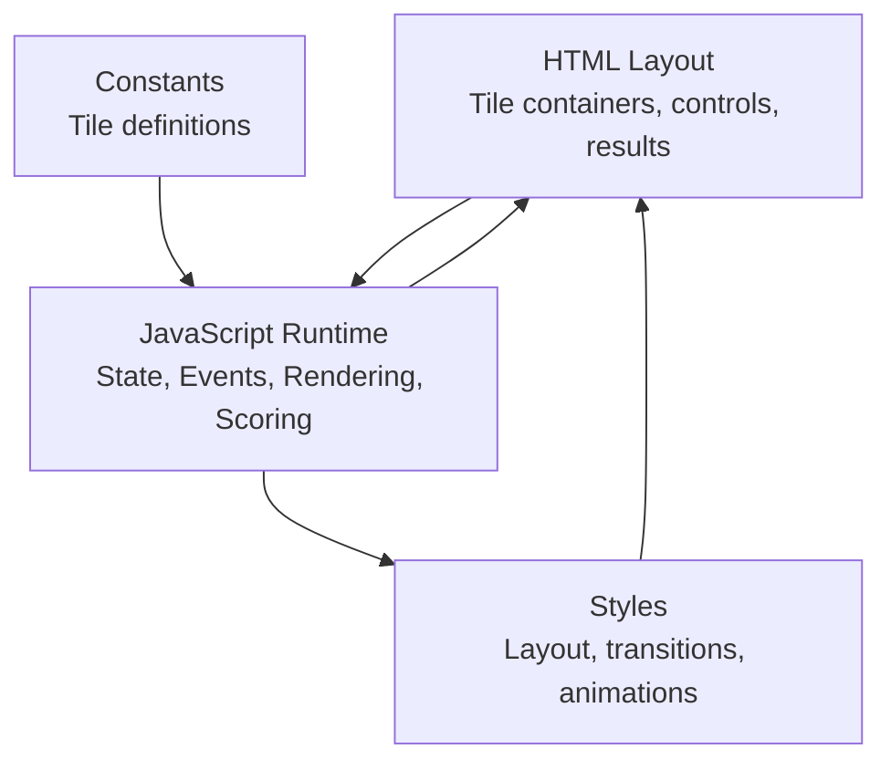
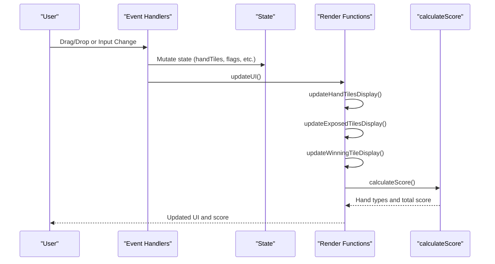
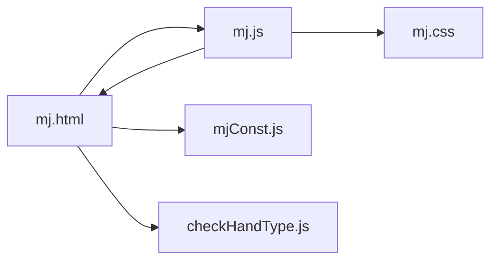
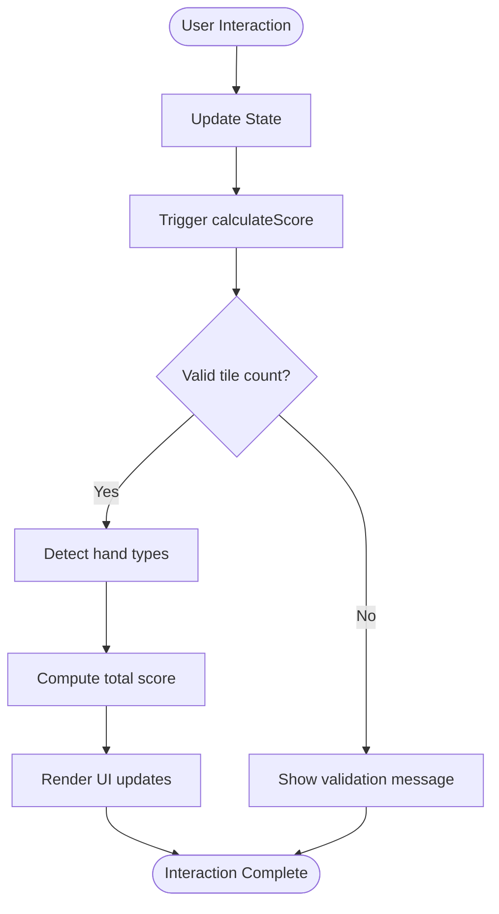
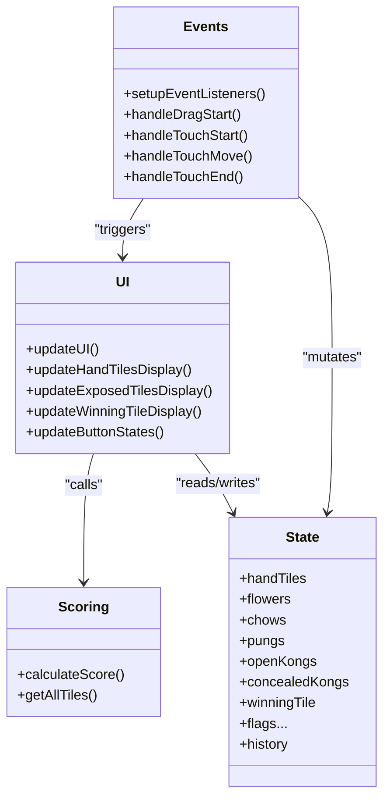

# Performance Issues and Optimization

<cite>
**Referenced Files in This Document**
- [mj.js](file://mj.js)
- [mj.html](file://mj.html)
- [mjConst.js](file://mjConst.js)
- [mj.css](file://mj.css)
</cite>

## Table of Contents
1. [Introduction](#introduction)
2. [Project Structure](#project-structure)
3. [Core Components](#core-components)
4. [Architecture Overview](#architecture-overview)
5. [Detailed Component Analysis](#detailed-component-analysis)
6. [Dependency Analysis](#dependency-analysis)
7. [Performance Considerations](#performance-considerations)
8. [Troubleshooting Guide](#troubleshooting-guide)
9. [Conclusion](#conclusion)
10. [Appendices](#appendices)

## Introduction
This document provides performance troubleshooting guidance for the OV MJ Calculator, focusing on slow score calculation times, memory leaks, and rendering bottlenecks on resource-constrained devices. It includes optimization techniques for large tile sets, complex hand configurations, and frequent state updates. It also covers debugging methods using browser developer tools, guidelines for efficient DOM manipulation, event listener management, and memory cleanup, as well as common causes of UI freezing, unresponsive interfaces, and excessive CPU usage during calculations.

## Project Structure
The application is a single-page Mahjong scoring tool with:
- HTML layout defining tile selection areas, exposed groups (chow/pung/kong), winning tile area, settings, and result display.
- JavaScript handling state, drag-and-drop interactions, UI updates, and score calculation.
- Constants defining tile types and tile data.
- CSS styling for tiles, drop zones, controls, and responsive behavior.

**Diagram sources**
- [mj.html:13-241](file://mj.html#L13-L241)
- [mj.js:1-1211](file://mj.js#L1-L1211)
- [mjConst.js:1-65](file://mjConst.js#L1-L65)
- [mj.css:1-493](file://mj.css#L1-L493)

**Section sources**
- [mj.html:13-241](file://mj.html#L13-L241)
- [mj.js:1-1211](file://mj.js#L1-L1211)
- [mjConst.js:1-65](file://mjConst.js#L1-L65)
- [mj.css:1-493](file://mj.css#L1-L493)

## Core Components
- State management: Centralized object tracking hand tiles, flowers, exposed groups, winning tile, and numerous boolean flags affecting scoring.
- Event system: Extensive drag-and-drop and touch support with per-tile event listeners; many input change handlers trigger recalculations.
- Rendering pipeline: Frequent DOM re-renders via innerHTML replacement and element creation for each tile or group.
- Scoring engine: Validates total tile count, detects hand types, aggregates scores, and updates UI.

Key performance hotspots:
- Repeated full re-render of tile lists and exposed groups on every interaction.
- Many event listeners bound to inputs that call calculateScore synchronously.
- Heavy DOM mutations inside updateUI and related functions.
- History stack growth and deep cloning on each action.

**Section sources**
- [mj.js:1-1211](file://mj.js#L1-L1211)
- [mj.html:13-241](file://mj.html#L13-L241)

## Architecture Overview
The app follows an imperative, event-driven architecture:
- Initialization binds events and renders initial tiles.
- User interactions (drag/drop, clicks, toggles) mutate state and invoke updateUI.
- updateUI triggers multiple render functions and calculates score.
- Score calculation validates tile counts, calls detection logic, and updates the result area.

**Diagram sources**
- [mj.js:36-42](file://mj.js#L36-L42)
- [mj.js:580-703](file://mj.js#L580-L703)
- [mj.js:909-917](file://mj.js#L909-L917)
- [mj.js:1082-1129](file://mj.js#L1082-L1129)

## Detailed Component Analysis

### Drag-and-Drop and Touch Handling
- Per-tile event binding occurs repeatedly when tiles are created or updated, which can cause memory pressure and redundant listeners if not carefully managed.
- Touch handling creates temporary drag images and attaches/updates styles frequently during move events, potentially causing layout thrashing on low-end devices.
- Drop zone setup removes and re-adds listeners to avoid duplicates, but initialization runs on DOMContentLoaded and again via setupDragAndDrop, risking double-binding if not guarded.

Optimization recommendations:
- Use event delegation for tile interactions where possible to reduce listener count.
- Debounce or throttle touchmove handlers to limit style updates.
- Ensure removeEventListener is called consistently before adding new ones; consider centralized listener management.

**Section sources**
- [mj.js:44-116](file://mj.js#L44-L116)
- [mj.js:179-377](file://mj.js#L179-L377)
- [mj.js:535-578](file://mj.js#L535-L578)
- [mj.js:926-942](file://mj.js#L926-L942)
- [mj.js:1037-1052](file://mj.js#L1037-L1052)

### UI Rendering and DOM Manipulation
- updateHandTilesDisplay, updateExposedTilesDisplay, and updateWinningTileDisplay replace container innerHTML and create elements per tile/group. This pattern is simple but can be expensive with frequent updates.
- Exposed groups loop through chows, pungs, openKongs, concealedKongs and rebuild DOM nodes each time.

Optimization recommendations:
- Batch DOM updates by building a DocumentFragment and appending once.
- Minimize innerHTML replacements; prefer targeted node updates or virtual DOM diffing.
- Avoid creating unnecessary intermediate arrays; reuse references where safe.

**Section sources**
- [mj.js:926-1052](file://mj.js#L926-L1052)

### Event Listeners and Recalculation Triggers
- Numerous input change handlers directly call calculateScore, leading to synchronous recalculations on every toggle/select change.
- This tight coupling between UI changes and heavy computation can freeze the UI on slower devices.

Optimization recommendations:
- Debounce/throttle input changes to batch updates.
- Consider requestAnimationFrame or microtask scheduling to defer heavy work off the main thread path.
- Separate pure computation from UI updates; compute first, then render once.

**Section sources**
- [mj.js:580-703](file://mj.js#L580-L703)

### History and Undo Mechanism
- saveStateToHistory performs deep clone of state objects and pushes into history array, capped at 50 entries. Deep cloning can be costly on frequent actions.
- undoLastAction restores previous state and triggers updateUI.

Optimization recommendations:
- Limit deep clones to essential fields or use structural sharing techniques.
- Consider immutable snapshots only when necessary; otherwise store deltas.
- Cap history size more conservatively if memory is constrained.

**Section sources**
- [mj.js:864-894](file://mj.js#L864-L894)

### Scoring Engine
- calculateScore validates total tile count against required tiles based on exposed groups and winning tile presence.
- Calls detectHandTypes (external script referenced in HTML) and aggregates scores, including dealer multiplier.
- Updates status message, hand types list, and total score display.

Potential issues:
- If detectHandTypes is computationally intensive or contains nested loops over all tiles/groups, it will dominate runtime.
- Frequent calls from many event handlers amplify cost.

Optimization recommendations:
- Cache intermediate results (e.g., grouped tile counts) to avoid recomputation.
- Early-exit validation paths to short-circuit invalid states quickly.
- Move heavy detection logic out of the main thread if feasible (Web Workers).

**Section sources**
- [mj.js:1082-1129](file://mj.js#L1082-L1129)
- [mj.html:244-247](file://mj.html#L244-L247)

### Tile Data and Constants
- Tile definitions and flower tiles are static arrays used throughout rendering and selection logic.
- These are lightweight but iterated frequently; ensure minimal allocations in hot paths.

Optimization recommendations:
- Precompute derived structures (e.g., maps by type/value) to speed up lookups.
- Avoid repeated filtering operations on ALL_TILES/FLOWER_TILES within tight loops.

**Section sources**
- [mjConst.js:1-65](file://mjConst.js#L1-L65)
- [mj.js:535-578](file://mj.js#L535-L578)

## Dependency Analysis
- mj.html loads mjConst.js, mj.js, and checkHandType.js. The scoring flow depends on detectHandTypes implemented externally.
- mj.js depends on DOM elements defined in mj.html and constants from mjConst.js.
- mj.css affects layout and visual feedback; transitions and transforms may impact performance on low-end devices.

**Diagram sources**
- [mj.html:244-247](file://mj.html#L244-L247)
- [mj.js:1-1211](file://mj.js#L1-L1211)
- [mjConst.js:1-65](file://mjConst.js#L1-L65)
- [mj.css:1-493](file://mj.css#L1-L493)

**Section sources**
- [mj.html:244-247](file://mj.html#L244-L247)
- [mj.js:1-1211](file://mj.js#L1-L1211)
- [mjConst.js:1-65](file://mjConst.js#L1-L65)
- [mj.css:1-493](file://mj.css#L1-L493)

## Performance Considerations
Common causes of slowdowns and freezes:
- Full re-renders on every interaction due to innerHTML replacement and per-element event binding.
- Synchronous heavy computations triggered by many input change handlers.
- Frequent creation/removal of DOM nodes and drag images during touch moves.
- Deep cloning of state for history on each action.

Optimization techniques:
- Reduce DOM churn:
  - Batch updates using DocumentFragment.
  - Update only changed nodes instead of replacing entire containers.
  - Reuse existing elements where possible.
- Optimize event handling:
  - Use event delegation for tile interactions.
  - Debounce/throttle input changes and touchmove events.
  - Remove redundant listeners and guard initialization to prevent duplicates.
- Improve scoring performance:
  - Cache computed tile counts and groupings.
  - Short-circuit invalid states early.
  - Offload heavy detection to Web Workers if detectHandTypes is complex.
- Memory management:
  - Clear temporary drag images promptly.
  - Limit history depth and avoid deep clones unless necessary.
  - Ensure removeEventListener is called before reattaching listeners.
- CSS and rendering:
  - Minimize heavy transitions and transforms on mobile.
  - Use will-change sparingly and only for animated elements.
  - Prefer layout-thrill-free updates (read DOM properties in batches).

[No sources needed since this section provides general guidance]

## Troubleshooting Guide
Use browser developer tools to identify and resolve performance issues:

- Profiling and Timelines:
  - Open Performance tab, record interactions (drag/drop, toggles), and analyze long tasks.
  - Look for spikes in calculateScore or render functions; identify blocking calls.
  - Check for excessive DOM manipulation and layout thrashing in the Main thread.

- Memory Leaks:
  - Take heap snapshots before and after interactions; compare retained objects.
  - Inspect for lingering event listeners on removed nodes.
  - Verify temporary drag images are removed and references cleared.

- Rendering Bottlenecks:
  - Use Layers panel to detect repaints and compositing costs.
  - Identify heavy CSS transitions or transforms causing jank.
  - Measure frame rate drops during touchmove and drag operations.

- Event Listener Management:
  - Audit event listeners in Elements > Event Listeners to find duplicates.
  - Confirm removeEventListener is invoked correctly before adding new ones.
  - Validate that drop zone initialization does not run multiple times unintentionally.

- Calculation Hotspots:
  - Instrument calculateScore and detectHandTypes with timing logs to pinpoint slow sections.
  - Break down work into smaller chunks using requestAnimationFrame or setTimeout to keep UI responsive.

- Practical checks:
  - Temporarily disable heavy features (e.g., history, complex drag effects) to isolate bottlenecks.
  - Test on low-end devices/emulators to reproduce real-world constraints.

**Section sources**
- [mj.js:44-116](file://mj.js#L44-L116)
- [mj.js:179-377](file://mj.js#L179-L377)
- [mj.js:580-703](file://mj.js#L580-L703)
- [mj.js:909-1129](file://mj.js#L909-L1129)

## Conclusion
The OV MJ Calculator’s performance hinges on minimizing DOM churn, optimizing event handling, and streamlining scoring computations. By batching updates, debouncing inputs, caching intermediate results, and managing memory carefully, you can significantly improve responsiveness on resource-constrained devices. Use profiling tools to validate improvements and continuously monitor for regressions.

[No sources needed since this section summarizes without analyzing specific files]

## Appendices

### Debugging Flowchart for UI Freezing During Calculations

**Diagram sources**
- [mj.js:1082-1129](file://mj.js#L1082-L1129)

### Class and Function Relationships

**Diagram sources**
- [mj.js:1-33](file://mj.js#L1-L33)
- [mj.js:580-703](file://mj.js#L580-L703)
- [mj.js:909-1129](file://mj.js#L909-L1129)