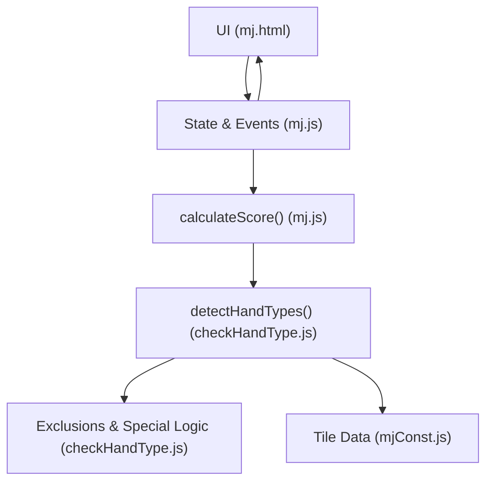
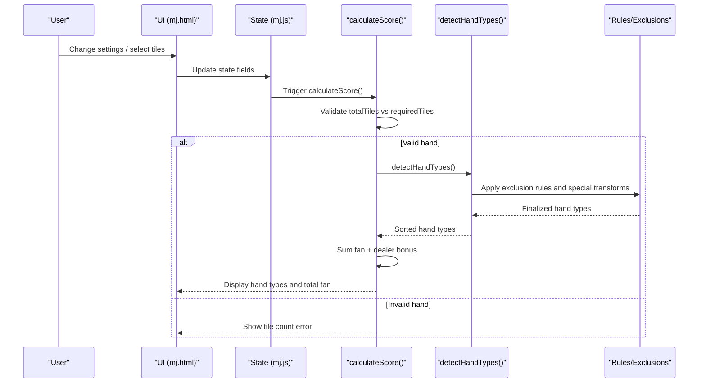
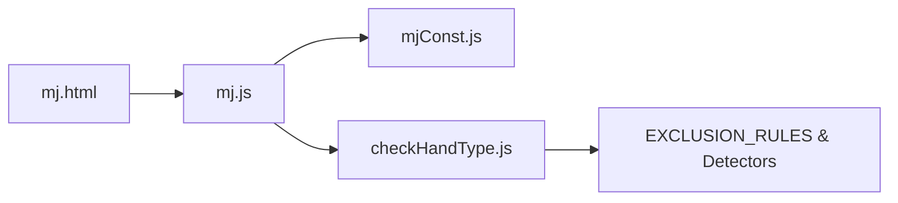

# Scoring Calculation Errors

<cite>
**Referenced Files in This Document**
- [mj.js](file://mj.js)
- [checkHandType.js](file://checkHandType.js)
- [mjConst.js](file://mjConst.js)
- [mj.html](file://mj.html)
</cite>

## Table of Contents
1. [Introduction](#introduction)
2. [Project Structure](#project-structure)
3. [Core Components](#core-components)
4. [Architecture Overview](#architecture-overview)
5. [Detailed Component Analysis](#detailed-component-analysis)
6. [Dependency Analysis](#dependency-analysis)
7. [Performance Considerations](#performance-considerations)
8. [Troubleshooting Guide](#troubleshooting-guide)
9. [Conclusion](#conclusion)

## Introduction
This document provides comprehensive troubleshooting guidance for scoring calculation errors and incorrect results in the OV MJ Calculator. It focuses on common mistakes in Mahjong hand configuration that lead to wrong scores, including misidentified hand types, missing special conditions, and incorrect bonus applications. It also includes debugging steps to verify hand type detection, check rule application order, validate scoring logic, and handle edge cases and rare hand patterns. Finally, it offers step-by-step guides for manually verifying scores and identifying discrepancies between expected and calculated results.

## Project Structure
The calculator is a client-side web app with:
- UI and state management in mj.js
- Hand type detection and scoring rules in checkHandType.js
- Tile definitions in mjConst.js
- HTML layout and controls in mj.html

**Diagram sources**
- [mj.js:1082-1129](file://mj.js#L1082-L1129)
- [checkHandType.js:105-587](file://checkHandType.js#L105-L587)
- [mjConst.js:1-65](file://mjConst.js#L1-L65)
- [mj.html:237-247](file://mj.html#L237-L247)

**Section sources**
- [mj.js:1-42](file://mj.js#L1-L42)
- [mj.html:1-248](file://mj.html#L1-L248)
- [mjConst.js:1-65](file://mjConst.js#L1-L65)

## Core Components
- Application state and event wiring: tile selection, open hands (chow/pung/kong), winning tile, and special condition flags all update the score automatically via calculateScore().
- Hand validation: total tile count must match required tiles based on exposed groups and kongs before any scoring runs.
- Hand type detection: detectHandTypes() enumerates many possible yaku/hand types, applies exclusion rules, and returns a sorted list used to compute total fan.
- Bonus and dealer multiplier: after hand types are computed, dealer status adds additional fan based on round/seat and consecutive dealer count.

Key responsibilities and where to look:
- State updates and triggers: [mj.js:580-703](file://mj.js#L580-L703)
- Tile input handling and validation: [mj.js:449-522](file://mj.js#L449-L522), [mj.js:713-829](file://mj.js#L713-L829)
- Score entry point and display: [mj.js:1082-1129](file://mj.js#L1082-L1129)
- Hand detection and exclusions: [checkHandType.js:105-587](file://checkHandType.js#L105-L587)
- Tile constants: [mjConst.js:1-65](file://mjConst.js#L1-L65)

**Section sources**
- [mj.js:580-703](file://mj.js#L580-L703)
- [mj.js:1082-1129](file://mj.js#L1082-L1129)
- [checkHandType.js:105-587](file://checkHandType.js#L105-L587)
- [mjConst.js:1-65](file://mjConst.js#L1-L65)

## Architecture Overview
The scoring pipeline is event-driven and deterministic:
- User actions update state and call calculateScore().
- calculateScore() validates tile counts, then calls detectHandTypes().
- detectHandTypes() builds candidate hand types, applies exclusion rules, handles special transformations (e.g., Da Ji Hu), and sorts results.
- calculateScore() aggregates fan from detected hand types and adds dealer-related fan, then displays results.

**Diagram sources**
- [mj.js:1082-1129](file://mj.js#L1082-L1129)
- [checkHandType.js:105-587](file://checkHandType.js#L105-L587)

## Detailed Component Analysis

### Tile Count Validation and Entry Gate
- The calculator enforces a strict tile count before scoring: total tiles must equal 17 plus the number of kongs (open or concealed). If not, no scoring occurs and an error message is shown.
- Common pitfalls:
  - Forgetting to set the winning tile when the hand reaches maximum size.
  - Incorrectly counting exposed groups (chow/pkung/open kong/concealed kong) affecting the required total.
  - Not removing tiles from hand when creating chow/pung/kong.

Debugging tips:
- Verify the displayed tile count matches the required count.
- Ensure each action (chow/pung/kong) removes the correct tiles from the hand and adds them to the appropriate group.
- Confirm the winning tile is set when the hand is complete.

**Section sources**
- [mj.js:1082-1101](file://mj.js#L1082-L1101)
- [mj.js:449-522](file://mj.js#L449-L522)
- [mj.js:713-829](file://mj.js#L713-L829)

### Hand Type Detection Pipeline
- detectHandTypes() performs layered checks:
  - High-value or structural patterns first (e.g., thirteen-orphans variants, sixteen-not-connected patterns, big/small seven doors, suits-only hands).
  - State-based bonuses (self-draw, ready declaration, ippatsu, last-tile draws, robbing kongs, double-kong wins, heaven/earth, etc.).
  - Structural patterns (full exposure hands, concealed tile counts like four/seven/ten concealed, pure/mixed one-suit, ping hu, dui dui hu).
  - Specific honors and dragons (winds/dragons sets, full honors).
  - Flower points and multi-win conditions.
  - Exclusion rules to prevent overlapping or lower-priority types from inflating the score.
  - Special transformation for low-scoring reward-only hands into Da Ji Hu/Ya Hu.

Common pitfalls:
- Missing special condition flags (e.g., forgetting to mark self-draw, last-tile draw, or multi-win).
- Misinterpreting “exposed” vs “concealed” groups leading to incorrect eligibility for certain patterns.
- Overlapping hand types being counted due to incorrect exclusion application.

Debugging tips:
- Temporarily log or inspect the intermediate handTypes array returned by detectHandTypes() to see which patterns matched.
- Check exclusion rules to ensure higher-priority patterns exclude conflicting ones.
- Validate state flags against the actual game situation.

**Section sources**
- [checkHandType.js:105-587](file://checkHandType.js#L105-L587)
- [checkHandType.js:42-70](file://checkHandType.js#L42-L70)

### Exclusion Rules and Priority
- The system uses an exclusion table to remove incompatible or lower-priority hand types when a higher-priority pattern is detected.
- Prefix matching allows flexible keys (e.g., “純全帶X”) to match parameterized names.
- After exclusions, a special transformation may replace multiple small reward-type fans with a single high-value fan (Da Ji Hu/Ya Hu) if applicable.

Common pitfalls:
- Assuming all detected patterns should be summed; some are intentionally excluded.
- Misunderstanding prefix matching behavior for parameterized names.

Debugging tips:
- Inspect the final handTypes after exclusions to confirm conflicts were removed.
- Verify whether a low-scoring combination was replaced by a high-scoring transformation.

**Section sources**
- [checkHandType.js:1-70](file://checkHandType.js#L1-L70)
- [checkHandType.js:72-102](file://checkHandType.js#L72-L102)

### Dealer Multiplier and Round/Seat Wind Bonuses
- After hand types are finalized, the calculator adds dealer-related fan based on whether the player is dealer and the consecutive dealer count.
- Wind honors can contribute additional fan depending on seat wind and round wind.

Common pitfalls:
- Incorrectly setting dealer status or consecutive dealer count.
- Misidentifying seat wind or round wind.

Debugging tips:
- Confirm the UI selections for seat wind, round wind, and dealer status.
- Verify the added dealer fan line in the output matches expectations.

**Section sources**
- [mj.js:1118-1125](file://mj.js#L1118-L1125)
- [checkHandType.js:504-534](file://checkHandType.js#L504-L534)

### Edge Cases and Rare Patterns
- Thirteen-orphans variants with extra melds or waits: detection considers base 13-orphans plus potential extra sequences/triplets and wait analysis.
- Sixteen-not-connected patterns with combinations like three-meeting winds or mixed dragons.
- Full-exposure hands (all chows/pungs/open kongs) with specific concealed tile counts (four/seven/ten).
- Multi-win scenarios (double/triple win) and “snow on snow” bonuses.
- Flower-based instant wins when eight flowers are present.

Common pitfalls:
- Failing to set the winning tile when the hand completes at maximum size.
- Not marking special draw conditions (flower draw, kong draw, double-kong draw, robbing kong).
- Miscounting concealed vs exposed groups for eligibility.

Debugging tips:
- Use undo/clear to reconstruct the hand step-by-step and re-run detection.
- Cross-check each special condition checkbox against the real game state.
- For complex patterns, isolate subsets (e.g., test suit-only hands separately) to confirm detection.

**Section sources**
- [checkHandType.js:109-185](file://checkHandType.js#L109-L185)
- [checkHandType.js:332-374](file://checkHandType.js#L332-L374)
- [checkHandType.js:556-583](file://checkHandType.js#L556-L583)

## Dependency Analysis
- UI events in mj.html trigger changes in mj.js state, which immediately recalculates scores.
- mj.js depends on mjConst.js for tile definitions and CSS classes.
- mj.js delegates scoring logic to checkHandType.js via detectHandTypes().
- Exclusion rules and specialized detectors live in checkHandType.js and rely on global state (chows, pungs, kongs, winning tile, flags).

**Diagram sources**
- [mj.html:237-247](file://mj.html#L237-L247)
- [mj.js:1082-1129](file://mj.js#L1082-L1129)
- [checkHandType.js:1-70](file://checkHandType.js#L1-L70)

**Section sources**
- [mj.js:1-42](file://mj.js#L1-L42)
- [mjConst.js:1-65](file://mjConst.js#L1-L65)
- [checkHandType.js:105-587](file://checkHandType.js#L105-L587)

## Performance Considerations
- The detection pipeline runs on every state change; keep the number of exposed groups reasonable to avoid excessive permutations in complex detectors.
- Avoid unnecessary repeated operations; the current design recomputes only when needed via event listeners.
- For very large hands or many kongs, consider simplifying inputs during debugging to isolate slow paths.

[No sources needed since this section provides general guidance]

## Troubleshooting Guide

### Step-by-Step Verification Workflow
1. Validate tile count
   - Ensure total tiles equals 17 plus the number of kongs (open or concealed).
   - If invalid, fix tile selection or winning tile placement before proceeding.

2. Confirm exposed groups
   - Verify chows, pungs, open kongs, and concealed kongs are correctly created and tiles removed from hand.
   - Check that the exposed area reflects intended groups.

3. Set winning tile
   - When the hand reaches maximum size without a winning tile, the app auto-sets it; otherwise, explicitly place the winning tile.

4. Mark special conditions
   - Self-draw, declared ready, ippatsu, last-tile draw, flower draw, kong draw, double-kong draw, robbing kong, heaven/earth, face-down, multi-win, visible-win-tile-count.

5. Review detected hand types
   - Inspect the listed hand types and their fan values.
   - Confirm exclusion rules did not remove expected types unintentionally.

6. Check dealer and wind bonuses
   - Verify seat wind, round wind, and dealer status.
   - Confirm dealer fan addition matches consecutive dealer count.

7. Manual score reconciliation
   - Sum fan from listed hand types and compare with the displayed total.
   - If discrepancy exists, trace back to the specific hand type and its eligibility conditions.

### Common Mistakes and Fixes
- Wrong hand type detected
  - Cause: Incorrect exposed/concealed classification or missing special flags.
  - Fix: Rebuild the hand step-by-step; ensure each action removes/adds tiles correctly; toggle relevant checkboxes.

- Missing special conditions
  - Cause: Forgetting to mark self-draw, last-tile draw, or multi-win.
  - Fix: Enable corresponding checkboxes; re-run calculation.

- Incorrect bonus application
  - Cause: Mis-set seat/round wind or dealer status.
  - Fix: Correct UI selections; verify added dealer fan and wind honor contributions.

- Overcounting due to overlapping patterns
  - Cause: Expecting multiple compatible patterns to sum when exclusions apply.
  - Fix: Understand exclusion rules; accept that some lower-priority patterns are intentionally removed.

### Debugging Techniques
- Isolate components
  - Test with minimal hands (e.g., pure one-suit or all honors) to confirm basic detection works.
  - Gradually add complexity (kongs, exposed groups) to pinpoint issues.

- Use undo/clear
  - Undo recent actions to revert to a known-good state.
  - Clear and rebuild from scratch to eliminate hidden state corruption.

- Cross-check with manual rules
  - Manually enumerate eligible patterns and compare with the app’s output.
  - Pay attention to high-value patterns that may replace smaller ones.

### Edge Cases Checklist
- Thirteen-orphans with extra melds or waits
  - Ensure base 13-orphans are present; check if extra tiles form valid sequences/triplets.
  - Verify wait analysis if claiming high-wait variants.

- Sixteen-not-connected patterns
  - Confirm presence of required non-connected structure; check for three-meeting winds or mixed dragons.

- Full-exposure hands with concealed counts
  - Ensure all melds are exposed and concealed tile count matches four/seven/ten thresholds.

- Multi-win and “snow on snow”
  - Set multi-win value (double/triple) and optional self-draw bonus; verify visible-win-tile-count if applicable.

- Flower-based instant win
  - Add exactly eight flowers to trigger the flower-hand win.

**Section sources**
- [mj.js:1082-1129](file://mj.js#L1082-L1129)
- [checkHandType.js:109-185](file://checkHandType.js#L109-L185)
- [checkHandType.js:332-374](file://checkHandType.js#L332-L374)
- [checkHandType.js:556-583](file://checkHandType.js#L556-L583)

## Conclusion
Scoring errors in the OV MJ Calculator typically stem from incomplete or incorrect hand configuration, missing special condition flags, or misunderstandings about exclusion rules and priority. By validating tile counts, carefully setting exposed groups and the winning tile, accurately marking special conditions, and reviewing detected hand types against exclusion logic, most discrepancies can be identified and resolved. Use the step-by-step verification workflow and edge case checklist to systematically debug and confirm correct scoring outcomes.