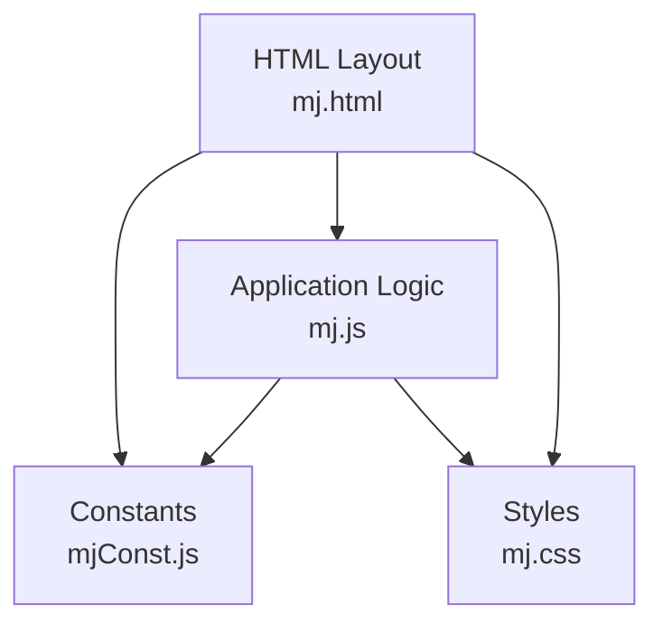
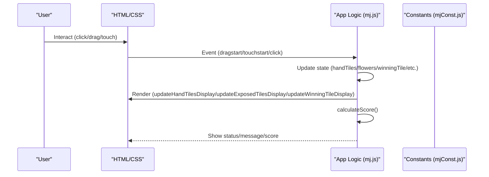
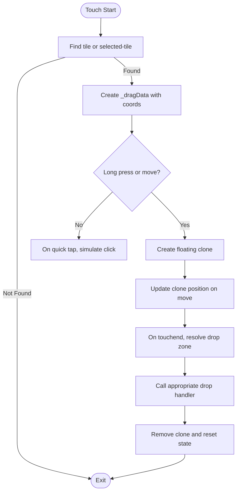
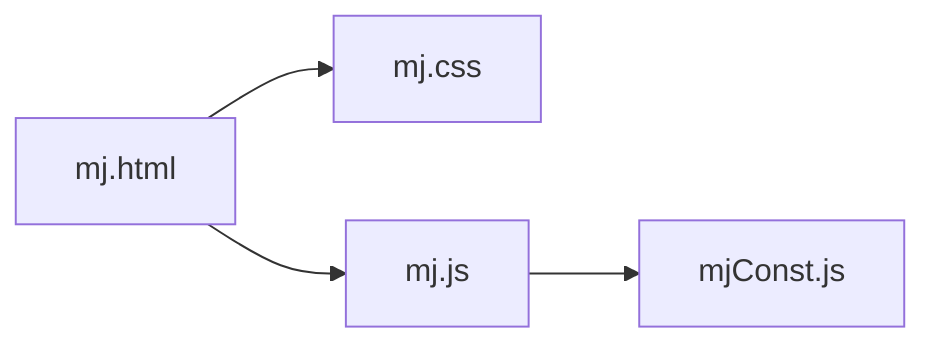

# Troubleshooting

<cite>
**Referenced Files in This Document**
- [mj.html](file://mj.html)
- [mj.js](file://mj.js)
- [mjConst.js](file://mjConst.js)
- [mj.css](file://mj.css)
</cite>

## Table of Contents
1. [Introduction](#introduction)
2. [Project Structure](#project-structure)
3. [Core Components](#core-components)
4. [Architecture Overview](#architecture-overview)
5. [Detailed Component Analysis](#detailed-component-analysis)
6. [Dependency Analysis](#dependency-analysis)
7. [Performance Considerations](#performance-considerations)
8. [Troubleshooting Guide](#troubleshooting-guide)
9. [FAQ](#faq)
10. [Conclusion](#conclusion)

## Introduction
This document provides comprehensive troubleshooting guidance for the OV MJ Calculator, focusing on browser compatibility (especially older browsers without full HTML5 support), mobile device issues (touch interactions and responsive design), performance on low-end devices, memory management, rendering problems, and debugging steps for incorrect score calculations, tile selection issues, and interface responsiveness. It also includes an FAQ section addressing common questions about Mahjong scoring rules, calculator behavior, and feature limitations.

## Project Structure
The application is a single-page web app composed of:
- HTML layout defining sections for tile selection, exposed groups, winning tile, settings, special conditions, and results.
- JavaScript handling state, drag-and-drop/touch interactions, UI updates, and score calculation.
- Constants defining tile types and tile data.
- CSS styling with responsive design and touch-friendly behaviors.

**Diagram sources**
- [mj.html:1-248](file://mj.html#L1-L248)
- [mj.js:1-1211](file://mj.js#L1-L1211)
- [mjConst.js:1-65](file://mjConst.js#L1-L65)
- [mj.css:1-493](file://mj.css#L1-L493)

**Section sources**
- [mj.html:1-248](file://mj.html#L1-L248)
- [mj.js:1-1211](file://mj.js#L1-L1211)
- [mjConst.js:1-65](file://mjConst.js#L1-L65)
- [mj.css:1-493](file://mj.css#L1-L493)

## Core Components
- State management: central object storing hand tiles, flowers, exposed groups, winning tile, winds, dealer info, self-draw flags, special conditions, and history for undo.
- Drag-and-drop and touch interaction: unified handlers for mouse drag and touch gestures to move tiles into hand, exposed areas, or trash.
- UI rendering: functions to render available tiles, selected tiles, exposed groups, winning tile, and update button states.
- Score calculation: validates total tile count and computes scores based on detected hand types and settings.

Key responsibilities and locations:
- Initialization and event wiring: [mj.js:36-42](file://mj.js#L36-L42), [mj.js:119-148](file://mj.js#L119-L148), [mj.js:580-703](file://mj.js#L580-L703)
- Touch and drag logic: [mj.js:45-116](file://mj.js#L45-L116), [mj.js:179-377](file://mj.js#L179-L377), [mj.js:386-442](file://mj.js#L386-L442)
- Tile selection and moves: [mj.js:150-177](file://mj.js#L150-L177), [mj.js:449-522](file://mj.js#L449-L522), [mj.js:1172-1209](file://mj.js#L1172-L1209)
- Exposed group actions: [mj.js:713-829](file://mj.js#L713-L829)
- UI updates: [mj.js:909-1080](file://mj.js#L909-L1080)
- Score calculation: [mj.js:1082-1129](file://mj.js#L1082-L1129)

**Section sources**
- [mj.js:36-42](file://mj.js#L36-L42)
- [mj.js:119-148](file://mj.js#L119-L148)
- [mj.js:179-377](file://mj.js#L179-L377)
- [mj.js:449-522](file://mj.js#L449-L522)
- [mj.js:713-829](file://mj.js#L713-L829)
- [mj.js:909-1080](file://mj.js#L909-L1080)
- [mj.js:1082-1129](file://mj.js#L1082-L1129)
- [mj.js:1172-1209](file://mj.js#L1172-L1209)

## Architecture Overview
The app follows a simple MVC-like pattern:
- Model: state object in JavaScript holds all game-related data.
- View: HTML structure and CSS define the UI; JS renders dynamic content.
- Controller: JS handles user input (clicks, drag/drop, touch), updates state, and triggers re-renders and recalculations.

**Diagram sources**
- [mj.html:1-248](file://mj.html#L1-L248)
- [mj.js:1-1211](file://mj.js#L1-L1211)
- [mjConst.js:1-65](file://mjConst.js#L1-L65)

## Detailed Component Analysis

### Drag-and-Drop and Touch Interaction
- Mouse drag uses standard HTML5 drag events; touch interactions are implemented via custom handlers that simulate dragging by creating a floating clone and tracking coordinates.
- Drop zones include hand tiles area, winning tile area, and trash icon. Touch end resolves drop target using elementFromPoint.

Potential issues:
- Older browsers may not fully support drag-and-drop APIs or touch events.
- Conflicts between scrolling and dragging can occur if preventDefault is not effective.
- Missing elements at runtime cause errors when setting up drop zones.

**Diagram sources**
- [mj.js:179-377](file://mj.js#L179-L377)

**Section sources**
- [mj.js:45-116](file://mj.js#L45-L116)
- [mj.js:179-377](file://mj.js#L179-L377)
- [mj.js:386-442](file://mj.js#L386-L442)

### Tile Selection and Moves
- Clicking tiles adds them to hand or flowers; drag-and-drop supports moving tiles between areas and into trash.
- Winning tile selection allows only one tile; moving from hand to winning automatically removes it from hand.

Common pitfalls:
- Source identification relies on dataset attributes; missing source leads to warnings.
- Moving from winning tile back to hand requires clearing winning tile state first.

**Section sources**
- [mj.js:150-177](file://mj.js#L150-L177)
- [mj.js:449-522](file://mj.js#L449-L522)
- [mj.js:1172-1209](file://mj.js#L1172-L1209)

### Exposed Groups (Chow/Pung/Kong)
- Chow requires three sequential tiles of same type; Pung requires at least three identical tiles; Kong requires four identical tiles.
- Actions save state to history for undo and remove used tiles from hand.

Validation and feedback:
- Buttons are enabled/disabled based on current selection.
- Status messages inform users of invalid selections.

**Section sources**
- [mj.js:713-829](file://mj.js#L713-L829)
- [mj.js:1054-1080](file://mj.js#L1054-L1080)

### Score Calculation
- Validates total tile count against required count (including kongs).
- Detects hand types and sums scores; applies dealer multiplier based on seat and round winds and consecutive dealer counts.

Debugging tips:
- If score remains zero or incorrect, verify tile count validation path and ensure all settings are correctly bound.

**Section sources**
- [mj.js:1082-1129](file://mj.js#L1082-L1129)

## Dependency Analysis
- mj.html depends on mj.css for styling and mj.js for behavior; mj.js imports mjConst.js for tile definitions.
- UI elements referenced by IDs must exist before setup; otherwise console errors appear.

**Diagram sources**
- [mj.html:1-248](file://mj.html#L1-L248)
- [mj.js:1-1211](file://mj.js#L1-L1211)
- [mjConst.js:1-65](file://mjConst.js#L1-L65)
- [mj.css:1-493](file://mj.css#L1-L493)

**Section sources**
- [mj.html:1-248](file://mj.html#L1-L248)
- [mj.js:1-1211](file://mj.js#L1-L1211)
- [mjConst.js:1-65](file://mjConst.js#L1-L65)
- [mj.css:1-493](file://mj.css#L1-L493)

## Performance Considerations
- Rendering frequency: UI updates occur on every state change; minimize unnecessary re-renders by batching updates where possible.
- Memory usage: History array is capped to 50 entries to prevent unbounded growth.
- Touch performance: Creating and updating a floating clone during drag can be heavy on low-end devices; consider reducing animation complexity or disabling effects under low-performance conditions.
- DOM operations: Repeated innerHTML assignments can cause reflows; prefer targeted updates for large lists.

[No sources needed since this section provides general guidance]

## Troubleshooting Guide

### Browser Compatibility Issues
Symptoms:
- Drag-and-drop does not work or behaves inconsistently.
- Touch interactions fail or conflict with scrolling.
- Elements not found errors during initialization.

Steps:
- Verify modern browser support for HTML5 drag-and-drop and touch events; test in Chrome/Firefox/Safari/Edge.
- For older browsers lacking full support, rely on click-to-select workflow (tiles are clickable to add to hand/flowers).
- Ensure all referenced elements exist before setup; check console for “element not found” errors and confirm IDs match HTML.

References:
- Drag-and-drop setup and error logging: [mj.js:119-148](file://mj.js#L119-L148)
- Touch event listeners and fallbacks: [mj.js:67-91](file://mj.js#L67-L91), [mj.js:179-377](file://mj.js#L179-L377)

**Section sources**
- [mj.js:119-148](file://mj.js#L119-L148)
- [mj.js:67-91](file://mj.js#L67-L91)
- [mj.js:179-377](file://mj.js#L179-L377)

### Mobile Device-Specific Issues
Symptoms:
- Tiles do not respond to touch or scroll instead of dragging.
- Drop zones do not accept drops on mobile.
- Responsive layout misaligns tiles or buttons.

Steps:
- Confirm touch-action and overscroll-behavior styles are applied to prevent unwanted scrolling during drag: [mj.css:401-404](file://mj.css#L401-L404), [mj.css:387-394](file://mj.css#L387-L394).
- Use quick taps to select tiles when dragging is problematic; long-press or small movement triggers drag simulation: [mj.js:179-377](file://mj.js#L179-L377).
- Check responsive breakpoints and tile sizing on small screens: [mj.css:469-493](file://mj.css#L469-L493).

**Section sources**
- [mj.css:401-404](file://mj.css#L401-L404)
- [mj.css:387-394](file://mj.css#L387-L394)
- [mj.css:469-493](file://mj.css#L469-L493)
- [mj.js:179-377](file://mj.js#L179-L377)

### Performance Issues on Low-End Devices
Symptoms:
- Laggy dragging or delayed UI updates.
- High CPU/memory usage during interactions.

Steps:
- Reduce visual effects (animations, shadows) temporarily to improve responsiveness.
- Avoid excessive DOM manipulations; batch updates where feasible.
- Monitor history size; it is capped at 50 entries to limit memory growth: [mj.js:864-878](file://mj.js#L864-L878).

**Section sources**
- [mj.js:864-878](file://mj.js#L864-L878)

### Memory Management Concerns
Symptoms:
- App slows down over time after many operations.

Steps:
- Ensure history array is bounded; it is limited to 50 entries: [mj.js:864-878](file://mj.js#L864-L878).
- Clear selections when resetting to free references: [mj.js:896-907](file://mj.js#L896-L907).
- Remove temporary drag clones promptly on touch end: [mj.js:301-308](file://mj.js#L301-L308).

**Section sources**
- [mj.js:864-878](file://mj.js#L864-L878)
- [mj.js:896-907](file://mj.js#L896-L907)
- [mj.js:301-308](file://mj.js#L301-L308)

### Rendering Problems
Symptoms:
- Tiles not appearing in correct areas.
- Selected tiles not showing or losing classes.

Steps:
- Verify container IDs exist and are initialized: [mj.html:13-58](file://mj.html#L13-L58).
- Check rendering functions for proper class assignment and dataset population: [mj.js:926-942](file://mj.js#L926-L942), [mj.js:944-954](file://mj.js#L944-L954), [mj.js:1037-1052](file://mj.js#L1037-L1052).
- Ensure CSS classes for tile types are defined: [mj.css:85-124](file://mj.css#L85-L124).

**Section sources**
- [mj.html:13-58](file://mj.html#L13-L58)
- [mj.js:926-942](file://mj.js#L926-L942)
- [mj.js:944-954](file://mj.js#L944-L954)
- [mj.js:1037-1052](file://mj.js#L1037-L1052)
- [mj.css:85-124](file://mj.css#L85-L124)

### Incorrect Score Calculations
Symptoms:
- Score remains zero or does not reflect expected values.
- Hand types not displayed.

Steps:
- Validate total tile count matches required count (including kongs); status message indicates mismatch: [mj.js:1082-1101](file://mj.js#L1082-L1101).
- Confirm settings (seat wind, round wind, dealer, self-draw, special conditions) are correctly bound and trigger recalculation: [mj.js:580-703](file://mj.js#L580-L703).
- Inspect detected hand types and their scores; ensure detection function exists and returns valid results: [mj.js:1103-1129](file://mj.js#L1103-L1129).

**Section sources**
- [mj.js:1082-1101](file://mj.js#L1082-L1101)
- [mj.js:580-703](file://mj.js#L580-L703)
- [mj.js:1103-1129](file://mj.js#L1103-L1129)

### Tile Selection Issues
Symptoms:
- Cannot add tiles to hand or flowers.
- Maximum tile limits enforced unexpectedly.
- Winning tile cannot be set or removed.

Steps:
- Click tiles to add to hand/flowers; ensure dataset attributes (type, value, source) are present: [mj.js:150-177](file://mj.js#L150-L177).
- Respect maximum per-type limit (4) and overall hand capacity considering exposed groups: [mj.js:1172-1209](file://mj.js#L1172-L1209).
- Move winning tile back to hand by dropping into hand area; winning tile cleared appropriately: [mj.js:476-504](file://mj.js#L476-L504).

**Section sources**
- [mj.js:150-177](file://mj.js#L150-L177)
- [mj.js:1172-1209](file://mj.js#L1172-L1209)
- [mj.js:476-504](file://mj.js#L476-L504)

### Interface Responsiveness Problems
Symptoms:
- Buttons disabled incorrectly.
- Drop zones not highlighting or accepting drops.

Steps:
- Button enable/disable logic depends on selection validity: [mj.js:1054-1080](file://mj.js#L1054-L1080).
- Drop zones use drag-over classes for visual feedback; ensure CSS classes are applied: [mj.css:303-311](file://mj.css#L303-L311), [mj.css:360-370](file://mj.css#L360-L370).
- Confirm event listeners are attached to correct elements: [mj.js:119-148](file://mj.js#L119-L148).

**Section sources**
- [mj.js:1054-1080](file://mj.js#L1054-L1080)
- [mj.css:303-311](file://mj.css#L303-L311)
- [mj.css:360-370](file://mj.css#L360-L370)
- [mj.js:119-148](file://mj.js#L119-L148)

## FAQ

### Mahjong Scoring Rules
- How are hands scored? The app detects hand types and sums their scores, then applies dealer multipliers based on seat/round winds and consecutive dealer counts.
- What affects the final score? Total tile count validation, detected hand types, dealer status, and special condition flags influence the result.

References:
- Score computation and display: [mj.js:1082-1129](file://mj.js#L1082-L1129)

**Section sources**
- [mj.js:1082-1129](file://mj.js#L1082-L1129)

### Calculator Behavior
- Why does the score stay zero? Ensure the total tile count matches the required count (including kongs); otherwise, the app shows a status message indicating insufficient tiles.
- Can I undo actions? Yes, the app maintains a history stack (up to 50 entries) and supports undoing the last action.

References:
- Undo functionality and history cap: [mj.js:864-894](file://mj.js#L864-L894)

**Section sources**
- [mj.js:864-894](file://mj.js#L864-L894)

### Feature Limitations
- Are all Mahjong variants supported? The app implements specific scoring rules and conditions; unsupported variants or house rules may not be reflected.
- Is offline usage supported? As a static web app, it runs locally in the browser without network dependencies.

[No sources needed since this section provides general guidance]

## Conclusion
This troubleshooting guide addresses common issues across browser compatibility, mobile interactions, performance, memory, rendering, and scoring accuracy. By following the diagnostic steps and referencing the relevant code sections, users can identify and resolve most problems encountered while using the OV MJ Calculator. For persistent issues, consult the detailed file references provided to inspect implementation specifics and adjust accordingly.