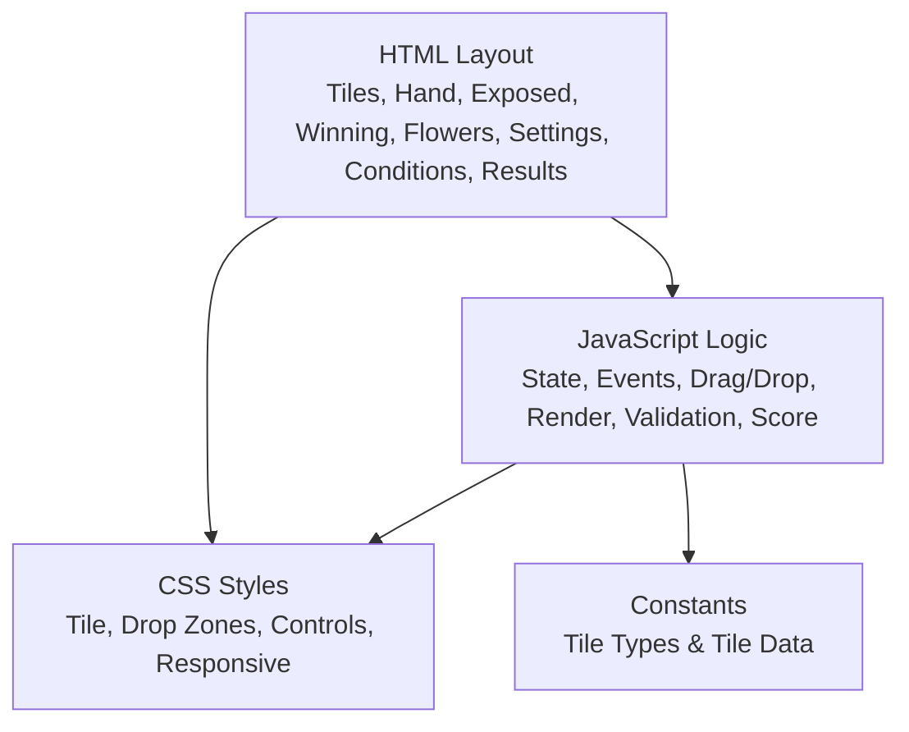
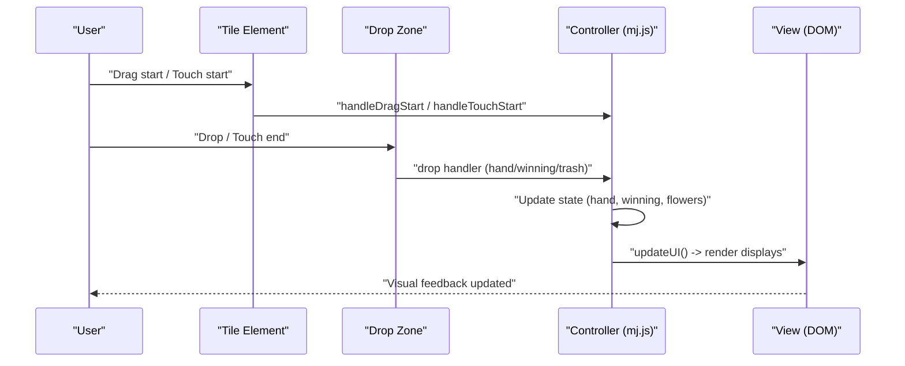
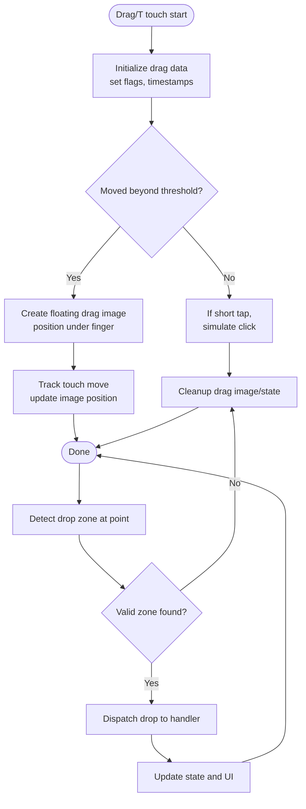
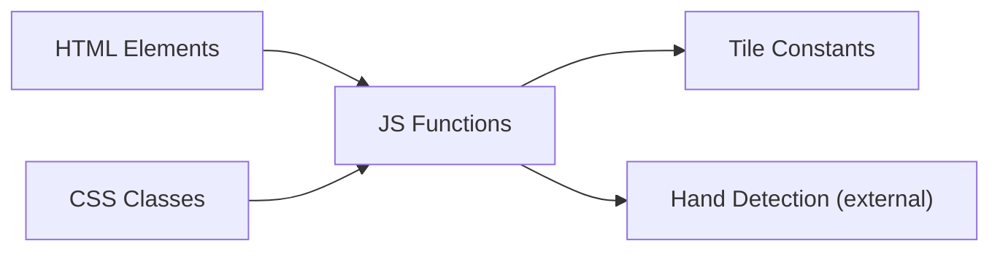

# User Interface Problems

<cite>
**Referenced Files in This Document**
- [mj.html](file://mj.html)
- [mj.js](file://mj.js)
- [mj.css](file://mj.css)
- [mjConst.js](file://mjConst.js)
</cite>

## Table of Contents
1. [Introduction](#introduction)
2. [Project Structure](#project-structure)
3. [Core Components](#core-components)
4. [Architecture Overview](#architecture-overview)
5. [Detailed Component Analysis](#detailed-component-analysis)
6. [Dependency Analysis](#dependency-analysis)
7. [Performance Considerations](#performance-considerations)
8. [Troubleshooting Guide](#troubleshooting-guide)
9. [Conclusion](#conclusion)

## Introduction
This document provides targeted troubleshooting guidance for user interface problems in the OV MJ Calculator, focusing on tile selection (drag-and-drop and click-to-select), visual feedback inconsistencies, layout issues (overlapping elements, text overflow, button accessibility), event handling conflicts, state synchronization failures, real-time update issues, CSS rendering debugging, JavaScript event binding problems, DOM manipulation errors, and common interaction patterns that may cause unexpected behavior.

## Project Structure
The application is a single-page UI with:
- HTML structure defining sections for tiles, selected hand, exposed groups, winning tile, flowers, settings, special conditions, and results.
- CSS styling for tiles, drop zones, controls, responsive layout, and drag/visual states.
- JavaScript managing application state, event listeners, drag-and-drop (mouse and touch), rendering, validation, undo/clear, and score calculation.
- Constants defining tile types and tile data.

**Diagram sources**
- [mj.html:13-247](file://mj.html#L13-L247)
- [mj.css:1-493](file://mj.css#L1-L493)
- [mj.js:1-1211](file://mj.js#L1-L1211)
- [mjConst.js:1-65](file://mjConst.js#L1-L65)

**Section sources**
- [mj.html:13-247](file://mj.html#L13-L247)
- [mj.css:1-493](file://mj.css#L1-L493)
- [mj.js:1-1211](file://mj.js#L1-L1211)
- [mjConst.js:1-65](file://mjConst.js#L1-L65)

## Core Components
- State management: central object holding hand tiles, flowers, exposed groups, winning tile, settings, special conditions, and history for undo.
- Rendering: functions to render available tiles, selected hand, exposed groups, winning tile, and flowers; update counts and button states.
- Event handling: mouse and touch drag-and-drop, click-to-select, control buttons, settings changes.
- Validation and scoring: validates tile counts and sequences, calculates total score based on detected hand types and settings.

Key responsibilities and locations:
- Initialization and setup: initialization, drag-and-drop setup, event listeners, UI updates.
- Drag-and-drop: handlers for dragstart/dragend/dragover/dragenter/dragleave and touch equivalents; drop zone setup for hand, winning tile, and trash.
- Click-to-select: click handler for source tiles and flower tiles.
- UI updates: tile count, hand display, exposed display, winning tile display, button states, score calculation.
- Undo/Clear: history stack and reset logic.

**Section sources**
- [mj.js:1-42](file://mj.js#L1-L42)
- [mj.js:44-148](file://mj.js#L44-L148)
- [mj.js:150-177](file://mj.js#L150-L177)
- [mj.js:179-384](file://mj.js#L179-L384)
- [mj.js:449-523](file://mj.js#L449-L523)
- [mj.js:535-578](file://mj.js#L535-L578)
- [mj.js:580-703](file://mj.js#L580-L703)
- [mj.js:705-829](file://mj.js#L705-L829)
- [mj.js:831-907](file://mj.js#L831-L907)
- [mj.js:909-1129](file://mj.js#L909-L1129)
- [mj.js:1131-1211](file://mj.js#L1131-L1211)

## Architecture Overview
The UI architecture follows a simple MVC-like pattern:
- Model: state object holds all interactive data.
- View: HTML structure and CSS styles define layout and visuals.
- Controller: JavaScript handles events, updates state, and re-renders view components.

**Diagram sources**
- [mj.js:44-148](file://mj.js#L44-L148)
- [mj.js:386-442](file://mj.js#L386-L442)
- [mj.js:449-523](file://mj.js#L449-L523)
- [mj.js:909-1129](file://mj.js#L909-L1129)

## Detailed Component Analysis

### Tile Selection: Drag-and-Drop Failures
Common symptoms:
- Tiles do not start dragging or drop silently.
- Touch interactions fail to initiate drag or drop.
- Drop zones do not highlight or accept drops.

Root causes and fixes:
- Missing draggable attributes or event listeners on dynamically created tiles. Ensure every tile element has draggable set and event listeners attached during creation and after updates.
- Duplicate or missing event listeners due to repeated setup calls. Remove old listeners before adding new ones in setup functions.
- Touch event conflicts with scrolling or default behaviors. Use passive:false where needed and prevent default appropriately during drag initiation and move.
- Drop zone detection at touch end fails if target element cannot be resolved. Validate target element and closest drop zone; provide fallbacks and console warnings when unavailable.
- Drag image positioning off-screen or overlapping other elements. Adjust offset calculations and ensure z-index prevents overlap.

Relevant implementation areas:
- Setup drag-and-drop and drop zones.
- Mouse drag handlers and visual feedback classes.
- Touch handlers for long press threshold, drag initiation, movement, and end resolution.
- Drop handlers for hand, winning tile, and trash.

**Diagram sources**
- [mj.js:179-384](file://mj.js#L179-L384)
- [mj.js:449-523](file://mj.js#L449-L523)

**Section sources**
- [mj.js:44-148](file://mj.js#L44-L148)
- [mj.js:179-384](file://mj.js#L179-L384)
- [mj.js:386-442](file://mj.js#L386-L442)
- [mj.js:449-523](file://mj.js#L449-L523)

### Tile Selection: Click-to-Select Problems
Common symptoms:
- Clicking a tile does not add it to the hand.
- Clicking already selected tiles triggers unintended actions.
- Flower tiles behave differently than regular tiles.

Root causes and fixes:
- Click handler skips tiles with certain classes or missing data attributes. Verify class checks and dataset presence.
- Source identification for flower vs regular tiles must match container IDs. Ensure dataset.source is correctly set for each tile.
- After adding tiles, UI must update to reflect selection and constraints (max per tile type, max hand size).

Relevant implementation areas:
- Click handler for tiles and flowers.
- Selection logic enforcing limits and automatic winning tile assignment when hand reaches capacity.

**Section sources**
- [mj.js:150-177](file://mj.js#L150-L177)
- [mj.js:1172-1209](file://mj.js#L1172-L1209)

### Visual Feedback Inconsistencies
Common symptoms:
- Drag-over highlights not appearing or persisting incorrectly.
- Selected tiles lack clear visual distinction.
- Touch-active states not applied consistently.

Root causes and fixes:
- Drag enter/leave handlers must toggle specific classes on known drop zones. Ensure IDs match and classes are applied only to intended targets.
- Selected tile styles and winning tile styles must be distinct and visible across themes/devices.
- Touch-active classes should be added/removed consistently during touch interactions.

Relevant implementation areas:
- Drag enter/leave handlers toggling classes.
- CSS classes for selected, winning, drag-over, touch-active.

**Section sources**
- [mj.js:421-442](file://mj.js#L421-L442)
- [mj.css:105-118](file://mj.css#L105-L118)
- [mj.css:303-311](file://mj.css#L303-L311)
- [mj.css:337-377](file://mj.css#L337-L377)

### Layout Problems: Overlapping Elements, Text Overflow, Button Accessibility
Common symptoms:
- Tiles or groups overlap on small screens.
- Text overflows containers or labels wrap awkwardly.
- Buttons are hard to tap or visually indistinguishable.

Root causes and fixes:
- Flex layouts and gaps must accommodate varying screen sizes; use responsive media queries to adjust tile sizes and spacing.
- Ensure containers have sufficient min-height and padding to avoid clipping.
- Buttons should have adequate padding, contrast, and disabled states for accessibility.

Relevant implementation areas:
- Tile and group container styles.
- Responsive adjustments for mobile.
- Button styles and disabled states.

**Section sources**
- [mj.css:68-83](file://mj.css#L68-L83)
- [mj.css:132-141](file://mj.css#L132-L141)
- [mj.css:156-176](file://mj.css#L156-L176)
- [mj.css:469-493](file://mj.css#L469-L493)

### Event Handling Conflicts
Common symptoms:
- Touch gestures trigger scrolling instead of drag.
- Multiple event listeners fire unexpectedly.
- Drop handlers receive incorrect data.

Root causes and fixes:
- Prevent default on touch events during drag initiation and movement to avoid scroll interference.
- Remove old listeners before adding new ones to prevent duplicates.
- Validate dataTransfer content and ensure JSON parsing succeeds; handle parse errors gracefully.

Relevant implementation areas:
- Touch event setup with passive:false and preventDefault usage.
- Listener removal and addition in setup functions.
- Data transfer handling in drop handlers.

**Section sources**
- [mj.js:67-91](file://mj.js#L67-L91)
- [mj.js:93-116](file://mj.js#L93-L116)
- [mj.js:179-231](file://mj.js#L179-L231)
- [mj.js:317-370](file://mj.js#L317-L370)
- [mj.js:386-405](file://mj.js#L386-L405)
- [mj.js:449-523](file://mj.js#L449-L523)

### State Synchronization Problems
Common symptoms:
- UI shows stale data after operations.
- Undo/clear does not restore expected state.
- Tile count or exposed groups mismatch.

Root causes and fixes:
- Ensure every state mutation calls updateUI to synchronize view.
- History stack must capture full relevant state snapshots before mutations.
- Clear operation must reset all arrays and properties consistently.

Relevant implementation areas:
- State mutations in selection and group creation.
- History save and undo logic.
- Clear selection resetting all state fields.

**Section sources**
- [mj.js:864-894](file://mj.js#L864-L894)
- [mj.js:896-907](file://mj.js#L896-L907)
- [mj.js:909-917](file://mj.js#L909-L917)

### Real-Time Update Failures
Common symptoms:
- Score or status messages do not update immediately.
- Button states remain enabled/disabled incorrectly.
- Tile count does not reflect current hand size.

Root causes and fixes:
- All change handlers must call calculateScore and updateButtonStates.
- Ensure DOM references exist before updating; guard against null elements.
- Avoid heavy computations in tight loops; keep updateUI efficient.

Relevant implementation areas:
- Settings change handlers calling calculateScore.
- updateButtonStates logic based on selections.
- updateTileCount and score calculation.

**Section sources**
- [mj.js:580-703](file://mj.js#L580-L703)
- [mj.js:1054-1080](file://mj.js#L1054-L1080)
- [mj.js:919-924](file://mj.js#L919-L924)
- [mj.js:1082-1129](file://mj.js#L1082-L1129)

### Debugging CSS Rendering Issues
Guidance:
- Inspect computed styles for tiles and drop zones to verify classes like selected, winning-tile, drag-over, touch-active are applied.
- Check responsive breakpoints to ensure tile sizes and gaps adapt on small screens.
- Confirm z-index stacking contexts so drag images and overlays appear above other elements.

Relevant implementation areas:
- Tile and drop zone styles.
- Dragging and touch-active styles.
- Responsive media queries.

**Section sources**
- [mj.css:85-124](file://mj.css#L85-L124)
- [mj.css:291-311](file://mj.css#L291-L311)
- [mj.css:329-377](file://mj.css#L329-L377)
- [mj.css:469-493](file://mj.css#L469-L493)

### Debugging JavaScript Event Binding Problems
Guidance:
- Verify that event listeners are attached once per element; remove old listeners before adding new ones.
- Ensure dynamic elements (tiles rendered after init) get listeners attached via setup functions.
- Log events during development to confirm firing order and target elements.

Relevant implementation areas:
- setupDragEvents removing and adding listeners.
- initializeTiles attaching listeners to existing tiles.
- DOMContentLoaded initialization sequence.

**Section sources**
- [mj.js:67-91](file://mj.js#L67-L91)
- [mj.js:1157-1170](file://mj.js#L1157-L1170)
- [mj.js:118-148](file://mj.js#L118-L148)

### Debugging DOM Manipulation Errors
Guidance:
- Guard against null element references before setting innerHTML or querying children.
- Rebuild lists by clearing containers first to avoid duplicate nodes.
- Ensure dataset attributes (type, value, source) are set consistently for all tiles.

Relevant implementation areas:
- Rendering functions clearing and rebuilding containers.
- Dataset assignments during tile creation.
- Error logs for missing elements.

**Section sources**
- [mj.js:535-578](file://mj.js#L535-L578)
- [mj.js:926-942](file://mj.js#L926-L942)
- [mj.js:1037-1052](file://mj.js#L1037-L1052)
- [mj.js:118-148](file://mj.js#L118-L148)

### Common Interaction Patterns Causing Unexpected Behavior
Patterns:
- Rapid taps on tiles can simulate clicks unintentionally during touch drag attempts.
- Dropping from winning tile back to hand may lose the winning tile if not handled carefully.
- Selecting four identical tiles automatically sets winning tile when hand reaches capacity.

Mitigations:
- Use thresholds to differentiate taps from drags; ensure quick taps are treated as clicks only when appropriate.
- Validate source and destination in drop handlers to preserve winning tile state unless explicitly moved.
- Provide clear feedback when auto-setting winning tile; allow users to revert via undo.

**Section sources**
- [mj.js:179-308](file://mj.js#L179-L308)
- [mj.js:476-504](file://mj.js#L476-L504)
- [mj.js:1172-1209](file://mj.js#L1172-L1209)

## Dependency Analysis
High-level dependencies:
- HTML defines structural elements referenced by ID throughout JavaScript.
- CSS provides visual states used by JavaScript to indicate interactions.
- JavaScript depends on constants for tile definitions and types.
- Score calculation relies on external hand detection function referenced in the HTML script order.

**Diagram sources**
- [mj.html:244-247](file://mj.html#L244-L247)
- [mj.js:1-42](file://mj.js#L1-L42)
- [mjConst.js:1-65](file://mjConst.js#L1-L65)

**Section sources**
- [mj.html:244-247](file://mj.html#L244-L247)
- [mj.js:1-42](file://mj.js#L1-L42)
- [mjConst.js:1-65](file://mjConst.js#L1-L65)

## Performance Considerations
- Minimize DOM reflows by batching updates within updateUI.
- Avoid excessive querySelectorAll calls; cache frequently accessed elements when possible.
- Keep touch event handlers lightweight; defer heavy work until drop completion.
- Limit history stack size to prevent memory growth.

[No sources needed since this section provides general guidance]

## Troubleshooting Guide

### Tile Selection Issues
- Drag-and-drop failures:
  - Verify draggable attribute and event listeners on all tiles.
  - Ensure drop zones are initialized and event listeners are attached.
  - Check touch event defaults and preventDefault usage to avoid scroll conflicts.
  - Validate drop zone detection at touch end and handle missing targets gracefully.
- Click-to-select problems:
  - Confirm click handler skips already selected tiles and handles flower tiles correctly.
  - Ensure dataset attributes are present and correct for source identification.
- Visual feedback inconsistencies:
  - Confirm drag-over and touch-active classes are applied to correct elements.
  - Review CSS for selected and winning tile styles to ensure visibility.

**Section sources**
- [mj.js:44-148](file://mj.js#L44-L148)
- [mj.js:150-177](file://mj.js#L150-L177)
- [mj.js:179-384](file://mj.js#L179-L384)
- [mj.js:421-442](file://mj.js#L421-L442)
- [mj.css:105-118](file://mj.css#L105-L118)
- [mj.css:303-311](file://mj.css#L303-L311)
- [mj.css:337-377](file://mj.css#L337-L377)

### Layout Problems
- Overlapping elements:
  - Adjust flex gaps and tile sizes for smaller screens using media queries.
  - Ensure containers have adequate min-height and padding.
- Text overflow:
  - Wrap long labels and ensure white-space handling prevents clipping.
- Button accessibility:
  - Increase button padding and ensure contrast; disable buttons when invalid actions are attempted.

**Section sources**
- [mj.css:68-83](file://mj.css#L68-L83)
- [mj.css:132-141](file://mj.css#L132-L141)
- [mj.css:156-176](file://mj.css#L156-L176)
- [mj.css:469-493](file://mj.css#L469-L493)

### Event Handling Conflicts
- Prevent default on touch events during drag initiation/move to avoid scrolling.
- Remove old listeners before adding new ones to prevent duplicates.
- Validate dataTransfer content and handle JSON parse errors.

**Section sources**
- [mj.js:67-91](file://mj.js#L67-L91)
- [mj.js:93-116](file://mj.js#L93-L116)
- [mj.js:179-231](file://mj.js#L179-L231)
- [mj.js:317-370](file://mj.js#L317-L370)
- [mj.js:386-405](file://mj.js#L386-L405)
- [mj.js:449-523](file://mj.js#L449-L523)

### State Synchronization and Real-Time Updates
- Call updateUI after any state mutation to keep view consistent.
- Save snapshots to history before mutations; limit history size.
- Ensure settings changes trigger calculateScore and updateButtonStates.

**Section sources**
- [mj.js:864-894](file://mj.js#L864-L894)
- [mj.js:896-907](file://mj.js#L896-L907)
- [mj.js:909-917](file://mj.js#L909-L917)
- [mj.js:580-703](file://mj.js#L580-L703)
- [mj.js:1054-1080](file://mj.js#L1054-L1080)
- [mj.js:1082-1129](file://mj.js#L1082-L1129)

### Debugging CSS and JavaScript
- CSS:
  - Inspect computed styles for interaction classes; verify responsive rules apply.
  - Check z-index stacking for drag images and overlays.
- JavaScript:
  - Ensure listeners are attached once per element; remove before re-attach.
  - Guard against null DOM references; rebuild lists by clearing containers first.
  - Set dataset attributes consistently for all tiles.

**Section sources**
- [mj.css:291-311](file://mj.css#L291-L311)
- [mj.css:329-377](file://mj.css#L329-L377)
- [mj.js:67-91](file://mj.js#L67-L91)
- [mj.js:535-578](file://mj.js#L535-L578)
- [mj.js:926-942](file://mj.js#L926-L942)
- [mj.js:1037-1052](file://mj.js#L1037-L1052)
- [mj.js:1157-1170](file://mj.js#L1157-L1170)

### Common Interaction Patterns
- Rapid taps simulating clicks:
  - Use thresholds to distinguish taps from drags; treat short touches as clicks only when appropriate.
- Moving winning tile back to hand:
  - Validate source/destination in drop handlers to preserve winning tile state unless explicitly moved.
- Auto-setting winning tile at capacity:
  - Provide clear feedback and allow undo to revert auto-set winning tile.

**Section sources**
- [mj.js:179-308](file://mj.js#L179-L308)
- [mj.js:476-504](file://mj.js#L476-L504)
- [mj.js:1172-1209](file://mj.js#L1172-L1209)

## Conclusion
By systematically verifying event bindings, ensuring consistent state updates, validating drag-and-drop flows for both mouse and touch, and reviewing CSS classes for visual feedback, most UI issues in the OV MJ Calculator can be identified and resolved. Pay close attention to dynamic element lifecycle (creation, listener attachment, cleanup), robust error handling in drop handlers, and responsive layout adjustments to maintain usability across devices.