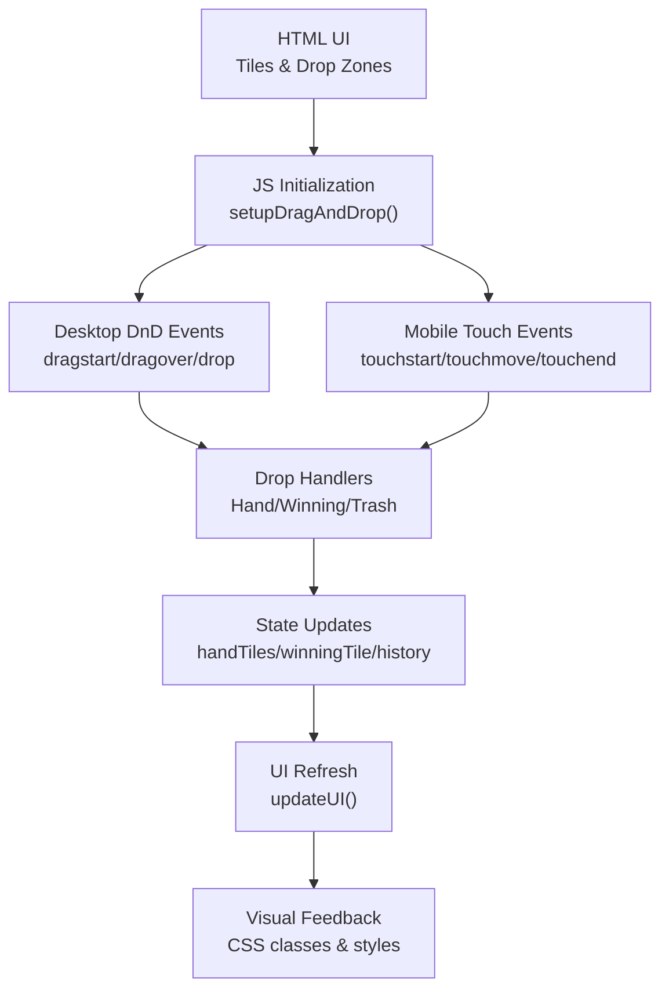
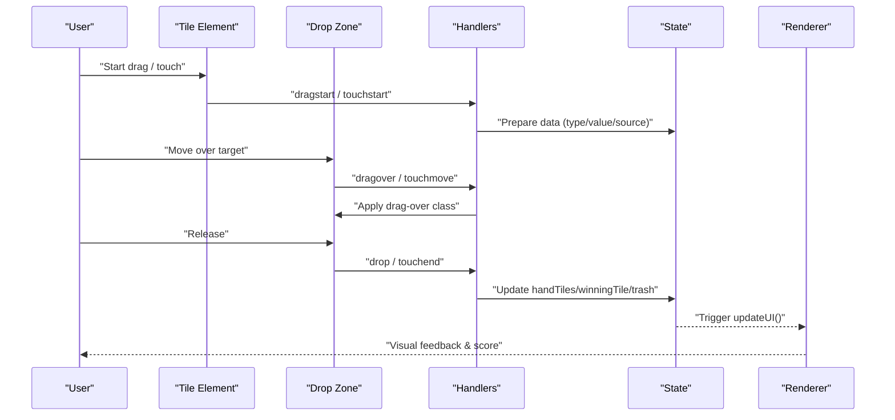
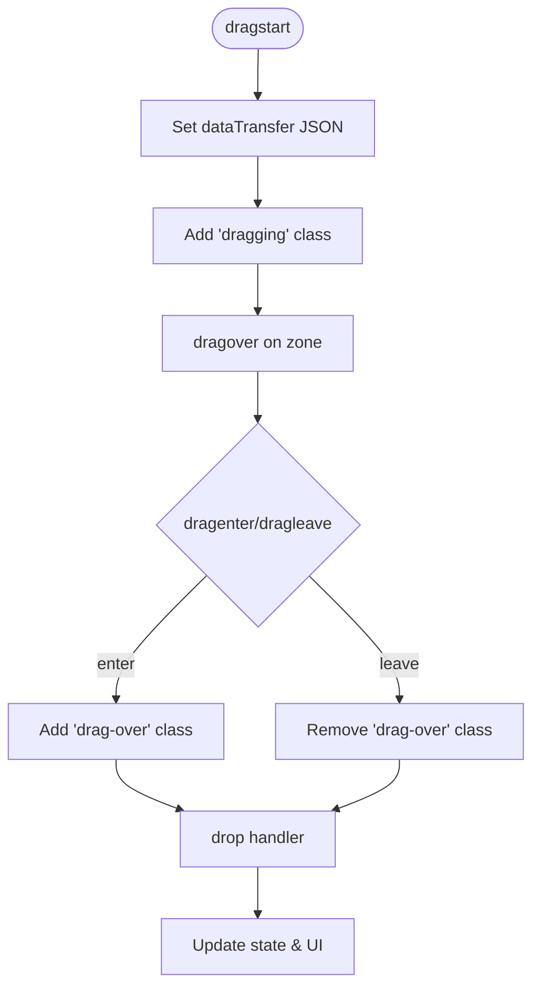
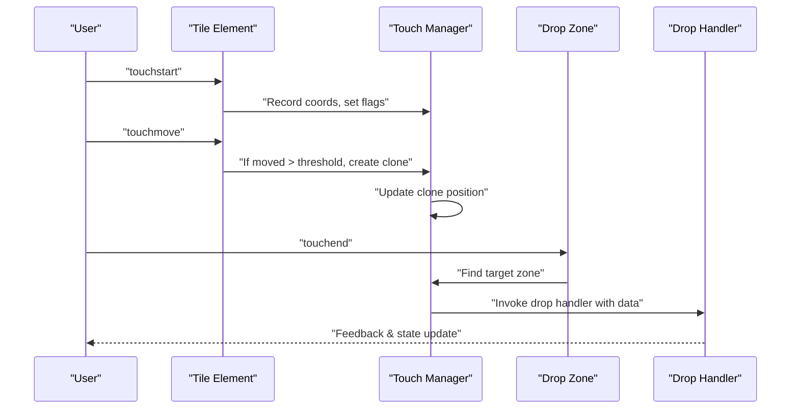
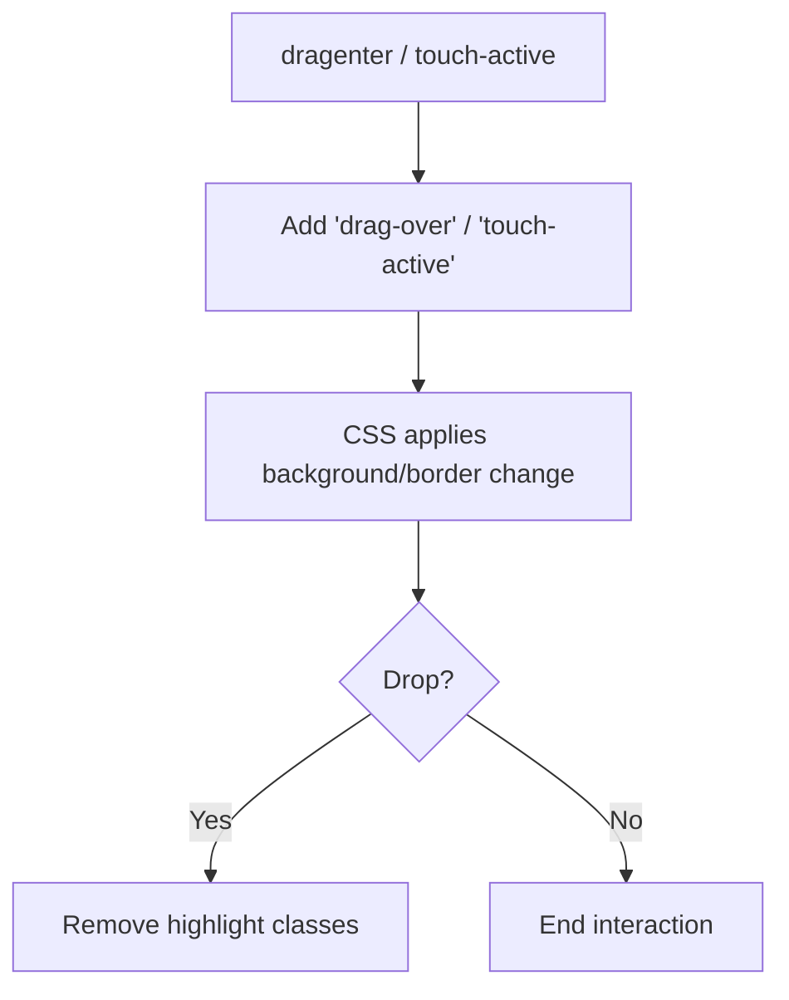
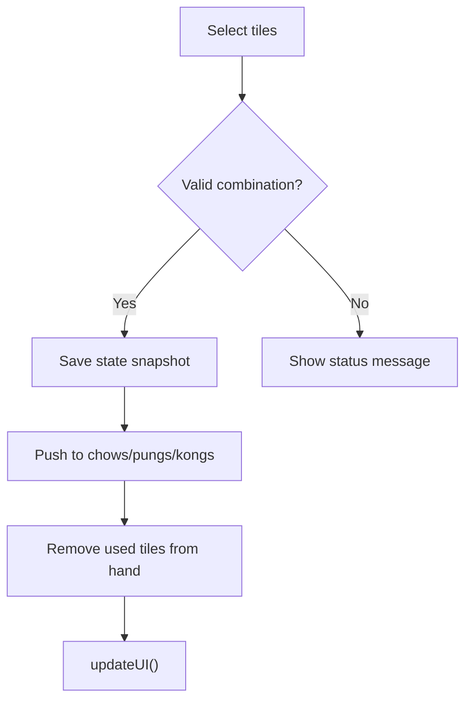
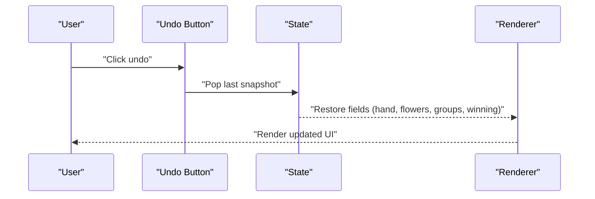
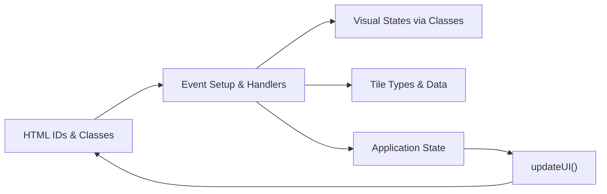

# Drag and Drop Operations

<cite>
**Referenced Files in This Document**
- [mj.html](file://mj.html)
- [mj.js](file://mj.js)
- [mj.css](file://mj.css)
- [mjConst.js](file://mjConst.js)
</cite>

## Table of Contents
1. [Introduction](#introduction)
2. [Project Structure](#project-structure)
3. [Core Components](#core-components)
4. [Architecture Overview](#architecture-overview)
5. [Detailed Component Analysis](#detailed-component-analysis)
6. [Dependency Analysis](#dependency-analysis)
7. [Performance Considerations](#performance-considerations)
8. [Troubleshooting Guide](#troubleshooting-guide)
9. [Conclusion](#conclusion)

## Introduction
This document explains the drag-and-drop functionality of the OV MJ Calculator, focusing on:
- Desktop drag-and-drop using the HTML5 Drag and Drop API (drag start, drag over, drop).
- Mobile touch support with custom touch event handling for smartphones and tablets.
- Visual feedback during drag operations (tile highlighting, drop zone indicators, validation feedback).
- Supported drag operations: moving tiles between sections, creating combinations (Chow, Pung, Kong), and removing tiles to trash.
- Undo functionality that tracks drag operations and allows reversal of actions.
- Troubleshooting tips and browser compatibility considerations.

## Project Structure
The drag-and-drop system spans three primary files:
- HTML defines the interactive regions (hand tiles, winning tile area, trash icon) and container elements for source tiles.
- JavaScript implements initialization, event binding, state management, and undo history.
- CSS provides visual cues for dragging, drop zones, and selection states.

**Diagram sources**
- [mj.html:13-57](file://mj.html#L13-L57)
- [mj.js:36-65](file://mj.js#L36-L65)
- [mj.js:449-522](file://mj.js#L449-L522)
- [mj.css:291-311](file://mj.css#L291-L311)

**Section sources**
- [mj.html:13-57](file://mj.html#L13-L57)
- [mj.js:36-65](file://mj.js#L36-L65)
- [mj.css:291-311](file://mj.css#L291-L311)

## Core Components
- Drag source tiles: All selectable tiles are marked draggable and bound with unified event setup.
- Drop zones: Hand tiles area, winning tile area, and trash icon act as targets.
- Event handlers: Centralized setup for both desktop and mobile interactions.
- State and history: Application state is updated and snapshots saved to enable undo.
- Visual feedback: CSS classes provide highlight effects for drag-over and active dragging.

Key responsibilities:
- Initialize and bind events for all tiles and drop zones.
- Handle drag lifecycle (start, over, enter, leave, end) on desktop.
- Simulate drag behavior on mobile via touch events and a floating clone.
- Update application state and render UI changes after drops.
- Provide undo capability by persisting state snapshots before mutations.

**Section sources**
- [mj.js:44-65](file://mj.js#L44-L65)
- [mj.js:67-116](file://mj.js#L67-L116)
- [mj.js:179-308](file://mj.js#L179-L308)
- [mj.js:449-522](file://mj.js#L449-L522)
- [mj.js:864-894](file://mj.js#L864-L894)
- [mj.css:291-311](file://mj.css#L291-L311)

## Architecture Overview
The drag-and-drop architecture separates concerns across layers:
- UI layer (HTML): Defines containers and interactive elements.
- Interaction layer (JS): Manages events and user intent.
- State layer (JS): Holds current hand, exposed groups, and winning tile.
- Rendering layer (JS + CSS): Reflects state changes and provides visual feedback.

**Diagram sources**
- [mj.js:386-424](file://mj.js#L386-L424)
- [mj.js:179-308](file://mj.js#L179-L308)
- [mj.js:449-522](file://mj.js#L449-L522)
- [mj.js:909-917](file://mj.js#L909-L917)

## Detailed Component Analysis

### Desktop Drag-and-Drop (HTML5 API)
- Drag start: Captures tile metadata (type, value, source, display) into dataTransfer and marks the element visually.
- Drag over: Allows dropping by preventing default and setting drop effect.
- Drag enter/leave: Adds/removes a highlight class on valid drop zones.
- Drop: Dispatches to specific handlers based on target zone.

**Diagram sources**
- [mj.js:386-424](file://mj.js#L386-L424)
- [mj.js:426-442](file://mj.js#L426-L442)
- [mj.js:449-522](file://mj.js#L449-L522)

**Section sources**
- [mj.js:386-424](file://mj.js#L386-L424)
- [mj.js:426-442](file://mj.js#L426-L442)
- [mj.js:449-522](file://mj.js#L449-L522)

### Mobile Touch Support
- Touch start: Prevents default scrolling, records initial coordinates, and prepares a long-press or move threshold to initiate drag.
- Touch move: Creates a floating clone when movement exceeds a small threshold; updates its position to follow the finger.
- Touch end: Determines the target drop zone under the finger and invokes the appropriate drop handler; if no drag occurred and duration is short, simulates a click.

**Diagram sources**
- [mj.js:179-308](file://mj.js#L179-L308)
- [mj.js:310-377](file://mj.js#L310-L377)

**Section sources**
- [mj.js:179-308](file://mj.js#L179-L308)
- [mj.js:310-377](file://mj.js#L310-L377)

### Visual Feedback During Drag
- Tile highlighting: Selected tiles use distinct background/border; winning tiles have a green accent.
- Drop zone indicators: Zones gain a blue border/background when hovered during drag; winning zone uses green.
- Active drag visuals: Tiles and clones scale up and add shadow while dragging; trash icon highlights on hover/drag-over.

**Diagram sources**
- [mj.css:291-311](file://mj.css#L291-L311)
- [mj.css:329-342](file://mj.css#L329-L342)
- [mj.css:360-370](file://mj.css#L360-L370)
- [mj.css:277-281](file://mj.css#L277-L281)

**Section sources**
- [mj.css:291-311](file://mj.css#L291-L311)
- [mj.css:329-342](file://mj.css#L329-L342)
- [mj.css:360-370](file://mj.css#L360-L370)
- [mj.css:277-281](file://mj.css#L277-L281)

### Supported Drag Operations
- Move tiles to hand: Drag from source containers or winning tile area into the hand tiles zone.
- Set winning tile: Drag any tile into the winning tile area; dragging back to hand removes it from winning slot.
- Remove to trash: Drag tiles from hand or winning area to the trash icon to delete them.
- Create combinations: Use buttons to form Chow (three consecutive same-suit tiles), Pung (three identical tiles), Open Kong (four identical), Concealed Kong (four identical). Validation ensures correct selections and updates UI accordingly.

**Diagram sources**
- [mj.js:713-748](file://mj.js#L713-L748)
- [mj.js:750-775](file://mj.js#L750-L775)
- [mj.js:777-802](file://mj.js#L777-L802)
- [mj.js:804-829](file://mj.js#L804-L829)
- [mj.js:864-894](file://mj.js#L864-L894)

**Section sources**
- [mj.js:449-522](file://mj.js#L449-L522)
- [mj.js:713-748](file://mj.js#L713-L748)
- [mj.js:750-775](file://mj.js#L750-L775)
- [mj.js:777-802](file://mj.js#L777-L802)
- [mj.js:804-829](file://mj.js#L804-L829)

### Undo Functionality
- Before mutating state (adding combinations, clearing selections), a deep copy of the current state is pushed to a history stack.
- The undo button restores the previous state and re-renders the UI.
- History is capped to prevent unbounded growth.

**Diagram sources**
- [mj.js:864-894](file://mj.js#L864-L894)
- [mj.js:896-907](file://mj.js#L896-L907)

**Section sources**
- [mj.js:864-894](file://mj.js#L864-L894)
- [mj.js:896-907](file://mj.js#L896-L907)

## Dependency Analysis
- HTML elements referenced by ID: hand-tiles, winning-tile, trash-icon, and various containers for source tiles.
- JS functions depend on DOM readiness and initialize listeners once per load.
- CSS classes drive visual states; JS toggles these classes during interactions.
- Constants define tile types and available tiles used throughout rendering and logic.

**Diagram sources**
- [mj.html:13-57](file://mj.html#L13-L57)
- [mj.js:118-148](file://mj.js#L118-L148)
- [mj.js:535-578](file://mj.js#L535-L578)
- [mj.js:909-917](file://mj.js#L909-L917)
- [mjConst.js:1-65](file://mjConst.js#L1-L65)

**Section sources**
- [mj.html:13-57](file://mj.html#L13-L57)
- [mj.js:118-148](file://mj.js#L118-L148)
- [mj.js:535-578](file://mj.js#L535-L578)
- [mj.js:909-917](file://mj.js#L909-L917)
- [mjConst.js:1-65](file://mjConst.js#L1-L65)

## Performance Considerations
- Event listener deduplication: Repeatedly adding listeners is avoided by removing old ones before attaching new ones.
- Lightweight drag visuals: Using CSS classes and a single floating clone minimizes layout thrashing.
- History cap: Keeping history bounded prevents memory growth during extended sessions.
- Efficient updates: updateUI centralizes rendering to avoid redundant DOM manipulations.

[No sources needed since this section provides general guidance]

## Troubleshooting Guide
Common issues and resolutions:
- Drag not starting on mobile: Ensure touch-action is set appropriately and passive listeners do not block prevention; verify that movement exceeds the threshold to trigger drag mode.
- Drop zone not highlighted: Confirm that dragover is prevented and drag-over class is applied; check CSS selectors for the target zone.
- Tiles not removable to trash: Verify that the trash icon has proper event binding and that drop handlers correctly identify the trash target.
- Undo not working: Ensure saveStateToHistory is called before state mutations and that history array is not empty.
- Browser compatibility: HTML5 Drag and Drop works in modern browsers; mobile requires custom touch handling due to lack of native drag APIs on touch devices.

**Section sources**
- [mj.js:67-116](file://mj.js#L67-L116)
- [mj.js:179-308](file://mj.js#L179-L308)
- [mj.js:426-442](file://mj.js#L426-L442)
- [mj.js:449-522](file://mj.js#L449-L522)
- [mj.js:864-894](file://mj.js#L864-L894)
- [mj.css:291-311](file://mj.css#L291-L311)

## Conclusion
The OV MJ Calculator implements a robust drag-and-drop system that combines HTML5 desktop drag events with custom mobile touch handling. It provides clear visual feedback, supports key Mahjong operations (moving tiles, forming combinations, discarding), and includes an undo mechanism to safely reverse actions. Proper event binding, state management, and CSS-driven visuals ensure a responsive and intuitive user experience across devices.