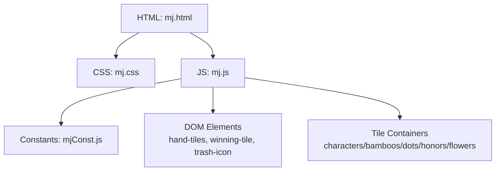
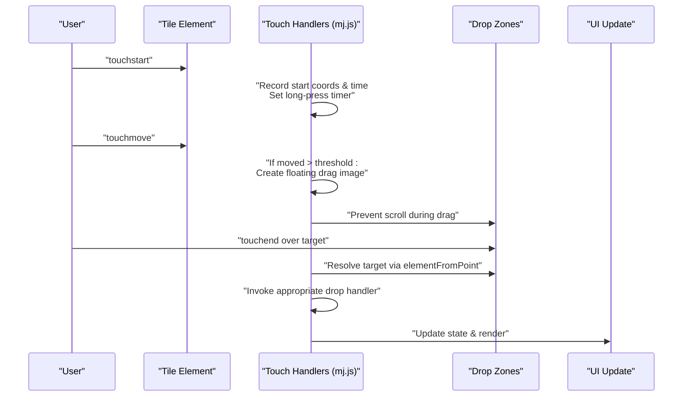
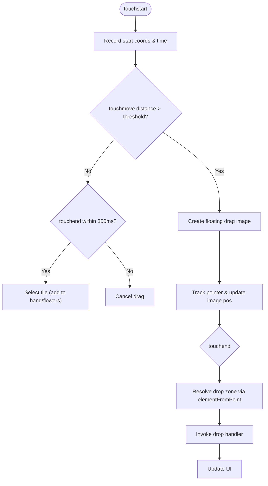
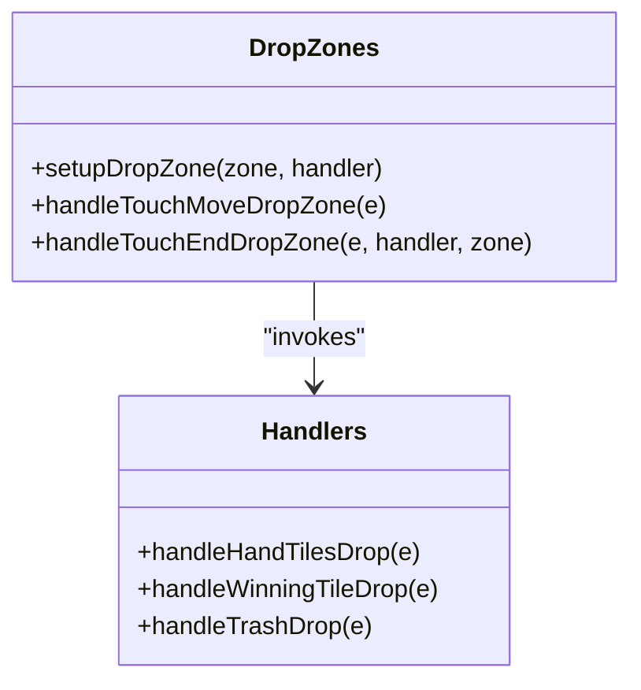
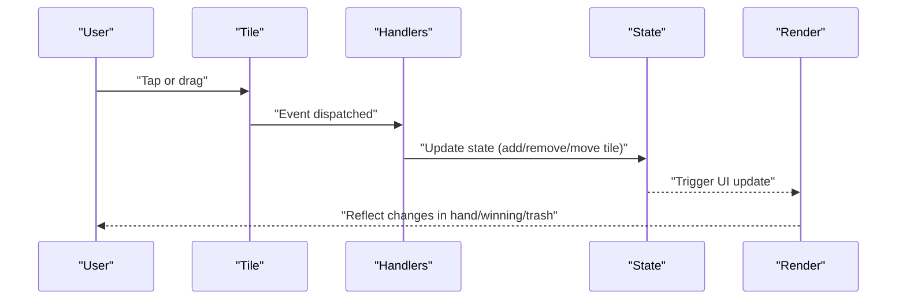
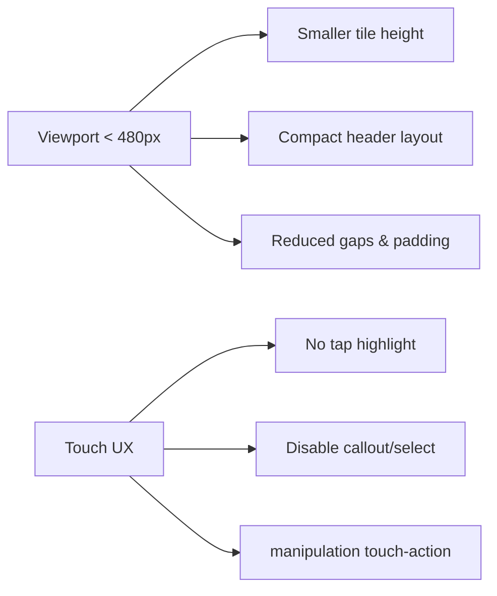
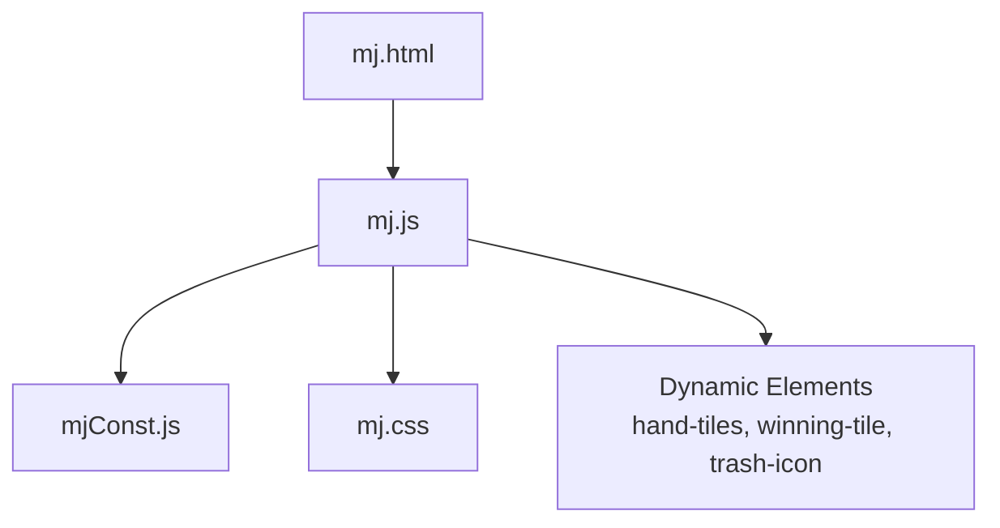

# Mobile Interactions

<cite>
**Referenced Files in This Document**
- [mj.html](file://mj.html)
- [mj.js](file://mj.js)
- [mj.css](file://mj.css)
- [mjConst.js](file://mjConst.js)
</cite>

## Table of Contents
1. [Introduction](#introduction)
2. [Project Structure](#project-structure)
3. [Core Components](#core-components)
4. [Architecture Overview](#architecture-overview)
5. [Detailed Component Analysis](#detailed-component-analysis)
6. [Dependency Analysis](#dependency-analysis)
7. [Performance Considerations](#performance-considerations)
8. [Troubleshooting Guide](#troubleshooting-guide)
9. [Conclusion](#conclusion)

## Introduction
This document explains the mobile-specific interactions implemented in the OV MJ Calculator. It focuses on how touch events replace mouse-based drag-and-drop on mobile devices, how gestures are interpreted (tap to select tiles, long press and drag for moving tiles), and how responsive design adapts the interface for small screens and different orientations. It also covers mobile-friendly UI elements such as larger touch targets, simplified controls, and optimized tile layouts, along with performance optimizations and best practices for testing across mobile devices and browsers.

## Project Structure
The application is a single-page web app composed of:
- HTML structure defining sections for tile selection, hand tiles, exposed groups, winning tile area, flower tiles, settings, and scoring.
- CSS providing responsive layout, tile styling, drop zones, and mobile-friendly touch behaviors.
- JavaScript handling state management, rendering, event binding, and both desktop drag-and-drop and mobile touch interactions.
- Constants defining tile types and tile data.

**Diagram sources**
- [mj.html:13-58](file://mj.html#L13-L58)
- [mj.html:60-242](file://mj.html#L60-L242)
- [mj.js:35-42](file://mj.js#L35-L42)
- [mj.js:535-578](file://mj.js#L535-L578)
- [mj.js:1157-1170](file://mj.js#L1157-L1170)
- [mjConst.js:1-65](file://mjConst.js#L1-L65)

**Section sources**
- [mj.html:1-248](file://mj.html#L1-L248)
- [mj.js:1-1211](file://mj.js#L1-L1211)
- [mj.css:1-493](file://mj.css#L1-L493)
- [mjConst.js:1-65](file://mjConst.js#L1-L65)

## Core Components
- Touch gesture system: Implements touchstart/touchmove/touchend handlers that emulate drag-and-drop on mobile by creating a floating “drag image” and detecting drop zones via elementFromPoint.
- Drop zone management: Centralized setup for hand tiles, winning tile area, and trash icon with both mouse and touch support.
- Tile selection and movement: Tap-to-select behavior for quick addition to hand; long press + drag to move tiles between areas or to trash.
- Responsive UI: Media queries and flexible layouts ensure usability on small screens; larger touch targets and simplified controls improve interaction.

Key implementation references:
- Touch event lifecycle and drag emulation: [handleTouchStart:180-231](file://mj.js#L180-L231), [handleTouchMove:233-268](file://mj.js#L233-L268), [handleTouchEnd:271-308](file://mj.js#L271-L308)
- Drop zone setup and handling: [setupDropZone:93-116](file://mj.js#L93-L116), [handleTouchMoveDropZone:310-315](file://mj.js#L310-L315), [handleTouchEndDropZone:317-370](file://mj.js#L317-L370)
- Drag-and-drop fallback for desktop: [setupDragAndDrop:45-65](file://mj.js#L45-L65), [handleDragStart:386-405](file://mj.js#L386-L405), [handleDragOver:421-424](file://mj.js#L421-L424)
- Rendering and re-binding events for dynamic tiles: [renderTiles:535-560](file://mj.js#L535-L560), [renderFlowers:562-578](file://mj.js#L562-L578), [updateDraggableTiles:705-711](file://mj.js#L705-L711)
- Responsive styles and touch UX: [tile and selected-tile styles:85-154](file://mj.css#L85-L154), [drop zone styles:291-311](file://mj.css#L291-L311), [touch-active visuals:337-342](file://mj.css#L337-L342), [media query:469-493](file://mj.css#L469-L493)

**Section sources**
- [mj.js:45-116](file://mj.js#L45-L116)
- [mj.js:180-370](file://mj.js#L180-L370)
- [mj.js:535-578](file://mj.js#L535-L578)
- [mj.css:85-154](file://mj.css#L85-L154)
- [mj.css:291-311](file://mj.css#L291-L311)
- [mj.css:337-342](file://mj.css#L337-L342)
- [mj.css:469-493](file://mj.css#L469-L493)

## Architecture Overview
The mobile interaction architecture bridges native touch events with the existing drag-and-drop model used on desktop. The flow ensures consistent behavior across platforms while optimizing for touch constraints.

**Diagram sources**
- [mj.js:180-231](file://mj.js#L180-L231)
- [mj.js:233-268](file://mj.js#L233-L268)
- [mj.js:271-308](file://mj.js#L271-L308)
- [mj.js:310-370](file://mj.js#L310-L370)
- [mj.js:449-522](file://mj.js#L449-L522)

## Detailed Component Analysis

### Touch Gesture System
- Tap to select: If a touch ends quickly without significant movement (<300ms), it triggers tile selection logic to add the tile to the hand or flowers.
- Long press to initiate drag: A short timeout starts a visual drag image when the user holds a tile.
- Drag and drop: While dragging, the app prevents default scrolling and updates the floating image position. On release, it resolves the drop target and invokes the corresponding handler.

**Diagram sources**
- [mj.js:180-231](file://mj.js#L180-L231)
- [mj.js:233-268](file://mj.js#L233-L268)
- [mj.js:271-308](file://mj.js#L271-L308)
- [mj.js:310-370](file://mj.js#L310-L370)

**Section sources**
- [mj.js:180-370](file://mj.js#L180-L370)

### Drop Zone Management
- Unified setup for all interactive zones (hand tiles, winning tile, trash).
- Supports both mouse drag-and-drop and touch gestures.
- Visual feedback via classes for hover/drag-over states.

**Diagram sources**
- [mj.js:93-116](file://mj.js#L93-L116)
- [mj.js:310-370](file://mj.js#L310-L370)
- [mj.js:449-522](file://mj.js#L449-L522)

**Section sources**
- [mj.js:93-116](file://mj.js#L93-L116)
- [mj.js:310-370](file://mj.js#L310-L370)
- [mj.js:449-522](file://mj.js#L449-L522)

### Tile Selection and Movement
- Tiles are dynamically created and bound with both drag and touch events.
- Selected tiles can be dragged back to source containers or to the winning tile area.
- Trash icon supports dropping to remove tiles from hand or clear winning tile.

**Diagram sources**
- [mj.js:535-578](file://mj.js#L535-L578)
- [mj.js:926-942](file://mj.js#L926-L942)
- [mj.js:1037-1052](file://mj.js#L1037-L1052)
- [mj.js:449-522](file://mj.js#L449-L522)

**Section sources**
- [mj.js:535-578](file://mj.js#L535-L578)
- [mj.js:926-942](file://mj.js#L926-L942)
- [mj.js:1037-1052](file://mj.js#L1037-L1052)
- [mj.js:449-522](file://mj.js#L449-L522)

### Responsive Design Adaptations
- Flexible tile containers and wrap layouts adapt to screen width.
- Media queries adjust spacing and sizes for smaller screens.
- Touch-friendly styles disable text selection and highlight, and enable manipulation gestures.

**Diagram sources**
- [mj.css:469-493](file://mj.css#L469-L493)
- [mj.css:337-342](file://mj.css#L337-L342)
- [mj.css:344-358](file://mj.css#L344-L358)
- [mj.css:379-385](file://mj.css#L379-L385)
- [mj.css:401-404](file://mj.css#L401-L404)

**Section sources**
- [mj.css:85-154](file://mj.css#L85-L154)
- [mj.css:291-311](file://mj.css#L291-L311)
- [mj.css:337-385](file://mj.css#L337-L385)
- [mj.css:401-404](file://mj.css#L401-L404)
- [mj.css:469-493](file://mj.css#L469-L493)

### Mobile-Specific UI Elements
- Larger, clearly visible drop zones with dashed borders and color feedback.
- Simplified control buttons grouped for easy reach on small screens.
- Tile sizes and spacing tuned for finger taps and swipes.

**Section sources**
- [mj.html:21-52](file://mj.html#L21-L52)
- [mj.css:156-176](file://mj.css#L156-L176)
- [mj.css:291-311](file://mj.css#L291-L311)
- [mj.css:85-154](file://mj.css#L85-L154)

## Dependency Analysis
- Event binding depends on DOM readiness and container IDs present in the HTML.
- Tile rendering relies on constants for tile types and data.
- Touch handlers depend on correct dataset attributes (type, value, source) attached to tile elements.

**Diagram sources**
- [mj.html:13-58](file://mj.html#L13-L58)
- [mj.js:35-42](file://mj.js#L35-L42)
- [mj.js:535-578](file://mj.js#L535-L578)
- [mjConst.js:1-65](file://mjConst.js#L1-L65)

**Section sources**
- [mj.html:13-58](file://mj.html#L13-L58)
- [mj.js:35-42](file://mj.js#L35-L42)
- [mj.js:535-578](file://mj.js#L535-L578)
- [mjConst.js:1-65](file://mjConst.js#L1-L65)

## Performance Considerations
- Efficient DOM updates: Rebuild only necessary containers (hand tiles, flowers, exposed groups) rather than full page redraws.
- Minimal animations: Use lightweight transforms and opacity changes for drag visuals; avoid heavy effects during frequent touch moves.
- Passive vs non-passive listeners: Critical touch handlers use non-passive to prevent default scrolling during drag, ensuring smooth interactions.
- Debouncing long press: Short timeout reduces unnecessary work for quick taps.
- Memory cleanup: Remove temporary drag images and clear timeouts on touch end to prevent leaks.

[No sources needed since this section provides general guidance]

## Troubleshooting Guide
Common issues and resolutions:
- Touch not starting drag: Ensure the element has required dataset attributes (type, value, source). Check console warnings for missing data-source.
- Scroll interference: Confirm touch handlers are non-passive and preventDefault where necessary; verify touch-action CSS properties on interactive zones.
- Drop target not detected: Verify drop zones exist and have correct IDs; check elementFromPoint resolution and z-index stacking.
- Events firing multiple times: Ensure old listeners are removed before adding new ones in setup functions.
- Inconsistent behavior across browsers: Test on iOS Safari and Android Chrome; confirm viewport meta tag and touch-action settings.

**Section sources**
- [mj.js:180-231](file://mj.js#L180-L231)
- [mj.js:233-268](file://mj.js#L233-L268)
- [mj.js:310-370](file://mj.js#L310-L370)
- [mj.css:337-385](file://mj.css#L337-L385)
- [mj.css:401-404](file://mj.css#L401-L404)

## Conclusion
The OV MJ Calculator implements a robust mobile interaction layer that translates touch gestures into familiar drag-and-drop operations. By combining careful event handling, responsive styling, and efficient DOM updates, it delivers a smooth experience on mobile devices. Following the testing and troubleshooting recommendations will help maintain reliability across diverse mobile environments.