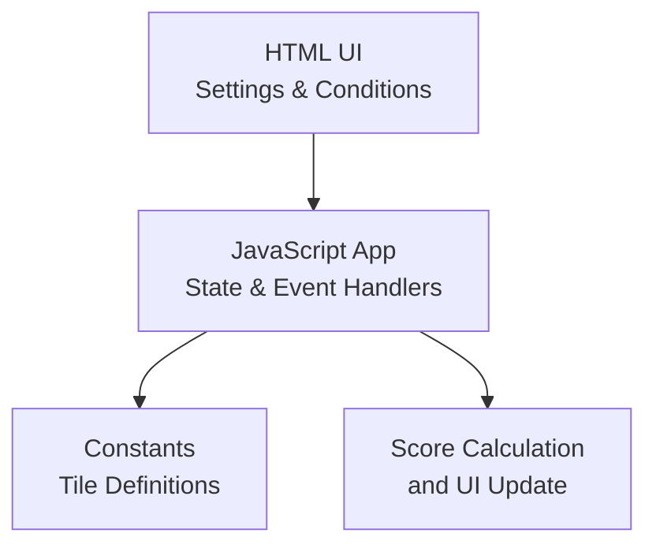
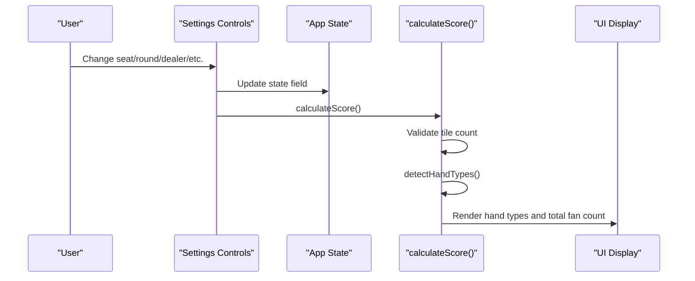
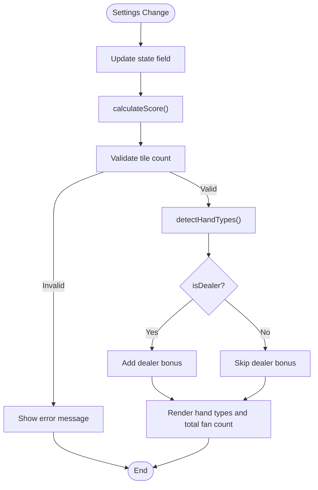

# Settings and Configuration

<cite>
**Referenced Files in This Document**
- [mj.html](file://mj.html)
- [mj.js](file://mj.js)
- [mjConst.js](file://mjConst.js)
</cite>

## Table of Contents
1. [Introduction](#introduction)
2. [Project Structure](#project-structure)
3. [Core Components](#core-components)
4. [Architecture Overview](#architecture-overview)
5. [Detailed Component Analysis](#detailed-component-analysis)
6. [Dependency Analysis](#dependency-analysis)
7. [Performance Considerations](#performance-considerations)
8. [Troubleshooting Guide](#troubleshooting-guide)
9. [Conclusion](#conclusion)
10. [Appendices](#appendices)

## Introduction
This document explains the settings and configuration panel of the OV MJ Calculator, focusing on how game state is configured and how it influences scoring. It covers:
- Basic game settings: seat wind (座位風位), round wind (圈風), dealer status (是否莊家), and consecutive dealer rounds (連莊次數).
- Special conditions: declared ready hand (宣告聽牌/叮), Ippatsu (一發), flower draw self-draw (花上自摸), kong draw self-draw (槓上自摸), Tenhou (天糊), Chihou (地糊), and multi-win scenarios (雙響/三響).
- Visibility modifiers: face-down hands (蓋牌), last tile draws (海底撈月, 河底撈魚), and visible winning tile counts (明絕).
It also provides common configuration scenarios and their impact on scoring calculations.

## Project Structure
The calculator UI is defined in a single-page HTML file with embedded sections for tile selection, flowers, and settings. The JavaScript manages application state, event bindings for all settings, and score calculation. Tile definitions are centralized in a constants file.

**Diagram sources**
- [mj.html:60-235](file://mj.html#L60-L235)
- [mj.js:1-33](file://mj.js#L1-L33)
- [mj.js:580-703](file://mj.js#L580-L703)
- [mj.js:1082-1129](file://mj.js#L1082-L1129)
- [mjConst.js:1-65](file://mjConst.js#L1-L65)

**Section sources**
- [mj.html:60-235](file://mj.html#L60-L235)
- [mj.js:1-33](file://mj.js#L1-L33)
- [mj.js:580-703](file://mj.js#L580-L703)
- [mj.js:1082-1129](file://mj.js#L1082-L1129)
- [mjConst.js:1-65](file://mjConst.js#L1-L65)

## Core Components
- Application state object holds all configuration flags and values that affect scoring.
- Event listeners bind every setting control to update state and trigger recalculation.
- Score calculation reads state and updates the UI with detected hand types and total fan count.

Key state fields relevant to this documentation:
- Seat wind, round wind, dealer flag, dealer count
- Self-draw flag
- Declared ready hand, Ippatsu
- Flower draw, Kong draw, Double Kong draw, Robbing Kong, Robbing Double Kong
- Tenhou, Chihou, Ten-ready, Chi-ready
- Face-down, Last-tile draw, Last-discard
- Multi-win (none/double/triple), Multi-win self-draw
- Visible winning tile count (明絕)

**Section sources**
- [mj.js:1-33](file://mj.js#L1-L33)
- [mj.js:580-703](file://mj.js#L580-L703)
- [mj.js:1082-1129](file://mj.js#L1082-L1129)

## Architecture Overview
The settings panel drives real-time recalculations. Each change to a setting updates the corresponding state field and calls the score calculation function, which validates tile counts, detects hand types, applies dealer bonuses, and displays results.

**Diagram sources**
- [mj.js:580-703](file://mj.js#L580-L703)
- [mj.js:1082-1129](file://mj.js#L1082-L1129)

## Detailed Component Analysis

### Basic Game Settings
- Seat Wind (座位風位): Selects the player’s seat wind. Changes update state.seatWind and trigger recalculation.
- Round Wind (圈風): Selects the current round wind. Changes update state.roundWind and trigger recalculation.
- Dealer Status (是否莊家): Checkbox toggles state.isDealer. When true, dealer bonus is added based on consecutive dealer rounds.
- Consecutive Dealer Rounds (連莊次數): Numeric selector sets state.dealerCount. Dealer bonus equals 2 × dealerCount + 1 when isDealer is true.

Impact on scoring:
- Dealer bonus is added only if isDealer is checked; otherwise, no dealer-related points are applied.
- Higher dealerCount increases the dealer bonus linearly.

**Section sources**
- [mj.html:60-118](file://mj.html#L60-L118)
- [mj.js:588-611](file://mj.js#L588-L611)
- [mj.js:1118-1125](file://mj.js#L1118-L1125)

### Special Conditions Section
- Declared Ready Hand (宣告聽牌/叮): Toggles state.isDeclaredReady. Indicates a pre-declared ready state.
- Ippatsu (一發): Toggles state.isIppatsu. Bonus condition for immediate win after opening.
- Flower Draw Self-Draw (花上自摸): Toggles state.isFlowerDraw. Self-draw triggered by drawing a flower tile.
- Kong Draw Self-Draw (槓上自摸): Toggles state.isKongDraw. Self-draw immediately after a kong.
- Double Kong Draw (槓上槓食糊): Toggles state.isDoubleKongDraw. Winning via double kong draw.
- Robbing Kong (搶杠食糊): Toggles state.isRobbingKong. Winning by robbing an open kong.
- Robbing Double Kong (搶杠上杠糊): Toggles state.isRobbingDoubleKong. Winning by robbing a double kong.
- Tenhou (天糊): Toggles state.isTenhou. Dealer wins on first deal.
- Chihou (地糊): Toggles state.isChihou. Non-dealer wins on first deal.
- Ten-ready (天聽): Toggles state.isTenReady. Dealer starts in ready state.
- Chi-ready (地聽): Toggles state.isChi-ready. Non-dealer starts in ready state.

Impact on scoring:
- These flags enable or modify scoring paths during detection and final fan summation. They do not alter tile count validation but influence whether certain hand types or bonuses are considered.

**Section sources**
- [mj.html:120-235](file://mj.html#L120-L235)
- [mj.js:613-696](file://mj.js#L613-L696)

### Visibility Modifiers
- Face-down Hands (蓋牌): Toggles state.isFaceDown. Affects visibility assumptions for scoring logic.
- Last Tile Draws:
  - Last Tile Draw (海底撈月): Toggles state.isLastTileDraw. Winning on the last tile drawn from the wall.
  - Last Discard (河底撈魚): Toggles state.isLastDiscard. Winning on the last discard.
- Visible Winning Tile Count (明絕): Selector sets state.visibleWinTileCount (0–3). Represents the number of winning tiles visible on the table.

Impact on scoring:
- These modifiers adjust scoring rules related to end-of-round conditions and visibility constraints. They can enable additional fans or modify existing ones depending on context.

**Section sources**
- [mj.html:185-235](file://mj.html#L185-L235)
- [mj.js:671-702](file://mj.js#L671-L702)

### Multi-Win Scenarios
- Multi-Win Selector (雙響/三響): Sets state.isMultiWin to none (0), double (2), or triple (3).
- Multi-Win Self-Draw (錦上添花): Toggles state.isMultiWinSelfDraw. Applies when multiple players win simultaneously and the winner drew the tile themselves.

Impact on scoring:
- Multi-win flags can increase the effective value or fan count when multiple winners are present. Self-draw variant may add extra bonuses under specific rules.

**Section sources**
- [mj.html:203-219](file://mj.html#L203-L219)
- [mj.js:687-696](file://mj.js#L687-L696)

### Common Configuration Scenarios and Impact
- Scenario 1: Dealer win on first deal with Ippatsu and last tile draw
  - Set isDealer = true, set dealerCount appropriately, check isTenhou, isIppatsu, isLastTileDraw.
  - Expected impact: Adds dealer bonus plus special conditions’ contributions; total fan count increases accordingly.
- Scenario 2: Non-dealer self-draw after kong with visible winning tiles
  - Unset isDealer, set isSelfDraw = true, check isKongDraw, set visibleWinTileCount > 0.
  - Expected impact: Adds self-draw and kong-draw bonuses; visible winning tiles may further adjust scoring.
- Scenario 3: Multi-win double with self-draw
  - Set isMultiWin = 2, check isMultiWinSelfDraw, ensure valid tile configuration.
  - Expected impact: Multi-win doubles the base value or adds extra fans; self-draw variant may add additional bonuses.
- Scenario 4: Face-down hand with declared ready and Ippatsu
  - Check isFaceDown, isDeclaredReady, isIppatsu.
  - Expected impact: Enables readiness and immediate win bonuses while accounting for hidden hand visibility.

[No sources needed since this section synthesizes configurations without quoting code]

## Dependency Analysis
- UI controls in HTML map directly to state fields in JavaScript via event listeners.
- All changes call calculateScore(), which depends on:
  - Tile count validation using handTiles, exposed groups, and winningTile.
  - Hand type detection (external module referenced in HTML).
  - Dealer bonus addition when isDealer is true.
- Constants define tile types and data used throughout the app.

**Diagram sources**
- [mj.js:580-703](file://mj.js#L580-L703)
- [mj.js:1082-1129](file://mj.js#L1082-L1129)

**Section sources**
- [mj.js:580-703](file://mj.js#L580-L703)
- [mj.js:1082-1129](file://mj.js#L1082-L1129)
- [mjConst.js:1-65](file://mjConst.js#L1-L65)

## Performance Considerations
- Real-time recalculations occur on every settings change; keep the number of exposed groups reasonable to avoid excessive re-renders.
- Tile count validation prevents invalid states early, reducing unnecessary computation.
- Using minimal DOM updates within calculateScore ensures responsive UI even with many configuration options.

[No sources needed since this section provides general guidance]

## Troubleshooting Guide
- Error: “Please select enough tiles”
  - Cause: Total tiles do not match required count (17 + number of kongs).
  - Action: Adjust hand tiles or exposed groups to meet the requirement.
- Error: “Each tile type can be selected at most 4 times”
  - Cause: Attempting to add more than four identical tiles.
  - Action: Remove duplicates or convert to exposed groups (chow/pung/kong).
- No score updates after changing settings
  - Ensure event listeners are bound and calculateScore is called.
  - Verify that the relevant checkbox/select elements exist and have correct IDs.

**Section sources**
- [mj.js:1082-1129](file://mj.js#L1082-L1129)
- [mj.js:1172-1209](file://mj.js#L1172-L1209)

## Conclusion
The settings and configuration panel provides comprehensive control over Mahjong scoring parameters. By adjusting basic game settings, special conditions, visibility modifiers, and multi-win scenarios, users can accurately model diverse winning situations. The system responds in real time, validating inputs and updating scores accordingly.

[No sources needed since this section summarizes without analyzing specific files]

## Appendices
- Reference for tile definitions and categories used across the app.

**Section sources**
- [mjConst.js:1-65](file://mjConst.js#L1-L65)