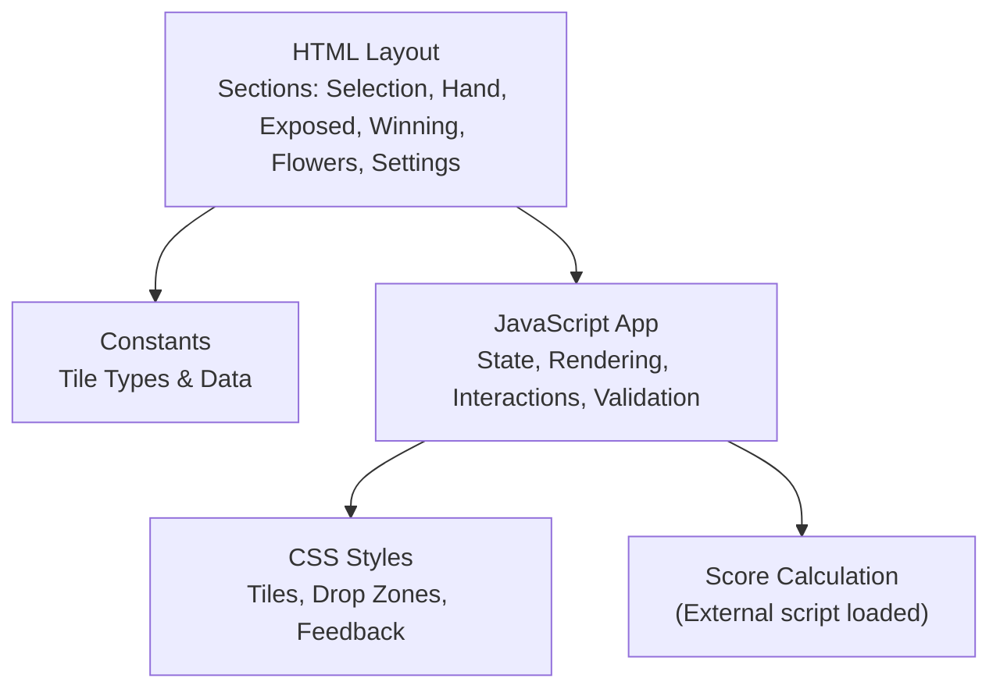
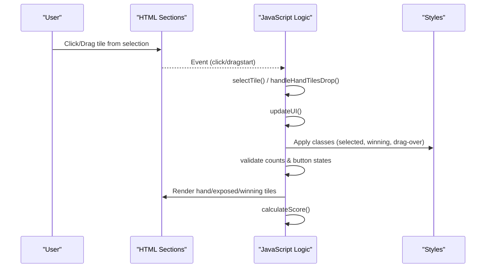
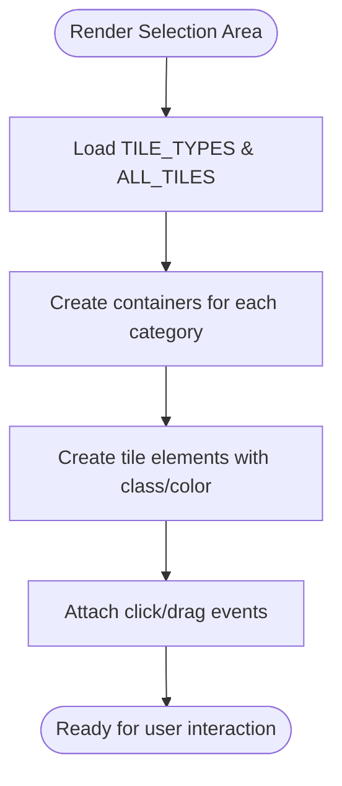
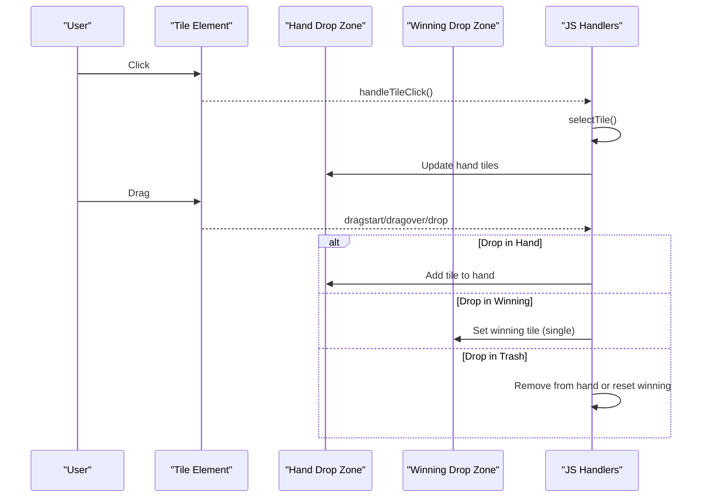
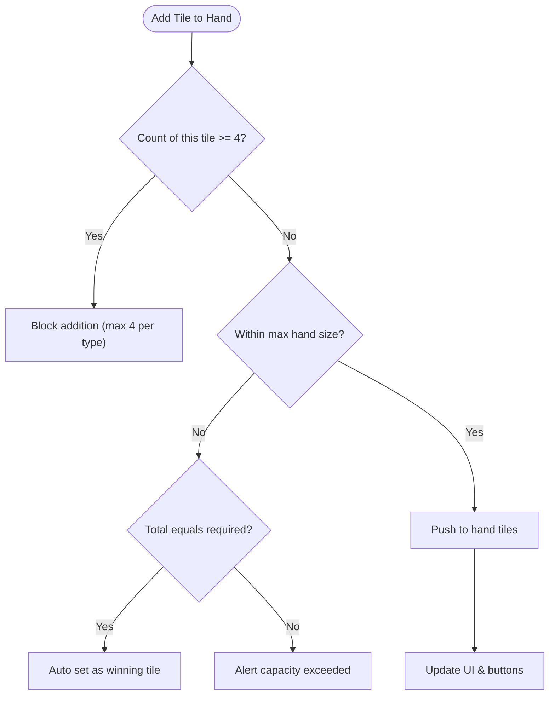
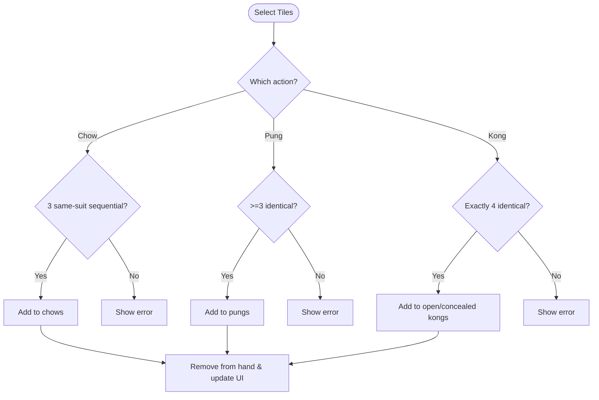
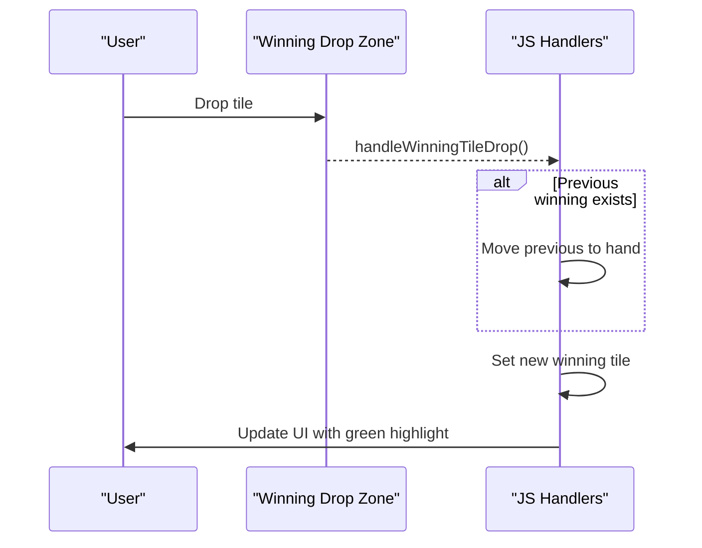
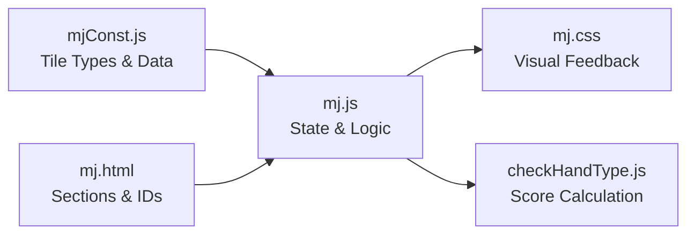

# Tile Management

<cite>
**Referenced Files in This Document**
- [mj.html](file://mj.html)
- [mj.js](file://mj.js)
- [mjConst.js](file://mjConst.js)
- [mj.css](file://mj.css)
</cite>

## Table of Contents
1. [Introduction](#introduction)
2. [Project Structure](#project-structure)
3. [Core Components](#core-components)
4. [Architecture Overview](#architecture-overview)
5. [Detailed Component Analysis](#detailed-component-analysis)
6. [Dependency Analysis](#dependency-analysis)
7. [Performance Considerations](#performance-considerations)
8. [Troubleshooting Guide](#troubleshooting-guide)
9. [Conclusion](#conclusion)

## Introduction
This document explains the tile management system in the OV MJ Calculator, focusing on how tiles are presented, selected, organized, and validated. It covers:
- The four main tile categories and their visual representation in the selection area
- Click and drag interactions for selecting tiles
- The hand tiles section with count display and capacity limits
- The exposed tiles section (副露區) for Chow (吃), Pung (碰), and Kong (槓) combinations
- The winning tile selection area with single-tile restriction and visual indicators
- Efficient organization patterns and common workflows for building different hand types

## Project Structure
The application is a single-page interface composed of:
- HTML layout defining sections for tile selection, hand tiles, exposed tiles, winning tile, flowers, settings, special conditions, and scoring
- JavaScript handling state, rendering, interactions (click/drag/touch), validation, and score calculation
- Constants defining tile types and tile data
- CSS styling for tiles, drop zones, and UI feedback

**Diagram sources**
- [mj.html:13-58](file://mj.html#L13-L58)
- [mjConst.js:1-65](file://mjConst.js#L1-L65)
- [mj.js:1-42](file://mj.js#L1-L42)
- [mj.css:68-124](file://mj.css#L68-L124)

**Section sources**
- [mj.html:13-58](file://mj.html#L13-L58)
- [mjConst.js:1-65](file://mjConst.js#L1-L65)
- [mj.js:1-42](file://mj.js#L1-L42)
- [mj.css:68-124](file://mj.css#L68-L124)

## Core Components
- Tile selection area: Four containers for the main categories (萬子, 索子, 筒子, 字牌) plus a separate container for flowers
- Hand tiles area: Displays selected tiles with a live count indicator and maximum capacity based on exposed groups
- Exposed tiles area: Groups for Chow (吃), Pung (碰), Open Kong (明槓), and Concealed Kong (暗槓)
- Winning tile area: Single-tile drop zone with visual highlighting and restriction
- Controls: Buttons to create Chow/Pung/Kong, undo, and clear selections
- Flowers section: Separate selection area for flower tiles
- Settings and special conditions: Configure winds, dealer status, self-draw flags, and other scoring modifiers

Key behaviors:
- Tiles can be added by clicking or dragging into the hand tiles area
- Drag-and-drop supports mouse and touch interactions with visual feedback
- Validation enforces rules for Chow (three consecutive same-suit tiles), Pung (three identical tiles), and Kong (four identical tiles)
- Winning tile area accepts only one tile; moving it back returns it to the hand
- Total tile counts are validated against required totals including exposed groups and winning tile

**Section sources**
- [mj.html:13-58](file://mj.html#L13-L58)
- [mj.js:150-177](file://mj.js#L150-L177)
- [mj.js:449-522](file://mj.js#L449-L522)
- [mj.js:713-829](file://mj.js#L713-L829)
- [mj.js:919-1080](file://mj.js#L919-L1080)
- [mj.js:1082-1129](file://mj.js#L1082-L1129)

## Architecture Overview
The app initializes constants, renders tile selection areas, sets up event listeners, and updates UI dynamically as users interact. State tracks hand tiles, flowers, exposed groups, and winning tile, along with configuration flags.

**Diagram sources**
- [mj.js:36-42](file://mj.js#L36-L42)
- [mj.js:150-177](file://mj.js#L150-L177)
- [mj.js:449-522](file://mj.js#L449-L522)
- [mj.js:909-917](file://mj.js#L909-L917)
- [mj.js:1082-1129](file://mj.js#L1082-L1129)

## Detailed Component Analysis

### Tile Categories and Visual Representation
- Categories:
  - 萬子 (Characters): Red-colored tiles labeled 一萬 through 九萬
  - 索子 (Bamboos): Green-colored tiles labeled 一索 through 九索
  - 筒子 (Dots): Blue-colored tiles labeled 一筒 through 九筒
  - 字牌 (Honors): Purple-colored tiles for winds and dragons (東, 南, 西, 北, 中, 發, 白)
- Visuals:
  - Each category has its own container in the selection area
  - Tiles use distinct color classes for quick identification
  - Hover effects lift tiles slightly; selected tiles highlight with a yellow background

**Diagram sources**
- [mjConst.js:1-65](file://mjConst.js#L1-L65)
- [mj.js:535-560](file://mj.js#L535-L560)
- [mj.css:85-124](file://mj.css#L85-L124)

**Section sources**
- [mjConst.js:1-65](file://mjConst.js#L1-L65)
- [mj.html:13-19](file://mj.html#L13-L19)
- [mj.css:85-124](file://mj.css#L85-L124)

### Selecting Tiles: Click and Drag Interactions
- Click-to-add:
  - Clicking a tile in the selection area adds it to the hand tiles
  - For flowers, clicking adds them to the flowers section instead
- Drag-and-drop:
  - Tiles are draggable across the interface
  - Drop zones include hand tiles, winning tile, and trash icon
  - Touch support includes long-press to start dragging and quick tap to simulate click
- Visual feedback:
  - Dragging shows an elevated clone with shadow
  - Drop zones highlight when hovered over during drag
  - Selected tiles become draggable within the hand area

**Diagram sources**
- [mj.js:150-177](file://mj.js#L150-L177)
- [mj.js:386-442](file://mj.js#L386-L442)
- [mj.js:449-522](file://mj.js#L449-L522)
- [mj.js:180-370](file://mj.js#L180-L370)

**Section sources**
- [mj.js:150-177](file://mj.js#L150-L177)
- [mj.js:386-442](file://mj.js#L386-L442)
- [mj.js:449-522](file://mj.js#L449-L522)
- [mj.js:180-370](file://mj.js#L180-L370)

### Hand Tiles Section: Organization, Count, and Capacity
- Display:
  - Selected tiles appear in the hand tiles group
  - Each tile is draggable and can be moved to other zones
- Count display:
  - A counter shows current hand tiles versus maximum allowed
  - Maximum hand size decreases by three for each exposed group created
- Capacity limits:
  - Each tile type limited to four copies
  - If total tiles match the required number (including exposed groups and winning tile), the last tile may auto-set as the winning tile
- Organizing patterns:
  - Keep sequential tiles together for easy Chow creation
  - Group identical tiles for Pung/Kong creation
  - Maintain flexibility by not committing too early to exposed groups

**Diagram sources**
- [mj.js:1172-1209](file://mj.js#L1172-L1209)
- [mj.js:919-924](file://mj.js#L919-L924)
- [mj.js:1082-1129](file://mj.js#L1082-L1129)

**Section sources**
- [mj.js:919-924](file://mj.js#L919-L924)
- [mj.js:1172-1209](file://mj.js#L1172-L1209)
- [mj.js:1082-1129](file://mj.js#L1082-L1129)

### Exposed Tiles Section (副露區): Chow, Pung, Kong
- Chow (吃):
  - Requires exactly three consecutive tiles of the same suit
  - Created via the Chow button after selecting the correct sequence
- Pung (碰):
  - Requires at least three identical tiles
  - Created via the Pung button after selecting matching tiles
- Kong (槓):
  - Open Kong (明槓): Four identical tiles exposed publicly
  - Concealed Kong (暗槓): Four identical tiles kept hidden
  - Both require exactly four identical tiles
- Visual grouping:
  - Each exposed group is displayed with a label indicating type (吃, 碰, 明槓, 暗槓)
  - Tiles in exposed groups are visually distinct from hand tiles

**Diagram sources**
- [mj.js:713-829](file://mj.js#L713-L829)
- [mj.js:956-1035](file://mj.js#L956-L1035)
- [mj.js:1054-1080](file://mj.js#L1054-L1080)

**Section sources**
- [mj.js:713-829](file://mj.js#L713-L829)
- [mj.js:956-1035](file://mj.js#L956-L1035)
- [mj.js:1054-1080](file://mj.js#L1054-L1080)

### Winning Tile Selection Area: Single-Tile Restriction and Indicators
- Single-tile restriction:
  - Only one tile can be placed in the winning tile area at a time
  - Dropping a new tile replaces the previous winning tile and moves it back to the hand if applicable
- Visual indicators:
  - The winning tile uses a green-highlighted style to distinguish it from hand tiles
  - The area highlights when dragged over to indicate valid placement
- Workflow:
  - Drag a tile into the winning tile area to designate it as the winning tile
  - Move it back to the hand by dragging out or using the trash icon

**Diagram sources**
- [mj.js:476-504](file://mj.js#L476-L504)
- [mj.js:1037-1052](file://mj.js#L1037-L1052)
- [mj.css:115-118](file://mj.css#L115-L118)

**Section sources**
- [mj.js:476-504](file://mj.js#L476-L504)
- [mj.js:1037-1052](file://mj.js#L1037-L1052)
- [mj.css:115-118](file://mj.css#L115-L118)

### Flowers Section
- Separate container for flower tiles
- Clicking a flower adds it to the selected flowers list
- Flowers do not participate in standard hand composition but affect scoring via settings

**Section sources**
- [mj.html:54-58](file://mj.html#L54-L58)
- [mj.js:562-578](file://mj.js#L562-L578)
- [mj.js:150-177](file://mj.js#L150-L177)

### Efficient Organization Patterns and Common Workflows
- Building sequences (Chow):
  - Keep adjacent values together in the hand to simplify selection
  - Use the last three tiles for Chow detection; arrange accordingly
- Building sets (Pung/Kong):
  - Group identical tiles to enable quick selection
  - Decide between open and concealed Kong based on strategy
- Managing capacity:
  - Monitor the tile count indicator to avoid exceeding limits
  - Create exposed groups early to free up hand space for needed tiles
- Using controls:
  - Undo last action to revert mistakes
  - Clear selection to reset and start fresh
- Scoring considerations:
  - Adjust settings like seat wind, round wind, dealer status, and special conditions to reflect game context

**Section sources**
- [mj.js:713-829](file://mj.js#L713-L829)
- [mj.js:880-907](file://mj.js#L880-L907)
- [mj.js:919-924](file://mj.js#L919-L924)
- [mj.js:1082-1129](file://mj.js#L1082-L1129)

## Dependency Analysis
- Constants define tile types and data used throughout rendering and logic
- HTML provides structural containers referenced by IDs for rendering and event binding
- JavaScript manages state and binds events to HTML elements, updating UI and validating inputs
- CSS styles provide visual feedback for interactions and tile categories

**Diagram sources**
- [mjConst.js:1-65](file://mjConst.js#L1-L65)
- [mj.html:244-247](file://mj.html#L244-L247)
- [mj.js:1-42](file://mj.js#L1-L42)
- [mj.css:68-124](file://mj.css#L68-L124)

**Section sources**
- [mjConst.js:1-65](file://mjConst.js#L1-L65)
- [mj.html:244-247](file://mj.html#L244-L247)
- [mj.js:1-42](file://mj.js#L1-L42)
- [mj.css:68-124](file://mj.css#L68-L124)

## Performance Considerations
- Re-rendering occurs on every state change; keep operations minimal to avoid unnecessary DOM updates
- Event listeners are attached per tile; ensure cleanup or reuse strategies if dynamic tile generation increases significantly
- Drag-and-drop handlers manage multiple events; avoid redundant bindings to prevent performance degradation
- Validation runs frequently; consider batching updates where possible

[No sources needed since this section provides general guidance]

## Troubleshooting Guide
- Cannot add more than four of the same tile:
  - The system enforces a maximum of four copies per tile type
- Hand capacity exceeded:
  - The counter indicates current vs. maximum allowed; reduce hand size by creating exposed groups
- Invalid Chow selection:
  - Ensure three consecutive tiles of the same suit without all being identical
- Invalid Pung/Kong selection:
  - Pung requires at least three identical tiles; Kong requires exactly four identical tiles
- Winning tile replacement:
  - Dropping a new tile replaces the previous winning tile; move it back to the hand if needed
- Undo and clear:
  - Use undo to revert the last action; clear resets all selections and exposed groups

**Section sources**
- [mj.js:1172-1209](file://mj.js#L1172-L1209)
- [mj.js:713-829](file://mj.js#L713-L829)
- [mj.js:880-907](file://mj.js#L880-L907)
- [mj.js:476-522](file://mj.js#L476-L522)

## Conclusion
The OV MJ Calculator’s tile management system provides a comprehensive, interactive interface for selecting, organizing, and validating Mahjong tiles. It supports both click and drag interactions, enforces game rules for Chow, Pung, and Kong, and offers clear visual feedback and capacity management. By following efficient organization patterns and leveraging the available controls, users can build and evaluate hands effectively while maintaining accurate tile counts and winning tile designation.