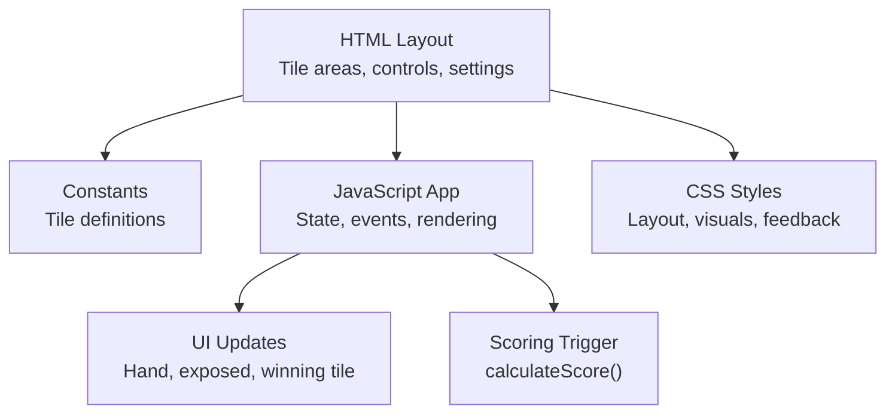
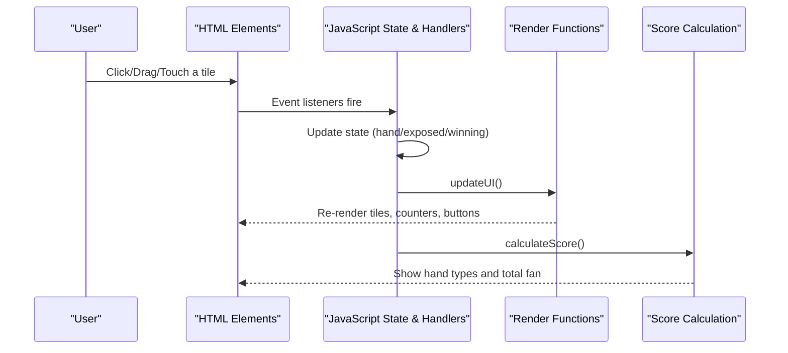
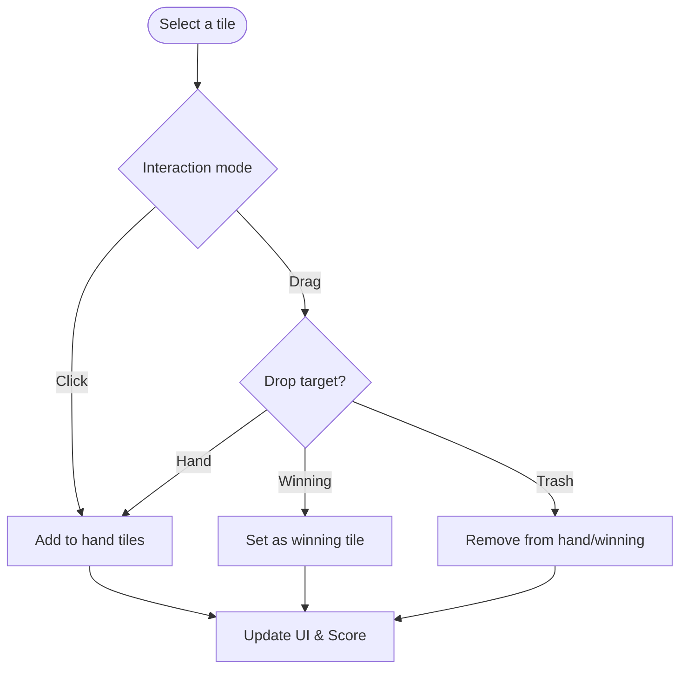
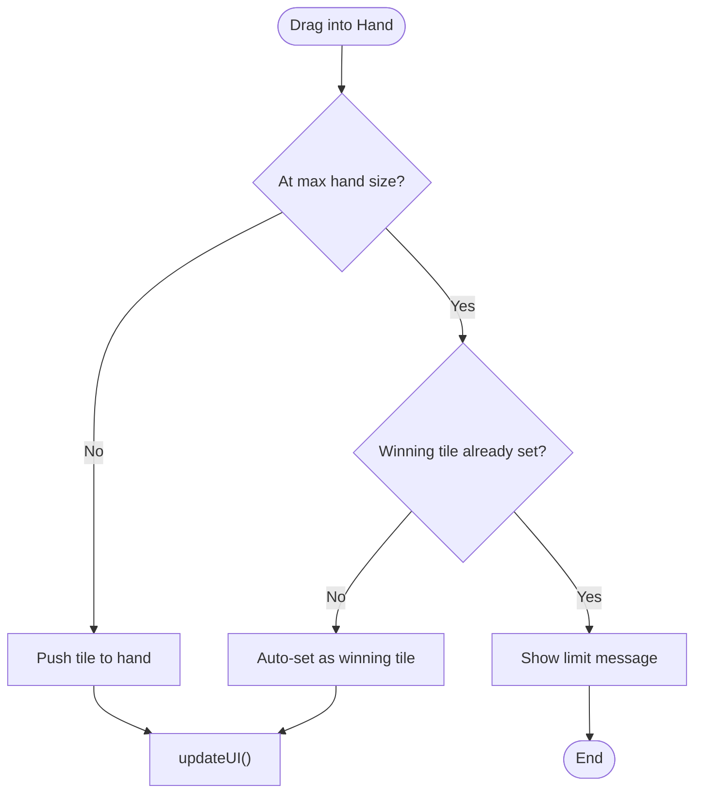
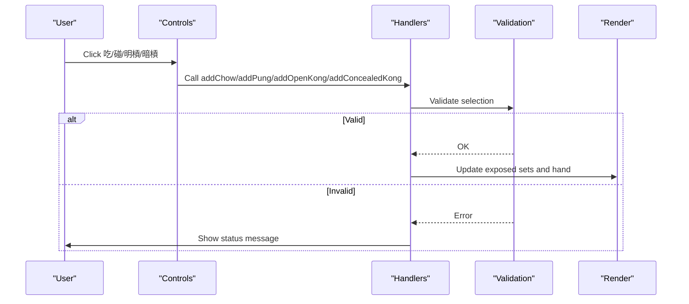
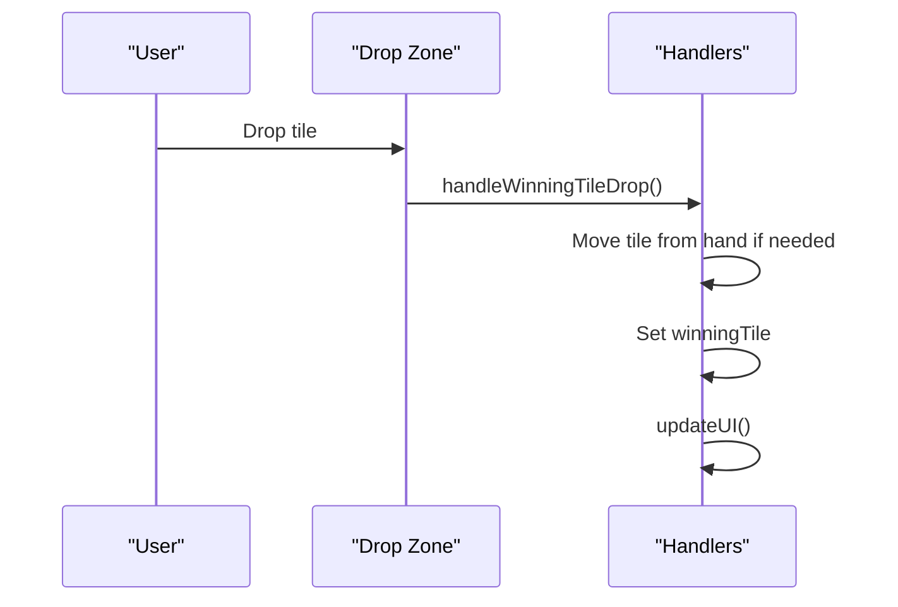
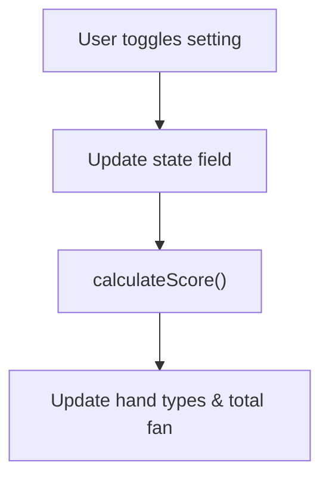
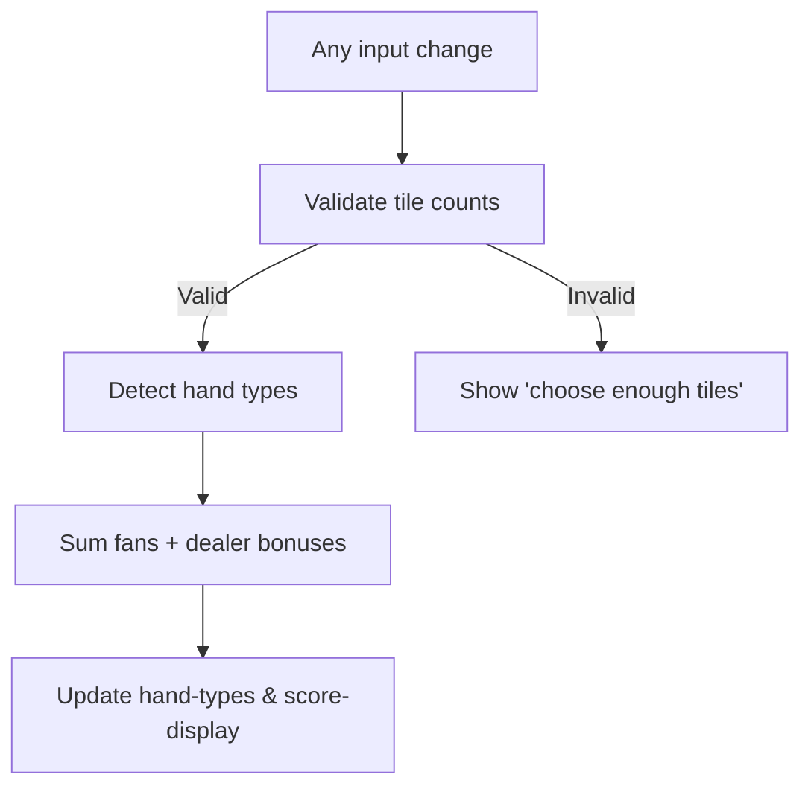
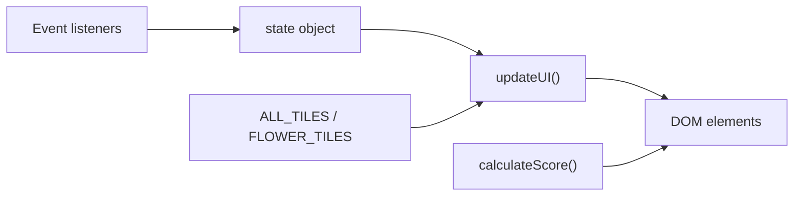

# User Interface Guide

<cite>
**Referenced Files in This Document**
- [mj.html](file://mj.html)
- [mj.js](file://mj.js)
- [mjConst.js](file://mjConst.js)
- [mj.css](file://mj.css)
</cite>

## Table of Contents
1. [Introduction](#introduction)
2. [Project Structure](#project-structure)
3. [Core Components](#core-components)
4. [Architecture Overview](#architecture-overview)
5. [Detailed Component Analysis](#detailed-component-analysis)
6. [Dependency Analysis](#dependency-analysis)
7. [Performance Considerations](#performance-considerations)
8. [Troubleshooting Guide](#troubleshooting-guide)
9. [Conclusion](#conclusion)

## Introduction
This guide explains the user interface of the OV MJ Calculator, a Mahjong hand scoring assistant. It covers how to select tiles, manage your hand and exposed sets, choose a winning tile, configure game settings (seat wind, round wind, dealer status, special conditions), and interpret real-time score feedback. It also documents drag-and-drop behavior on desktop and touch gestures on mobile devices.

## Project Structure
The application is a single-page web app composed of:
- HTML layout defining sections for tile selection, hand management, exposed sets, winning tile selection, flowers, settings, special conditions, and results.
- JavaScript handling state, interactions (drag-and-drop/touch/click), UI updates, and scoring triggers.
- Constants defining all tile types and values.
- CSS styling for responsive layout, tile visuals, drop zones, and interactive feedback.

**Diagram sources**
- [mj.html:13-242](file://mj.html#L13-L242)
- [mjConst.js:1-65](file://mjConst.js#L1-L65)
- [mj.js:35-42](file://mj.js#L35-L42)
- [mj.css:23-186](file://mj.css#L23-L186)

**Section sources**
- [mj.html:13-242](file://mj.html#L13-L242)
- [mjConst.js:1-65](file://mjConst.js#L1-L65)
- [mj.js:35-42](file://mj.js#L35-L42)
- [mj.css:23-186](file://mj.css#L23-L186)

## Core Components
- Tile Selection Areas: Four containers for 萬子 (Characters), 索子 (Bamboos), 筒子 (Dots), and 字牌 (Honors). Each tile is draggable and clickable.
- Hand Management Area: Displays selected hand tiles with a live counter and supports drag-and-drop reordering or removal via trash.
- Exposed Tiles Section: Shows 吃 (Chow), 碰 (Pung), 明槓 (Open Kong), and 暗槓 (Concealed Kong) groups created from selected tiles.
- Winning Tile Selection: A dedicated drop zone that accepts exactly one tile as the winning tile; can be moved back to hand or removed.
- Flowers Section: Optional bonus tiles selectable from a dedicated area.
- Settings Panel: Configures seat wind, round wind, dealer status and consecutive dealer count, self-draw flag, and many special conditions (Tenhou/Chihou, Ippatsu, last tile draws, multi-win, visible winning tiles, etc.).
- Results Area: Displays detected hand types and total fan score, updated in real time when inputs change.

**Section sources**
- [mj.html:13-242](file://mj.html#L13-L242)
- [mj.js:535-578](file://mj.js#L535-L578)
- [mj.js:909-1129](file://mj.js#L909-L1129)
- [mj.css:68-186](file://mj.css#L68-L186)

## Architecture Overview
The UI is driven by a central state object. User actions update this state, which then triggers UI rendering and recalculates scores. Drag-and-drop and touch events are normalized into common handlers that move tiles between source containers, hand, exposed sets, and winning tile area.

**Diagram sources**
- [mj.js:35-42](file://mj.js#L35-L42)
- [mj.js:44-116](file://mj.js#L44-L116)
- [mj.js:909-1129](file://mj.js#L909-L1129)

## Detailed Component Analysis

### Tile Selection Areas (萬子, 索子, 筒子, 字牌)
- Visuals: Four horizontal containers render all available tiles with distinct colors per type.
- Interaction:
  - Desktop: Drag tiles into the hand area or winning tile area; hover highlights indicate valid drops.
  - Mobile: Long-press or short tap to add tiles; dragging creates a floating clone that follows your finger.
- Feedback: Tiles highlight on hover; selected tiles become draggable within the hand area.

**Diagram sources**
- [mj.js:150-177](file://mj.js#L150-L177)
- [mj.js:449-522](file://mj.js#L449-L522)
- [mj.js:535-578](file://mj.js#L535-L578)
- [mj.css:85-124](file://mj.css#L85-L124)

**Section sources**
- [mj.html:13-19](file://mj.html#L13-L19)
- [mjConst.js:11-53](file://mjConst.js#L11-L53)
- [mj.js:150-177](file://mj.js#L150-L177)
- [mj.js:535-578](file://mj.js#L535-L578)
- [mj.css:85-124](file://mj.css#L85-L124)

### Hand Management Area
- Purpose: Holds your current hand tiles. The counter shows how many tiles you have versus the maximum allowed based on exposed sets.
- Behavior:
  - Drag tiles in/out; drag within the hand to reorder.
  - Drag to the trash icon to remove a tile.
  - If the hand reaches its maximum without a winning tile set, the next added tile automatically becomes the winning tile.
- Visual cues: Drop zones highlight when hovered; selected tiles are slightly larger and styled distinctly.

**Diagram sources**
- [mj.js:1172-1209](file://mj.js#L1172-L1209)
- [mj.js:919-924](file://mj.js#L919-L924)
- [mj.css:126-141](file://mj.css#L126-L141)

**Section sources**
- [mj.html:21-52](file://mj.html#L21-L52)
- [mj.js:449-522](file://mj.js#L449-L522)
- [mj.js:909-924](file://mj.js#L909-L924)
- [mj.js:1172-1209](file://mj.js#L1172-L1209)
- [mj.css:126-141](file://mj.css#L126-L141)

### Exposed Tiles Section (吃/碰/明槓/暗槓)
- Purpose: Display grouped sets formed from your hand.
- How to create:
  - Select three sequential same-type tiles and click 吃 to form a Chow.
  - Select at least three identical tiles and click 碰 to form a Pung.
  - Select four identical tiles and click 明槓 or 暗槓 to form a Kong.
- Validation: Buttons enable only when selections meet rules; invalid attempts show status messages.
- Visuals: Each group is labeled and rendered with consistent tile styling.

**Diagram sources**
- [mj.js:713-829](file://mj.js#L713-L829)
- [mj.js:1054-1080](file://mj.js#L1054-L1080)
- [mj.js:956-1035](file://mj.js#L956-L1035)

**Section sources**
- [mj.html:33-51](file://mj.html#L33-L51)
- [mj.js:713-829](file://mj.js#L713-L829)
- [mj.js:956-1035](file://mj.js#L956-L1035)
- [mj.css:200-230](file://mj.css#L200-L230)

### Winning Tile Selection
- Purpose: Designate the final tile that completes your hand.
- Behavior:
  - Only one tile can be placed here; moving it back adds it to the hand.
  - Dragging from hand to this area moves the tile out of the hand automatically.
- Visuals: Green-tinted drop zone indicates acceptance; winning tile has a distinct style.

**Diagram sources**
- [mj.js:476-504](file://mj.js#L476-L504)
- [mj.js:1037-1052](file://mj.js#L1037-L1052)
- [mj.css:232-242](file://mj.css#L232-L242)

**Section sources**
- [mj.html:38-42](file://mj.html#L38-L42)
- [mj.js:476-504](file://mj.js#L476-L504)
- [mj.js:1037-1052](file://mj.js#L1037-L1052)
- [mj.css:232-242](file://mj.css#L232-L242)

### Flowers Section
- Purpose: Add optional flower tiles to your configuration.
- Behavior: Clicking a flower adds it to the selected flowers list; these do not participate in standard hand composition but may influence scoring depending on rules.

**Section sources**
- [mj.html:54-58](file://mj.html#L54-L58)
- [mj.js:562-578](file://mj.js#L562-L578)
- [mj.js:944-954](file://mj.js#L944-L954)
- [mjConst.js:55-65](file://mjConst.js#L55-L65)

### Settings Panel
- Seat Wind and Round Wind: Choose your seat wind and the current round wind using dropdowns.
- Dealer Status: Toggle whether you are the dealer and set the number of consecutive dealer rounds.
- Self-Draw: Mark if the win was achieved by self-draw.
- Special Conditions:
  - Basic: Declared ready (叮), Ippatsu (一發).
  - Special Draws: Flower draw, Kong draw, Double Kong draw, Robbing Kong, Robbing Double Kong.
  - Heaven/Earth: Tenhou (天糊), Chihou (地糊), Ten Ready (天聽), Chi Ready (地聽).
  - Other: Face-down (蓋牌), Last tile draw (海底撈月), Last discard (河底撈魚).
  - Multi-Win: Two/three-way wins and extra self-draw bonus.
  - Visible Winning Tiles: Number of visible winning tiles on the table (0–3).
- All changes trigger immediate recalculation of the score display.

**Diagram sources**
- [mj.js:580-703](file://mj.js#L580-L703)
- [mj.js:1082-1129](file://mj.js#L1082-L1129)

**Section sources**
- [mj.html:60-235](file://mj.html#L60-L235)
- [mj.js:580-703](file://mj.js#L580-L703)
- [mj.js:1082-1129](file://mj.js#L1082-L1129)

### Real-Time Score Display
- Location: Bottom section showing detected hand types and total fan count.
- Behavior:
  - Validates total tile count against required amount (including kongs).
  - Detects hand patterns and lists each with its fan value.
  - Adds dealer-related fans when applicable.
  - Updates instantly whenever any input changes.

**Diagram sources**
- [mj.js:1082-1129](file://mj.js#L1082-L1129)

**Section sources**
- [mj.html:237-242](file://mj.html#L237-L242)
- [mj.js:1082-1129](file://mj.js#L1082-L1129)

## Dependency Analysis
- Data model: Central state object holds hand, flowers, exposed sets, winning tile, and all settings.
- Rendering: updateUI orchestrates rendering of tiles, exposed sets, winning tile, and button states.
- Events: setupEventListeners binds UI controls to state updates and triggers score calculation.
- Constants: ALL_TILES and FLOWER_TILES define available tiles and their visual classes.

**Diagram sources**
- [mj.js:2-33](file://mj.js#L2-L33)
- [mj.js:580-703](file://mj.js#L580-L703)
- [mj.js:909-1129](file://mj.js#L909-L1129)
- [mjConst.js:1-65](file://mjConst.js#L1-L65)

**Section sources**
- [mj.js:2-33](file://mj.js#L2-L33)
- [mj.js:580-703](file://mj.js#L580-L703)
- [mj.js:909-1129](file://mj.js#L909-L1129)
- [mjConst.js:1-65](file://mjConst.js#L1-L65)

## Performance Considerations
- Lightweight DOM updates: Rendering functions rebuild only the affected sections (hand, exposed, winning tile).
- Efficient event binding: setupDragEvents removes old listeners before adding new ones to avoid duplicates.
- Minimal recalculations: calculateScore runs only on relevant changes; early exit when tile counts are invalid.
- Touch optimization: Prevent default scrolling during drag and use passive:false where necessary to ensure smooth interactions.

[No sources needed since this section provides general guidance]

## Troubleshooting Guide
- Cannot place a tile: Ensure the target drop zone is highlighted; verify you are dragging from a valid source (tile container, hand, or winning tile area).
- Buttons disabled: Check that your selection meets the required pattern (e.g., three sequential same-type for 吃, at least three identical for 碰, four identical for 槓).
- Score not updating: Confirm that the total tile count matches the required amount; the app will show a message indicating missing tiles.
- Undo/Clear: Use the undo button to revert the last action or clear to reset everything.

**Section sources**
- [mj.js:444-447](file://mj.js#L444-L447)
- [mj.js:713-829](file://mj.js#L713-L829)
- [mj.js:880-907](file://mj.js#L880-L907)
- [mj.js:1082-1101](file://mj.js#L1082-L1101)

## Conclusion
The OV MJ Calculator provides an intuitive, responsive interface for building and scoring Mahjong hands. Use the tile selection areas to build your hand, organize exposed sets, designate a winning tile, and configure game settings. Drag-and-drop and touch gestures make tile management fast on both desktop and mobile. The real-time score display helps you understand your hand’s value and adjust accordingly.